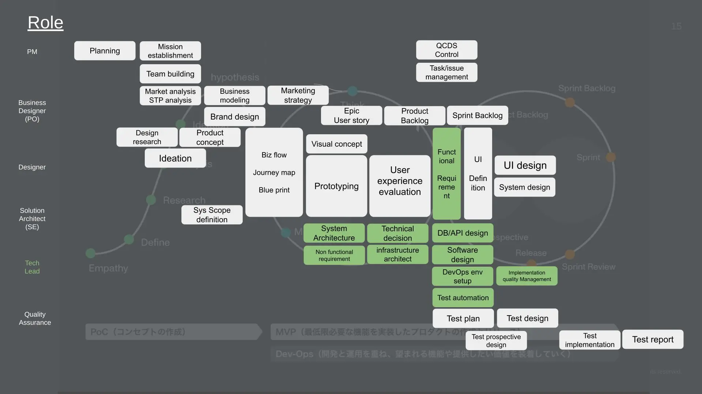

It’s been almost 6 months since I started working at Monstarlab. I want to share with you what it’s like “being a Tech Lead at Monstarlab” and hope that my insights and personal experiences will benefit anyone who has an interest in working at Monstarlab.

## Diversity

I am sure many people working at Monstarlab share a similar view on this.  

With Monstarlab offices all over the world, project teams are built across the globe and various languages other than Japanese are used to communicate. It’s inspiring to work in an environment without fixating on Japanese values and exchange ideas with people from different regions and countries.

And to better connect with Monstars - Monstarlab members - from other teams and countries, we are working on a “Culture Book” in which company culture is shared. The purpose of this platform is to build an organization and development teams in which members voluntarily build working relationships by acknowledging their strengths and make full use of those strengths.

On the other hand, language differences could sometimes be a challenge. Generally, Japanese and English are mainly used but the company supports English/Japanese learning through the benefit packages they offer so for anyone looking to improve their English/Japanese skills, it’s a great opportunity.

## Job of a Tech Lead

In a nutshell, a Tech Lead is like a midfielder in soccer (or football.) More specifically, the biggest responsibility of a Tech Lead is assessing and selecting technology and communicating with team members of various functions. Actually, the scope of responsibility of a Tech Lead varies by project. The following image is an example that will give you an idea of what the job and responsibilities could include. 

If you excel in coding, you may be in charge of implementation; if architecture is your speciality, then you could be creating the specification. A lot of times, Tech Lead acts as the control tower to ensure the project moves forward smoothly from a technical aspect. It’s a critical role in charge of discussions with clients and deciding specifications which sets the foundation for the key technology in the upstream process. This would be an exciting role for anyone who is looking into technological support from a business perspective or creating better products with new technology.

## Offshore development

Monstarlab has offshore offices within the group and proactively engages them in projects.  
I was anxious in my first Tech Lead role, but with the support of an assigned communicator in the project team who acted as an interpreter, the project went smoothly. Offshore development is a way in which high-quality products could be provided at a low cost, so we develop from a global perspective. And this is one of the contributing factors to the significant number of requests we receive from clients to work on projects together.

## Working with clients

At Monstarlab, there are many opportunities to work directly with clients.

In a corporate digital transformation project, our involvement sometimes begins with building a business strategy. There are many opportunities to propose new technology and take on the challenge to find a solution for a problem.   
“Do as you’re told” work hardly exists; you are expected to make technical suggestions and be capable of quick learning. While enjoying freedom in the workplace, you experience more decision making in a broad spectrum. And because of the nature of the job, you have the opportunity to encounter various industries and acquire different technological skills. Every time I work on a project, I see my abilities and skills expand and that’s really exciting.

## Full remote work (Work from anywhere in Japan)

Tasks and communication can be accomplished while working fully remote. There are a number of Monstars who don’t work at the main office. If we need to speak to each other, we simply huddle on Slack or use Google Meet. It’s great to be able to work and take breaks at my own discretion.

## Great people, open communication

There’s an openness in communication between workers and that creates a healthy environment which allows you to talk to your superior if something is on your mind.

There’s also a mentoring program that helps you get your concerns off your mind, whether it’s about work or life in general. I received helpful advice on managing workload and skill enhancement which helped me figure out the work-life balance and assess my career plan.   
For issues that come up on the job that you can’t figure out on your own, there are Slack channels dedicated to the specific topic where you could ask questions and Monstars across the globe provide you with thorough tips and advice.

## Express your opinion from day 1

The company encourages Monstars to thrive which creates an environment that allows everyone to freely express their opinions and incorporate their ideas. And there are opportunities where you can dive into discussions and unleash your potential in many areas.

## Family-friendly workplace

Monstarlab is very generous to anyone raising children.  
The company implements the Discretionary Labor System which enables Monstars to manage our family life with flexible working hours so we could manage work schedules according to our personal situations. I was startled to see both men and women taking childcare leave. It certainly reflects the needs of our times and it wouldn’t have been possible without the diversity the company achieves.

# Thanks for reading!

I hope this gave you a better picture of what Monstarlab is all about; a look inside the company and an idea of what it’s like to work at Monstarlab.   
Monstarlab is looking for talent who share the mission to “Empower talent everywhere to engineer awesome products, services and ecosystems; building a brighter world for us all.” If you are interested, visit Careers on our website to find out more information. 

## Reference

- [Monstarlab Japan hiring page](https://www.join.monstar-lab.com/)

_[Article Photo by fauxels](https://www.pexels.com/@fauxels)_
