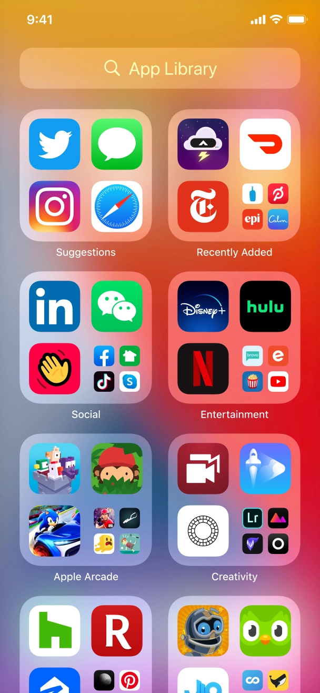
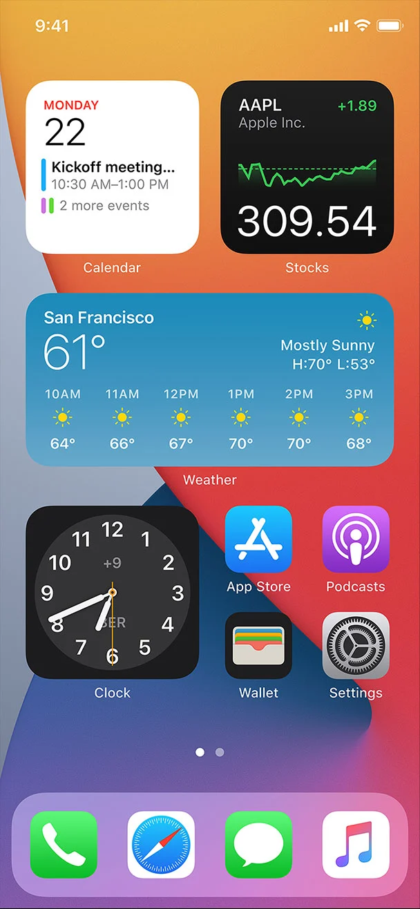
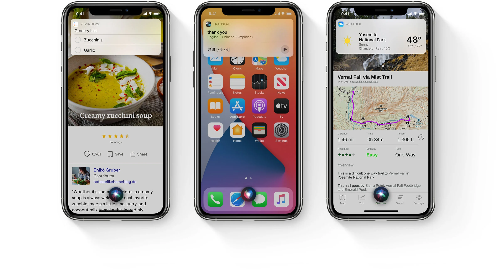
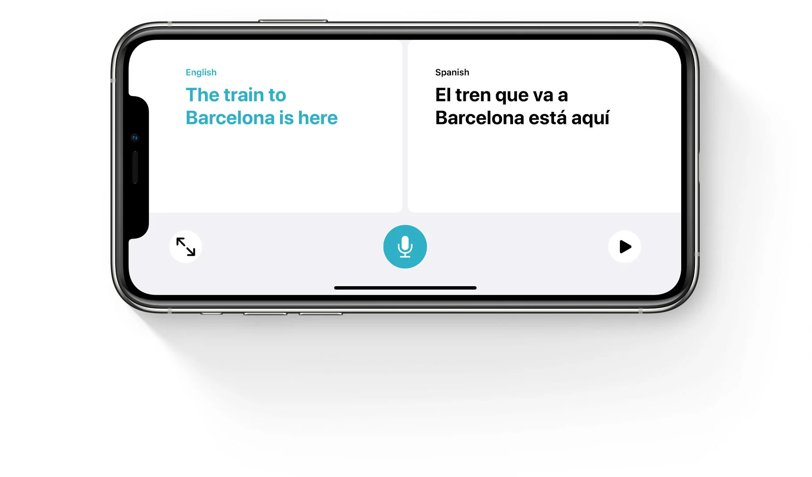
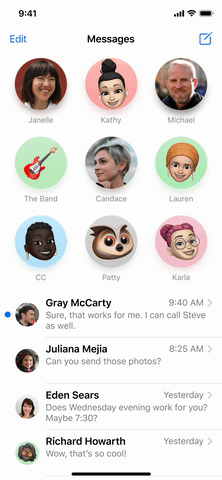
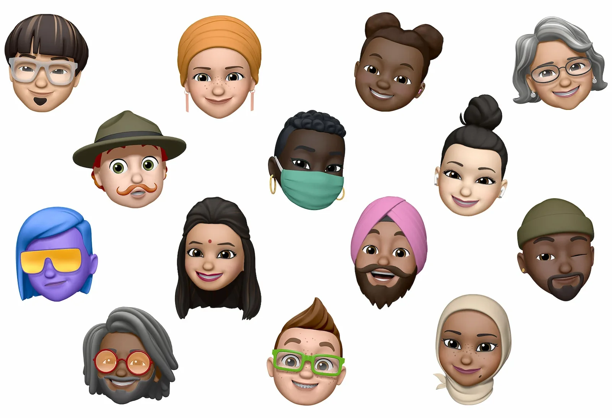
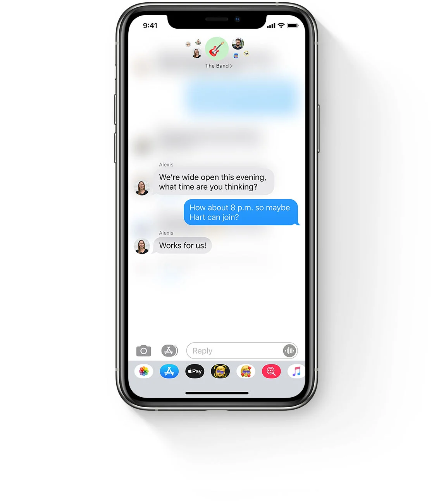

Every year Apple's [WWDC](https://developer.apple.com/wwdc20/) event is a highlight in the Apple developer community, and this year was no different. Because of COVID-19 the event had to take on a new form and move out of Cupertino and into the virtual world. The week was kicked off with the highly anticipated _keynote_ and _state of the union_ talks followed by a daily release of video sessions and developer labs, where developers could book 1:1 sessions with Apple's engineers.

Even more than in recent years, the leitmotif of a lot of topics Apple covered was the convergence of all platforms within their ecosystem. Starting with the transition to ARM-based CPUs for the entire Mac product line, to universally applicable SwiftUI code, through to macOS Big Sur's new user interface, unification appeared to be the mantra resonating through everything. Take Big Sur's new Desktop, put an iPad next to it, and ask your grandma which one is which.

For users this means they only have to learn how to use an Apple product once. If you already know how to use an iPhone, chances are you'll have little trouble getting used to an iPad or a Mac. In the majority of cases you'll probably be able to use the same apps.

For developers it means it should be easier than ever to offer apps on multiple platforms. You just have to make up your mind about which technology to adopt. On iOS your options are manageable. On macOS on the other hand, you can now choose between AppKit, UIKit, Catalyst, and SwiftUI to build the user interface of your app.

For Apple it means everything they've been able to do with their in-house SoCs powering iOS devices for a number of years now, finally comes home to the Mac. They have full control over the development roadmap of both their software and hardware, on all of their devices.

Another topic Apple again put a lot of emphasis on, is the privacy of its users, with iOS users gaining even more control over data that is shared with developers or 3rd parties and macOS inheriting a lot of privacy-focused features iOS user have been familiar with for years.

## Highlights For Users (and Developers)

### App Library

Apple added an App Library to the last page of the home screen. It automatically organizes and groups all your apps contextually. You can choose how many pages you want to display and hide rarely used apps for a less cluttered home screen and quicker access to App Library. It also provides a search bar at the top, with all apps sorted alphabetically and a quick way to search for apps.


_Image source: [App Library](https://www.apple.com/ios/ios-14-preview/)_

### Widgets

Apple added widgets to the iOS 14 home screen, allowing you to freely position your widgets alongside your apps on the home screen. There are three different sizes to choose from, depending on how important the content of a widget is to you. When you drag and drop your widget, space between the app icons will automatically be managed based on the position and size of the widget. You can also place a stack of widgets on your home screen and navigate through it using a swipe gesture. As opposed to Today widgets, the new home screen widgets are written exclusively using SwiftUI.


_Image source: [Widgets](https://www.apple.com/ios/ios-14-preview/)_

### Picture-in-Picture

Apple added Picture-in-Picture support. While watching a video or talking to a friend on FaceTime, it allows you to access other apps on your iOS device at the same time. The below image shows a PiP video displayed alongside the Notes app.


_Image source: [Picture in Picture](https://www.apple.com/ios/ios-14-preview/)_

### Siri

Much like the new overlay for incoming calls, Apple redesigned Siri's interface to be less intrusive by not covering the whole screen. Addressing Siri now summons an indicator at the bottom of the screen:


_Image source: [Siri](https://www.apple.com/ios/ios-14-preview/)_

More ways to send messages using Siri are:

- by Recording audio
- by using your voice for keyboard dictation

### The Translate App

Apple designed the Translate App for conversations. It works completely offline and keeps your conversations private. You can translate your voice and text from and to any of the languages below. In a conversation it can automatically detect who is speaking based on the language that is spoken, and add the translated text to the right side of the conversation.


_Image source: [Translate App](https://www.apple.com/ios/ios-14-preview/)_

### Messages

- **Conversations:**
  You can now pin conversations and keep the most important messages at the top by swiping right on a conversation and pinning it. For multiple conversations, you can edit pinned content from the menu.


_Image source: [Conversations](https://www.apple.com/ios/ios-14-preview/)_

- **Memoji:** Apple added new Memoji customization options, including new hairstyles, face covers, and more.


_Image source: [Memoji](https://www.apple.com/ios/ios-14-preview/)_

- **Groups:** In group conversations, you are now able to add `inline replies` and `mentions`. This means you can reply to specific messages and start a thread. You can mention anyone in a group conversation and also update the settings to only be notified when you are mentioned in a group conversation. You can customize your group photo and inside a conversation, you can see the profile pictures of group members aligned around the group photo at the top.


_Image source: [Groups](https://www.apple.com/ios/ios-14-preview/)_

### Maps

Apple has added some welcome features to Maps:

- **Guides** help you explore new places and can be saved for offline usage.
- **Cycling Directions** offer information about elevation, quiet or busy roads, steep passages coming up, and stairs along the route.
- **EV routing** shows charging stations along the route which are compatible with your electric vehicle.

## Highlights For Developers (and Users)

### <a name="swift-5.3" />What's New in Swift 5.3

Every year Apple adds a slew of new features to the Swift Standard library and 2020 was no exception. Some of the highlights from Swift 5.3 include:

- Updates to the standard library adding support for a preview packages
- Updates to enums, fx synthesized conformance to the `Comparable` protocol and enum cases as protocol witnesses
- Support for multiple trailing closures
- increased availability of implicit `self` in closures
- Float16
- Multi-pattern catch clauses
  You can read more about what's new in Swift [here.]({{ baseurl }}2020-06-29-Whats-new-in-Swift)

### SwiftUI 2.0

When Apple introduced SwiftUI at last year's WWDC, it left a lot of developers with mixed feelings. On the one, everyone was excited about the paradigm shift to a fresh, concise, and declarative approach to building user interfaces. On the other hand, it still left a lot to be desired, lacking some critical features. In short, it was not ready for the main stage.

This year, Apple added a lot features developers have been asking for. Some highlights include:

- `LazyVStack`, `LazyHStack`, and `List` load content on-demand as the user scrolls, much like table and collection views in UIKit
- Leveraging Swift 5.3's `@main`, there is a new entry point to applications. SwiftUI's new `App`, `Scene`, and `WindowGroup` structs eliminate the need for AppDelegates and SceneDelegates, allowing you to build your entire user interface just using SwiftUI
- The new `@StateObject` property wrapper allows for creating reference types inside views while ensuring they don't get released for the lifetime of the view
- `ProgressView` adds native activity indicators and progress bars
- `LazyVGrid` and `LazyHGrid` somewhat address the lack of collection views
- `TextEditor` is the equivalent to UIKit's UITextView
- Better control over scroll views, such as determining the current or scrolling to a specific offset has been added in the form of `ScrollViewReader` and `ScrollViewProxy`

### [App Clips]({{ baseurl }}2020-06-26-Introducing-App-Clips)

App clips offer a promising new way for businesses to increase the discoverability of their apps and services while at the same time eliminating the need to install a full app.

At a glance, app clips:

- cannot be larger than 10 MB after app thinning
- can share data with containing app using app group containers
- are not added to home screen, not backed up
- are deleted from device after a period of inactivity
- can be built using either UIKit or the new SwiftUI app lifecycle

### Advances in [ARKit]({{ baseurl }}2020-06-23-A-first-look-at-Apples-new-Augmented-Reality-features)

Apple has further extended its lead over the competition in AR. This year they introduced features making use of the LiDAR scanner that was added to the iPad Pro earlier this year and that will potentially come to high-end iPhone models this fall. Some highlights include:

- The Depth API offers per-pixel depth information about the user's surroundings, allowing for more precise measurements and object occlusion
- Set location anchors to real-world geo-coordinates to enable AR experiences at specific locations
- Face tracking using the front camera does not require a TrueDepth camera any longer, provided your device has at least an A12 Bionic chip

### HealthKit

#### Electrocardiogram (ECG)

Third-party apps are now able to read ECG data that can be recorded with the Apple Watch since watchOS 5.2.


_Image source: [What's new in HealthKit, Apple WWDC20 session](https://developer.apple.com/wwdc20/10182)_

Apple has added `HKElectrocardiogram` to the iOS 14 SDK:

```swift
class HKElectrocardiogram: HKSample {
  var classification: HKElectrocardiogram.Classification
  var symptomsStatus: HKElectrocardiogram.SymptomsStatus
  var averageHeartRate: HKQuantity?
  var samplingFrequency: HKQuantity?
  var numberOfVoltageMeasurements: Int
}
```

#### Mobility Data Types

New mobility data types have been added:

- Walking speed and step length
- Walking asymmetry and double support percentage
- Stair ascent and descent speed
- Six minute walk test distance

#### Symptom Samples

Apple has added symptom samples accessible to developers to HealthKit:

- Mood Changes
- Night Sweats
- Diarrhea
- Wheezing
- Bloating
- Tiredness or Fatigue
- Bladder Incontinence
- Nausea
- Sleep Changes
- Sinus Congestion


_Image source: [What's new in HealthKit, Apple WWDC20 session](https://developer.apple.com/wwdc20/10182)_

### Security and privacy

#### Encrypted DNS

With iOS 14 and macOS 11 Apple will support **DoT** (DNS over TLS) as well as **DoH** (DNS over HTTPS).
By enabling this, communication with DNS servers will be encrypted. Where normal DNS traffic would communicate using clear text (allowing others to track and profile users) both DoT and DoH prevent any third-parties from tracking DNS queries by encrypting the entire communication.

Encrypted DNS can be enabled system-wide by setting up a DNS server that supports this or on application-level by developers who want to use their own DNS for resolving addresses.

#### Private MAC address

A MAC (Media Access Control) address is a unique identifier that is assigned to the network interface of your device. With iOS 14 you will be able to enable "Private MAC address" for WIFI which will change the MAC address periodically and also whenever you switch networks. **This will prevent systems from tracking you (/your device).**

Of course, you can decide to use the real MAC address where applicable. For example it might make sense to do so for your home or work network if the routers use it to recognize your device and grant access.

#### Privacy for Photos, Location, Contacts

- **[Photos]({{ baseurl }}2020-06-29-Privacy-for-Photos-Access):** iOS 14 introduces new access levels permissions for Photo Library which allows you to share specific photos/videos or give access to your entire photo library.

- **Location:** With iOS 14, you can now grant an app access to your approximate location, rather than your precise location.

- **Contacts:** With iOS 14, instead of sharing your entire Contacts list in third-party apps, you can now type individual names to automatically fill their corresponding phone numbers, addresses, and other information. The autofill happens on your device, and contacts are not shared with third-party developers without your consent.

### Accessibility

This year Apple continues to focus a lot on one of the most important topics nowadays: **Accessibility**. There are a couple of highly recommended sessions talking about improving accessibility by optimizing for **Voice Over**, **Switch Control** as well as making the **visually accessible**.

You'll find the [relevant sessions here](https://developer.apple.com/news/?id=xpew8919). They are all great, but I found [this one]((https://developer.apple.com/wwdc20/10019)) by [Sommer Panage](https://twitter.com/Sommer) particularly interesting and eye-opening.

**Be inclusive. Not exclusive!**

### <a name="swift-package-manager" />Swift Package Manager

#### Binary Dependencies

If you are using the new manifest version `// swift-tools-version:5.3` you can include binary dependencies in your package. These are pre-compiled libraries for each supported architecture and therefore won't expose the source code. Once you have set it up other users can include your package as if it was a regular package.

- ✅ Great if you want to share a closed source framework using SPM
- ✅ Your library packages are protected by a checksum
- ✅ Developers can see your method signatures and documentation
- ❌ Only available for Apple platforms – no Linux support

Also, before you start shipping binary dependencies only, bear in mind that you should have a very good business reason to do so; the general drawbacks of using compiled libraries still apply:

- ❌ Debugging is way harder
- ❌ A package user cannot change the code to make it fit for their purpose or fix an issue
- ❌ If a new architecture (e.g. a new iPhone) has been released you cannot support it until the package owner compiles a binary for the new architecture

More information:

- [SE-0272 - Package Manager Binary Dependencies](https://github.com/apple/swift-evolution/blob/master/proposals/0272-swiftpm-binary-dependencies.md)

#### Resources & Localization

Also new with Swift 5.3 is the option to ship resources and localized resources with a Swift Package. This proves great if you want to ship resources, such as images, HTML, or other content as well as localizations with your package.

- ✅ Add Asset catalogs, HTML files, storyboards, databases, resources, even sample code as part of your package
- ✅ Provide localized content with your package
- ✅ You can define how they should be processed, e.g. if they should be compiled (code), optimized (images) or just copied (e.g. sample source code)
- ❌ A developer using your package cannot access your resources directly; if you need them to get access to specific resources, you can add static APIs for them

More information:

- [SE-0271 - Package Manager Resources](https://github.com/apple/swift-evolution/blob/master/proposals/0271-package-manager-resources.md)
- [SE-0278 - Package Manager Localized Resources](https://github.com/apple/swift-evolution/blob/master/proposals/0278-package-manager-localized-resources.md)

### <a name="swift-numerics" />Swift Numerics

[Swift Numerics](https://github.com/apple/swift-numerics) is a new package that introduces a numerical API for Swift. It comes with two stand alone modules `RealModule` and `ComplexModule`. The `RealModule` defines four protocols:

- `ElementaryFunctions` -> Basic arithmetic functions including the most common geometrical functions we all know and love from school
- `RealFunctions` -> Adds a series of more complex functions that are difficult to implement for complex numbers.
- `AlgebraicField` -> An extension to the Switch `SignedNumeric` that allows you to represent a number as a field and introduces reciprocal values
- `Real` -> The `Real` protocol combines all of the above and makes sure that they can be applied to all `FloatingPoint` conforming types, such as integers, floats, doubles, and any other types that will be added in the future

The `ComplexModule` is build on top of the `RealModule` and adds a new `struct Complex<RealType> where RealType: Real`. It support most of the arithmetic functions already provided for real numbers as well as a set of functions only relevant for complex values.

### Swift on Server

Swift on Server has received a lot of love recently by Apple. They are heavily invested in [SSWG](https://swift.org/server/) (Swift Server Working Group) where people from Apple together with others and our friends from [Vapor](https://vapor.codes) provide overall technical direction, support and curate packages and make the (Swift) world a better place.

In this year's WWDC Apple has mentioned [Vapor](https://vapor.codes) in their Platform State of the Union and designated a whole session for [using Swift using AWS Lambda](https://developer.apple.com/wwdc20/10644).

Apart from [Swift NIO](https://github.com/apple/swift-nio), [Swift AWS Lambda runtime](https://github.com/swift-server/swift-aws-lambda-runtime/) and [Swift Crypto](https://github.com/apple/swift-crypto) many of the new features introduced in this years WWDC are very useful for Server-side Swift development, e.g. the updates to [Swift Package Manager](#swift-package-manager), [Swift 5.3](#swift-5.3) or [Swift Numerics](#swift-numerics).

## WWDC Articles

- [A first look at Apple's new Augmented Reality features]({{ baseurl }}2020-06-23-A-first-look-at-Apples-new-Augmented-Reality-features)
- [What's new in Swift]({{ baseurl }}2020-06-29-Whats-new-in-Swift)
- [Introducing App Clips]({{ baseurl }}2020-06-26-Introducing-App-Clips)
  <!-- - [Serverless Swift with Lambdas on AWS]({{ baseurl }}2020-06-23-A-first-look-at-Apples-new-Augmented-Reality-features) -->
  <!-- - [What's new in SwiftUI]({{ baseurl }}2020-06-23-A-first-look-at-Apples-new-Augmented-Reality-features) -->
- More to come next week

_Article Photo by [Apple](https://www.apple.com/newsroom/images/live-action/wwdc/Apple_wwdc2020_03132020_big.jpg.large.jpg)_
