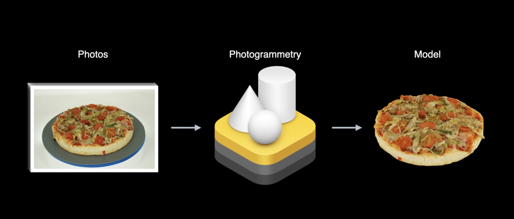
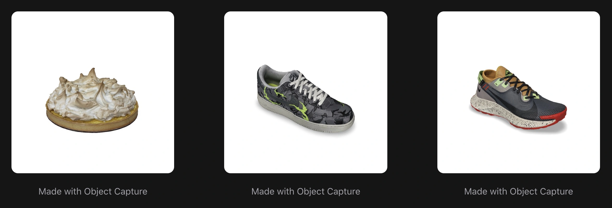
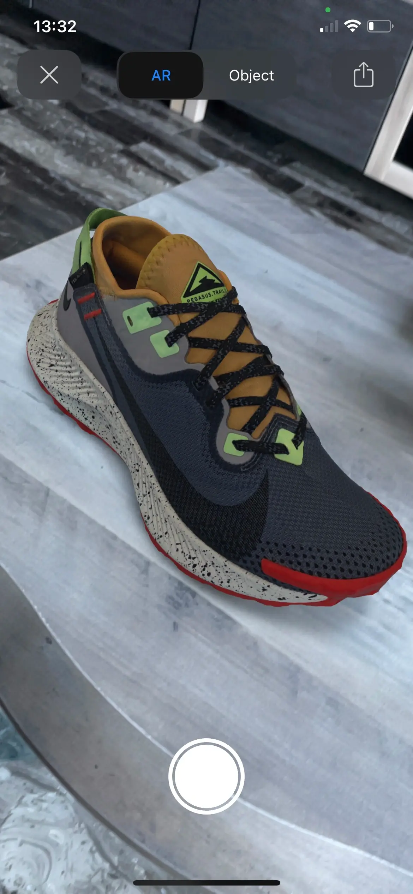

There are now over 1 billion augmented reality enabled iPhones and iPads which gives an incredible reach for your experiences. Here is an overview of what we know so far from this year's [WWDC](https://developer.apple.com/wwdc21/) when it comes to augmented reality, with more details to unravel this week after the engineering sessions. You can find a list of recommended AR sessions and challenges to check out from this year's WWDC at the end of the article.

## [RealityKit 2](https://developer.apple.com/augmented-reality/realitykit/)

Introduced in 2019, RealityKit is Apple's rendering, animation, physics, and audio Swift framework built from the ground up with augmented reality in mind. This year, RealityKit gets some great improvements:

### Object Capture API

_Image source: [Apple](https://developer.apple.com/videos/wwdc2021/)_

Object Capture is a new API on macOS Monterey that enables anybody to create high-quality, photo-realistic 3D models of real-world objects in minutes. The biggest step-back I have seen for adding augmented reality capabilities to businesses is the cost of 3D content creation. So this new feature is massive for the AR world, especially for the E-commerce industry. You can use an iPhone, iPad or even a DSLR to take pictures and transform them into 3D models optimized for AR. You will be able to generate USDZ, USD and OBJ files with the level of detail you wish.

AR Quick Look is a great way to showcase your models created with Object Capture. Apple has even updated their [AR Quick Look Gallery](https://developer.apple.com/augmented-reality/quick-look/) with new 3D model examples created with Object Capture, and I must say, I am very impressed!

Unity has been working closely with Apple to bring this new feature into their AR Companion app ([Unity MARS](https://blog.unity.com/technology/mars-companion-apps)). You can read more about Apple's collaboration with Unity in [this article](https://blog.unity.com/technology/unity-reveals-latest-ar-companion-app-feature-at-apple-wwdc-21).

### Custom Shaders

Custom shaders give developers more control over the rendering with custom render targets and materials. This update will make Apple AR experiences even more realistic.

_Video source: [Apple](https://developer.apple.com/videos/wwdc2021/)_

### Dynamic assets

The loading of assets is now more flexible, giving the option for example to programmatically change an image with every frame.

### Improved Entity Component System

A new `System` object is available which will affect multiple entities in every frame of a RealityKit scene. Developers will be able to organize their assets better and build more complex apps.

### Character Controller

Great addition for AR games, developers will now be able to control the characters and make them jump, scale and explore the AR worlds.

## [ARKit 5](https://developer.apple.com/augmented-reality/arkit/)

ARKit helps developers build powerful augmented reality experiences for millions of users worldwide. Here are the main updates announced this year:

### Location Anchors (in more cities)

Location anchors were introduced in 2020 but with a limited availability in major United States cities. The update we are getting this year is additional cities including London. AR Coaching UI will also now support location anchors with a new `geoTracking` goal, meaning that you can easily guide your users through location based experiences.

### Expanded Face Tracking support

Face Tracking support has been extended on the Ultra Wide camera on iPad Pro (5th generation). If you want to learn more about how to create AR Face filters, you can check out my Borderless Engineering Conference talk on the topic [Youtube video](https://youtu.be/xSLDST-a6qU).

### Improvements to Motion Tracking

With ARKit, you can capture the motion of a person in real time with a single camera, previously possible only with special equipment. Great potential with this ARKit feature, so it is exciting to see what improvements they are bringing to it.

### App Clip Code Anchors

Great addition to the list of supported ARKit anchors, you will be able to place your virtual content to a printed or digital App Clip Code.

_Video source: [Apple](https://developer.apple.com/videos/wwdc2021/)_

## Apple Smart Glasses

Still no Apple Smart Glasses announced, but that was expected. However, if you would like to catch up with the latest rumors, I can recommend [this in-depth roundup article from MacRumors](https://www.macrumors.com/roundup/apple-glasses/).

## WWDC21 AR sessions

- [Create 3D models with Object Capture](https://developer.apple.com/videos/play/wwdc2021/10076/)
- [Dive into RealityKit 2](https://developer.apple.com/videos/play/wwdc2021/10074/)
- [AR Quick Look, meet Object Capture](https://developer.apple.com/videos/play/wwdc2021/10078/)
- [Explore advanced rendering with RealityKit 2](https://developer.apple.com/videos/play/wwdc2021/10075/)
- [Explore ARKit 5](https://developer.apple.com/videos/play/wwdc2021/10073/)
- [Create 3D workflows with USD](https://developer.apple.com/videos/play/wwdc2021/10077/)

## WWDC21 AR challenges

[WWDC21 Challenges](https://developer.apple.com/wwdc21/challenges/) are a fun way to dive right into the latest technologies and frameworks. Each day brings new challenges you can share on the Apple Developer Forums. This year, we have 2 augmented reality related challenges:

1. Create your first 3D model with Object Capture (Tuesday)
2. Framework Freestyle (Thursday) - build and ARKit sample app in 100 lines of code or less

## Resources

- [Augmented Reality - Apple Developer](https://developer.apple.com/augmented-reality/)
- [Building Augmented Reality experiences with iOS - Engineering Awesome Conference 2020](https://youtu.be/v2Br76XFAYQ)
- [Easy web augmented reality with AR Quick Look]({{ baseurl }}2020-09-07-Easy-web-augmented-reality-with-ar-quick-look)
- [How to convert 3D models to USDZ files using Apple's Reality Converter]({{ baseurl }}2020-04-26-how-to-convert-3d-models-to-usdz-files-using-apples-reality-converter)
- [Using USDZ for a better AR experience]({{ baseurl }}2019-10-07-Using-USDZ-for-a-better-AR-experience)
- [How to make an augmented reality decorating experience app with AR Quick Look]({{ baseurl }}2019-12-31-How-to-make-an-Augmented-Reality-decorating-experience-app-with-AR-Quick-Look)

_Article Photo by [Apple](https://developer.apple.com/videos/wwdc2021/)_
