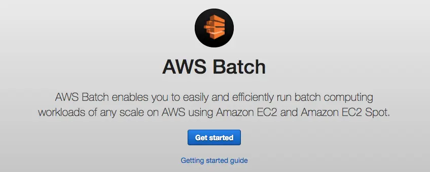
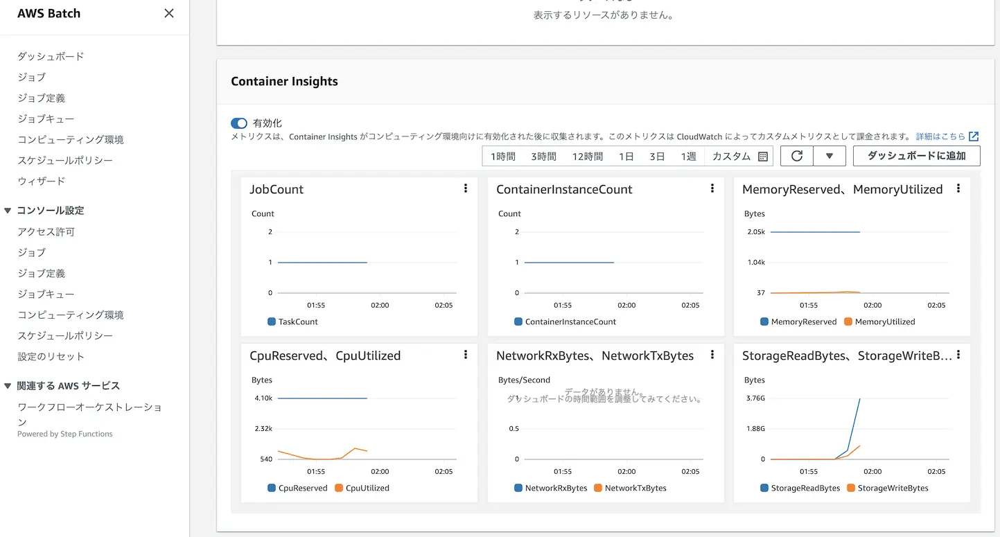
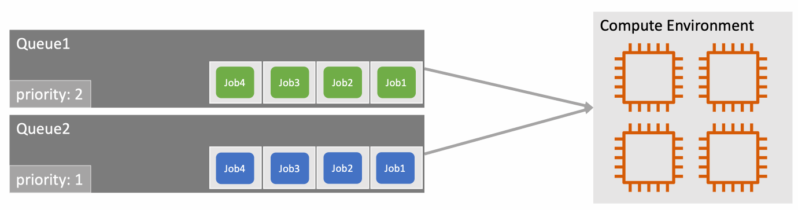
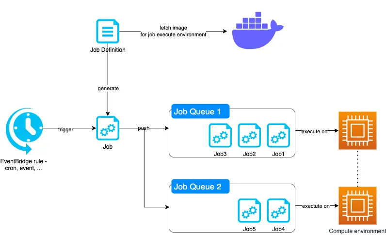
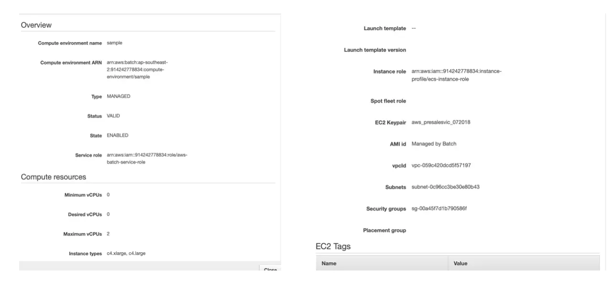
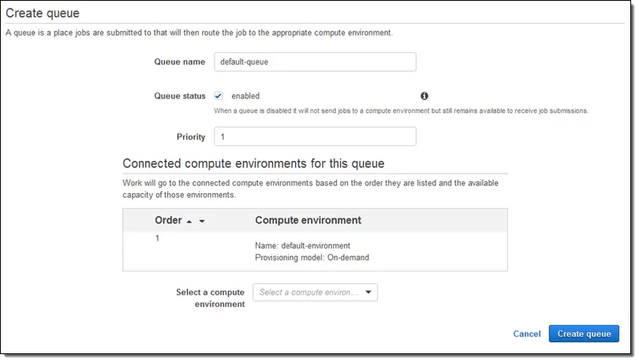
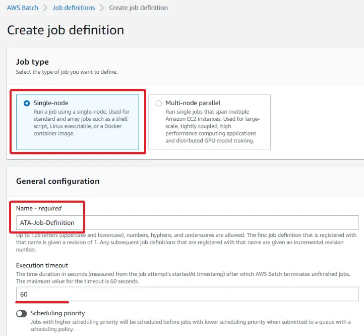
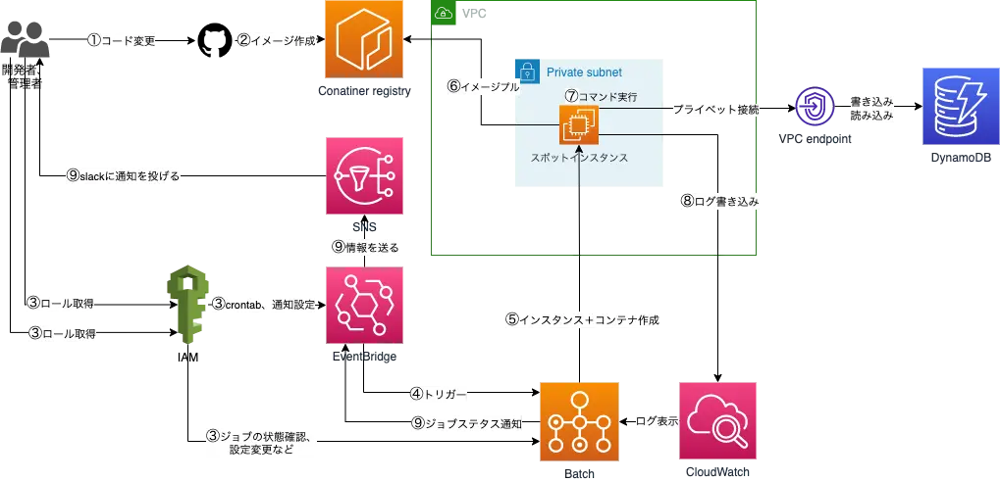

膨大な量のデータの時代に、バッチはアプリケーションと同じくらい、欠かせない処理です。 
バッチを起動するためにはフレームワークを選びつつデプロイ先も思考する必要があります。 
一般的と言えば Spring Batch, Kubernetes の Job や Cronjob、分散システムの場合 Hadoop、Apache Spark などの技術を使って Kubernetes 上デプロイの形です。 
ただし、小規模のプロジェクトまたは単独のバッチだと上記の導入は困難です。 
したがって以下の懸念点がありました：

- 導入&運用コスト
- モニタリングとログ記録
- ジョブの優先度&リトライ設定

そのため今回はクラウドプロバイダーから提供しているサービスを目指して AWS のバッチサービスを紹介したいと思います。

## 概要

AWS Batch は AWS 上の各種リソースに、バッチ処理を簡単かつ、効率的に行うことができるサービスです。なお、先述した問題を解決できます。 
以下は基本の特徴をリストアップしながらプレビューしましょう。

#### コスト最適化

- フルマネージドサービスなので導入&運用コストゼロ
- AWS Batch に対する追加料金は発生しません。AWS リソースの費用のみがかかります。

#### モニタリングとログ記録

- メトリクスは AWS マネジメントコンソールに表示される
- コンピューティング性能や、実行中、完了済みなどのジョブの状態も確認することができる
- ログ AWS CloudWatch に書き込まれ、バッチ毎にログを確認できる
  

#### ジョブ実行、優先度&リトライ設定

- 複数ジョブキューで優先度を設定できて、リソースの無駄をコントロールが可能
- 条件によるリトライの仕組みがある。例: エラーコード=3 の場合リトライをする
- ML に応じるマルチノード並列、GPU の実行が可能
  

主な機能を紹介しましたので、AWS の構成をみていきましょう。

## 構成

基本的に 3 つに分かれています：**ジョブ定義** (Job Definition)、**キュー** (Job Queue)、**コンピューティング環境** (Computing environment)

実行できるまでには、最低限、以下のフローのように定義しなければなりません。

1. コンピューティング環境の準備 
   - バッチジョブ実行に必要とする CPU、メモリのリソースです。
   - 「コンピューティング環境画面」で設定できます。
     
2. ジョブキューの定義 
   バッチジョブにコンピューティング環境と優先順位を付ける設定です
   
3. ジョブ定義 
   コマンド、コンテナ、パラメータなどの指定
   
4. ジョブ実行 
   ジョブ定義から実行できるジョブ設定が生成され、キューに入る
   このステップの入り口がいくつがあり、一般的にはイベントとしてトリガーしますが、Batch のコンソールで手動起動の形も可能です。

これで簡単のバッチを作成できますが、実際、自動化、通知などを求められるケースが多かったのです。その際にコンテナイメージ作成やトリガーの Eventbridge 設定必要となり、次に伝えます。

## スタディケース

AWS Batch は AWS プラットフォームと統合されていることから、AWS を利用している場合構築が最適的です。
以下のように crontab で DynamoDB を書き込むバッチを起動して結果を担当者へ通知するシステムを構築してみました。

①② バッチスクリプトを含むイメージは、開発者がソースコードを変更した時点で（Github Actions で）ビルドされる。 
③ 開発者が AWS にログインし、EventBridge、Batch でジョブ定義、cron、通知などを設定する。 
④⑤ cron で起動したバッチジョブには、スポットインスタンスも同時にプライベート subnet 中に作成される。 
⑥⑦ バッチスクリプトが入ったコンテナ起動後、コマンドが実行される。DynamoDB のアクセスがプライベートで行われる。 
⑧ ログは Cloudwatch に送信されるが、AWS Batch コンソールから参照することができる。 
⑨ ジョブのイベント、ステータスを EventBridge で管理するため、実行エラーの際に SNS 経由で関係者を通告する。 
このようにセキュリティ向上のプライベートシステムができました。ややこしく見えましたが、実際に AWS Batch をメインに作業しますので、Kubernetes より実装しやすいと思います。

## 最後に

個人的にはすごく使いやすく良いサービスなのに、プラットフォーム利用料金が 0 というのはありがたいです。
AWS を使うのであれば AWS Batch は最強の選択肢であり、開発者の負担を減らしてプログラミングに集中することができるのです。
ぜひ活用してみてください。

## 出典

Photo source: 
https://aws.amazon.com/ 
