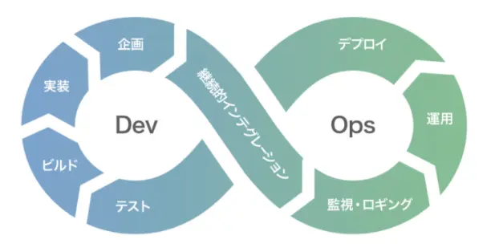
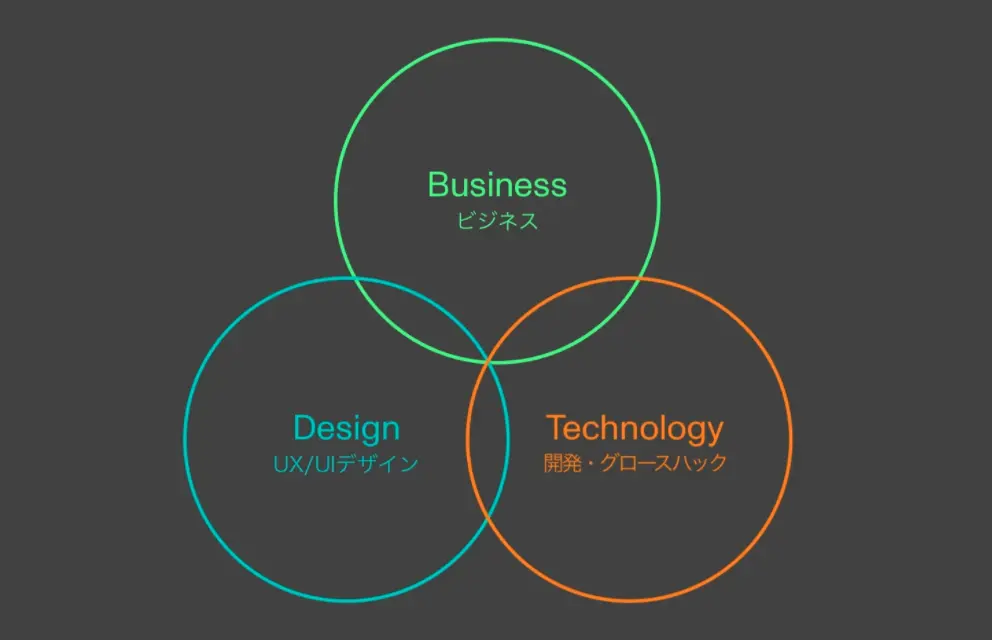

初めまして、株式会社モンスターラボ（以降、モンスターラボ）フロントエンドチーム TechLead の安です。

今日はコーディングテストに役立つチートシートを電撃公開します。

もしコーディングテストに恐れを感じているなら、この記事を見たらそのような心配がなくなると思います。
評価項目に適切な時間配分で最高の評価を受けることができるからです！

**_この記事で説明しているコーディングテストはモンスターラボ東京本社でエンジニア採用の時に使用しているものです。職業の区別や拠点によって、コーディングテストがない場合や異なる場合があります。_**

## コーディングテストの目的は？

口頭で進行する面接で確認できない部分を見るためです。ソースコードは、個人のスタイルと経験の集約体ですから、どの程度のレベルに達しているかを把握することが可能です。

_Source [Photo by Christopher Gower](https://unsplash.com/photos/m_HRfLhgABo)_

モンスターラボの TechLead はエンジニアの能力とマネージャーとしての能力の両方が必要です。複雑で深いソースコードも優れていますが、一般的な観点から誰が見ても分かりやすく、今後の運用に良いのかが評価項目に含まれています。これはチームワークを基本とするモンスターラボのチーム体制に適切な人材かを評価する尺度でもあります。

簡単に言えば、モンスターラボのコーディングテストは正解不正解があるようなアルゴリズムのようなテストではありません。モンスターラボが望む人材像と合うかを見るための事です。11 件の評価基準によって、平均点を元に採点者の判断で合格するかどうかが決まります。ここで平均点も重要ですが、チームプレーができるような一緒に働きたい人材なのかが重要なポイントになります。

_以下の評価基準は 2022 年 3 月を基準にしています。課題によっては一部変更されることがあり、今後変更される可能性がありますのでご注意ください。_

### 全体的な項目

広い意味で全体的の確認です。領域によっては固定された項目もあるので、採点に含まれない場合があります。

#### General Info

ソースコードの一般的な情報に関する項目です。プラットフォーム、フレームワーク、言語などを確認しますが、課題によって一般的な環境であり、特別な部分がない場合は採点項目から除外します。

たとえば、フロントエンドの場合、Web アプリケーションに関連する一般的な環境は共通であるため、採点には含まれません。

#### Architecture

どのアーキテクチャを使用したかについての項目です。さまざまなアーキテクチャパターンがあるので、基本的にはそのようなアーキテクチャパターンを意図的に使用したかどうかを見ています。

厳密な意味でアーキテクチャを評価することは難しく、そのような部分まで要求するわけではないので、一般的に使用するモダンアーキテクチャの中で一つを使って作成されているかを確認します。

_Source [Photo by JOHN TOWNER](https://unsplash.com/photos/3Kv48NS4WUU)_

### 詳細な項目

提出されたソースコードの詳細を確認する項目たちです。

#### Setup/Build

**「プロジェクトを Setup して駆動することに問題はないですか？」**

Setup とビルドに関する項目です。README などを元にした初期動作の確認なので、手順通りに進んだときに問題なく実行されると評価点が得られます。開発を進めてみるとローカルに依存する場合が発生する可能性がありますが、これらの部分に対して正しく処理したかどうかを見ることです。

可能であれば、開発を進めていたローカル以外の環境で Setup およびビルドを進めて問題がないことを確認してください。プロジェクトビルドに必要なツールやライブラリがある場合は、その部分についても明示してください。言語のインストールまで説明する必要はありませんが、一般的なもの以外に必要な部分があれば書いた方がいいです。

たとえば、環境変数として設定する必要がある場合は、その環境変数を実行`command`に含めるとか、環境変数の発行が必要な場合は、その部分に対する手順を書くなどの実行をするために追加的に必要な部分についての確認です。

ただし、環境変数については、セキュリティ的に秘密にする必要があるものについてどのように扱っているかを見たりもします。

#### Dependency/Library

**「プロジェクトの依存関係とライブラリはどうですか？ あなたならそうしますか？」**

ライブラリに関する項目です。プロジェクトに適切なライブラリと依存関係を設定しているかどうかを確認しています。特に、使用したライブラリが常に管理および更新されているかどうかを確認します。もはや実際の業務で使用するのが難しい古いライブラリを使用している場合は、減点要因になります。

`javascript`フロントエンドを基準に説明すると、`dependencies`と`devDependencies`の区切りを適切にしたのか、ライブラリのバージョンが古いのではないかを確認しています。古いライブラリの判断は難しいですが、基本的な判断基準は LTS（Long Term Support）または npm の Versions を確認しています。ライブラリによって違いがあるのでその部分も考慮しています。

例えば、使っている`node`の Version は？`gulp`を使っているなら、`3.9`以前なのか`4.x`以降なのかの区分です。

React を例にして見ると、

> 新しいメジャーがリリースされると、通常、以前のメジャーの新しい修正のリリースを停止します。唯一の例外は、重大なバグ（セキュリティの脆弱性を含む）です。

> Once a new major is released, we generally stop releasing new fixes for a previous major. The only exception is absolutely critical bugs (including security vulnerabilities). — [Major version LTS dates](https://github.com/reactjs/reactjs.org/issues/1745#issuecomment-466767389)

上記の引用によると、新しい major version がリリースされると、以前の major version は基本的にこれ以上更新されないと言っています。

したがって、2022 年 3 月基準では、React の LTS は最新の major である React 18 といえるので、React 18 以前のバージョンを使用しているかを確認しています。

#### Tests

**「テストはありますか？ 作成されたテストは`pass`判定をしていますか？」**

テストに関する項目です。 作成したすべてのソースコードに対してテストを作成する必要はありません。重要なロジックについてユニットテストが作成されているのかを評価しています。

#### Readability

**「コードの可読性はどうですか？」**

読みやすさに関する項目です。 初見した時、全体的な流れを理解しやすく書かれているかを見ています。

#### Code Style

**「コードスタイルが対象プラットフォームに適しているか？」**

プラットフォームによって異なりますが、同様に現代的で一般的な意味で適切に作成されているかを見ています。一貫して同じスペース、タブ、インデント、垂直ソートなどを使用しているかを基本に使用する文法にも一貫性があるのか（この部分は eslint、tslint、beautify などでも問題ないです）、古い文法と新文法の混用がないかなどを基準にしています。

javascript で説明すると、関数を宣言する時に `let` と `const` を使いながら、ある部分では `var` を使うかなどの場合です。

#### Code Comments

**「コメントがありますか？」**

テストの項目と同様に、すべてのロジックに対するコメントを評価するのではなく、コメントが必ず必要な重要なビジネスロジックなどに適切なコメントを作成しているかを見ています。 コメントの言語は英語や日本語どちらでも構いません。

#### Code Structure

**「ソースコードの構造はどのように構成されていますか？」**

意図をもって適切なツリー構造になっているかを確認しています。どのようなツリー構造でも構いませんが、使用するプラットフォームやフレームワークに合わせて理解しやすく、今後の拡張性を考慮した形を基準に評価しています。

極端な例として、すべてのファイルを 1 つのフォルダに管理している場合、減点要因になります。

_Source [Photo by Yann Jacobsen](https://unsplash.com/photos/j3KhPniqdXQ)_

### その他

メンテナンス、そして採点者の経験に基づいて追加の要素を採点する項目たちです。

#### Maintainability

**「作成されたソースコードに基づいてメンテナンス性はどうですか？」**

ソースコードの構造、コードスタイル、可読性などに基づいて機能を追加・変更・削除することが便利なのかを確認します。 一般的な意味で OOP（Object-oriented programming）を活用したロジックを推奨し、ツリー構造などを基準に誰でも簡単に理解して拡張できるかを評価しています。

#### Other considerations

上記の 10 個の採点項目に含まれていないか、含まれていても各項目を連携した時に追加点として考慮できる部分が対象となります。またはコーディングテストの必須項目ではないが、対象課題に追加の機能が含まれている場合も対象となります。

さまざまな領域があるため、例を挙げることは困難ですが、実際のサービスに展開した時にユーザーの満足度を満たすか、繰り返し作業を除去する DevOps 的な要素があるのかなどです。

## 最後に

これまで、モンスターラボコーディングテストの採点基準について説明しました。

最小限の基準としては業務遂行に問題のないレベルかを確認しており、一般的な基準としては現在のトレンドをもとに個々の確立されたノウハウを適切に使用しているかを見ています。

言葉を変えると、モンスターラボはコーディングテストで 100％確実な正解を要求するのではなく、製品としての完成度と熟練度を評価尺度と考えています。

チートシートというには長すぎる文になりましたが最後に個人的にアドバイスを伝えたいと思います。評価されるためのソースコードを書くことではなく、ユーザーに公開することを前提として自分がユーザーでも使い続けたいと考えることができる製品を作ってください。

採点者はすべて現場で活躍しているエンジニアなので、そのような真心はソースコードを通じて十分に伝達されます。製品への愛着と熱意が最大の評価基準だと思います。

それでは、モンスターラボで仲間として出会える日を楽しみにしています。今後ともよろしくお願いします。

## 参考

- [モンスターラボ採用ページ](https://www.join.monstar-lab.com/)

_Article Photo by [Clay Banks](https://unsplash.com/photos/8q6e5hu3Ilc)_
