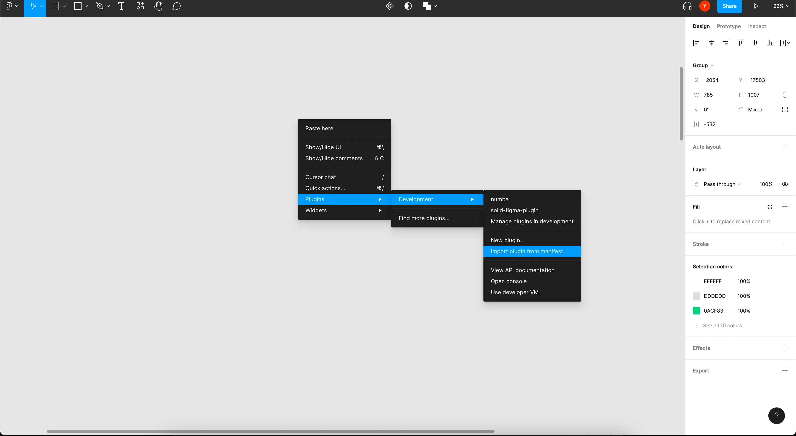
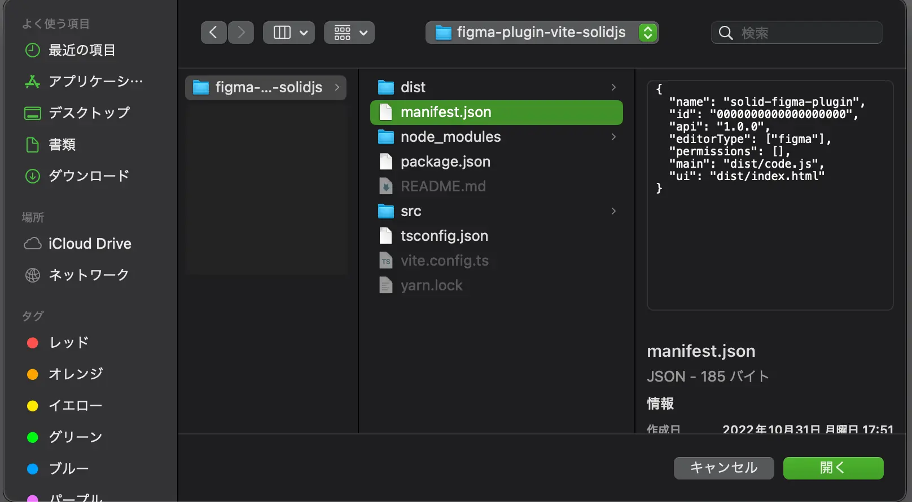
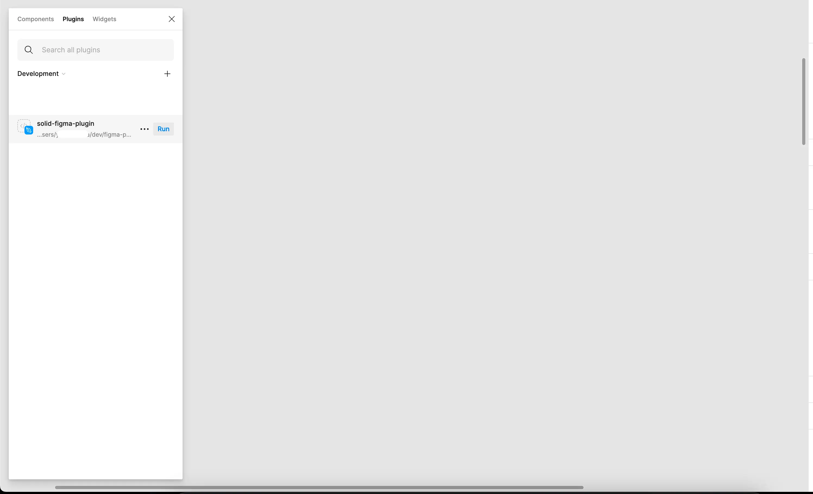
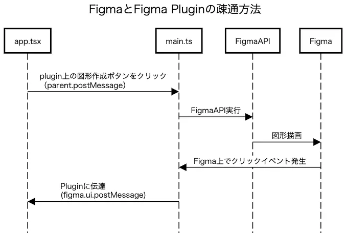

# 初めに

この記事は、Figma でプラグイン作りたいがどうやって始めればいいかわからない、SolidJS で何かプロジェクトを始めたいけどアイデアをもらいたい方に向けて記載しています。<br>
Figma のプラグインを自分でも作れることを知っていましたか？<br>
Figma は Javascript で動作しており、プラグインも Javascript で作ることができます。<br>
今回はこの Figma の Plugin の UI 部分を Javascript フレームワークである SolidJS とビルドツールである、Vite（ヴィート）を使って、Figma のプラグインを作っていこうと思います。

# 使用する技術

### Solid.js 　

https://www.solidjs.com/

Plugin のメイン UI 部分になります。書き方、設計思想など React に影響されており、React に慣れ親しんだ人であれば違和感なく記述できます。<br>
React との大きな違いは、仮装 DOM を使わないので描画のパフォーマンスがいいなどが挙げられます。

### Vite（ヴィート）

https://vitejs.dev/

ビルド部分を処理するためのビルドツールです。フランス語で「高速」の意味で、Vue.js を開発された Evan You 氏が開発に携わっています。<br>
開発時にバンドルしないので、開発時のビルド速度が早くストレスなく開発できます。

### TypeScript

https://www.typescriptlang.org/<br>

フロントエンドの開発をする上で非常に頼りになる存在。<br>
最初から入れておくことで堅牢なコードを書くことができます。

# Figma プラグインを作る

実際に Figma プラグインを作るとなると、このブログでは書ききれない量になるので、サンプルコードを準備しました。<br>
サンプルコードをダウンロードしてから、フォルダ構成などを説明していきます。

### サンプルコードのダウンロード

```
git clone https://github.com/yuta-hidaka/figma-plugin-vite-solidjs.git
```

### サンプルコードのフォルダ構成

サンプルをダウンロードが完了したらフォルダの中身を覗いて見ましょう。 👀<br>
ファイル構成は以下のようになっています。

```
figma-plugin-vite-solidjs
├── README.md
├── dist                 # ビルドしたファイルたち
│   ├── code.js          # main.tsをES Buildしたファイル（Figmaとの疎通部分）
│   └── index.html       # Viteでビルドしたファイル（UI部分）
│
├── manifest.json        # Figma Pluginのメタ情報
├── src
│   ├── app.tsx          # Figma PluginのUI部分ソースコード
│   ├── index.html　　　  # app.tsx 読み込みHTML
│   └── main.ts　　　　　　# Figmaプラグインからのイベントをリッスンしたり、Figma APIを実行する。
├── tsconfig.json        # Typescript config
└── vite.config.ts.      # vite config
```

# 開発準備

依存関係の取得をして開発ができるようにします。

```
yarn install

yarn dev
```

# Figma Plugin を Figma で表示する

### Figma の準備

最初に Figma を開きましょう。<br>
Figma のダウンロードはこちら ⇨ https://www.figma.com/downloads/

### Figma にプラグインを読み込ませる

1. 右クリックで以下のボタンをクリック Plugins > Development > Import plugin from manifest...


2. manifext.json を選択して開く


3. プラグインを立ち上げる


4. オブジェクトを作ったりして遊べます！

<video autoplay>
  <source src="./step4.webm" type="video/webm">
  Your browser does not support HTML video.
</video>

# 仕組み解説

Figma とプラグインへの疎通方法<br>
このサンプルでは、以下のようにして Figma と疎通しています。<br>
Figma のプラグインは iFrame 内で動いているので、Figma のアプリに命令を出すときには parent.postMeaage を利用しています。逆の場合には figma.ui.postMeaage を利用します。



Plugin -> Figma への伝達方法<br>
https://developer.mozilla.org/en-US/docs/Web/API/Window/postMessage

Figma -> Plugin への伝達方法<br>
https://www.figma.com/plugin-docs/api/properties/figma-ui-postmessage/

ソースコードの`src/app.tsx:7`を見ると以下のようなコードがあり、Figma と疎通している部分を確認できます。

```
parent.postMessage({ pluginMessage: { type, payload } }, "*");
```

# もっと FigmaPlugin 開発について知りたい方

ここで紹介したサンプルコードは基本的な部分しか紹介していませんが、SolidJS の Store を利用することで状態管理しながら、複雑なプラグインの開発もできます。<br>

⇨ Figma の公式ドキュメントでもっと多くのことを試せるのでぜひ Figma の Plugin 開発者サイトも覗いてみてください。<br>

https://www.figma.com/plugin-docs/
