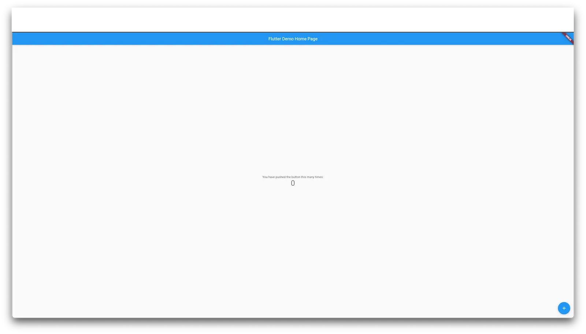

## はじめに

こんにちは、モンスターラボでフロントエンドエンジニアとして働いている清水です。
モンスターラボでは最近 Flutter を使用したアプリ開発案件が増えて来ているようです。
私自身 Flutter に興味あったので、Flutter on the Web を使用して簡単な Web アプリを作成してみようと思います。

## 実際に作ってみたもの

今回は映画情報を表示するアプリケーションを作成してみました。
開発時の主なポイントとしては、以下となります。

- [The Movie Database API](https://developers.themoviedb.org/)を使用して、映画情報を Web API 経由で取得
- [Get Widget](https://docs.getwidget.dev/)を使用して見た目を調整
- [Fluro](https://github.com/lukepighetti/fluro)を使用して、パラメータ付き URL に直アクセスでも表示出来るように
  - デフォルトだと Flutter は `/movies/:movieId` のような動的パスを解釈することが出来ません。

※著作権の関係上、映画の画像をサンプル画像に変更しています。

| 映画一覧                                                                                                                       | 映画詳細                                                                                                                         |
| ------------------------------------------------------------------------------------------------------------------------------ | -------------------------------------------------------------------------------------------------------------------------------- |
|  |  |

## 開発手順

### 1. 開発環境構築

Homebrew を使用して Flutter をインストール

```shell
brew install --cask flutter
```

作業用ディレクトリで Flutter プロジェクトを作成

```shell
flutter create my_app
cd my_app
```

アプリケーションを実行

```shell
flutter run -d web-server
```

#### 開発環境構築後のビュー



### 2. http パッケージを追加する

インターネットからデータを取得するために http パッケージを追加します。

```shell
flutter pub add http
```

### 3. パラメータ付き URL に直アクセスを実現する

今回のポイントである「パラメータ付き URL に直アクセス」を実現させるための実装を行います。\
Fluro の導入では以下の記事がとても参考になりました。\
[【Flutter】ルーティングライブラリ Fluro の使い方](https://www.l08084.com/entry/2021/12/29/180118)

#### Fluro の導入

```shell
flutter pub add fluro
```

#### 実装

```dart
// lib/main.dart
import 'package:fluro/fluro.dart';
import 'package:flutter/material.dart';
import 'package:flutter_dotenv/flutter_dotenv.dart';
import 'package:flutter_web_plugins/flutter_web_plugins.dart';
import 'package:my_app/router/routes.dart';
class MyApp extends StatelessWidget {
  static FluroRouter? router;
  const MyApp({Key? key}) : super(key: key);
  @override
  Widget build(BuildContext context) {
    return MaterialApp(
        title: 'Movie',
        initialRoute: '/',
        onGenerateRoute: (setting) {
          return MyApp.router?.generator(setting);
        });
  }
}
Future main() async {
  await dotenv.load(fileName: '.env');
  setUrlStrategy(PathUrlStrategy());
  final router = FluroRouter();
  Routes.configureRoutes(router);
  MyApp.router = router;
  runApp(const MyApp());
}
```

```dart
// lib/router/routes.dart
import 'package:fluro/fluro.dart';
import 'package:flutter/material.dart';
import 'package:my_app/pages/movie_detail.dart';
import 'package:my_app/pages/movie_list.dart';
Handler createBasicHandler(Widget targetWidget) {
  return Handler(
      handlerFunc: (BuildContext? context, Map<String, List<String>> params) {
    return targetWidget;
  });
}
Handler movieDetailPageHandler = Handler(
    handlerFunc: (BuildContext? context, Map<String, List<String>> params) {
  return MovieDetailPage(movieId: params['movieId']!.first);
});
class Routes {
  static void configureRoutes(FluroRouter router) {
    router.notFoundHandler = Handler(
        handlerFunc: (BuildContext? context, Map<String, List<String>> params) {
      print("ROUTE WAS NOT FOUND!!!");
      return null;
    });
    router
      ..define('/', handler: createBasicHandler(const MovieListPage()))
      ..define('/movies', handler: createBasicHandler(const MovieListPage()))
      ..define('/movies/:movieId', handler: movieDetailPageHandler);
  }
}
```

### 4. ネットワークリクエスト用の関数を作成する

API を使用するための API キーは環境変数化したいので、[flutter_dotenv](https://pub.dev/packages/flutter_dotenv)を導入します。

```shell
flutter pub add flutter_dotenv
```

[The Movie Database API](https://developers.themoviedb.org/)からデータを取得するために関数を作成します。

```dart
// lib/apis/movie.dart
import 'dart:convert';
import 'package:flutter_dotenv/flutter_dotenv.dart';
import 'package:http/http.dart' as http;
final API_KEY = dotenv.get('API_KEY');
Future<http.Response> fetchMovieList() async {
  return http.get(
      Uri.parse('https://api.themoviedb.org/3/movie/popular?api_key=$API_KEY'));
}
Future<http.Response> fetchMovieDetail(dynamic movieId) async {
  return http.get(Uri.parse(
      'https://api.themoviedb.org/3/movie/$movieId?api_key=$API_KEY'));
}
```

### 5. カスタムオブジェクトにレスポンスを変換

4.のネットワークリクエスト関数のままだと、データの型が決まっておらず扱いづらいので Dart のカスタムオブジェクトに変更するためのクラスを作成します。

API スキーマは[The Movie Database API](https://developers.themoviedb.org/)から提供されているので、参考にしながら作成します。

- [映画一覧 API スキーマ](https://developers.themoviedb.org/3/movies/get-popular-movies)
- [映画詳細 API スキーマ](https://developers.themoviedb.org/3/movies/get-movie-details)

```dart
// lib/models/movie.dart
class Movie {
  final String? posterPath;
  final bool adult;
  final String overview;
  final String releaseDate;
  final List<int> genreIds;
  final int id;
  final String originalTitle;
  final String originalLanguage;
  final String title;
  final String? backdropPath;
  final num popularity;
  final int voteCount;
  final bool video;
  final num voteAverage;
  const Movie(
      {this.posterPath,
      required this.adult,
      required this.overview,
      required this.releaseDate,
      required this.genreIds,
      required this.id,
      required this.originalTitle,
      required this.originalLanguage,
      required this.title,
      this.backdropPath,
      required this.popularity,
      required this.voteCount,
      required this.video,
      required this.voteAverage});
  factory Movie.fromJson(Map<String, dynamic> json) {
    return Movie(
        posterPath: json['poster_path'],
        adult: json['adult'],
        overview: json['overview'],
        releaseDate: json['release_date'],
        genreIds: List<int>.from(json['genre_ids']),
        id: json['id'],
        originalTitle: json['original_title'],
        originalLanguage: json['original_language'],
        title: json['title'],
        backdropPath: json['backdrop_path'],
        popularity: json['popularity'],
        voteCount: json['vote_count'],
        video: json['video'],
        voteAverage: json['vote_average']);
  }
}
```

```dart
// lib/models/movie_list.dart
import 'movie.dart';
class MovieList {
  final int page;
  final List<Movie> results;
  final int totalResults;
  final int totalPages;
  const MovieList(
      {required this.page,
      required this.results,
      required this.totalResults,
      required this.totalPages});
  factory MovieList.fromJson(Map<String, dynamic> json) {
    return MovieList(
        page: json['page'],
        results: (json['results'] as List<dynamic>)
            .map((e) => Movie.fromJson(e))
            .toList(),
        totalResults: json['total_results'],
        totalPages: json['total_pages']);
  }
}
```

```dart
// lib/models/movie_detail.dart
class MovieDetail {
  final bool adult;
  final String? backdropPath;
  final Map<String, dynamic>? belongsToCollection;
  final int? budget;
  final List<dynamic> genres;
  final String? homePage;
  final int id;
  final String? imdbId;
  final String originalLanguage;
  final String originalTitle;
  final String? overview;
  final num popularity;
  final String? posterPath;
  final List<dynamic> productionCompanies;
  final List<dynamic> productionCountries;
  final DateTime releaseDate;
  final int? revenue;
  final int? runtime;
  final List<dynamic> spokenLanguages;
  final String status;
  final String? tagline;
  final String title;
  final bool video;
  final num voteAverage;
  final dynamic voteCount;
  const MovieDetail(
      {required this.adult,
      this.backdropPath,
      this.belongsToCollection,
      required this.budget,
      required this.genres,
      required this.homePage,
      required this.id,
      this.imdbId,
      required this.originalLanguage,
      required this.originalTitle,
      required this.overview,
      required this.popularity,
      required this.posterPath,
      required this.productionCompanies,
      required this.productionCountries,
      required this.releaseDate,
      required this.revenue,
      this.runtime,
      required this.spokenLanguages,
      required this.status,
      this.tagline,
      required this.title,
      required this.video,
      required this.voteAverage,
      required this.voteCount});
  factory MovieDetail.fromJson(Map<String, dynamic> json) {
    return MovieDetail(
        adult: json['adult'],
        backdropPath: json['backdrop_path'],
        belongsToCollection: json['belongs_to_collection'],
        budget: json['budget'],
        genres: List<dynamic>.from(json['genres']),
        homePage: json['home_page'],
        id: json['id'],
        imdbId: json['imdb_id'],
        originalLanguage: json['original_language'],
        originalTitle: json['original_title'],
        overview: json['overview'],
        popularity: json['popularity'],
        posterPath: json['poster_path'],
        productionCompanies: json['production_companies'],
        productionCountries: json['production_countries'],
        releaseDate: DateTime.parse(json['release_date']),
        revenue: json['revenuew'],
        runtime: json['runtime'],
        spokenLanguages: json['spoken_languages'],
        status: json['status'],
        tagline: json['tagline'],
        title: json['title'],
        video: json['video'],
        voteAverage: json['vote_average'],
        voteCount: json['vote_count']);
  }
}
```

### 6. リクエスト関数の返り値に型を付与

4.のリクエスト関数の返り値に型が付くように、関数の型を指定します。
ついでに 200 以外のレスポンスコードが返却された場合には例外をスローするようにします。

```dart
import 'dart:convert';
import 'package:flutter_dotenv/flutter_dotenv.dart';
import 'package:http/http.dart' as http;
import 'package:my_app/models/movie_detail.dart';
import 'package:my_app/models/movie_list.dart';
final API_KEY = dotenv.get('API_KEY');
// Future<http.Response> fetchMovieList() async {
//   return http.get(
//       Uri.parse('https://api.themoviedb.org/3/movie/popular?api_key=$API_KEY'));
// }
// Future<http.Response> fetchMovieDetail(dynamic movieId) async {
//   return http.get(Uri.parse(
//       'https://api.themoviedb.org/3/movie/$movieId?api_key=$API_KEY'));
// }
// 4. で作成したものから↓に変更する
Future<MovieList> fetchMovieList() async {
  final response = await http.get(
      Uri.parse('https://api.themoviedb.org/3/movie/popular?api_key=$API_KEY'));
  if (response.statusCode == 200) {
    return MovieList.fromJson(jsonDecode(response.body));
  } else {
    throw Exception('Failed to load movies');
  }
}
Future<MovieDetail> fetchMovieDetail(dynamic movieId) async {
  final response = await http.get(Uri.parse(
      'https://api.themoviedb.org/3/movie/$movieId?api_key=$API_KEY'));
  if (response.statusCode == 200) {
    return MovieDetail.fromJson(jsonDecode(response.body));
  } else {
    throw Exception('Failed to load the movie detail.');
  }
}
```

### 7.ページを作成する

映画情報一覧・詳細を表示するページを作成します。
見た目調整のため[Get Widget](https://docs.getwidget.dev/)も同時に導入していきます。

#### Get Widget 導入

```shell
flutter pub get getwidget
```

#### 映画一覧ページ

映画一覧データをウィジェットに保持しておくため、Stateful Widget として作成します。
タップしたときに映画詳細画面に遷移させるため、`onTap`イベントで遷移処理が実行されるようにします。

```dart
// lib/pages/movie_list.dart
import 'package:flutter/material.dart';
import 'package:getwidget/getwidget.dart';
import 'package:my_app/main.dart';
import 'package:my_app/apis/movie.dart';
import 'package:my_app/models/movie_list.dart';
class MovieListPage extends StatefulWidget {
  const MovieListPage({super.key});
  @override
  State<MovieListPage> createState() => _MovieListPageState();
}
class _MovieListPageState extends State<MovieListPage> {
  late Future<MovieList> futureMovies;
  @override
  void initState() {
    super.initState();
    futureMovies = fetchMovieList();
  }
  @override
  Widget build(BuildContext context) {
    return Scaffold(
        backgroundColor: Colors.grey[800],
        appBar: AppBar(
          title: const Text('Movie List'),
          backgroundColor: Colors.grey[900],
        ),
        body: Center(
            child: FutureBuilder<MovieList>(
          future: futureMovies,
          builder: (context, snapshot) {
            if (snapshot.hasData) {
              return GridView.count(
                  crossAxisCount: 2,
                  children: snapshot.data!.results
                      .map((e) => GestureDetector(
                          onTap: () => {
                                MyApp.router!
                                    .navigateTo((context), '/movies/${e.id}')
                              },
                          child: GFCard(
                            color: Colors.white,
                            boxFit: BoxFit.cover,
                            showOverlayImage: true,
                            imageOverlay: NetworkImage(
                                'https://image.tmdb.org/t/p/w500${e.posterPath}'),
                            title: GFListTile(
                              title: Text(
                                e.title,
                                style: const TextStyle(
                                  color: Colors.white,
                                  fontWeight: FontWeight.bold,
                                ),
                              ),
                            ),
                          )))
                      .toList());
            } else if (snapshot.hasError) {
              return Text('${snapshot.error}');
            }
            return const CircularProgressIndicator();
          },
        )));
  }
}
```

#### 映画詳細ページ

```dart
// lib/pages/movie_detail.dart
import 'package:flutter/material.dart';
import 'package:getwidget/getwidget.dart';
import 'package:my_app/apis/movie.dart';
import 'package:my_app/models/movie_detail.dart';
class MovieDetailPage extends StatefulWidget {
  const MovieDetailPage({super.key, required this.movieId});
  final dynamic movieId;
  @override
  State<MovieDetailPage> createState() => _MovieDetailPageState();
}
class _MovieDetailPageState extends State<MovieDetailPage> {
  late Future<MovieDetail> futureMovieDetail;
  @override
  void initState() {
    super.initState();
    futureMovieDetail = fetchMovieDetail(widget.movieId);
  }
  @override
  Widget build(BuildContext context) {
    return Scaffold(
        backgroundColor: Colors.grey[800],
        appBar: AppBar(
          title: const Text('Movie Detail'),
          backgroundColor: Colors.grey[900],
        ),
        body: Center(
            child: FutureBuilder<MovieDetail>(
                future: futureMovieDetail,
                builder: ((context, snapshot) {
                  if (snapshot.hasData) {
                    return Column(
                      crossAxisAlignment: CrossAxisAlignment.start,
                      children: [
                        GFImageOverlay(
                          image: NetworkImage(
                            'https://image.tmdb.org/t/p/w500${snapshot.data!.posterPath!}',
                          ),
                          height: 200.0,
                          boxFit: BoxFit.cover,
                        ),
                        Padding(
                            padding:
                                const EdgeInsets.only(left: 16.0, right: 16.0),
                            child: Column(
                              crossAxisAlignment: CrossAxisAlignment.start,
                              children: [
                                Padding(
                                    padding: const EdgeInsets.only(top: 16.0),
                                    child: Text(snapshot.data!.title,
                                        style: const TextStyle(
                                            fontSize: 24.0,
                                            color: Colors.white))),
                                GFRating(
                                  onChanged: (value) {},
                                  value:
                                      snapshot.data!.voteAverage.toDouble() / 2,
                                  size: 16.0,
                                ),
                                Padding(
                                    padding: const EdgeInsets.only(top: 16.0),
                                    child: Text(snapshot.data!.overview!,
                                        style: const TextStyle(
                                            color: Colors.white))),
                                Padding(
                                    padding: const EdgeInsets.only(top: 16.0),
                                    child: Text(
                                      'Genres: ${snapshot.data!.genres.map((e) {
                                        return e['name']!;
                                      }).join(', ')}',
                                      style:
                                          const TextStyle(color: Colors.white),
                                    ))
                              ],
                            ))
                      ],
                    );
                  } else if (snapshot.hasError) {
                    return Text('${snapshot.error}');
                  }
                  return const CircularProgressIndicator();
                }))));
  }
}
```

サンプルアプリケーションについてのガイドは以上となります。

## SEO について

Web アプリケーション開発だと頻繁に SEO 性能が求められることがあります。
SEO についてどのように Flutter だと設定出来るのか調査してみました。
調査したところ、公式ドキュメントに下記のように記載されていました。

> In general, Flutter is geared towards dynamic application experiences. Flutter’s web support is no exception. Flutter web prioritizes performance, fidelity, and consistency. This means application output does not align with what search engines need to properly index. For web content that is static or document-like, we recommend using HTML—just like we do on flutter.dev, dart.dev, and pub.dev. You should also consider separating your primary application experience—created in Flutter—from your landing page, marketing content, and help content—created using search-engine optimized HTML.
> （日本語訳）
>
> 一般的に、Flutter は動的なアプリケーション体験に向いている。Flutter のウェブサポートも例外ではありません。Flutter のウェブはパフォーマンス、忠実度、一貫性を優先しています。つまり、アプリケーションの出力は、検索エンジンが適切にインデックスするために必要なものとは一致しません。静的な、あるいはドキュメントのようなウェブコンテンツには、flutter.dev や dart.dev、pub.dev で行っているように、HTML を使うことをおすすめします。また、Flutter で作成した主要なアプリケーション体験と、検索エンジンに最適化された HTML で作成したランディングページ、マーケティングコンテンツ、ヘルプコンテンツとを分離することも検討する必要があります。
Flutter アプリケーションで SEO を考慮する場合、HTML を使用することが推奨されています。
SEO 要件の内容にもよりますが、サイト自体で SEO 性能を高める場合には、Flutter の使用は避けておいたほうが良いかもしれません。

## 最後に

今回、Flutter on the Web について、実装・調査をしてみましてが、まだ Web フロントの競合（React・Vue）に比べると、発展途上という風に感じました。（どんな技術も発展途上なのですが。。）
しかし、組織の開発技術スタックのメインが Flutter・Dart の場合には、より少ないコストで Web アプリケーションを作れそうなので、魅力的ですね！
今後もどのように Flutter が Web の開発を盛り上げてくれるのか、注目していきたいと思います！

## リソース

- [Search Engine Optimization (SEO)](https://docs.flutter.dev/development/platform-integration/web/faq#search-engine-optimization-seo)
- [Fetch data from the internet](https://docs.flutter.dev/cookbook/networking/fetch-data)
- [flutter_dotenv](https://pub.dev/packages/flutter_dotenv)
- [The Movie Database API](https://developers.themoviedb.org/)
- [Get Widget](https://docs.getwidget.dev/)
- [Fluro](https://github.com/lukepighetti/fluro)
- [【Flutter】ルーティングライブラリ Fluro の使い方](https://www.l08084.com/entry/2021/12/29/180118)
- [Routing in Flutter using Fluro](https://medium.com/flutter-community/routing-in-flutter-using-fluro-bedb564cb737)

Article Photo by [Flutter Web](https://flutter.dev/multi-platform/web)
