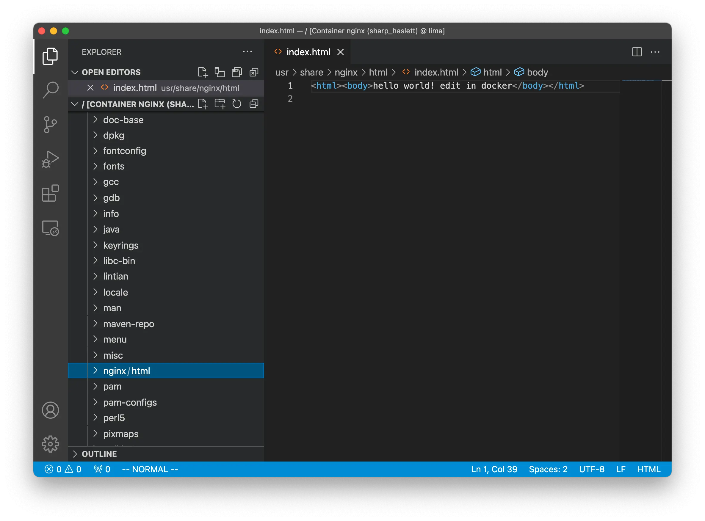

こんにちは、モンスターラボで BackEnd の TechLead をしています、国平です。

今日は、いよいよ有料化が迫った Docker Desktop についてモンスターラボで検討されている代替案の一つをご紹介します。

Docker Desktop の有料化に伴う対応について、モンスターラボが世界中のグループ、パートナー、そしてお客様と一緒に働いていることもあり、一律 Docker Desktop を有料利用するという判断が行えないプロジェクトもあります。
そのため、モンスターラボではこの問題に対応するワーキンググループが Slack 上で結成され、世界中の拠点から対応に関する知見が集まっています。
今回はその中で挙がったの一つを紹介します。

なお、モンスターラボ内では開発機として macOS が主流なため、ここでは macOS の利用を前提とします。

## 代替案

前述のワーキンググループで挙がった代替案を列挙します。

- podman
- minikube
- multipass
- Docker on Lima
- Colima
- 脱 macOS (Windows や Linux の利用)

今回はこの内、 Lima を使う方法を詳しく説明します。

## Docker on Lima

Docker Desktop に代わる案として、 Lima を用いて macOS 上に Linux 環境を構築し、 macOS 上の docker client から Lima 上の docker daemon にアクセスする方法があります。

[https://github.com/lima-vm/lima](https://github.com/lima-vm/lima)

## Install Docker client on your Mac

まず、ホストとなる mac 上に docker client をインストールします。

```shell
brew install docker
```

この時、間違えて `--cask` オプションをつけてしまうと、有料化の対象となる Docker Desktop がインストールされるので注意してください。

## Install & Lanch Lima

```shell
brew install lima
```

今回は Docker を使いたいので、公式に配布されている `docker.yaml` を利用して vm を立ち上げます。

```shell
curl https://raw.githubusercontent.com/lima-vm/lima/master/examples/docker.yaml -o docker.yaml

limactl start docker.yaml --tty=false
```

これで、 Lima が起動しました。

```shell
limactl list

# NAME      STATUS     SSH                ARCH      CPUS    MEMORY    DISK      DIR
# docker    Running    127.0.0.1:51139    x86_64    4       4GiB      100GiB    /Users/kiyotaka_kunihira/.lima/docker
```

## Connect host docker client to Lima's docker daemon

ホストマシンの Docker client から Lima 上の docker daemon に接続できるよう設定を行います。
先ほどダウンロードした `docker.yaml` には、 ホストマシンの `DOCKER_HOST` 環境変数を設定するコマンドが記載されていますが、今回は `docker context` を利用して、接続先を切り替えられるようにしたいと思います。

```shell
docker context create lima --docker "host=$(limactl list docker --format 'unix://{{.Dir}}/sock/docker.sock')"

docker context use lima
```

期待通りホストマシンから Lima 上の docker が利用できるか試してみます。

まず、ホストマシン上で適当に docker run します。

```shell
docker run hello-world

docker ps -a

# CONTAINER ID   IMAGE         COMMAND    CREATED          STATUS                      PORTS     NAMES
# ab69d9e5cdf3   hello-world   "/hello"   26 seconds ago   Exited (0) 25 seconds ago             flamboyant_jang
```

Lima 上でも `docker ps -a` して、同じ結果が得られるか確認します

```shell
limactl shell docker docker ps -a

# CONTAINER ID   IMAGE         COMMAND    CREATED         STATUS                     PORTS     NAMES
# ab69d9e5cdf3   hello-world   "/hello"   2 minutes ago   Exited (0) 2 minutes ago             flamboyant_jang
```

`CONTAINER ID` が一致しているので、問題なく Lima 上の docker がホストマシンから操作できています。

## VSCode からアクセス

## Lima で writable 設定

デフォルト設定で起動した場合、Mac のホームディレクトリが読み取り専用でマウントされるため、そのままではファイルの保存ができません。以下のマウント設定を参考に Lima の設定ファイルを修正する必要があります。

```shell
vim `limactl list docker --format '{{.Dir}}/lima.yaml'`
```

ファイル内の `mounts` の ホームディレクトリを `writable` に変更します。

```yaml
mounts:
  - location: "~"
    writable: true # Add this line
  - location: "/tmp/lima"
    writable: true
```

Lima を再起動すれば設定が反映されます。

```shell
limactl stop docker
limactl start docker
```

## VSCode からアクセス

[Remote - Containers](https://marketplace.visualstudio.com/items?itemName=ms-vscode-remote.remote-containers) を使ってコンテナ上のファイルを編集します。

ここではサンプルとして、 nginx の docker コンテナを立ち上げ、コンテナ上のファイルを編集します。

まず、ホストマシン上で適当な html ファイルを用意します。

```shell
echo "<html><body>hello world</body></html>" > index.html
```

そして、 nginx コンテナを立ち上げます。

```shell
docker run -v $(pwd):/usr/share/nginx/html:rw -d nginx
```

VSCode の Remote Explorer ペインを開くと、 nginx コンテナが表示されるので開きます。


nginx から コンテナ内のファイルを編集できました。



## まとめ

Docker Desktop の代替案として、 Mac から Lima 上の docker-daemon を利用する方法をまとめました。
また、 docker container 上のファイルを VS Code から編集するための設定しました。

_Article Photo by [cottonbro](https://www.pexels.com/photo/shallow-focus-photo-of-wooden-whale-toy-3663069/)_
