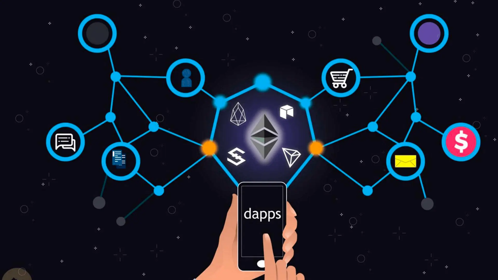
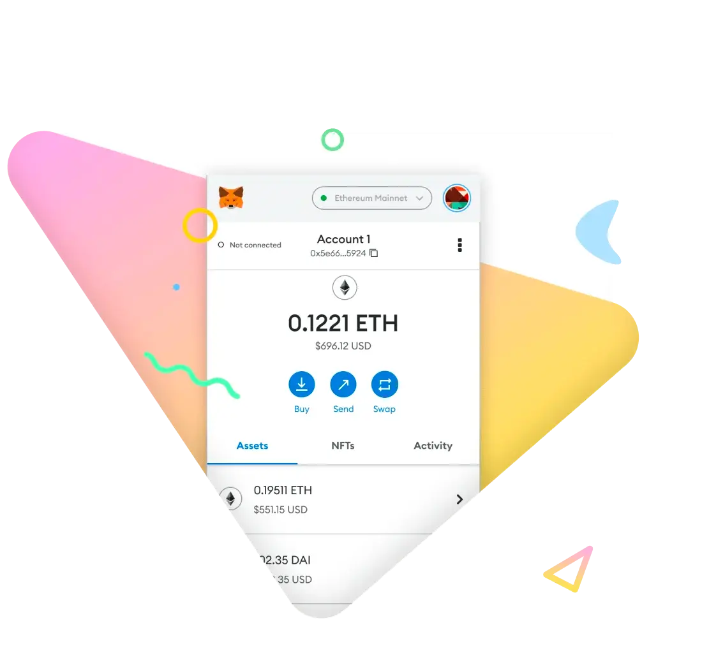
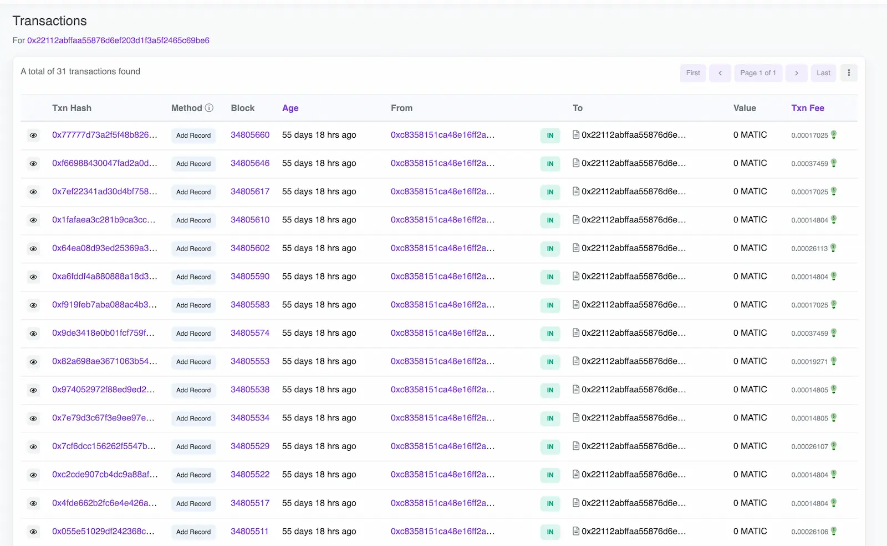
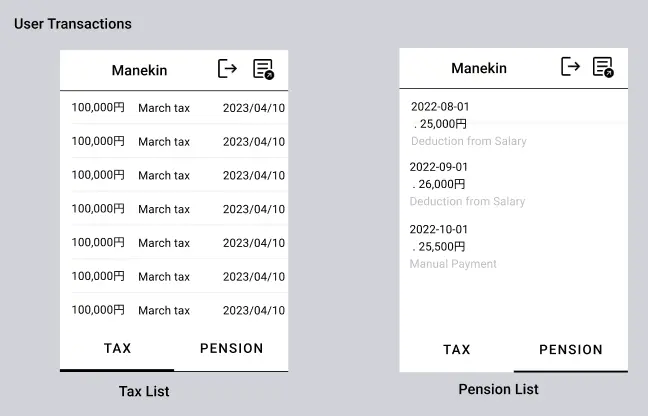

# 序章

急速にデジタル化が進む世界において、安全で透明性のある分散型の運用モードの必要性はますます高まっています。それがブロックチェーンの領域です。ブロックチェーンは、世界中の産業に革命をもたらした画期的な技術です。しかし、モバイルアプリケーションとの関係はどのようなものなのでしょうか？さらに深く探ってみましょう。

ブロックチェーンは、その核となる分散型台帳であり、暗号化を用いて保護された連続的に成長する記録のリスト（ブロック）を維持します。ブロックチェーンの最も魅力的な特徴は、データの改変に対する無傷性であり、信頼性、透明性、セキュリティを持つ技術です。

ブロックチェーンの骨格を背負っている Web3 という概念に出会います。Web3 または Web 3.0 は、分散化の原則に基づいて構築された新しいインターネットの時代を代表しています。Web3 は、ユーザーが自分自身のデータと相互作用を制御するオンライン環境を作り出すことを目指しており、これはブロックチェーンと本質的に相互に共生する概念です。

それに基づいて、ブロックチェーンと Web3 をモバイルアプリに統合することは、様々な産業において革新をもたらすと期待されており、非常に大きな可能性を秘めています。その影響が見られるであろう主な領域には、分散型金融、アプリ内デジタルアイデンティティまたは分散型ソーシャルネットワークなどがあります。

そのため私たちはこの技術が近い将来、モバイルアプリへの活用がされると考え、チーム内でキャッチアップすることにしました。基本的にはブロックチェーンとの実験環境を作り上げ、経験を積むことができるようにまずは簡単なプロジェクトを作成することで、将来のプロジェクトに活用することも視野に入れました。

次のセクションでは、ブロックチェーンに関連するいくつかの重要な用語を紹介し、私たちの市役所アプリがブロックチェーンを活用するアイデアを共有します。ゆくゆくは、パート 2 にて開発プロセスと技術的な背景を公開する予定です。

この旅は、モバイルアプリの領域におけるブロックチェーン技術の未来と、デジタルプラットフォームとの関わり方を革新する可能性についての洞察を提供します。それでは、ブロックチェーンとモバイル・アプリケーションの興味深い世界へ、探検を進めましょう！

# 新しい専門用語

### dApps

dApps は**分散型アプリケーション**（Decentralized Applications）の略称です。dApps は通常、ブロックチェーン技術を活用した分散型ネットワーク上で実行されるソフトウェアアプリケーションです。従来のアプリケーションが中央集権的なサーバーに依存するのに対し、dApps はデータやトランザクションが複数のノードに分散されたネットワーク上で動作します。ノードとは、ブロックチェーン全体のコピーを保持し、トランザクションの妥当性を検証するコンピュータやデバイスのことです。

主な特徴：

- **分散化**：dApps は分散型ネットワーク上で動作するため、単一の制御点や障害点が存在しません。アプリケーションのロジックとデータはブロックチェーンや類似の分散型台帳技術に格納され、処理されます。

- **オープンソース**：dApps はオープンソースでもあり、そのソースコードは一般に公開されており、透明性があります。

- **トークン化**：多くの dApps は独自のトークンや仮想通貨を持っており、アプリケーション内でのトランザクションを容易にしたり、所有権や価値を表現したりします。

- **スマートコントラクト**：dApps におけるスマートコントラクトは、ブロックチェーン上で事前に定義されたルールを自動的に実行するプログラムです。

Figure: 分散型アプリケーション（dApps）のイメージ、 ソース: https://cryptoadventure.com/wp-content/uploads/2020/06/dapps-developpment.jpg

このブログでは、**分散化**された機能と**スマートコントラクト**を備えたシンプルな dApp の開発について説明します。

### スマートコントラクト

スマートコントラクトは、複数の当事者間の契約や合意の条件を自動化し、検証し、強制するコンピュータプログラムです。それは、条件と規定が直接コードに書き込まれた自己実行契約です。

スマートコントラクトの主な特徴は次のとおりです：

- **自動化**：スマートコントラクトは、事前に定義された条件が満たされた場合、自動的なアクションやトランザクションを実行します。コード自体が条件を強制するため、仲介者や中央権限の必要性がなくなります。

- **デジタルと変更不可能**：スマートコントラクトは、コードで書かれたデジタル形式で存在し、ブロックチェーンに保存されます。一度展開されると、コードは変更や改ざんができない不変性を持ちます。

- **分散化**：スマートコントラクトは、複数の参加者がトランザクションを検証し記録するブロックチェーンなどの分散型ネットワーク上で動作します。この分散化の性質により、透明性が確保され、単一の中央権限の必要性が排除されます。

- **信頼とセキュリティ**：スマートコントラクトは、暗号技術を活用してトランザクションを保護し、当事者が契約の実行と結果を信頼できるようにします。ブロックチェーンの分散型コンセンサスメカニズムは、追加のセキュリティ層を提供します。

Figure: Polygonscanに展開されたスマートコントラクトの例

このブログで説明されているプロジェクトでは、スマートコントラクトを展開し、ブロックチェーンにレコードを追加するために、[Metamask](https://metamask.io/) で **ウォレット** を作成しました。

### ウォレット

Web3 ウォレットは、個人が分散型の世界でデジタルアイデンティティ、資産、および相互作用を制御するための暗号化ツールです。セキュアなキー管理、認証メカニズム、ユーザーフレンドリーなインターフェースの組み合わせを包含し、ユーザーがブロックチェーンベースの資産を安全に保管、送信、受け取り、管理できるだけでなく、dApps やブロックチェーンネットワークとシームレスに対話することができます。

このブログで説明されているプロジェクトでは、Metamask でウォレットを作成しました。Metamask は、ブラウザ拡張機能を介してユーザーとブロックチェーンネットワークとの橋渡しとして機能します。

Figure: Metamask, https://metamask.io/

スマートコントラクトの作成、トークンの送信、レコードの追加など、ブロックチェーンに変更を引き起こすすべての操作は、Metamask ウォレットで表示される**トランザクション**に記録されます。

### トランザクション

トランザクションは、ブロックチェーンで実行される操作です。このような操作はスマートコントラクトとの対話を含み、指定された関数呼び出しとパラメータに従ってコントラクトのコードが実行されます。スマートコントラクトは内部の状態を変更し、残高を更新し、イベントを発行したり、トランザクションのロジックに基づいてさらなるアクションをトリガーすることがあります。

ブロックチェーンネットワークでトランザクションが発生すると、以下の手順が行われます：

1. **開始と検証**：トランザクションは、ユーザーまたはアプリケーションによって作成され、開始されます。その後、トランザクションはブロックチェーンネットワークにブロードキャストされ、検証プロセスを経ていきます。マイナー（プルーフオブワークネットワーク）またはバリデータ（プルーフオブステークネットワーク）は、送信者が十分な資金を持っているか、トランザクションの形式が正しいか、ネットワークのコンセンサスルールによって課される追加の条件が満たされているかを確認し、トランザクションの正当性を検証します。

2. **ブロックへの含蓄**：トランザクションが検証されると、他の検証済みトランザクションと共にグループ化され、ブロックを形成します。ブロックにはトランザクションのコレクションが含まれ、ブロックチェーン上で永久的な記録として機能します。

3. **マイニングまたはブロックの最終化**：ブロックチェーンにおけるマイニングは、トランザクションの検証とそれらをブロックチェーンに追加するプロセスであり、そのための報酬を獲得することです。一方、ブロックチェーンのマイナーは、計算能力を使用してトランザクションを検証し処理し、ブロックチェーンに追加し、ネットワークのセキュリティとコンセンサスを確保する参加者です。彼らはその取り組みに対して暗号通貨で報酬を受け取ります。プルーフオブワークネットワークでは、マイナーは計算作業を必要とする暗号パズルの解決を競います。最初にパズルを解いたマイナーが新しいブロック（トランザクションを含む）をブロックチェーンに追加します。プルーフオブステークネットワークでは、バリデータは自分のステークと選択アルゴリズムに基づいてブロックを追加する順番を決めます。

4. **コンセンサスと確認**：新しく追加されたブロックはネットワーク内の他のノードに伝播され、彼らはその含蓄を検証し確認します。確認とは、トランザクションを含むブロックの上に追加された後続のブロックの数を表します。トランザクションが受け取る確認の数が多いほど、そのトランザクションの確定性とセキュリティは高まります。

5. **ブロックチェーンの状態の更新**：トランザクションが実行されると、ブロックチェーンの状態が変更されます。これには、口座残高の更新、スマートコントラクトの状態の変更、およびトランザクションに関連するイベントやログの記録などが含まれます。

Figure: スマートコントラクトのトランザクションのリスト

このブログで説明されているプロジェクトでは、以下 2 種類のトランザクションに実行しました：

- スマートコントラクトの展開時

- 年金や税金の記録をブロックチェーンに追加するために、ブロックチェーンの状態を更新するメソッドを呼び出す際

### 私たちのアイデア：市役所の住民税記録アプリ

このブログ投稿でのプロジェクトは、ユーザーがブロックチェーンに保存されている年金と税金の記録を確認できるモバイルアプリです。わかりやすいように、このアプリをマネキンと呼んでいます。Manekin は **Money（お金）と Kin（金）** を組み合わせたものです。

私たちは、今後はこのようなアプリが、従来のクラウドベースのシステムではなく、ブロックチェーンベースのシステムで開発される可能性があると考えました。なぜなら、年金や税金の記録をブロックチェーンに保存することで、信頼性とセキュリティが向上するからです。特に、ブロックチェーンから取得したデータは不変で信頼性があります。ただし、ブロックチェーン技術はすべての種類のアプリケーションに適しているわけではなく、実際の製品ではスケーラビリティやパフォーマンスなどの制約も考慮に入れる必要があります。

以下は、私たちのアプリの主な特徴です：

- **ユーザー認証**
  - アプリでは、ユーザーがユーザー ID を入力することで認証できるログインプロセスを提供しています。
  - ユーザー ID は QR コードをスキャンするか、テキストフィールドを介して手動で入力することができます。
  - ユーザー認証により、認可された個人のみが特定の記録にアクセスできるようになります。
  - ログアウトプロセスにより、次回のログインまでレコードへのアクセスが停止されます。

Figure: 私たちのアプリのモックアップ

- **税金と年金記録の取得**
  - アプリはスマートコントラクト内のメソッドを呼び出し、ブロックチェーンとやり取りして、ユーザー ID に関連する記録を取得します。
  - 取得した記録には、支払金額、タイムスタンプ、貢献の種類（税金または年金）、および記録に関する関連情報のノートなどの詳細が含まれています。

Figure: 私たちのアプリのモックアップ

- **使いやすいインターフェース**
  - 使いやすく、直感的なインターフェースを提供しています。
  - アプリケーションはスマートコントラクトと通信し、ブロックチェーンテストネットワーク上に展開されます。これはすべて裏側で行われ、ユーザーは通常のデータベースのような体験ができます。
  - 使いやすいインターフェースとスマートコントラクトとのシームレスな統合により、アプリはユーザーが安全に自分の記録にアクセスして確認することができます。

# 市役所アプリを超えて

上記のアイデアは、デジタルアイデンティティとセキュリティの分野からのアイデアです。ここでは、ユーザーが個人データを制御し、従来の集中型認証システムに依存せずに情報がより安全になるという特徴があります。デジタルアイデンティティとセキュリティは、近い将来においてもブロックチェーン技術を活用した影響を受ける分野の一つです。他の分野からの例としては、以下のようなものが挙げられます：

1. **分散型ファイナンス（DeFi）**：銀行アプリが、ユーザーがスマートフォンから直接アクセスできる分散型金融サービス（貸出、借入、仮想通貨の取引など）を提供します。ブロックチェーンベースのスマートコントラクトにより、金融取引の透明性とセキュリティが確保され、仲介業者なしでP2Pのやり取りが可能となります。

2. **サプライチェーン管理**：ファッションブランドがブロックチェーン技術と統合されたアプリです。製品の由来や正当性をサプライチェーン全体で追跡・検証できます。この透明性により、偽造品の対策、公正な取引慣行の確保、消費者からの信頼向上に役立ちます。

3. **分散型ソーシャルネットワーキング**：Web3 を活用したモバイルアプリは、ユーザーがデータと相互作用を制御できる分散型ソーシャルネットワーキングを実現します。コンテンツが分散型ネットワーク上に分散されるため、データ漏洩や検閲への懸念なく、ソーシャルプラットフォームに参加することができます。

4. **投票とガバナンス**：選挙アプリは、安全で透明性のある投票システムを実現し、選挙や意思決定プロセスの誠実さを保証します。分散化と不変性の原則に基づく Web3 技術は、ガバナンスにおける信頼と参加を高めます。

ブロックチェーンと Web3 がモバイルアプリとの統合により、ユーザー中心の安全で透明な体験の可能性が広がります。技術の進化とユーザーの採用増加に伴い、モバイルアプリとのインタラクション方法においてパラダイムシフトが起こることを期待できます。これにより、個々の人々が力を持ち、さまざまな産業が変革がもたらされます。

# つづく。。。

結論として、ブロックチェーン と Web3 のモバイルアプリへの統合は、技術とイノベーションの刺激的なフロンティアを示します。ブロックチェーン技術の分散型の性質と Web3 の原則の組み合わせにより、個人はデータ、プライバシー、デジタルインタラクションに対してより大きな制御権を持つことができます。

ブロックチェーン と Web3 のモバイルアプリにおけるポテンシャルは非常に大きく、技術の進化に伴い、さらに革新的なユースケースが期待されます。開発者や起業家たちはこれらの可能性を探求し、個人がデジタルライフにおいてより大きな制御と所有権を持つ分散型の未来への道を切り開いています。

次のブログでは、この新しく進化する技術を使用してアプリ開発をするための開発フェーズや取り組みについて詳しく掘り下げます。詳細を、お楽しみに！
