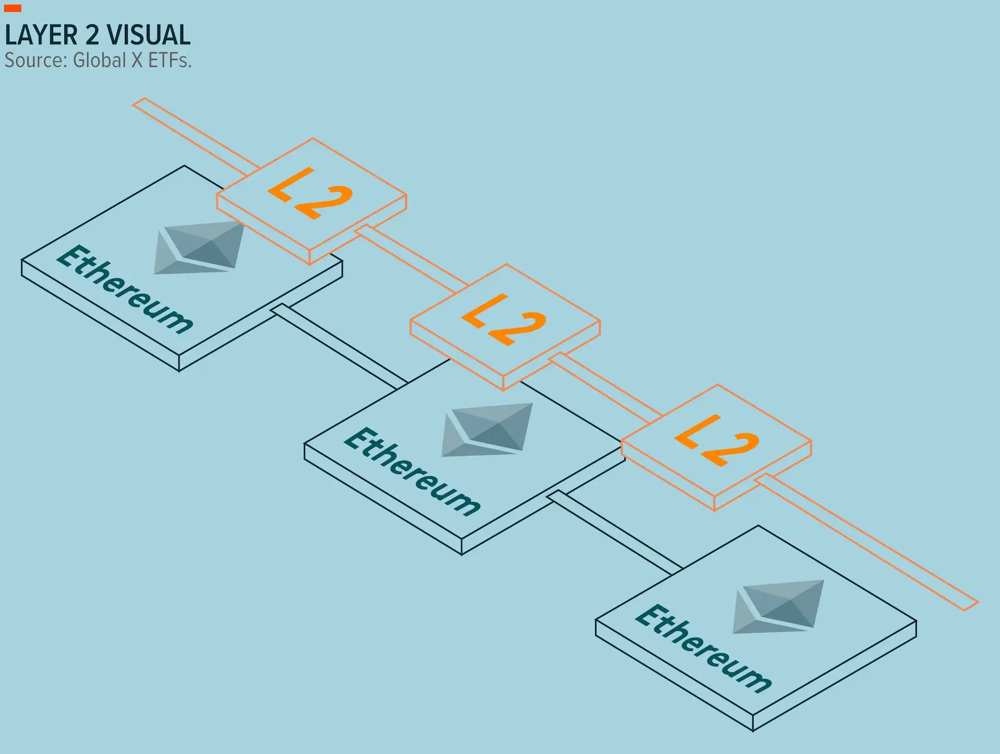
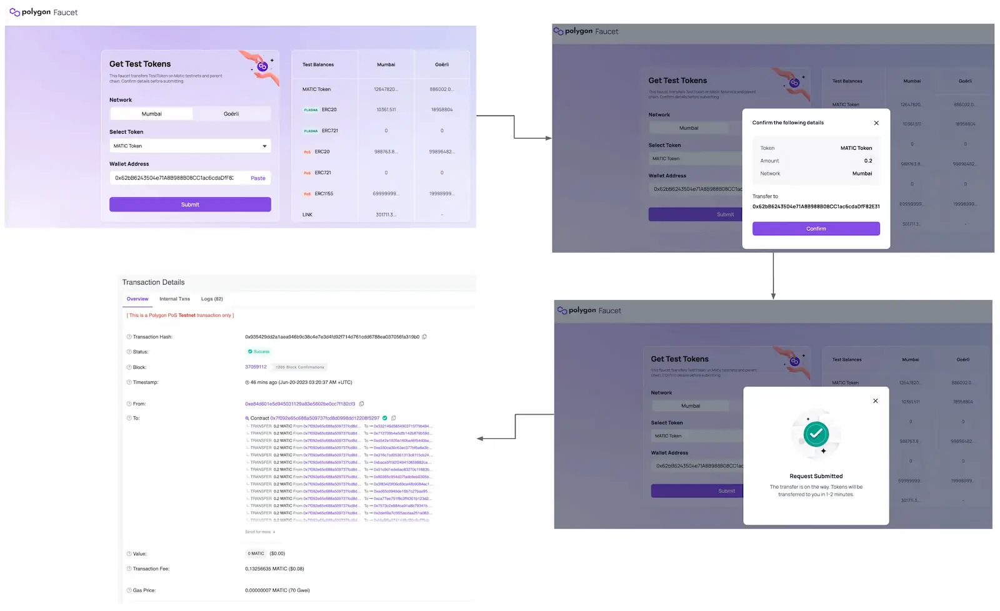
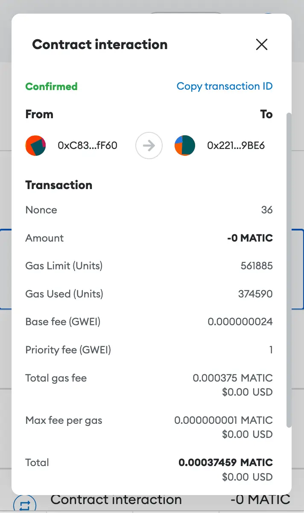
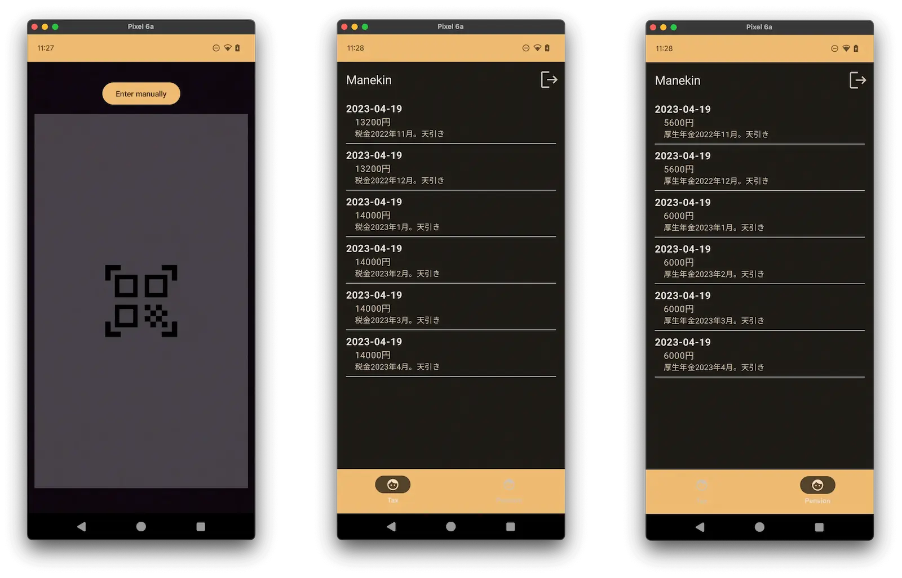
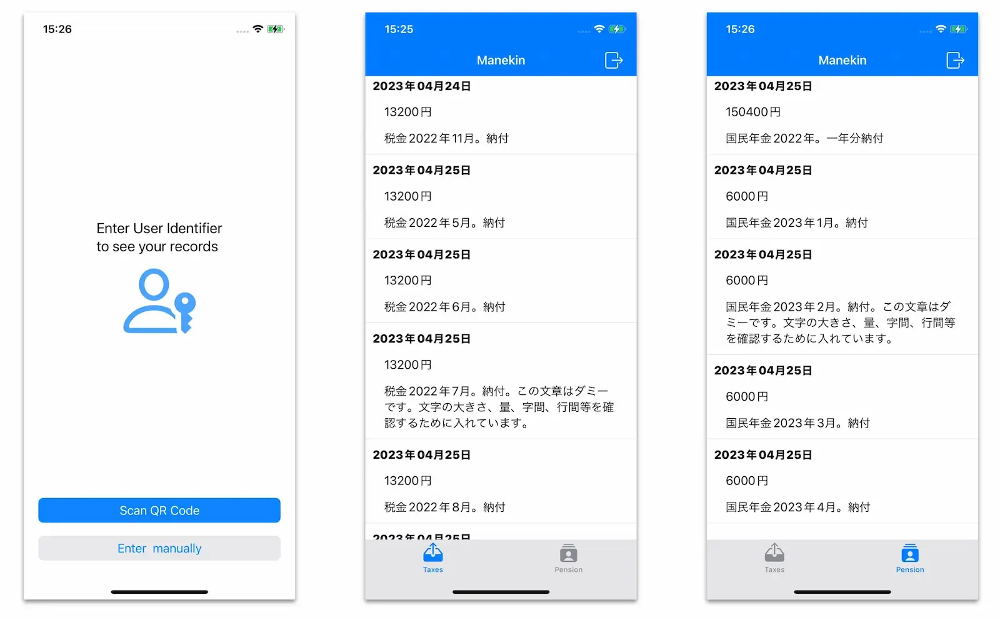

ブロックチェーン技術に関するブログシリーズへお帰りなさい！前回の投稿では、ブロックチェーンの基本とさまざまな産業への可能性について探求しました。もしまだ読んでいない方は、[こちら](https://engineering.monstar-lab.com/jp/post/2023/07/12/Empowering-Mobile-Applications-through-Blockchain-Our-Journey-Part-1/)をご覧ください。今日は、ブロックチェーン技術を用いたプロトタイプモバイルアプリケーションの開発プロセスを掘り下げて説明します。このアプリの焦点は、ユーザーがブロックチェーン技術を使用して、確実で透明性のある方法で年金と税金の記録を確認できるようにすることです。

アプリの主な機能は以下の通りです：

- ユーザー認証：QR コードまたはユーザー ID を使用した認証
- ログアウトプロセス
- 税金と年金の詳細表示：支払金額、タイムスタンプ、およびブロックチェーンに記録された情報に関する注記

# アプリ＋ブロックチェーン開発

ブロックチェーンをモバイルアプリに統合することで、企業や組織はデータを扱う新しい方法を模索しています。ブロックチェーンの主な特徴である分散化と不変性を活用することにより、デジタルトランザクションの記録やデジタルアセットの管理において、より透明性のある安全な環境が実現されます。

現在の状況では、モバイルアプリケーションをブロックチェーンに接続するためのさまざまな方法と技術が利用可能です。以下は一般的なアプローチです：

- SDK（ソフトウェア開発キット）は、ブロックチェーン機能をモバイルアプリに統合するための事前に構築されたライブラリやツールを開発者に提供します。
- API（アプリケーションプログラムインターフェース）は、モバイルアプリがブロックチェーンネットワークと通信し、その機能にアクセスすることを可能にします。例えば、Coinbase API はブロックチェーンネットワークとのやり取りを容易にします。
- MetaMask などの Web3 ウォレットとの統合により、ブロックチェーンネットワークとのシームレスなやり取りが実現します。

現在、ネイティブに開発されたアプリであるか、Flutter のようなクロスプラットフォーム技術を使用して構築されたアプリであるかに関係なく、モバイルアプリに統合するための機能的なオープンソースライブラリが利用可能です。以下は人気のあるライブラリーです：

- iOS 向けには、[Web3swift](https://github.com/web3swift-team/web3swift) がスマートコントラクトに接続し、アプリから直接トランザクションを実行するための必要なツールを提供します。
- Android 向けには、[Web3j](https://github.com/web3j/web3j)が Java ライブラリとして提供されており、Android 開発者が Ethereum ブロックチェーンとやり取りすることを可能にします。ウォレットの作成、トランザクション処理、スマートコントラクトの呼び出しなどの機能を提供します。
- Flutter の場合、[web3dart](https://pub.dev/packages/web3dart)は Ethereum ブロックチェーンとやり取りすることを可能にするライブラリで、ウォレットの作成、トランザクション処理、Flutter アプリ内にてスマートコントラクト操作などの機能を提供します。

# ブロックチェーンに接続するモバイルアプリで何ができるでしょうか？

以下は、ブロックチェーンに接続するモバイルアプリで一般的に行われる操作です：

- **ウォレットの管理**：ブロックチェーンに接続したアプリでは、デジタルウォレットを管理する機能がしばしば含まれています。ユーザーはウォレットを作成し、暗号鍵を安全に保存し、仮想通貨やトークンなどのデジタルアセットを管理することができます。

- **トランザクション処理**：アプリはブロックチェーンでトランザクションの開始と処理を容易にすることができます。ユーザーはモバイルデバイスからデジタルアセットを送受信し、支払いを行うことができます。

- **アセットのトラッキング**：ブロックチェーンに接続したアプリはデジタルアセットをリアルタイムで追跡と監視を提供することができます。ユーザーはブロックチェーン上でアセットの取引履歴、残高、所有情報を表示することができます。

- **スマートコントラクトとのインタラクション**：アプリはブロックチェーンに展開されたスマートコントラクトとのやり取りを可能にします。ユーザーは関数を呼び出したり、分散型アプリケーション（DApps）に参加したり、自動化された契約ロジックとやり取りすることができます。

この記事では、主にスマートコントラクトとのやり取りを目的としたモバイルアプリケーションについて話します。

# ブロックチェーン開発概念

開発の詳細に進む前に、理解をより深めるためにいくつかの概念について見ていきましょう。

### Polygon ネットワーク

Polygon ネットワークは、Ethereum のスケーリングソリューションまたは Layer 2 ソリューションとして機能します（以下の図を確認してください）。これは、Ethereum ネットワーク上の混雑と高い手数料を緩和するための追加のインフラストラクチャと技術を提供します。トランザクションやアクティビティは Ethereum メインネットワークから Polygon ネットワークにオフロードされることで、より高速かつ低い手数料で処理されることがあります。


Figure: Layer 2ソリューションの表現で、オレンジの部分がLayer 2ソリューションを示し、緑の部分がメインネットを示しています。Source: https://www.globalxetfs.com.au/

**Polygon Scan**と呼ばれる Web ベースのプラットフォームは、Polygon ネットワーク上の活動を探索し、モニタリングするために使用されます。

興味深い事実として、Polygon は「[“Eco-friendly blockchain”](https://polygon.technology/blog/polygon-the-eco-friendly-blockchain-scaling-ethereum)」であり、特にエネルギーを多く消費する Bitcoin ブロックチェーンネットワークと比較して、環境に配慮した特性を持っています。

この記事で説明したプロジェクトでは、記録を格納するために Polygon ネットワークを使用しました。より深い理解については、前回の[記事](https://engineering.monstar-lab.com/jp/post/2023/07/12/Empowering-Mobile-Applications-through-Blockchain-Our-Journey-Part-1/)のスマートコントラクトセクションを参照してください。

### テストネット

テストネットは、開発者やユーザーが実際の仮想通貨を使用せずに、アプリケーションやスマートコントラクト、その他のブロックチェーンの機能をテストし、実験するために使用できる独立したブロックチェーンネットワークです（ブロックチェーンの本番バージョンであるメインネットとは別に存在します）。

このプロジェクトでは、Mumbai テストネットを使用しました。Mumbai テストネットは[PolygonScan プラットフォーム](https://mumbai.polygonscan.com/)を通じてアクセスできます。

### フォーセット

Web3 において、faucet（フォーセット）は、テストや開発の目的でユーザーに無料のトークンや仮想通貨を提供するサービスまたは仕組みを指します。通常、テストネットワーク上で使用され、現実世界での価値を持たないトークンが配布され、ブロックチェーンアプリケーションの実験に利用されます。

フォーセットの文脈において、「トランザクション」は、フォーセットからユーザーのウォレットへの仮想通貨の送金を指します。

このプロジェクトでは、以下のフォーセットから無料のトークンを入手しました：

- [Polygon Faucet](https://faucet.polygon.technology/)
- [Chainlist](https://chainlist.org/?search=Polygon&testnets=true)

以下は、Metamask で作成したアカウントへのフォーセットからのトランザクションの例です。必要な唯一のパラメータは、Metamask 拡張機能から取得されるウォレットアドレスでした。


Figure: フォーセットのトランザクション

**Polygon Scan**と呼ばれるウェブベースのプラットフォームは、Polygon ネットワーク上の活動を探索し、監視するために使用されます。

この記事で説明したプロジェクトでは、レコードを格納するために Polygon ネットワークを使用しました。スマートコントラクトの開発に関するセクションをご参照ください。

### Metamask

この記事で説明したプロジェクトでは、[Metamask](https://metamask.io/)でウォレットを作成しました。Metamask は、ブラウザの拡張機能を介してユーザーとブロックチェーンネットワークとの間に橋渡しをする役割を果たします。


Figure: Metamaskのトランザクションの詳細

Metamask でウォレットを設定するために実行した手順は以下の通りです：

- Metamask のブラウザ拡張機能をインストールします。
- パスワードと秘密の回復フレーズを生成する手順に従います。
- Metamask のメニューでアカウントを作成します。

# スマートコントラクト開発

このプロジェクトで開発されたスマートコントラクトの目的は、年金と税金の取引記録をブロックチェーン上に安全に保存することです。最終的に展開されたスマートコントラクトは、[ここ](https://mumbai.polygonscan.com/address/0x22112abffaa55876d6ef203d1f3a5f2465c69be6#code)で確認できます。

### 主な特徴

- このスマートコントラクトは分散型の台帳として機能し、年金と税金の記録の不変性と透明性を確保します。

- 政府の職員がユーザー識別子へのアクセス権を持つことにより、ブロックチェーンに記録を追加する機能を提供します。

- スマートコントラクトは、モバイルアプリケーションが特定のユーザーに属する記録のみを呼び出しと取得できるようにするメソッドを提供し、プライバシーと個別のアクセスを保証します。

### 開発と展開

以下は、スマートコントラクトの開発と展開プロセスで行った手順です。

1. **要件分析**：スマートコントラクトに必要なデータ、レコードの構造、ユーザー識別、およびアプリの仕様を考慮したアクセス制御など、要件を収集し分析しました。

2. **Solidity コントラクト開発**：Solidity プログラミング言語を使用してスマートコントラクトを記述しました。必要な変数と機能を定義して、望む機能を実装しました。

   - 変数：
     - contributionType (uint8)
     - recordNumber (uint)
     - amount (uint)
     - timestamp (uint)
     - note (string)
   - 関数：
     - 単一のレコードを追加するための関数
     - 特定のユーザーに対して、すべてのレコードを取得するための関数
     - 特定のユーザーに対して、レコード数を取得するための関数

3. **Remix 統合**：オープンソースのツールである Remix を使用して、ブラウザから直接スマートコントラクトを開発およびテストしました。Remix は Solidity コントラクトの記述、コンパイル、およびデバッグに便利な環境を提供します。

4. **テスト**：デプロイする前に、Remix を使用してスマートコントラクトをローカルでテストしました。

5. **Metamask でウォレットを作成**：ブロックチェーンネットワークとやり取りを開始するために、 [Metamask](https://metamask.io/)でウォレットを作成しました。必要な手順に従ってパスワードと認証アクセスのためのシードフレーズを設定しました。さらに、トランザクションの確認とトークン資金の管理のためにいくつかのアカウントを作成しました。

6. **トークンの取得**：その後、テストネット上でスマートコントラクトの展開とやり取りに使用するため、フォーセットから無料のトークンを入手しました。

7. **Mumbai Testnet への展開**：私たちは、PolygonScan プラットフォームが提供する Mumbai Testnet にスマートコントラクトを展開しました。展開されたスマートコントラクトのアドレスは[こちら](https://mumbai.polygonscan.com/address/0x22112abffaa55876d6ef203d1f3a5f2465c69be6#code) です。

### スマートコントラクトのレスポンスの構造

展開されたスマートコントラクトには、モバイルアプリケーションから呼び出される getRecordsForUser というメソッドが含まれています。このメソッドは、年金と税金の記録を取得するために使用されます。このメソッドは、2 つのキーを持つ辞書型オブジェクトを返します: "0"と"\_success"です。キー"0"には、以下の例に示すようなタプルの配列が含まれます。

```json
[
   "0":[
      [
         2,
         0,
         13200,
         1682317471,
         "税金2022年11月。納付"
      ],
      [
         2,
         1,
         13200,
         1682416499,
         "税金2022年5月。納付"
      ],
      [
         1,
         17,
         6000,
         1682416853,
         "国民年金2023年4月。納付"
      ]
   ],
   "_success":true
]
```

各タプルは 1 つの記録に対応します。含まれる項目は以下の通りです。

1. Contribution タイプ：年金の場合は 1、税金の場合は 2
2. Record Number：特定のユーザーの記録番号
3. Amount：この記録の金額
4. Timestamp：記録が追加されたタイムスタンプ
5. Note：ブロックチェーンに追加された記録に関連する注記

# Android アプリ開発

### アプリケーション概要

このネイティブ Android アプリケーションでは、ユーザーが「ログイン」することができます。これには、Manekin コントラクトに存在する有効な GUID をアプリケーションに保存する必要があります。その後、アプリケーションはその GUID に関連するトランザクションをコントラクトにクエリし、ユーザーにカテゴリ別に表示します。コントラクトへのクエリは読み取り専用の操作であり、したがって仮想通貨は不要です。


Figure: Androidモバイルアプリスクショ

スマートコントラクトとのやり取りには、Android 向けに[Web3j ライブラリ](https://github.com/web3j/web3j) を利用しました。これは、複数のブロックチェーンへのアクセスを可能にする最も人気で最もメンテナンスされているプロジェクトです。

### その他使用したライブラリ

**Firebase Remote Config**
もしテストネットが将来変更される場合、RPC URL やコントラクトアドレスをリモートで変更できます。これにより、アプリにハードコードされた情報を再リリースする必要がなくなります。

**AndroidX Camera**
バーコードリーダーに情報を提供し、カメラプレビューを表示するために使用しました。

**Google MLKit Barcode Scanner**
ログインに使用される QR コードを認識し、その中のデータを読み取るために使用しました。

**Google Accompanist**
カメラの許可を簡単に処理するために使用しました。

### Java のスマートコントラクトラッパーの生成

まず、Manekin スマートコントラクトのページからコントラクトの ABI をダウンロードする必要がありました。

次に、[Web3j コマンドラインツール](https://docs.web3j.io/4.10.0/command_line_tools/)（執筆時点ではバージョン 4.10.0）をインストールしました。

その後、以下のコマンドを使用してラッパーを生成し、データ/モデルフォルダに配置しました：

```shell
web3j generate solidity -a <abi_file> -o <output_folder> -p <java_package_name>
```

### Polygon Mumbai テストネットへのアクセス

1. RPC URL とコントラクトアドレスを定義してください。前述のように、私たちは Firebase Remote Config に保存し、その後取得しました。

```kotlin
val remoteConfigRepository: RemoteConfigRepository =
            (application as App).remoteConfigRepository

val rpcUrl = remoteConfigRepository.getRPCUrl().data ?: ""
val contractAddress = remoteConfigRepository.getContractAddress().data ?: ""
```

2. RPC URL を使用して Web3j ライブラリを初期化してください。

```kotlin
val web3j: Web3j = Web3j.build(HttpService(rpcUrl))
```

3. 前の web3j オブジェクトを使用して、トランザクションを取得するために読み取り専用のトランザクションマネージャーを初期化してください。

```kotlin
val readonlyTransactionManager = ReadonlyTransactionManager(web3j, "0x0000000000000000000000000000000000000000")
```

Web3j は、読み取り専用の操作であってもウォレットアドレスが必要ですので、ダミーアドレスを使用しました。

4. 以前に Web3j コマンドラインツールで生成した Manekin コントラクトラッパーを読み込んでください。

```kotlin
val contract: ManekinContract =
            ManekinContract.load(
                contractAddress,
                web3j,
                readonlyTransactionManager,
                DefaultGasProvider()
            )
```

5. Web3j が生成した関数を使用して、コントラクトから記録を取得してください。

```kotlin
Retrieve the records from our contract, using the function which Web4j generated :
```

`userIdentifier`が定義されているか、または渡されていると仮定し、これはユーザーデータを表す GUID です。

# iOS アプリ開発

### アプリケーション概要

これは、ユーザーがブロックチェーンに保存された年金と税金の記録を確認することを可能にするネイティブモバイルアプリケーションです。ブロックチェーンに記録を追加するプロセスはアプリケーション内では実行されず、代わりに手動で行われます。これは[PolygonScan](https://mumbai.polygonscan.com/address/0x22112abffaa55876d6ef203d1f3a5f2465c69be6#writeContract) コンソールで _writeContract_ メソッドを呼び出すことで行うことができます。


Figure: iOSモバイルアプリスクショ

スマートコントラクトとやり取りするために、私たちは**Web3Swift**ライブラリを使用しました。これは、iOS 向けに設計された Swift ライブラリで、Ethereum のスマートコントラクトをブロックチェーン上でシームレスに統合することを目的としています。このライブラリは [こちら](https://github.com/web3swift-team/web3swift)で見つけることができます。

私たちがこのライブラリを選んだ理由は、人気がありかつ、Swift プロジェクトへの簡単な統合が可能な点、さらにメンテナンスを考慮した為です。Web3swift はさまざまなスマートコントラクト操作に対して広範なサポートを提供しており、複雑な Web3 関連プロジェクトの開発に適しています。

### 必要なパラメーター

Polygon の Mumbai テストネットに展開されたスマートコントラクトをインスタンス化するために、以下の 3 つの情報が必要でした：

- RPC サーバーアドレス：Mumbai テストネットには複数のアドレスがあり、最も便利なものを選択できます。詳細については、[Chainlist](https://chainlist.org/)を参照してください。

- チェーン ID：Mumbai テストネットのチェーン ID は 80001 です。詳細については、[Chainlist](https://chainlist.org/)を訪れてください。

- コントラクトアドレス：これは[スマートコントラクト URL](https://mumbai.polygonscan.com/address/0x22112abffaa55876d6ef203d1f3a5f2465c69be6)に埋め込まれているハッシュを指します。

- コントラクト ABI：この JSON ファイルにはスマートコントラクトの詳細が含まれており、polygonscan プラットフォームからダウンロードできます。

### ブロックチェーンから記録を取得するための手順

1. RPC サーバーアドレスと Mumbai テストネットのチェーン ID を使用して、Web3 オブジェクトを作成します。

```swift
let mumbaiEndpoint = URL(string: rpcUrl)
let mumbaiNetworkId = 0x13881

var provider: Web3Provider

do {
    provider = try await Web3HttpProvider(
        url: mumbaiEndpoint,
        network: Networks.fromInt(UInt(mumbaiNetworkId)))
} catch {
    return TaskResult.failure(AppError.providerGenerateError)
}

let web3 = Web3(provider: provider)
```

2. ローカルに保存されている JSON ABI ファイルを文字列として取得します。

```swift
guard let contractABIURL = Bundle.main.url(forResource: "contract_abi", withExtension: "json") else {
    return TaskResult.failure(AppError.abiBundleError)
}

guard let contractABIString = try? String(contentsOf: contractABIURL, encoding: .utf8) else {
    return TaskResult.failure(AppError.abiStringParseError)
}
```

3. Web3 インスタンス、コントラクトアドレス、ABI 文字列、およびスマートコントラクトで呼び出すメソッドの名前を使用して、ReadOperation オブジェクトを作成します。

```swift
guard let contract = web3.contract(contractABIString, at: EthereumAddress(contractAddress)) else {
    return TaskResult.failure(AppError.contractGenerateError)
}

guard let readOperation = contract.createReadOperation(
    "getRecordsForUser",
    parameters: [userIdentifier]) else {
    return TaskResult.failure(AppError.contractWrongMethodOrParameters)
}
```

4. callContractMethod を実行し、データを必要に応じて解析してユーザーインターフェースに表示します。

```swift
do {
  // 1. Call callContractMethod
  let result = try await readOperation.callContractMethod()

  // 2. Check whether there are records added for this User
  guard let array = result["0"] as? [[Any]] else {
      return TaskResult.failure(AppError.userDoesNotExistOrNoRecords)
  }
  if !array.isEmpty {
      var records: [ContributionModel] = []

      // 3. Parse the records in the response one by one
      for subArray in array {
          if !subArray.isEmpty {

              guard let recordNumber = subArray[1] as? BigUInt,
                    let amount = subArray[2] as? BigUInt,
                    let timeStamp = subArray[3] as? BigUInt,
                    let contributionType = subArray[0] as? BigUInt else {
                  continue
              }

              var type: ContributionModelType
              if contributionType == 1  {
                  type = .pensions
              } else if contributionType == 2  {
                  type = .taxes
              } else {
                  continue
              }

              let note = subArray[4] as? String ?? ""

              let newRecord = ContributionModel(
                  recordNumber: recordNumber,
                  timeStamp: timeStamp,
                  amount: amount,
                  note: note,
                  type: type)

              records.append(newRecord)
          }
      }
      return TaskResult.success(records)
  }
  return TaskResult.failure(AppError.userDoesNotExistOrNoRecords)
} catch {
  return TaskResult.failure(AppError.userDoesNotExistOrNoRecords)
}
```

# 結論

ブロックチェーンは非常に新しい技術であり、急速に進化しています。したがって、このプロジェクトの開発中に 2 ヶ月前に行った決定は今日では異なっているかもしれません。

まとめると、市役所アプリなどのモバイルアプリにブロックチェーン技術を統合することは、強化されたセキュリティ、透明性、効率化されたプロセス、および改善されたデータの完全性を提供します。さらに、モバイルアプリにおけるブロックチェーン技術の未来は非常に大きな可能性を秘めていると考えています。

この最初のステージでは、ブロックチェーンからいくつかの情報を取得するだけの簡単なアプリを作成しました。次のステップでは、アプリ自体からブロックチェーンにレコードを追加することになります。この目的のために、市役所向けのアプリを作成する予定です。このアプリでは、従業員がスマートコントラクトに直接アプリからレコードを追加できるようになります。これを実現するために、Metamask 以外のより使いやすいウォレットを使用し、よりユーザーフレンドリーな体験を提供したいと考えています。これらの内容は別のブログの話題となるかもしれませんが、それらについて詳細に調査した後にここで話す予定です。
