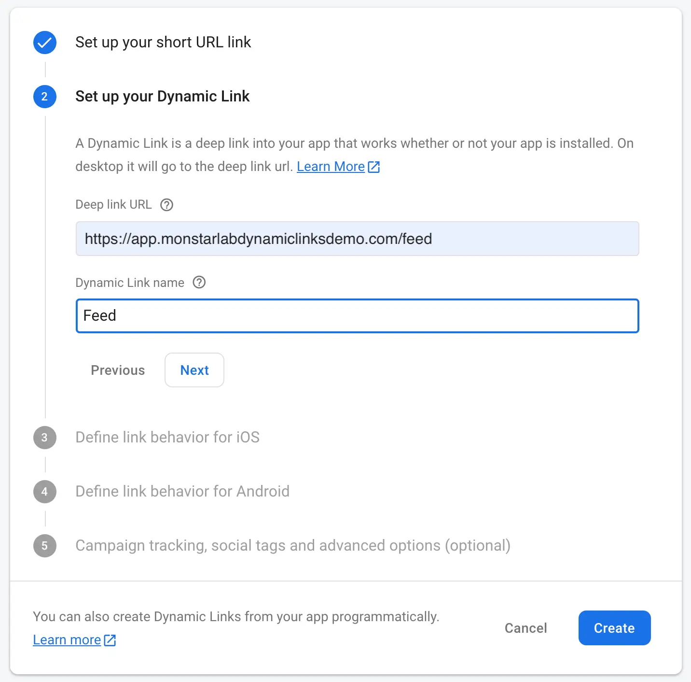
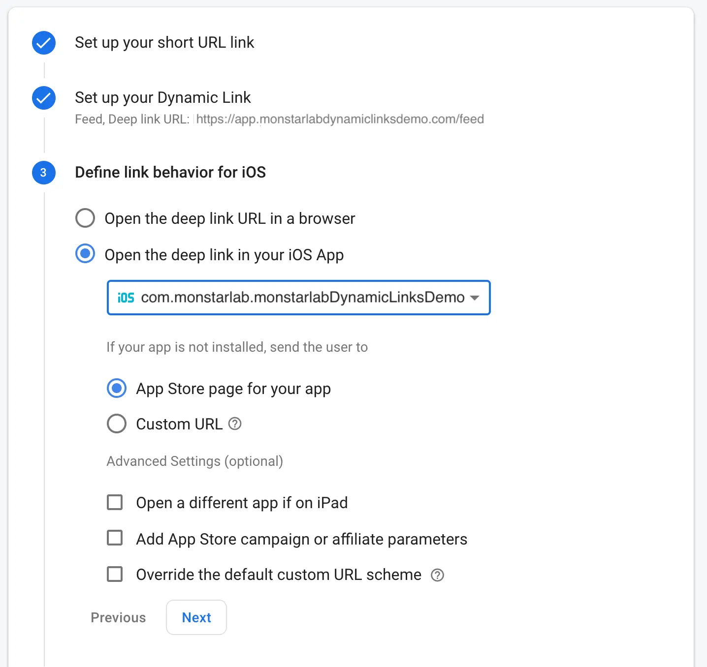
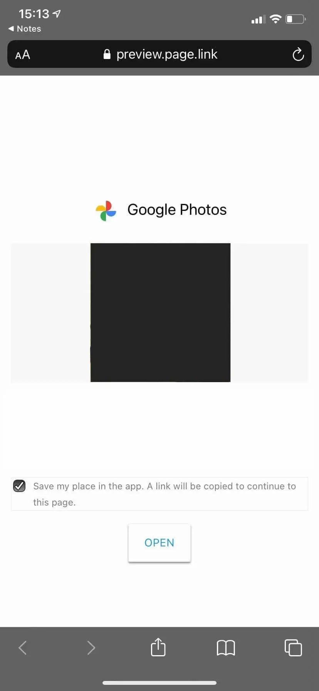

この記事はFlutterでDynamic Linkを使用する方法のステップバイステップガイドです。

## Dynamic Linksとは何ですか？

Dynamic Linksは、アプリの特定の画面に連携するスマートURLです。一般的にはディープリンクとして知られて、外部のウェブサイト/アプリで簡単に使用できます。


## どうしてFirebase Dynamic Links?

どうしてFirebaseですか？ 自分自身で実装することはできませんか？ディープリンクような実装を開発する為、別のサービスに依存する必要がありますか？ Firebase使用を決定する前にこのような質問で悩んでいました。おかげさまで、以下のビデオを見つけて、簡単に決定できました。

{{ youtube-link="LvY1JMcrPF8" }}

では、Firebase Dynamic Linksを選んだ理由は以下に説明します。

- **全てのプラットフォーム（iOS、Android、Web）が対応：** 1つのリンクが全てのプラットフォームで使用できます。
- **アプリがインストールされていない動作を調整できます：** ユーザーをランディングページまたはストアプラットフォーム（iOS、Android）に遷移できます。
- **アプリのインストール後にフローが停止されないです：** ユーザーがアプリをインストールしていない場合でも、アプリをインストールした後、Dynamic Linkが動作します。
- **Firebase Analyticsと組み合わせて簡単に使用できます：** Firebase Analyticsを使用して、Dynamic Linkが使用された回数をカウントできます。

## Getting started

この記事では、FlutterでDynamic Linkを使用する方法のみを説明します。 先に進む前に、下記の手順が完了していることを確認しましょう。

- Firebaseプロジェクトの作成
- Firebase Consoleで必要なiOSおよびAndroidアプリの追加
- Firebaseを使用する為の、iOSとAndroidアプリの設定


## ステップ1：Prefix URLを作成

Dynamic LinkはURLから定義されるので、まずはそのURLのプレフィックスを指定します。

上記をする為、以下のサイトページを開いてください。

*Firebase Console > Dynamic Links > Get startedボタン*


ここで自分たちのprefix URLを設定します。 このprefixは、全てのDynamic Linkに表示される文言なので、明らかに自分たちのアプリに関係付けて必要があります。 したがって、明確で正確なものを設定することをお勧めします。 この例では、以下のprefixに決定しました。

***<p style="text-align: center;">https://app.monstarlabdynamiclinksdemo.com/<p/>***

上記のprefix URLからの後続のリンクは、以下のようになります。

***<p style="text-align: center;">https://app.monstarlabdynamiclinksdemo.com/home<p/>***

最後に**Verify**ステップで、そのドメインの所有権を証明してください。


**スタートガイド**の**Finish**ステップに到達ときに、自分たちのアプリのprefix URLが作成できました。次のステップに移動しましょう。

## ステップ2: インストール

FlutterアプリにFirebase Dynamic Linkを実装する為、firebase_dynamic_linksライブラリを利用します。

<u>https://pub.dev/packages/firebase_dynamic_links</u>

ターミナルで以下のコマンドを実行してください。ライブラリがFlutterプロジェクトにインストールされます。

```shellscript
flutter pub add firebase_dynamic_links
```

インストール後、AndroidでDynamic Linkを受信する為、これ以上することはありません。 しかし、iOS端末にはさらに3つの設定が必要です。 これから、iOSアプリがDynamic Linkを開くできるようにその3つの手順があります。

#### ステップ2.1: Universal Linkを設定

第一目の設定は、iOSアプリにAssociated Domains機能を追加することです。こちらを行う為、XcodeでRunner.workshopを開いて、以下の箇所に移動してください。

*Project root > App target > Signing & Capabilities > + Capability > Associated Domains*


**Associated Domains>Domains**の項目は **applinks:(URL prefix)** に設定してください。

```shellscript
applinks:app.monstarlabdynamiclinksdemo.com
```

上記した後、App ID（Apple dev center）の設定を更新して、Associated Domains capabilityを追加して、プロビジョニングプロファイルを更新します。 そうしないと、iOSアプリでDynamic Linkをテストできなくなります。

#### ステップ2.2: Custom URL schemesを対応

第二目の設定は、iOSアプリでcustom URL schemesを対応することなので、以下の箇所に移動してください。

*Project root > App target > Info > URL Types > +*


ここでは、**Identifier**項目は**Bundle ID**に設定し、**URL Schemes**項目はiOSアプリのbundle idを設定してください。

```shellscript
com.monstarlab.monstarlabDynamicLinksDemo
```

#### ステップ2.3: Info.plistを設定

第三目の設定は、**Info.plist**に**FirebaseDynamicLinksCustomDomains**のArrayを追加します。


Array追加した後、**String項目**を追加して、自分たちのURL prefixを記入してください。

```shellscript
https://app.monstarlabdynamiclinksdemo.com/
```

この時点で、準備ができているはずです。それにもかかわらず、iOSアプリの設定は一番の面倒なタスクなので、困るときに以下のビデオチュートリアルを参考してください。特にiOS端末でDynamic Linkを開かない場合、上記のステップを再確認をお願いいたします。

{{ youtube-link="KLBjAg6HvG0" }}

## ステップ3: Dynamic Linksを作成 (不変URL)

ステップ１にアプリのprefix URLを作成しましたが、Dynamic Linkとして足りないです。上記に説明の通り、Dynamic Linkはアプリの特定の画面に連携するスマートURLです。ちゃんと動いているリンクを作成したい場合は、その画面に連携する部分のURLも定義する必要があります。

なお、このステップ3にはアプリ画面を開くために特別な情報やパラメターが必要リンクに集中します。以下は例になります。

***<p style="text-align: center;">https://app.monstarlabdynamiclinksdemo.com/feed</p>***

***<p style="text-align: center;">https://app.monstarlabdynamiclinksdemo.com/premium</p>***

***<p style="text-align: center;">https://app.monstarlabdynamiclinksdemo.com/profile</p>***

上記のリンクは、Firebase Consoleから簡単に作成できます。以下のサイトページ箇所を開いてください。

*Firebase Console > Dynamic Links section > New Dynamic Linkボタン*


「New Dynamic Link」ボタンをクリックするときにガイドを表示されます。そのガイドの一つずつのステップは詳しく説明して行きます。

#### ステップ3.1: ショートURL

第１ステップでは、ショートDynamic LinkのURLの最後の部分を設定することができます。


この時点では、ショートURLのメリットを理解するのは難しいと思います。したがって、フィールドをランダムな文字列のままにして、次のステップに進んでください。

#### ステップ3.2: Dynamic Linkの設定



第２ステップでは、**Deep link URL**の最後の部分を定義します。 こちらは実際のDynamic Linkになります。 文字列について、何でもいいですが、連携している画面を強調する文言が設定することをお勧めします。

URLパスに加えて、「**Dynamic Link name**」の設定は必要です。 このnameはFirebaseコンソール内で使用するものです。Dynamic Linkが多い場合、名前で簡単に指摘できるようにDynamic LinkのURLの隣に表示されます。

#### ステップ3.3: iOSの行動



第３ステップでは、Dynamic LinkはiOS端末でクリックするときの行動を設定できます。 このリンクはアプリ内の画面を開くことなので、「**Open the deep link in your iOS App**」のオプションを選択してください。

同じように、ユーザーがアプリをインストールしていない場合の動作を設定できます。 この例で、「**App Store page for your app**」を選択して、Appストアを開くことに決定しました。 代わりに、「**Custom URL**」を選択する場合、ランディングページURLを設定することもできます。

#### ステップ3.4: Androidの行動


第４ステップでは、Dynamic LinkはAndroid端末でクリックするときの行動を設定できます。 前のステップと同じように、アプリ内の画面を開くことなので、「**Open the deep link in your Android App**」のオプションを選択してください。

さらに、アプリがインストールされていない場合、「**Google Play page for your app**」を選択して、Playストアを表示することができます。

#### ステップ3.5: その他の設定

第５ステップでは、Dynamic Linkの多数のオプションを設定できます。


「**Add social meta tags for better sharing**」と言う項目ではリンクのメタタグパラメータを設定できます。そうするとSNSで、リンクを表示するときに魅力的なUIを表示してくれます。

代わりに、「**Track a campaign with UTM parameters**」と言う項目ではUTMパラメータを設定できます。このパラメータはFirebaseAnalyticsと一緒に使用することができます。

#### App preview page

FirebaseのDynamic Linkは「App preview page」と言う機能があります。こちらは、リンクとアプリ画面の間のhtmlページになります。 このhtmlページは、端末のデフォルトのブラウザーに表示され、上記のステップで設定されたソーシャルメタタグパラメーター（タイトル、画像、説明）も表示されます。




このページも「**OPEN**」ボタンを表示されるので、ユーザーが本当にリンクを開きたいことを決定できます。 開発者はこのようなページを表示したくない場合、「**Skip the app preview page (not recommended)** 」チェックボックスをオンにしてスキップすることができます。

## ステップ3:  Dynamic Linksを作成 (可変URL)

Dynamic Linkの作成に続けて、画面を開くために特別な情報やパラメターが必要リンクを説明します。特別な情報が必要ため、URLパスは可変になります。

以下は例になります。

***<p style="text-align: center;">https://app.monstarlabdynamiclinksdemo.com/detail/9875</p>***

***<p style="text-align: center;">https://app.monstarlabdynamiclinksdemo.com/news/305</p>***

***<p style="text-align: center;">https://app.monstarlabdynamiclinksdemo.com/profile/monstarlab</p>***

このタイプを作成するときにコードを書くことが必要です。

#### firebase_dynamic_linksライブラリー

可変URLを作成するときに、firebase_dynamic_linksライブラリの**DynamicLinkParameters**クラスを利用します。

以下のコードは例になります。

```dart
final DynamicLinkParameters parameters =
DynamicLinkParameters(
    uriPrefix: 'https://app.monstarlabdynamiclinksdemo.com/',
    link: Uri.parse('https://app.monstarlabdynamiclinksdemo.com/detail/$id'),
    androidParameters: AndroidParameters(
      packageName: 'com.monstarlab.monstarlab_dynamic_links_demo',
    ),
    iosParameters: IosParameters(
      bundleId: 'com.monstarlab.monstarlabDynamicLinksDemo',
      appStoreId: '962194608',
    ),
);
final Uri dynamicUrl = await parameters.buildUrl();
```

上記のコードで指定されているパラメーターは必須です。そうしないと、Dynamic Linkは上手く開かなくなります。重要な点なので詳しく説明を記載します。

- **uriPrefix:** prefix URLを指定してください。

```shellscript
http://app.monstarlabdynamiclinksdemo.com/
```

- **link:** Dynamic Link URLを指定してください。以下の「id」は、ケース・画面ごとに変化する値になります。

```shellscript
https://app.monstarlabdynamiclinksdemo.com/detail/$id
```

- **androidParameters > packageName:** Firebaseコンソールで設定されているAndroid package nameを指定してください。

```shellscript
com.monstarlab.monstarlab_dynamic_links_demo
```

- **iosParameters > bundleId & appStoreId:** Firebaseコンソールで設定されているiOS bundle idを指定してください。

```shellscript
com.monstarlab.monstarlabDynamicLinksDemo
```

そして、Firebaseコンソールでも設定されているApp store idを指定してください。まだ存在していない場合、以下をご使用ください。Google Photosアプリのidになります。

```shellscript
962194608
```

#### ショートリンク

```dart
final Uri dynamicUrl = await parameters.buildUrl();
```

必須パラメータを指定した後、上記のコードを実行するときに以下のようなリンクを作成できます。

***<p style="text-align: center;">https://app.monstarlabdynamiclinksdemo.com/?link=https://app.monstarlabdynamiclinksdemo.com/detail/9234&apn=com.monstarlab.monstarlab_dynamic_links_demo&ibn=com.monstarlab.monstarlabDynamicLinksDemo&isi=962194608</p>***

ちょっと長すぎない！？特にツイートに添付したいときに無理そう？と感じた場合はこちらでショートリンクをうまく利用できます。


```dart
final ShortDynamicLink shortDynamicLink = await parameters.buildShortLink();
final Uri shortUrl = shortDynamicLink.shortUrl;
```

上記で作成したパラメータの変数を使用すると、「buildShortLink()」と言うメソッドを利用して、以下のような短いURLを作成できます。

***<p style="text-align: center;">https://t.co/9YPgIeGACb</p>***

上記のリンクは長いリンクと同じのプロパティを持っているので、同じように動きます。

#### OS毎の特別なパラメーター

AndroidおよびiOSで特別に設定できるパラメーターがあります。

```dart
final DynamicLinkParameters parameters =
DynamicLinkParameters(...),
    androidParameters: AndroidParameters(
      packageName: 'com.monstarlab.monstarlab_dynamic_links_demo',
      minimumVersion: 21
      fallbackUrl: 'https://www.monstar-lab.com',
    ),
    iosParameters: IosParameters(
      bundleId: 'com.monstarlab.monstarlabDynamicLinksDemo',
      appStoreId: '962194608',
      minimumVersion: '12.0'
      fallbackUrl: 'https://www.monstar-lab.com',
    ),
);

final Uri dynamicUrl = await parameters.buildUrl();
```

Firebase Consoleからリンクを作成したときと同じように、ユーザーがアプリをインストールしていない場合にカスタムURLを指定できます。「**fallbackUrl**」を設定されていない場合、代わりにOSストア（Appストア、Playストア）が表示されます。

「**minimumVersion**」を使用して、最低OSバージョンを指定できます。Dynamic Linkを特定のバージョンのOSで開きたくない場合、このパラメーターが便利です。

#### ソーシャルメタタグパラメータ

さらに、上記で説明したメタタグパラメータに関して、コードで作成されたDynamic Linkの場合、「**socialMetaTagParameters**」を指定して、設定できます。 以下は例のコードです。

```dart
final DynamicLinkParameters parameters =
DynamicLinkParameters(...),
    androidParameters: AndroidParameters(...),
    iosParameters: IosParameters(...),
    socialMetaTagParameters: SocialMetaTagParameters(
      title: ‘title’,
      description: ‘description’,
      imageUrl: Uri.parse(imageUrl),
    ),
);

final Uri dynamicUrl = await parameters.buildUrl();
```

## ステップ4: Dynamic Linksを開く

Dynamic Linksが上手く作成できた後、そのリンクを受信するためにアプリを準備しないといけません。

以下のコードを使用すると、そのアプリはDynamic Linkに反応するようになります。

```dart
FirebaseDynamicLinks.instance.onLink(onSuccess: (dynamicLink) async {
  final Uri deepLink = dynamicLink?.link;
  if (deepLink != null) {
    // Show desired screen
  }
});
```

上記のコードはアプリが起動・バックグラウンドから通過する箇所に置くすることをお勧めします。例えば、ルートビューに置くなど。

冒頭に説明したように、Firebase Dynamic Linksを使用すると、アプリインストールした後でもフローが停止されません。 このような機能を可能にしたいのならば、以下のコードを利用ください。

```dart
final PendingDynamicLinkData data = await FirebaseDynamicLinks.instance.getInitialLink();
final Uri deepLink = data?.link;
if (deepLink != null) {
	// Show desired screen
}
```

「**getInitialLink()**」は、ユーザーがインストール前にリンクをクリックしたかどうかを通知し、そのリンクも提供します。

なお、アプリを開いた後、適切の画面を表示したいので、以下のコードを利用ください。

（URLはコードを理解する為に置いています）

***<p style="text-align: center;">https://app.monstarlabdynamiclinksdemo.com/?link=https://app.monstarlabdynamiclinksdemo.com/detail/9234&apn=com.monstarlab.monstarlab_dynamic_links_demo&ibn=com.monstarlab.monstarlabDynamicLinksDemo&isi=962194608</p>***

```dart
if (deepLink.contains('detail')) {
  final strings = deepLink.split('detail/');
  navigatorKeys[TabPage.home].push(
    MaterialPageRoute(
      builder: (context) => LectureDetailView(strings.last),
    ),
  );
}
```

## Testing

この時点で実装が完了しました。残っているのは、作成されたDynamic Linkがアプリで正しく開き、適切な画面が表示されるかどうかの確認です。

Dynamic Linkはブラウザで開くことができないので注意が必要です。つまり、アドレスバーにコピーして貼り付けてEnterキーを押しでも動作しません。動かす為には、クリックが必要です。テストをするときにNotesアプリまたはTwitterのツイートを使用することをお勧めします。

**<p style="color: indianred;">さらに、AndroidエミュレーターとAndroidデバイスでdeep linkを開くことができますが、iOS端末でのみテストできます。iOSシミュレーターで動きません。</p>**

最後に、iOS 14とVPNのバグを発見したので、記載します。 VPN接続を使用している場合は、「iOS設定」の「開発者メニュー」で「関連ドメイン開発」を有効にしてください。 そうしないと、ディープリンクを開いても反応ありません。 以下にバグのリンクを貼っています。

<u>https://developer.apple.com/forums/thread/659156</u>

## 結論

要約すると、Firebaseを使用したリンクの作成は簡単ですがiOSの設定は複雑で難しくなります。

firebase_dynamic_linksライブラリにも非常に便利ですが、オプションが多いため、一見に全てを理解するのは難しいです。

明らかに、deep linkによってユーザ体験が良くなり、開発者の負担が減ります。 その結果、deep linkの価値が高まります。
