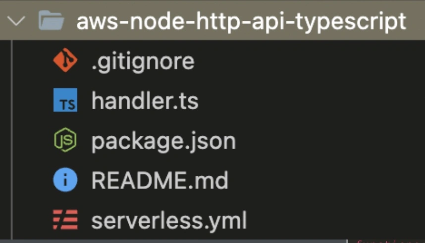

<!-- summary -->

フロントエンドエンジニアとして、フルスタックエンジニアになることは大変難しい事に思えるかもしれません。しかし、適切なツールと知識を持っていれば、フロントエンドとバックエンドの両方のロジックと機能を組み込んだ、スケーラブルな Web アプリケーションを構築することが可能です。この記事では、Universal JavaScript を使用して、インフラや API 機能のための Serverless Framework、CI/CD のための GitHub Actions を組み合わせて、フルスタックアプリケーションを構築する方法を探ります。

---

## はじめに

この記事は、実際にリリースされたプロジェクトをもとに書いています。個人的な経験から、そのプロジェクトはフロントエンドエンジニアにとって素晴らしい修業となりました。シングルページアプリケーションの開発から API やクラウドインフラストラクチャ、DevOps などの分野のスキルを広げられる機会をいただきました。これから、フロントエンドエンジニアがフルスタックの道を歩むために始めることができる手がかりを見てみましょう。

## Universal JavaScript/Typescript を学ぶ


フロントエンドエンジニアがフルスタックアプリケーションを構築するための重要な要素の 1 つは、Universal JavaScript/Typescript の技術スタックを使用することです。 Universal JavaScript は、開発者がクライアントとサーバーサイドの両方で実行できる JavaScript コードを書くことができるようにするアプローチです。このアプローチにより、フロントエンドエンジニアは新しい言語を学ぶことなく、サーバーサイドの開発を開始できます。また、同じチームが両方を同時に書くため、不要なコミュニケーションを減らし、開発をより迅速かつ効率的に行えます。流行っている Universal JavaScript のテックスタックには、React、Node.js、OpenAPI などが含まれています。

## Serverless Framework を使用してインフラストラクチャと API 機能を構築する


Universal JavaScript を適用したら、次のステップはインフラのセットアップとサーバーサイド機能をアプリケーションに組み込むことです。これを行うためよく使われる方法の一つが、Serverless Framework です。

### Serverless Framework について

Serverless Framework は、サーバーレスアプリケーションの構築とデプロイをサポートするオープンソースの開発者向けフレームワークです。サーバーレス関数とリソースの定義、デプロイ、管理を簡単かつ一貫性があり、クラウドサービスプロバイダに依存しない方法で提供することで、開発者がクラウドネイティブなアプリケーションを簡単に構築および運用ができるようになります。

Serverless Framework は、**Infrastructure as Code (IaC)** のコンセプトに基づいています。他の人気ある IaC サービスと比較することで、その強みを理解しやすくなります。

|                        |  |  |  |
| ---------------------- | -------------------------------------------------------------------------------------------------------- | ------------------------------------------------------------------------------------------------------ | ---------------------------------------------------------------------------------------------------------------- |
|                        | Serverless                                                                                               | Terraform                                                                                              | CloudFormation                                                                                                   |
| Infrastructure as Code | YAML/JSON config ファイル                                                                                | HCL/JSON config ファイル                                                                               | YAML/JSON config ファイル                                                                                        |
| プラットフォーム       | AWS, Azure, Google Cloud など                                                                            | AWS, Azure, Google Cloud など                                                                          | AWS だけ                                                                                                         |
| 強み                   | クラウドネイティブアプリケーションのための**オールインワン開発ソリューション**                           | **どんな環境**でもリソースをプロビジョニング、変更、バージョン管理できる                               | AWS およびサードパーティのリソースのプロビジョニングおよび管理                                                   |

### Serverless Framework の簡単なサンプル

Serverless Framework を利用して作成された Lambda ベースの API のサンプルを見てみましょう。他のサンプルコードを確認したい場合は、[こちら](https://github.com/serverless/examples)を閲覧してください。

サンプルコードのフォルダ構造から分かるように、サーバーレスプロジェクトは、アプリケーションコードとインフラストラクチャの構成ファイルの 2 つの主要なパーツで構成されています。


ここの **handler.ts** ファイルは、簡単なメッセージを返す API を作成します。

```
import { APIGatewayProxyEvent, APIGatewayProxyResult } from "aws-lambda";

export const hello = async (
 event: APIGatewayProxyEvent
): Promise<APIGatewayProxyResult> => {
 return {
   statusCode: 200,
   body: JSON.stringify(
     {
       message: "Hello Serverless!",
       input: event,
     },
     null,
     2
   ),
 };
};
```

**serverless.yml** ファイルでは、関数と関連するハンドラーファイルを指定することで、インフラを簡単に定義できます。API Gateway などの他のリソースも自動的に作成されます。

```
service: serverless-http-api-typescript
frameworkVersion: '3'

provider:
 name: aws
 runtime: nodejs14.x

functions:
 hello:
   handler: handler.hello
   events:
     - httpApi:
         path: /
         method: get

plugins:
 - serverless-plugin-typescript
```

それで、 **`$ serverless deploy`** という 1 つのマジックコマンドで、API が使用可能になります。

プラグインを利用することで、より多くクラウドリソースや機能を有効にすることもできます。上記の例では、TypeScript プラグインが追加されました。実際のプロジェクトでは、バックエンドで RDS、Data API、SQS などを使用するためのプラグインを追加しました。フロントエンドでは、 `Sveltkit` ベースの SPA であるため、ビルドされたファイルを S3 にデプロイし、関連する Cloudfront ディストリビューションを作成するために別のプラグインが使用されました。

これらの機能は、フロントエンドエンジニアにとって非常に役立ちます。インフラやバックエンド開発の知識が限られていても、最小限の前提条件でフルスタック開発を開始することができます。

### Serverless Framework のまとめ

以下が Serverless Framework の主な特徴です：

- インフラのコード化: Serverless Framework は、開発者が構成ファイルを使用してインフラやリソースをコードとして定義することを可能にし、バージョン管理、テスト、チームメンバーとの共有が容易に行えます。

- 簡単なデプロイメント: Serverless Framework は、一つのコマンドでサーバーレスアプリケーションをデプロイすることが容易であり、パッケージング、デプロイメント、リソース管理タスクを自動化できます。

- プラグインアーキテクチャ: Serverless Framework は新しいプラグインを追加したり、独自のプラグインを作成したりすることで、フレームワークの機能を拡張およびカスタマイズできます。

- ローカル開発: Serverless Framework は、`Serverless Offline`プラグインを使用して、サーバーレスアプリケーションのローカルでのテストおよびデバッグを可能にします。

まとめると、Serverless Framework は、クラウドリソースを管理とデプロイを一貫したことにより、開発者がサーバーレスアプリケーションを構築および運用するための優れたツールと機能を提供しています。

## Serverless Framework に GitHub Actions で CI/CD の構築

フルスタックアプリケーションの信頼性を高くにするためには、継続的インテグレーションおよび継続的デプロイメント（CI/CD）のプラクティスを使用することが重要です。GitHub Actions は、Serverless Framework と良く統合される人気のある CI/CD ツールです。GitHub Actions と Serverless Framework を組み合わせることで、自動化されたテスト、Lint、およびデプロイメントプロセスを設定して、コードが常に最新でスムーズに動作することを保証できます。

### CI の Workflow

最初に、新しいプルリクエストが作成されると、リントとテストのジョブが実行されます。最後に、 **静的コード解析**スキャンも実施されます。開発者は、テストとスキャンの結果がプルリクエストのコメントに更新されるため、人によるコードレビューがなくても、検出された問題を修正することができます。

_check.yml:_

```
name: status check

on:
  pull_request:
    types: [opened, synchronize, reopened]

jobs:
  check:
    name: lint and check App
    runs-on: ubuntu-latest
    environment: develop
    steps:
      - name: Checkout
        uses: actions/checkout@v3
        with:
          fetch-depth: 0

      - uses: actions/setup-node@v3
        with:
          node-version: 16.x

      - name: Install Dependencies
        run: npm install

      - name: Make envfile
        uses: SpicyPizza/create-envfile@v1.3
        with:
          envkey_VITE_EXAMPLE: test

      - name: Build
        run: npm run build
        env:
          CI: true

      - name: check format & lint
        run: npx lint-staged

      - name: test and coverage
        run: npm run coverage

      - name: SonarCloud Scan
        uses: sonarsource/sonarcloud-github-action@master
        env:
          GITHUB_TOKEN: ${{ secrets.GITHUB_TOKEN }}
          SONAR_TOKEN: ${{ secrets.SONAR_TOKEN }}
```

### CD の Workflow

デプロイの場合は、プルリクエストが対象のブランチにマージされると実行されます。デプロイ前と後には、Slack でデプロイのステータスが通知されます。AWS や Slack のキーなどの環境変数は、GitHub リポジトリの設定の**Environments**で設定できます。デプロイコマンド _npm run deploy:staging_ の背後には、**package.json** に定義されたスクリプトです：

```
"deploy:staging": "serverless deploy --stage staging"
```

_deploy-staging.yml:_

```
name: Deploy - Staging

on:
  push:
    branches:
      - develop

concurrency:
  group: staging
  cancel-in-progress: false

jobs:
  deploy:
    name: Deploy App
    runs-on: ubuntu-latest
    environment: develop
    steps:
      - name: Post to a Slack channel
        id: slack
        uses: slackapi/slack-github-action@v1.21.0
        with:
          channel-id: ${{ secrets.SLACK_BOT_POST_CHANNEL }}
          slack-message: 'FRONTEND STAGING RELEASE started'
        env:
          SLACK_BOT_TOKEN: ${{ secrets.SLACK_BOT_OAUTH_TOKEN }}
      - uses: actions/checkout@v3
      - uses: actions/setup-node@v3
        with:
          node-version: 16.x
      - uses: aws-actions/configure-aws-credentials@v1
        with:
          aws-access-key-id: ${{ secrets.AWS_ACCESS_KEY_ID }}
          aws-secret-access-key: ${{ secrets.AWS_SECRET_ACCESS_KEY }}
          aws-region: ${{ secrets.AWS_REGION }}
      - name: install
        run: npm install
      - name: Make envfile
        uses: SpicyPizza/create-envfile@v1.3
        with:
          envkey_VITE_ENVIRONMENT: ${{ secrets.VITE_ENVIRONMENT }}
          ...
           # .env variables here - name: deploy
      - name: deploy
        run: npm run deploy:staging
      - name: Post to a Slack channel - success
        if: success()
        id: slack-success
        uses: slackapi/slack-github-action@v1.21.0
        with:
          channel-id: ${{ secrets.SLACK_BOT_POST_CHANNEL }}
          slack-message: 'FRONTEND STAGING RELEASE finished'
        env:
          SLACK_BOT_TOKEN: ${{ secrets.SLACK_BOT_OAUTH_TOKEN }}
      - name: Post to a Slack channel - failure
        if: failure()
        id: slack-failure
        uses: slackapi/slack-github-action@v1.21.0
        with:
          channel-id: ${{ secrets.SLACK_BOT_POST_CHANNEL }}
          slack-message: 'FRONTEND STAGING RELEASE failed'
        env:
          SLACK_BOT_TOKEN: ${{ secrets.SLACK_BOT_OAUTH_TOKEN }}

```

## 学びと実践を続けましょう

フルスタックエンジニアになるには、学びと実践が継続的に必要です。フロントエンドとバックエンドの最新のトレンドやテクノロジーについて常にアップデートし、自分のスキルを向上するための方法を常に模索してください。オンラインコミュニティに参加したり、カンファレンスやミートアップに参加したり、他のチームメンバーと協力して最新情報を得て、フルスタックエンジニアとして成長し続けましょう。

フルスタック開発をマスターするためには、フルスタックプロジェクトをもっと参加し続ける必要があります。まずは、フロントエンドとバックエンドのコードを統合する練習ができる小さなプロジェクトから始めましょう。自信をつけたら、より大規模、複雑な幅広くなツールやスキルを必要とするプロジェクトに取り組むことができます。

まとめると、Universal JavaScript、Serverless Framework、GitHub Actions を組み合わせることで、スケーラブルなクラウドネイティブアプリケーションを効果的に構築できます。これらのツールを習得し、フルスタックプロジェクトを構築することで、開発チームのより貢献できる、重宝なメンバーになりましょう。

_Article Photo by [Midjourney](https://www.midjourney.com/)_
