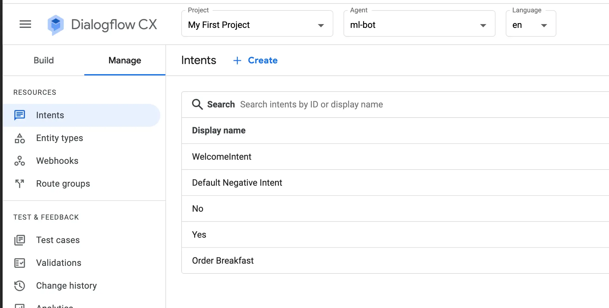
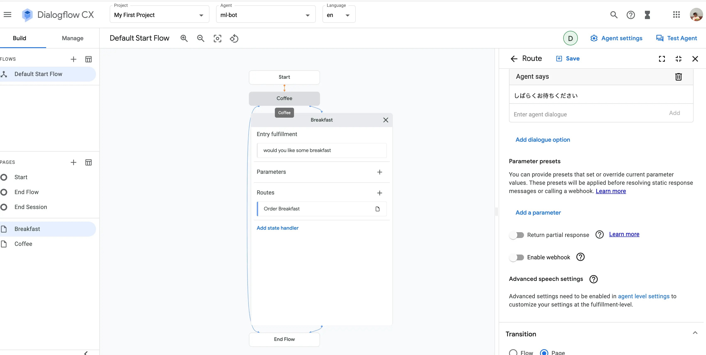
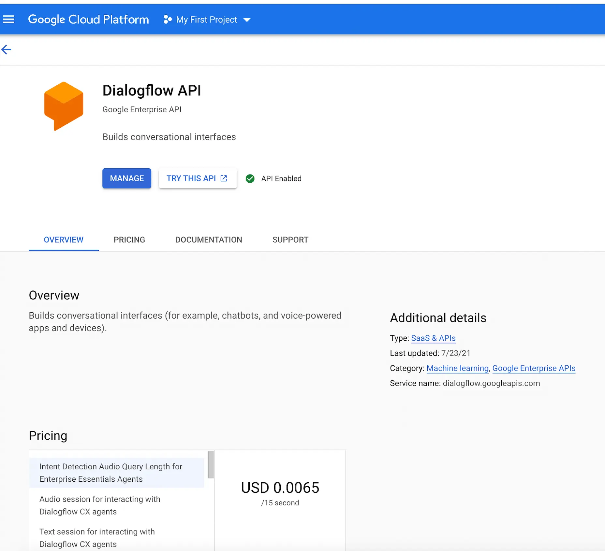
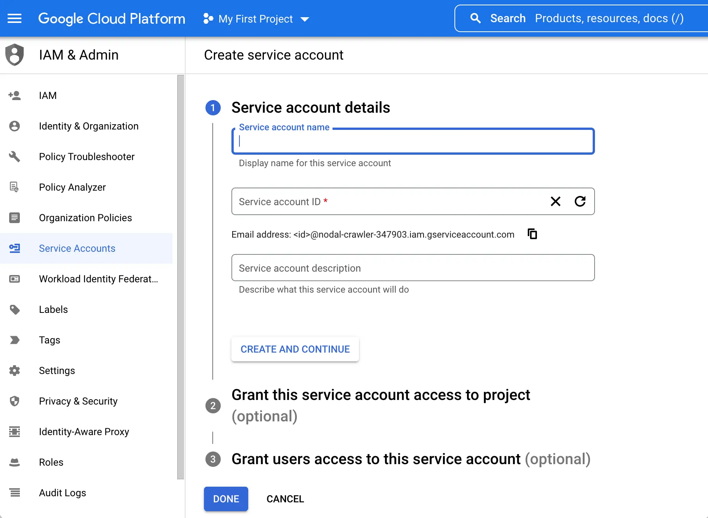
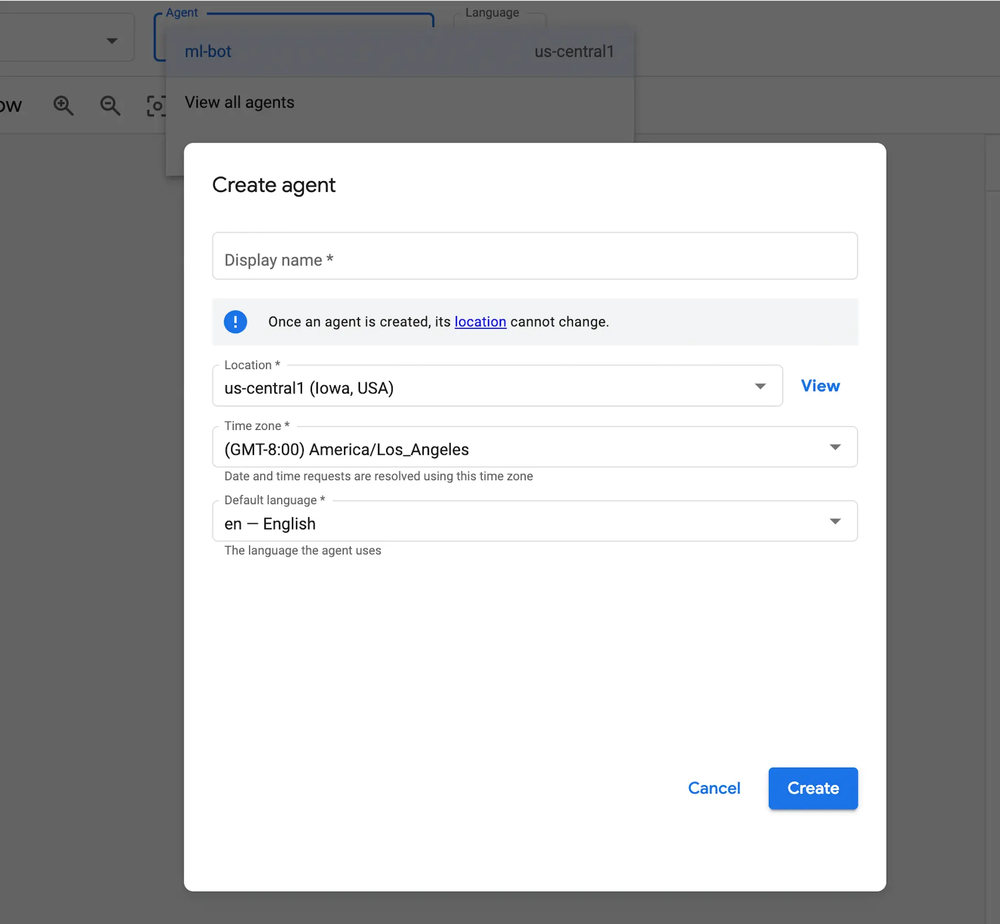
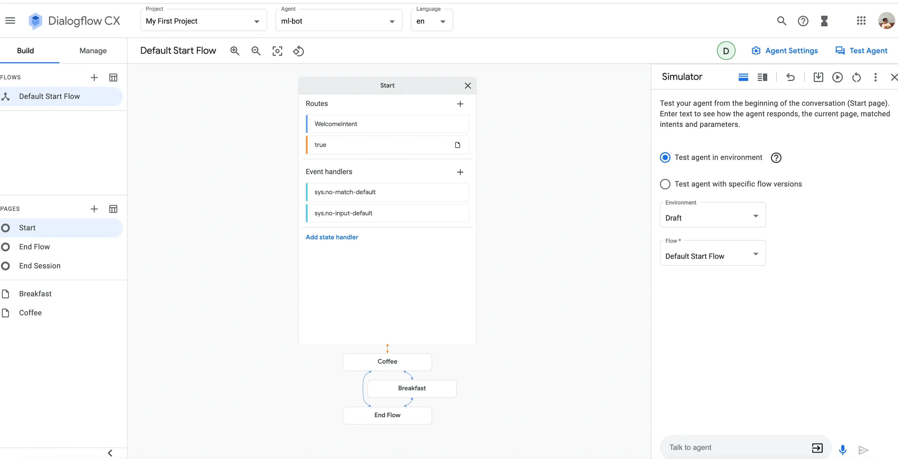
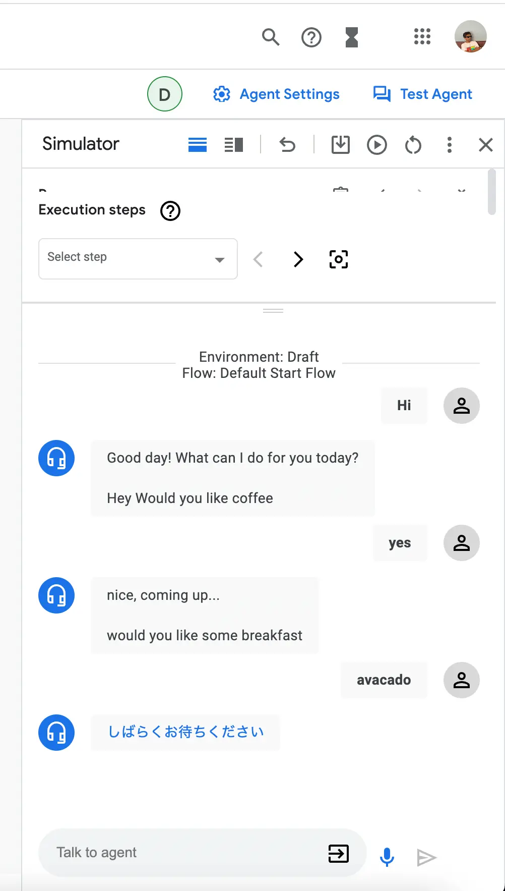
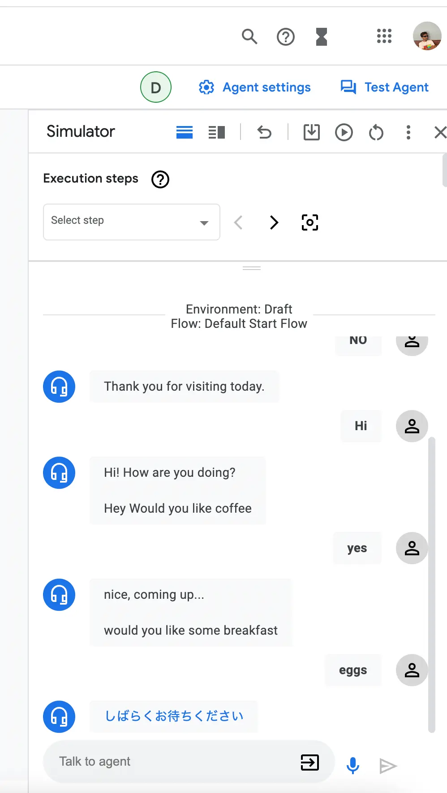

私たちは毎日のように様々な場面で、"ねぇ Google"、"OK Google"、"音楽をかけて"、"電気をつけて" と音声アシスタント機能を使用していますが、その背景で何が起こっているのか考えたことはありますか？このようなシステムがどのように機能するかを調べるために、`ml-bot` という名前の小さなチャットボットを作りました。

# Dialogflow とは？

Dialogflow は Google の AI サービスで、多言語で利用できます。
これを使うことで、会話型の音声ボットやチャットボットを簡単に作ることができます。
最近では、高度でかつ高速な要望が増えてきており、ゼロからコードを書くことが難しくなってきています。ビジネスシーンでは、数時間から 1 日程度でボットのサンプルを作成する必要があるかもしれません。このような場合に Web やモバイルアプリへの組み込みが非常に簡単な Dialogflow の利用を検討することができます。

## Dialogflow のメリット

- ML/AI を採用
- 簡単に使える
- 複雑な会話を処理する
- 多くの言語で利用できる
- 他のツールとの統合がしやすい
- Webhook との連携が容易（Dialogflow システム内の特定のアクションに対する HTTP リクエストイベント）

# ダイアログフローサービスの種類

## 1. Dialogflow CX(カスタマーエクスペリエンス)

複雑な会話の流れのために設計は、会話の状態を管理するためにステートマシンを使用します。
以下は、ピザ配達における食品注文フローがどのようなものであるかの例です。食品注文システムは、Dialogflow CX が使用できるわかりやすい例だと思います。

_Image source: [Google](https://cloud.google.com/dialogflow/cx/docs/basics)_

## 2. ダイアログフロー ES(エッセンシャルズ)

Dialogflow の旧バージョンで、ES に改名されたものです。ボットを設計する際に、シンプルで小さなエージェントがあれば、ES を使うべきでしょう。

_Image source: [Google](https://cloud.google.com/dialogflow/es/docs/basics)_

# Dialogflow はどこで使うべき？

- Slack のようなメッセージングツールは Dialogflow との統合が非常に簡単です。詳しくは[こちら](https://cloud.google.com/dialogflow/es/docs/integrations/slack)をご覧ください。
- 音声ボットは Dialogflow で簡単に作ることができ、あらゆるタイプのユーザーに対応することができます。
- モバイルアプリのプラットフォーム（Android、iOS、Flutter など）や、いくつかの種類のウェブアプリでチャットボットを実現できます。非常に正確で高速な応答が可能です。

# CX を使ってコードを書いたりボットを設計したりする前に知っておくべきことは何ですか？

### **エージェント**とは何ですか？

エージェントは、ボットシステムへの入り口です。エージェントは基本的にエンドユーザーと対話し、システムの背後にある情報を処理します。

エージェントの例 - ここでは、"ml-bot" がエージェント名です。

### **Intent**とは？

インテントとは、簡単に言うと「ユーザーが言いたいこと」です。
エンドユーザーの意図のようなものです。また、多くのインテントを組み合わせることで、より多くのことを一緒に行うことができます。

Dialogflow CX のインテントの例 - "WecomeIntent", "No", "Yes" など。

ページ上のウェルカムインテントの例

"hi"、"just going to say hi"、"long time no see"、"hello hi "などです。

### **Entity** と **Entity types** とは何ですか？

Entity とは、ユーザーが取得したデータのことです。下の写真では、エッグベネディクトがエンティティの一例です。
ユーザーのデータを取得する方法をエンティティタイプと呼びます。下の図では、`breakfast-type`がエンティティタイプで、`eggs benedict`が同義語（eggs, Eggs, eggs benedict）を持つエンティティであることを示しています。同義語とは、ユーザがメッセージを入力するための方法です。

### **ルート**とは何ですか？

ルートは、ページ内の流れを制御する方法です。フロー内の条件ロジックについて詳しく説明します。

### **ページ**とは何ですか？

ページは、CX のセッションを表します。開始すると、会話ページがアクティブになります。フローの開始と終了の状態は、特別なページで処理されます。
下の例では、レストランで料理を注文するときに、「朝食」と「コーヒー」のページがあります。
ここでは、「注文ページ」と、すでに作成されている「朝食」「コーヒー」のページを追加する例を示します。

### **Parameters**とは？

ユーザーからボットに送られた値を受け取ることができます。この値をパラメータと呼びます。

### **フロー**とは？

フローは、会話の単純な部分とその流れを定義するモジュールまたはユニットです。フローは、会話における経路として機能します。以下の例では、「朝食」はレストランで料理を注文する際の会話の一部である。
コーヒーのフロー例

### **フルフィルメント** - ボットのレスポンスとは？

ボットがユーザーに対して行う応答をフルフィルメントと呼びます。
「しばらくお待ちください」は、朝食の注文が入った後にエージェントが言うフルフィルメントの一例です。

# ダイアログフローのシステム構成

以下は、ユーザーがボットに「こんにちは」と言った場合の例です。このメッセージはシステムに送られ、システムは Dialogflow API に接続します。そして、Webhook があれば、それを使ってリトライします。
そして、プロセスは戻り、Dialogflow API はインテントを検知してレスポンスを返し、それがシステムに返され、最終的にユーザーに到達します。

_Image source: [Google](https://cloud.google.com/dialogflow/cx/docs/basics)_

# CX ビジュアルビルダーでチャットボット(ml-bot)を実装する。

以下の手順で行います：

## ステップ 1

[Google Dialog](https://dialogflow.cloud.google.com/)でプロジェクトを作成し、Dialogflow Cloud にログインします： Cloud Console > New Project > Name を入力し、以下の画像のように他の詳細を選択します。

## ステップ 2

[Dialogflow API を有効化する](https://console.cloud.google.com/marketplace/product/google/dialogflow.googleapis.com?project=nodal-crawler-347903)。添付の画像は、API を有効にした後のものです。最初に`Enable`ボタンが表示されるはずです。

API を有効にすると、Dialogflow の API が使えるようになります。

## ステップ 3

[.json ファイルをダウンロードする](https://console.cloud.google.com/apis/credentials?project=nodal-crawler-347903)。プロジェクトを選択 →「CREATE CREDENTIALS」ボタンをタップ → サービスアカウントを選択 → サービスアカウントの詳細を入力します：
]

すべての情報を入力した後、「KEYS」タブで.json ファイルを作成し、ダウンロードします。

## ステップ 4

CX ビジュアルビルダーを使用して、Dialogflow CX チャットボットを作成します。

### ステップ 4.1

Project > Select Agent > Create agent > type details を選択してエージェントを作成します。

### ステップ 4.2: 空のボード

空のボードに、デフォルトのスタートフローから始めて、ページ、フロー、引数、インテントなどを追加することができます。

### ステップ 4.3： すでに作られたコーヒーの例があるボード

これは、Dialogflow CX のビジュアルビルダーで、すでに作成された例を示しています：

ここでは、何でもできます。

### ステップ 4.4： チャットボットをテストする

これは Dialogflow CX のビジュアルビルダーで、すでに作成された例です。

#### 例 1 - アボカドを頼む

#### 例 2 - 卵を頼む

#### 例 3 - チャットを終了するために「いいえ」と言う

ここでは、ボットにあらゆる種類の質問をすることができます。回答は CX ビジュアルビルダーで定義したとおりになります。

## コードを書く

### APIs をフォローする

- [Dialogflow CX API](https://cloud.google.com/dialogflow/cx/docs/reference)
- [Dialogflow ES APIs](https://cloud.google.com/dialogflow/es/docs/reference)
  - [Dialogflow Essentials(ES) Dialogflow Essentials & Flutter で [Android 用ボイスボットを作ろう](https://codelabs.developers.google.com/codelabs/dialogflow-flutter#0)

## 結論:

Dialogflow の基礎とその種類（CX、ES）についての紹介と完全ガイドをまとめ、Dialogflow CX のビジュアルビルダーを使ったクイックチャットボット（ml-bot）を作り、私のボット Ask-Me-Any-Thing からビジュアルビルダーを使っていくつか質問してみました。

ゼロからチャットボットを実装するのは時間と手間がかかるので、今回ご紹介させていただいた Google Dialogflow の利用検討をお勧めします。

## 参考文献

- [Dialogflow ドキュメント](https://cloud.google.com/dialogflow/)
- [Dialogflow ES コンプリートガイド](https://dialogflow.cloud.google.com/#/getStarted)
- [Dialogflow CX コンプリートガイド](https://codelabs.developers.google.com/codelabs/dialogflow-cx-retail-agent#0)
- [サービス.json の作成](https://console.cloud.google.com/apis/credentials?project=nodal-crawler-347903)
- [DialogFlow API の有効化ページ](https://console.cloud.google.com/marketplace/product/google/dialogflow.googleapis.com?q=search&referrer=search&project=nodal-crawler-347903)
- [Dialogflow CX 入門／Youtube](https://www.youtube.com/watch?v=Xfgn9iA1KMk&list=PLJLSPq0cTRmat9ec-c0hOJJhhNfObZXy3&index=1)
- [チャットボットの分解 / Youtube](https://www.youtube.com/watch?v=O00K10xP5MU&list=PLIivdWyY5sqK5SM34zbkitWLOV-b3V40B&index=1)
- [DialogFlow の価格](https://cloud.google.com/dialogflow/pricing)

記事写真：[Robin Worrall](https://unsplash.com/photos/FPt10LXK0cg)
