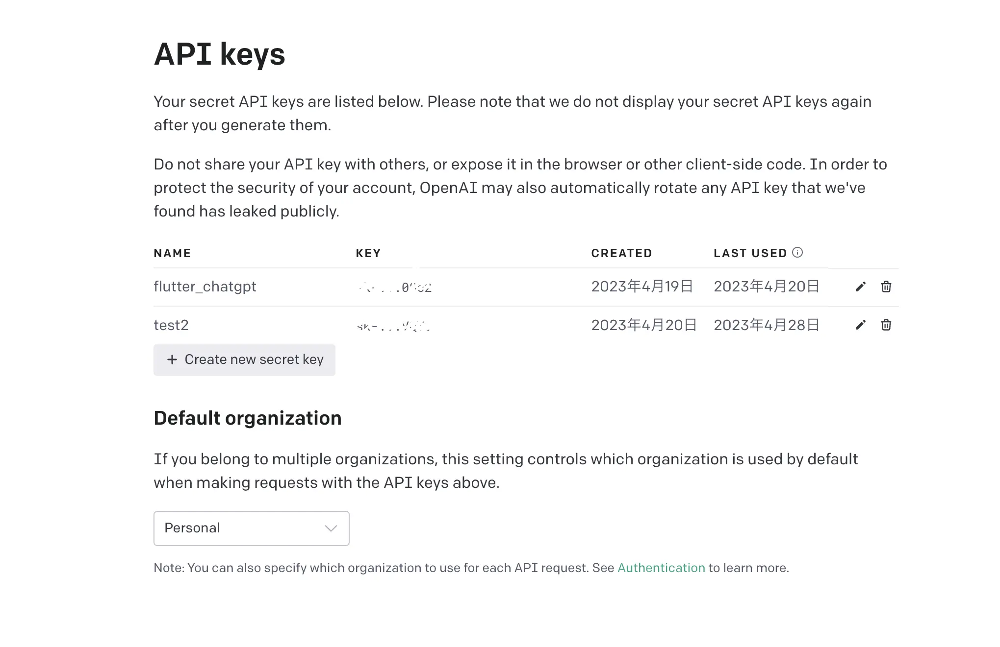
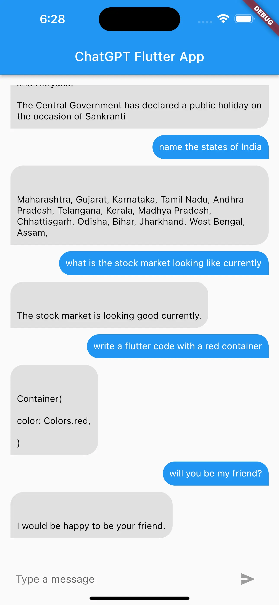

## はじめに

ChatGPTは、非営利団体のOpenAI Inc.とその子会社である営利企業OpenAI LPで構成される人工知能研究所であるOpenAIによって開発された大規模な言語モデルです。 OpenAIは、人類全体に利益をもたらす形でデジタルインテリジェンスを前進させることを目的として2015年に設立されました。彼らは、最先端のAI技術の開発、研究の実施、そしてAIの責任ある使用と安全な展開を推進することに重点を置いています。OpenAIの最も有名な成果の1つは、ChatGPTが含まれるGPT（Generative Pre-trained Transformer）言語モデルシリーズの開発です。 ChatGPTは会話形式に設計され、幅広いトピックに対して自然な言語応答を理解して生成することができます。

このチュートリアルは、ChatGPTをFlutterアプリに統合する方法のステップバイステップのガイドです。 ChatGPTをアプリに統合することで、ユーザーに対して人間らしいやり取りができる対話型チャットボットを提供することができます。

このチュートリアルでは、ChatGPTの基本的な機能、OpenAIのAPIを使用してアクセスする方法などについて説明します。また、必要な依存関係を設定し、チャットボットインターフェースを作成し、ユーザーの入力と応答を処理するための手順についても説明します。全体として、このチュートリアルは、Flutterアプリに強力な自然言語処理機能を追加したい開発者にとって貴重なリソースを提供します。

### 使用するモデル
Text-Davinci-002は、OpenAIが開発した言語モデルの1つであり、GPT-3モデルのバリアントの1つです。膨大なテキストデータでトレーニングされており、様々なプロンプトに対して人間らしい回答を生成することができます。Text-Davinci-002は、前身のText-Curieよりも大きなモデルであり、より洗練された、一貫性のある回答を生成することができます。現在はOpenAIのAPIを介してのみ利用可能であり、開発者は簡単なHTTPリクエストを通じてその機能にアクセスすることができます。

## APIを組み込むまでの手順

以下の手順に従って、ChatGPT APIをFlutterアプリに統合できます。

1. APIキーを取得する：ChatGPT APIにアクセスするにはAPIキーが必要です。 ChatGPTのウェブサイトでAPIキーにサインアップすることができます。
2. バックエンドサーバーをFlutterアプリに統合する：FlutterのHTTPクライアントを使用して、OpenAI のバックエンドサーバーにAPIリクエストを送信し、レスポンスを受信することができます。
3. チャットUIにレスポンスを表示する：ChatGPT APIからレスポンスを受信したら、それをFlutterアプリのチャットUIに表示します。

### Keyを取得する
サインアップして、WebからAPIキーを取得する：
[API Keyの取得はこちら](https://platform.openai.com/account/api-keys)



## モデルのリクエスト/レスポンスに対応:

まずは、APIのレスポンスを処理するためのリポジトリの作成から始めましょう。

### Chat Respository
```dart
import 'dart:convert';
import 'package:cgp/repository/response.dart';
import 'package:http/http.dart' as http;
class ChatRepository {
  Future<Response?> makeRequest({required String question}) async {
    final url = Uri.parse('https://api.openai.com/v1/completions');
    final headers = {
      'Content-Type': 'application/json',
      'Authorization': 'Bearer API-Token',
    };
    final data = {
      'prompt': question,
      'model': 'text-davinci-002',
      'temperature': 0.5,
      'max_tokens': 50,
    };

    final response = await http.post(
        url, headers: headers, body: jsonEncode(data));
    if (response.statusCode == 200) {
      final jsonData = jsonDecode(response.body);
      final text = jsonData['choices'][0]['text'];
      return Response.success(text);
      // handle the success response
    } else {
      final error = jsonDecode(response.body);
      final errorMessage = error['error']['message'];
      return  Response.error(errorMessage);
      // handle the error response
    }
  }
}
```

このコードでは、OpenAIクラスが使用され、OpenAIのText-Davinci-002 APIを処理しています。コンストラクタはapiKeyとapiUrlという2つの引数を取ります。これらはAPIリクエストの認証とAPIエンドポイントの指定に使用されます。上記のコードで自分のAPIトークンを置き換えてください。
getResponse関数は、APIに送信するテキストメッセージであるmessage引数を取ります。関数は、プロンプトとしてメッセージを使用し、温度やmax_tokensなどの追加のパラメータとともにAPIにPOSTリクエストを送信します。モデルパラメータはtext-davinci-002に設定されており、Text-Davinci-002モデルを使用します。
レスポンスのステータスコードが200の場合、関数はjson.decode関数を使用してレスポンスボディをデコードし、生成されたテキストを返します。レスポンスのステータスコードが200でない場合、関数はエラーメッセージを含む例外をスローします。

### Response クラス
以下は、2つの可能なサブタイプ、SuccessResponseとErrorResponseを持つAPIからのレスポンスを表すフリーズドクラスです。コードの各部分の説明は以下の通りです：

```dart
part 'response.freezed.dart';
part 'response.g.dart';
```

これらの2つの行は、生成されるコードのファイル名を定義しています。 freezedは、フリーズドクラスを生成するために .freezed.dart ファイルを使用し、シリアル化/デシリアル化コードを生成するために .g.dart ファイルを使用します。
```dart
@freezed
class Response with _$Response {}
```
この行は、$Responseミックスイン（SuccessとError）を持つフリーズドクラスとしてResponseクラスを定義します。このミックスインには、copyWith、toString、およびoperator ==などの便利なメソッドが用意されています。
factory Response.success(String text) = SuccessResponse;
factory Response.error(String message) = ErrorResponse;

このファクトリーメソッドは、JSONオブジェクトをResponseオブジェクトに逆シリアル化します。これには、.g.dartファイルから生成された_$ResponseFromJson関数が使用されます。
このResponseクラスを使用するには、APIのレスポンスに基づいてSuccessResponseまたはErrorResponseのインスタンスを作成し、それらをコード内で使用することができます。
クラスはこの様になります:
```dart
import 'package:freezed_annotation/freezed_annotation.dart';

part 'response.freezed.dart';
part 'response.g.dart';

@freezed
class Response with _$Response {
 factory Response.success(String text) = SuccessResponse;
 factory Response.error(String message) = ErrorResponse;

 factory Response.fromJson(Map<String, dynamic> json) =>
     _$ResponseFromJson(json);
}
```

## チャットページViewモデル

UIとリポジトリ間のロジックを処理するために、チャットページのビューモデルクラスを作成します。

### チャットページの状態処理
```dart
@freezed
class ChatPageState with _$ChatPageState {
  factory ChatPageState({
    @Default([]) List<Message> messages,
    String? question,
    @Default(true) loading,
    String? errorMessage,
  }) = _ChatPageState;
}

class Message {
  final String text;
  final bool isUserText;

  Message({
    required this.text,
    this.isUserText = true,
  });
}
```
Messageクラスには2つのプロパティがあります：

* text：メッセージのコンテンツを表す必須文字列です。
* isUserText：ユーザーから送信されたメッセージか、AIから受信したかを示すブール値です。このプロパティのデフォルト値はtrueであり、新しいMessageオブジェクトを作成するときに指定されていない場合は、メッセージがユーザーから送信されたものであると想定されます。

ChatPageStateクラスは、immutableクラスを生成するためにfreezedパッケージを使用しています。以下に4つのプロパティがあります：

* messages：チャット履歴を表すMessageオブジェクトのリストです。このプロパティのデフォルト値は空のリストです。
* question：ユーザーが送信した現在の質問またはプロンプトを表す文字列です。
* loading：APIリクエストのタイミングを示すブール値です。
* errorMessage：チャットページの読み込み中に発生した可能性のあるエラーメッセージを表す文字列です。

ChatPageStateクラスには、各プロパティの名前付きパラメータを受け取るfactoryという名前のコンストラクタがあります。それらの値をfreezedパッケージによって生成されたプライベートな_ChapPageStateコンストラクタに渡し、ChatPageStateクラスのimmutableなインスタンスを作成します。

### View モデル
チャットページの状態を管理するChatPageViewModelという名前のStateNotifierクラスです。以下、コードの各パーツが何をするのかを説明します：
```dart
class ChatPageViewModel extends StateNotifier<ChatPageState> {
  ChatPageViewModel({required this.chatRepository}) : super(ChatPageState());

  final ChatRepository chatRepository;
}
```
これはChatPageViewModelのクラス定義です。StateNotifierを拡張し、ChatPageState型の状態を管理します。また、APIと通信するリポジトリのインスタンスであるchatRepositoryを必須のパラメーターとして取ります。
```dart
Future<void> askQuestion({required String question}) async {
final userQuestion = Message(text: question, isUserText: true);
state = state.copyWith(
loading: true, messages: List.from(state.messages)..add(userQuestion));
final response = await chatRepository.makeRequest(question: question);
response!.when(success: (response) {
  final responseMsg = Message(text: response, isUserText: false);
  List<Message> messages = List.from(state.messages)..add(responseMsg);

  state = state.copyWith(messages: messages);
}, error: (errorMessage) {
  state = state.copyWith(errorMessage: errorMessage);
});
state = state.copyWith(loading: false);
}
```
このメソッドは、ユーザーが質問を送信したときに呼び出されます。ユーザーの質問を表す Message オブジェクトを作成し、api リクエストの際に loading 状態を true に設定し、ユーザーの質問を state の messages リストに追加します。

ユーザーの質問を API に送信して、レスポンスを待ちます。レスポンスが成功した場合、レスポンスを表す Message オブジェクトを作成し、それを state の messages リストに追加します。エラーがある場合は、state のエラーメッセージを設定します。最後に、loading 状態を false に設定します。
全体として、この ChatPageViewModel はチャットページの状態を管理し、API と通信してユーザーの質問に対する応答を提供します。

## チャットページUI

チャットページのUIを作りましょう。

UIは、基本的なチャットページで、2つの主要なウィジェットコンポーネントで構成されます。
* チャットバブル
* テキストメッセージを作成するためのメッセージテキストボックス

### チャットバブル
```dart
class ChatBubble extends StatelessWidget {
  final String message;
  final bool isSentByMe;

  const ChatBubble({
    required this.message,
    required this.isSentByMe,
    super.key,
  });

  @override
  Widget build(BuildContext context) {
    return Container(
      alignment: isSentByMe ? Alignment.centerRight : Alignment.centerLeft,
      child: Container(
        padding: const EdgeInsets.all(10),
        margin: const EdgeInsets.symmetric(vertical: 5),
        decoration: BoxDecoration(
          color: isSentByMe ? Colors.blue : Colors.grey[300],
          borderRadius: BorderRadius.only(
            topLeft: Radius.circular(20),
            topRight: Radius.circular(20),
            bottomLeft: isSentByMe ? Radius.circular(20) : Radius.circular(0),
            bottomRight: isSentByMe ? Radius.circular(0) : Radius.circular(20),
          ),
        ),
        child: Text(
          message,
          style: TextStyle(
            color: isSentByMe ? Colors.white : Colors.black,
          ),
        ),
      ),
    );
  }
}
```
このウィジェットでは、message引数は表示するテキストメッセージで、isMe引数はメッセージが現在のユーザーによって送信されたものか、チャットの他のユーザーによって送信されたものかを示すブール値であり、key引数はこのウィジェットのオプションのキーです。
メッセージバブルは、適切な角に丸みを帯びたカラフルな背景を持つContainerウィジェットとして表示されます。メッセージテキストは、TextウィジェットでContainerウィジェットの内部に表示されます。Containerウィジェットの幅、パディング、マージンプロパティは、メッセージバブルの適切なスペースとレイアウトを提供するように設定されています。

### メッセージテキストボックス
```dart
import 'package:flutter/material.dart';

class MesageInputBox extends StatefulWidget {
  final Function(String) onSend;

  const MesageInputBox({Key? key, required this.onSend}) : super(key: key);

  @override
  State<MesageInputBox> createState() => _MesageInputBoxState();
}

class _MesageInputBoxState extends State<MesageInputBox> {
  final TextEditingController _textController = TextEditingController();

  bool _isComposing = false;

  @override
  Widget build(BuildContext context) {
    return Container(
      padding: const EdgeInsets.symmetric(horizontal: 8.0),
      child: Row(
        children: [
          Expanded(
            child: TextField(
              controller: _textController,
              decoration: const InputDecoration.collapsed(
                hintText: 'Type a message',
              ),
              onChanged: (String text) {
                setState(() {
                  _isComposing = text.isNotEmpty;
                });
              },
              onSubmitted: _handleSubmit,
            ),
          ),
          IconButton(
            icon: const Icon(Icons.send),
            onPressed:
            _isComposing ? () => _handleSubmit(_textController.text) : null,
          ),
        ],
      ),
    );
  }

  void _handleSubmit(String text) {
    if (text.trim().isEmpty) return;

    widget.onSend(text);
    _textController.clear();

    setState(() {
      _isComposing = false;
    });
  }
}
```
このウィジェットでは、sendMessage引数は文字列を入力として取り、チャットにメッセージを送信するための関数です。_textControllerはテキスト入力フィールドの状態を制御するために使用されます。
メッセージコンポーザーは、パディング8を備えたContainerウィジェットとして表示されます。Container内には、Rowウィジェットが含まれており、テキスト入力フィールドのために利用可能なすべてのスペースを占めるために使用されるExpandedウィジェットが含まれています。テキスト入力フィールドには、_textControllerに設定されたコントローラーがあります。TextFieldには、ラベルとボーダーの装飾が設定されています。textCapitalizationプロパティは、各文の最初の文字を自動的に大文字にするために、TextCapitalization.sentencesに設定されています。onSubmittedプロパティは、ユーザーがEnterキーを押すか、テキスト入力を送信したときに呼び出される_sendMessageに設定されています。
テキスト入力フィールドの横には、送信アイコンが表示されるIconButtonウィジェットがあります。ユーザーがこのボタンをタップすると、テキスト入力をチャットに送信して、テキスト入力フィールドをクリアする_sendMessage関数が呼び出されます。

### チャットページ
```dart
// chat_page.dart

import 'package:cgp/repository/chat_repository.dart';
import 'package:cgp/ui/chat_page_view_model.dart';
import 'package:cgp/widgets/message_bubble.dart';
import 'package:flutter/material.dart';
import 'package:flutter_riverpod/flutter_riverpod.dart';
import 'package:get_it/get_it.dart';
import '../widgets/message_composer.dart';

import 'chat_page_state.dart';

GetIt injector = GetIt.instance;
final chatProvider =
StateNotifierProvider.autoDispose<ChatPageViewModel, ChatPageState>(
        (ref) => ChatPageViewModel(
      chatRepository: injector.get<ChatRepository>(),
    ));

class ChatPage extends ConsumerStatefulWidget {
  const ChatPage({Key? key}) : super(key: key);

  @override
  ConsumerState<ChatPage> createState() => _ChatPageState();
}

class _ChatPageState extends ConsumerState<ChatPage> {
  @override
  Widget build(BuildContext context) {
    final state = ref.watch(chatProvider);
    final viewModel = ref.read(chatProvider.notifier);

    return Scaffold(
      appBar: AppBar(
        title: const Text('ChatGPT Flutter App'),
      ),
      body: Padding(
        padding: const EdgeInsets.all(16),
        child: Column(
          children: [
            Container(),
            Expanded(
              child: ListView(
                children: [
                  ...state.messages.map(
                        (msg) => ChatBubble(
                      message: msg.text,
                      isSentByMe: msg.isUserText,
                    ),
                  ),
                ],
              ),
            ),
            MessageInputBox(
              onSend: (question) async {
                await viewModel.askQuestion(question: question);
              },
            ),
          ],
        ),
      ),
    );
  }
}
```

このChatPageはStatefulWidgetクラスであり、ユーザーのためにチャットインターフェースを構築します。
このコードブロックは、チャットインターフェースを含むScaffoldウィジェットを返します。AppBarはアプリのタイトルを表示します。bodyには、2つの子を持つColumnウィジェットが含まれています。

* ChatPageStateのメッセージから生成された子を持つListViewを含むExpandedウィジェット。各メッセージは、ChatBubbleウィジェットを使用して表示され、メッセージテキストとメッセージがユーザーによって送信されたかどうかが引数として渡されます。
* onSendコールバック関数を持つMessageInputウィジェット。このコールバック関数は、ChatPageViewModelのaskQuestionメソッドを呼び出します。
  全体として、このChatPageクラスは、メッセージを表示し、ユーザーの質問をChatPageViewModelに送信して処理するチャットインターフェースを作成します。

アプリを実行すると、最終的に以下のような状態になります：


コード全体はこちらのリポジトリで見ることができます:
[GithubRepo](https://github.com/huma11farheen/chatgpt_flutter_app)

参考
https://openai.com/about
