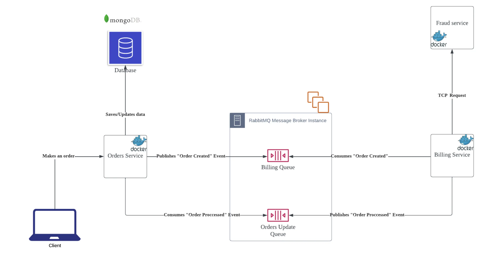

スケーラブルでパフォーマンスと保守性に優れたエンタープライズサービスを構築する必要性が高まる中、その解決策としてマイクロサービスやイベント駆動アーキテクチャがよく持ち出されますが、こうしたアーキテクチャでサービスを構築する場合、どのような点に留意すべきでしょうか。

## はじめに

本記事では、イベント駆動アーキテクチャを利用する動機、コアとなる概念、主な課題について解説します。
また、バックエンドに NestJS、通信ツールに RabbitMQ を使用し、イベントやメッセージングを扱うイベント駆動アーキテクチャの実装方法についても解説しています。

## マイクロサービスとその欠点

スケーラブルでモジュール化された保守性の高いシステムに対する必要性が高まる中、マイクロサービスアーキテクチャは、複雑な企業システムを構築するための事実上標準的なアーキテクチャとなりつつあります。
マイクロサービス・アーキテクチャでは、システムをより小さなフォールトトレラント・モジュールに分解し、個別に拡張、デプロイ、保守することができます。個々のサービスは、サービスが担当するドメインやタスクにより適した異なるテクノロジースタックを使用することもできます。例えば、ほとんどのサービスが Java で書かれているシステムで、機械学習モデルを担当するサービスには Python を使用することができます。

マイクロサービスアーキテクチャを採用する大きなメリットの 1 つは、サービスが疎結合であるため、あるサービスに障害が発生しても、他のサービスに障害が発生することがなく、単一障害点となりません。しかし、サービス間のブロッキング通信で単一障害点になってしまうと、その利点が失われてしまうことがあります。この問題は、2 つのサービスが HTTP/TCP でリクエスト/レスポンス方式で通信している場合に非常によく見られます。

また、依存するサービスがレスポンスを生成するための処理時間が長くなってしまう場合、エンドユーザーが感じる待ち時間が遅くなる可能性があります。

## イベント駆動アーキテクチャ

上記の問題を解決するためには、ノンブロッキングの通信方法が必要であり、イベント駆動型アーキテクチャがそれらの問題を解決することができます。 イベント駆動アーキテクチャでは、サービスがリクエスト/レスポンス方式で通信する代わりに、**イベントプロデューサー**は、**イベントコンシューマー**によって消費されるメッセージの形で**イベントキュー**にイベントを登録します。 使用する技術によってメッセージを届けるプロトコルは異なり、リアルタイムデータのストリーミングをサポートしているものもありますが、基本的なアーキテクチャは以下の通りです：


イベントプロデューサーがイベントを生成すると、そのイベントはイベントキューに登録され、イベントプロデューサーはそのイベントのレスポンスを気にすることなく、他のタスクを開始することができる。 イベントはキューに格納され、イベントコンシューマーがイベントメッセージを読み込んで必要な処理を行うことができるようになります。必要な処理が正常に終了すると、メッセージはキューから削除されます。

また、イベントキューのインスタンスを複数起動させることができるため、イベントキューの耐障害性をし、サービスが真の意味で疎結合になったことを保証することができます。コンシューマーが使えなくなった場合でも、プロデューサーは正常に動作し、イベントはキューにスタックされ、必要なコンシューマーが回復した時点でイベントメッセージをピックアップすることができます。これは、イベントキューにメッセージを必要なだけ保存し、コンシューマがイベント メッセージを処理するために必要なだけ再実行できるため、データ損失に関する問題にも非常に役立ちます。

## イベント駆動型アーキテクチャの主なコンセプト

ここでは、イベント駆動型アーキテクチャに関する主なコンセプトについて説明したいと思います：

- イベント: イベントとは オブジェクトやリソースのステータスが変化することを指します。例: _新たな注文が入りました_
- イベントプロデューサー: イベントキューにイベントを生成するサービスです。
- イベントキュー/ブローカー: イベントプロデュサーから送信されたイベントメッセージを保持し、イベントコンシューマーに消費（処理）されるためのキューです。
- イベントコンシューマー: イベントキューにあるイベントを消費し、必要な処理を行うサービスです。
- デッドレターキュー(DLQ): 何らかの理由で処理できなかったイベントメッセージが移動されるメインイベントキューの並列キューです。 DLQ があることで、エラーが発生したイベントメッセージを後から解析したり、再実行することができるようになります。
  - 例えば、何らかの破損した情報を持つメッセージがその最大リトライ回数に達すると、DLQ に移行されます。
- Ack: 英語の Acknowledgment という言葉からの略語。 Event が正常に処理され、キューから安全に取り除くことができることを確認するものです。

## イベント駆動型アーキテクチャの課題

マイクロサービス・アーキテクチャの多くの問題に対処しているにもかかわらず、イベント駆動アーキテクチャには独自の課題があります。

### 複雑性

イベント駆動アーキテクチャをベースとしたエンタープライズシステムを開発できるようになるには、アーキテクチャの設計と実装の両方でかなりの学習コストが必要です。

### 互換性

イベントベース通信がウェブサービスのペアやグループに最適かどうかを判断するのは難しいことです。 あるサービスが他のサービスの処理終了を待つ必要が全くない場合もありますが、一方で消費するサービスプロセスからの応答が、タスクを進めるために必要不可欠である場合もあります。

しかし、イベントベース通信が当該サービスにとって最適な答えであるかどうかが明確でない場合もあり、さまざまな通信パターンのトレードオフを考慮して、どちらがより特定のケースに適しているかを判断する必要があります。

### イベント複製・イベント順序性

マイクロサービスのフォールトトレラントと水平スケーリングの特性により、キューが複数のインスタンスで動作しているため、イベントの重複は、「もし」ではなく「いつ」の問題です（つまり、いつかは必ず起こります）。例：顧客に 2 回請求したり、顧客の財布に 2 回資金を追加したりすること。
メッセージブローカーによっては、_独自のトレードオフを伴いながら_、すぐにこの解決策を提供するものもあり、イベント ID やその他のテクニックを使って、重複排除ロジックを自ら実装することを好むものもあります。

同様に、イベントの順序が重要な場合、イベントが意図した順序で処理されることを保証するロジックを実装することが重要です。インターネットに接続できないシステムでは、サーバーに転送する前に大量のイベントがスタックされる可能性があり（例：IoT システム）、それを防止するロジックが実装されていないと、イベントがすべて順序不同になる可能性があります。

### エラー処理

イベント駆動型アーキテクチャによって導入された、より多くの可動部、異なる状況、異なる通信方法などによって、エラー処理はより複雑になりますが、サービスの微調整を行う上で重要な部分でもあります。

## イベント駆動型アーキテクチャのパターン

### シンプルなイベント処理


### 複雑なイベント処理


### ストリーミングイベント処理


## イベント駆動型アーキテクチャを使うべき場合

- サービス間に非同期処理がある場合や、現在の同期式サービスを非同期式に改造しても、大きな欠点がない場合
- 他のサービスからのレスポンスがすぐに必要でなく、処理結果を状態/ステータス遷移で管理してもよい場合 (例: Processing, Billing, Completed, Fail, など)。
- 処理の再実行が必要な場合、または（あるいは、それに加えて）失敗したときにデータ損失を回避しなければいけない場合

## イベント駆動型アーキテクチャを使うべきでない場合

- サービスからのレスポンスが、プロセスを継続するために不可欠である場合。(例：不正行為の検知)
- イベント駆動型アーキテクチャのメリットが、運用コストや複雑な実装を上回るほどシステムが複雑でない場合。
- チームがイベント駆動型アーキテクチャに慣れておらず、新アーキテクチャに移行するための時間が十分に確保できない場合。

## メッセージブローカーとその関連技術

- RabbitMQ: AMQP プロトコルを使用したキュー、Pub/Sub メッセージブローカーとして動作します。シンプルで信頼性が高いため、人気があります。
- Apache Kafka: 分散型イベントストアとストリーミング処理プラットフォーム。その性能と実装の可能性から、より人気のある選択肢の 1 つです。
- AWS SQS/SNS, GCP Pub/sub: クラウドで実装をしながら、運用のオーバーヘッドを少なくしたい方に最適なクラウド型メッセージキューサービスです。
- AWS Kinesis: AWS のマネージドデータストリーミングプラットフォームです。Kafka と似ていますが、運用のオーバーヘッドが少ないです。

_RabbitMQ と Kafka のマネージドバージョンは、いくつかのクラウドプロバイダーでも見つけることができます。_

## アーキテクチャーの例

イベント駆動型アーキテクチャを利用した注文アプリの簡単な例です：



このアーキテクチャでは、Orders サービスは Billing サービスから切り離され、エンドユーザーへの低レイテンシー、障害時に再試行が可能な疎結合サービスによる耐障害性、Billing サービスが独自のデータベースを持つ必要がないためデータの重複がないことを実現しています。

一方、Billing サービスは、Fraud サービス（不正検知サービス）と密結合しており、不正の兆候があれば、すぐに注文をキャンセルする必要があります。しかし、Fraud サービスの処理に障害が発生した場合でも、Billing サービスは処理が終了してからイベントメッセージを**Ack**するので、イベント駆動型アーキテクチャと Rabbit MQ のおかげで、ここでもリトライが可能です。

## コードの例

ここでは、**NodeJS**と**RabbitMQ**のバックエンドフレームワークを使用した、このアーキテクチャの主要コンポーネントのコードスニペットをいくつか紹介します。

### イベントプロデューサー

`orders.controller.ts`:

```typescript
@Controller("orders")
export class OrdersController {
  constructor(private readonly ordersService: OrdersService) {}

  @Post()
  async createOrder(@Body() createOrderRequest: CreateOrderRequest) {
    return await this.ordersService.createOrder(createOrderRequest);
  }
}
```

`orders.service.ts`:

```typescript
@Injectable()
export class OrdersService {
  constructor(
    @InjectModel(Order.name) private orderModel: Model<OrderDocument>,
    @Inject(BILLING_SERVICE) private billingClient: ClientProxy
  ) {}

  async createOrder(
    createOrderRequest: CreateOrderRequest
  ): Promise<OrderInterface> {
    try {
      const order = new this.orderModel({
        ...createOrderRequest,
        status: "PENDING",
      });

      await order.save();
      const orderPayload: OrderInterface = {
        orderId: order._id.toString(),
        productName: order.productName,
        price: order.price,
        buyer: order.buyer,
        status: order.status,
      };

      await lastValueFrom(
        this.billingClient.emit("order_created", {
          orderPayload,
        })
      );

      return orderPayload;
    } catch (error) {
      throw error;
    }
  }
}
```

エントリーポイントは **controller** で、注文データを **service** レイヤーに送信し、注文を **PENDING** として保存し、**order_created** イベントを **BILLING** キューにペイロードとともに送信します。キューは **BILLING_SERVICE**という const 変数で登録される。( `export const BILLING_SERVICE = 'BILLING';`)

### イベントコンシューマー

`billing.controller.ts`

```typescript
@Controller()
export class BillingController {
  constructor(
    private readonly billingService: BillingService,
    private readonly rmqService: RmqService,
    @Inject(ORDERS_SERVICE) private ordersClient: ClientProxy
  ) {}

  @EventPattern("order_created")
  async handleOrderCreated(
    @Payload("orderPayload") order: Order,
    @Ctx() context: RmqContext
  ) {
    //check for fraud
    if (await this.billingService.isFraud(order)) {
      order.status = "CANCELED_FRAUD";
    } else {
      this.billingService.bill(order);
      order.status = "PROCESSED";
    }

    // emit and event to update the order status
    await lastValueFrom(
      this.ordersClient.emit("order_procesed", {
        order,
      })
    );

    // if no errors happened, acknowledge the order_created process is over and remove it from the queue
    this.rmqService.ack(context);
  }
}
```

課金サービスは、**_order_created_**という**イベントパターン** を監視し、不正をチェックし、注文を請求しようとします。エラーが発生しない場合は、新しい注文ステータスを持つ **_order_processed_** イベントを **発信** します。 そして、エラーが発生しなければ、**_order_created_**イベントメッセージを**Ack**します。

その後、Order サービスは新しいステータスでデータベースを更新し、**order_processed** イベントメッセージを **ack** して、全プロセスを終了します。

### イベントブローカー

`rmq.module.ts`(RabbitMQ を Producers として使用するサービスに必要な設定。)

```typescript
@Module({
  providers: [RmqService],
  exports: [RmqService],
})
export class RmqModule {
  static register({ serviceName, serviceEnvVar }: RmqModuleOptions): DynamicModule {
    return {
      module: RmqModule,
      imports: [
        /*
          Creates a dynamic module based on the serviceName
          This module creates/connects to a queue as an event producer
        */
        ClientsModule.registerAsync([
          {
            name: serviceName,
            useFactory: (configService: ConfigService) => ({
              transport: Transport.RMQ,
              options: {
                urls: [configService.get<string>('RABBIT_MQ_URI')],
                queue: configService.get<string>(serviceEnvVar),
              },
            }),
            inject: [ConfigService],
          },
        ]),
      ],
      exports: [ClientsModule],
    };
}
```

**register**メソッドは、RabbitMQ を**Producers**として使用する必要があるサービスによって使用されます。サービスには、**_serviceName_**、**_RabbitMQのURI_**（例：実行中のコンテナ）、 **_serviceEnvVar_** を **_queue name_** を持つ環境変数として提供する必要があります。
例えば、次のような環境変数がありましたら `RABBIT_MQ_BILLING_QUEUE=BILLING`, **_register_** メソッドを次のように呼びます like `RmqModule.register({ serviceName: 'BILLING', serviceEnvVar: 'RABBIT_MQ_BILLING_QUEUE'}),`.

`rmq.service.ts`:

```typescript
@Injectable()
export class RmqService {
  constructor(private readonly configService: ConfigService) {}

  // return the config options to subscribe to a queue as an event consumer
  getOptions(queue: string, noAck = false): RmqOptions {
    return {
      transport: Transport.RMQ,
      options: {
        urls: [this.configService.get<string>("RABBIT_MQ_URI")],
        queue: this.configService.get<string>(queue),
        noAck,
        persistent: true,
      },
    };
  }
}
```

RabbitMQ キューから消費するサービスに必要な設定を返します。(queue 変数は環境変数名と一緒になります)

### イベントメッセージ Ack

`rmq.service.ts`:

```typescript
@Injectable()
export class RmqService {
  constructor(private readonly configService: ConfigService) {}

  ack(context: RmqContext): void {
    const channel = context.getChannelRef();
    const originalMessage = context.getMessage();
    channel.ack(originalMessage);
  }
}
```

不要になったイベントメッセージをキューから**Ack**するために必要なメソッドです。

## 参考リンク

- 上記のアーキテクチャの全てのコードは、[この Github リポジトリで見ることができます](https://github.com/FelipeCO14/nest-event-driven-app)
- [NestJS + RabbitMQ の統合](https://docs.nestjs.com/microservices/rabbitmq)
- [IBM のイベント駆動型アーキテクチャの記事](https://www.ibm.com/topics/event-driven-architecture)

_Article Photo by [Krusche & Company](https://kruschecompany.com/)_
