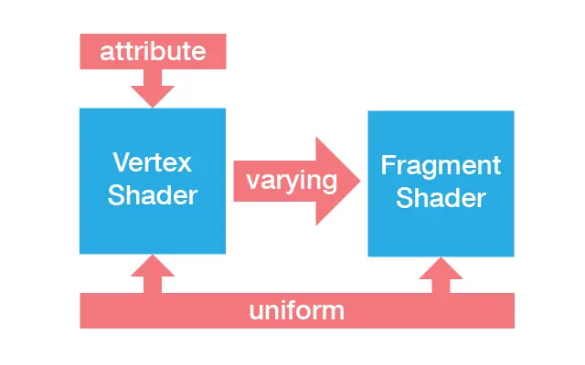
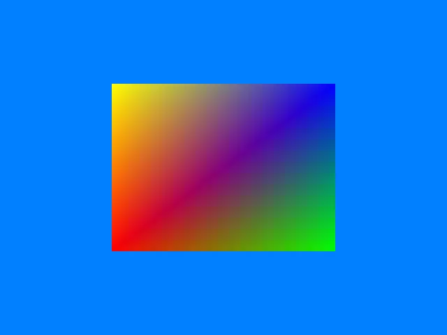

3Dレンダリングを学んだり、自分でエンジンを作ったりするのは、大変な作業です。最近は素晴らしいUnityやUnrealがありますが、具体的にどのように機能しているのでしょうか？

チュートリアルもありますが、そのロジックを完全に理解しようとすると、実はかなり難しいのではないかと思います。そこで今日は、細かいことや数学的なことは抜きにして、簡単に仕組みを解説してみたいと思います。

ベストプラクティスに沿ってきれいな本番用アプリを作る方法を紹介するのではなく、多くのショートカットを使って、簡単に理解できるように物事を単純化して説明します。

## What is a GPU?

CPUは計算速度に特化しており、低レベルの命令を幅広く持っています。GPUは全く逆で、速度が遅くシンプルですが、並列化（コア数の多さ）に重点を置いており、命令の種類も限られています。

一般的なCPUは2～16個のコアを搭載していますが、GPUは数千個のコアを搭載し、並行して演算処理を行っています。どちらも独立したメモリを持ち、（アーキテクチャによっては）専用バスでデータをやり取りするのみです。


Figure: Image by [Nvidia](https://developer.nvidia.com/blog/cuda-refresher-reviewing-the-origins-of-gpu-computing/)

## OpenGLとは

GLとは、Graphics Libraryの略です。GPUとのやりとりを容易にし、グラフィックを表示するためのフレームワークです。DirectXやVulkanのようなよく使われる代替手段もありますが、ここではOpenGLに焦点を当てます。

OpenGL は2つの部分で構成されています:
- ひとつはライブラリ自体です。ほとんどすべてのプログラミング言語で使用することができます。CPU上で動作し、GPUに命令やデータを送るものです。
- もう一つはシェーダーです。シェーダーは命令（コード）の断片で、まずCPUでコンパイルされ、その後GPUに送られます。これがGPU側で実行されるのです。OpenGLでは、シェーダーはGLSL言語（Graphics Library Shading Language）を使って記述されます。

OpenGLには、OpenGL ES（Embedded Systems）と呼ばれる代替版もあります。これは機能が少なく、簡素化されているので、現在ではほとんどのモバイル機器やアーキテクチャで動作させることができます。これはWebGLとしても知られており、ブラウザは他の設定なしで簡単に始められるので、ここではこちらを使用してデモを行います（プレーンなJavaScriptで）。しかし、心配しないでください。この記事のコードは、あなたが好きなほとんどすべてのプログラミング言語に置き換えることができます。

## セットアップ

この記事で示すすべてのコードには、非常に基本的で単一ページのHTMLファイルを使用することにします。
また、このページの一番下に全結果へのリンクがあります。

```html
<!DOCTYPE html>
<html>
    <body>
        <script type="text/javascript">
            const canvas = document.createElement('canvas');
            canvas.width = 640;
            canvas.height = 480;
            document.body.appendChild(canvas);

            const gl = canvas.getContext('webgl');
            if (!gl) {
                throw new Error('Unable to use WebGL. Your device may not support it.');
            }

            gl.clearColor(0, 0.5, 1, 1);
            gl.clear(gl.COLOR_BUFFER_BIT);

            // <-- Here we will add more code
        </script>
    </body>
</html>
```

これは 640x480 ピクセルのキャンバスと、その中の WebGL コンテキストを初期化します。
OpenGL からの今後のすべての描画操作は、このキャンバスにレンダリングされます。

OpenGLは完全に手続き的です。ここでは、まず `clearColor` を使用して、今後すべての `clear` 関数呼び出しで使用される色を定義しています。

色は、RGBA成分を表す0から1の間の4つの浮動小数点で定義されます。
つまり、ここで使っている色 (`0, 0.5, 1, 1`) は `rgba(0, 128, 255, 1.0)` と同じです (無地で不透明な青です)。

`gl.clear` は最初の描画操作です。これは、canvas にあらかじめ存在する可能性のあるものをすべてリセットし、青色を一様に適用します。

`COLOR_BUFFER_BIT` の引数の意味は、範囲外なので今回は説明しませんが、技術的な詳細は [こちら](https://www.khronos.org/registry/OpenGL-Refpages/gl4/html/glClear.xhtml) をご覧ください。

このページをブラウザで表示しようとすると、無地の青いキャンバスが表示されます。

## 形状の定義

画面を覆う1つの矩形を描画することになります。
OpenGLで図形を描くための基本要素は三角形であり、あらゆる図形はこの三角形でできています。

ここでは、長方形を表現するために [トライアングル ストリップ](https://en.wikipedia.org/wiki/Triangle_strip) メソッド を使用します。つまり、一連の頂点で三角形を定義し、すべての三角形が1つの頂点で結ばれている必要があります。

分かりやすくするために、図解で説明します。


レンダリング領域（キャンバス）は、X軸とY軸の座標 `[-1 .. +1]` に拘束され、原点 `(0, 0)` を中心に配置されています。OpenGLの図形は、ピクセルではなく10進数（浮動小数点）で表現されます。

長方形を描くために、最初の三角形 `(ABC)` を定義し、次に2番目の三角形 `(CAD)` を定義する。トライアングル ストリップ メソッドを用いて、頂点の並び `(ABCAD)` を得る。

これをちょっとしたコードで定義してみましょう。

```javascript
const positionBuffer = gl.createBuffer();
gl.bindBuffer(gl.ARRAY_BUFFER, positionBuffer);
gl.bufferData(gl.ARRAY_BUFFER, new Float32Array([
    -1, -1, // A
    +1, -1, // B
    +1, +1, // C
    -1, -1, // A
    -1, +1, // D
]), gl.STATIC_DRAW);
```

これは GPU のメモリに格納されたバッファの配列を作成し、その参照を `positionBuffer` として返します。

`bindBuffer` はOpenGLの状態を変更し、次の命令（その後の `bufferData` への呼び出しを含む）は `positionBuffer` を使用しなければならないようにします。

そして、矩形は 32 ビットの浮動小数点数である X と Y の座標 `(Xa, Ya, Xb, Yb...)` のシーケンスとして定義され、GPU のメモリ内のこのバッファに送られます。

(`ARRAY_BUFFER` と `STATIC_DRAW` 定数の意味は、この記事とは関係ないので説明しませんが、こちらをご参照ください。 [参照１](https://www.khronos.org/registry/OpenGL-Refpages/gl4/html/glBindBuffer.xhtml) 、[参照２](https://www.khronos.org/registry/OpenGL-Refpages/gl4/html/glBufferData.xhtml) 。

今はまだ、いろいろなことを定義しなければならないですが、一貫性を保つために、このプログラムの最後のインストラクションを、先に紹介することにします。：

```javascript
gl.drawArrays(gl.TRIANGLE_STRIP, 0, 5);
```

この命令は、現在定義されている状態とデータを使って実際に描画呼び出しを実行するようOpenGLに指示します。

最初の引数は描画方法（アルゴリズム）、次の引数はバッファから使用するデータの範囲を定義します。この例では、インデックス0から5つの頂点が定義されていますが、これは複雑なアプリケーションを最適化するのに便利です。

## シェーダーの種類

OpenGLの **プログラム** は、2つのシェーダーで構成されています:
- **バーテックスシェーダー** は、描画したい頂点ごとに（共通に）1回実行されます。これはいくつかの **アトリビュート** を入力として受け取り、空間におけるこの頂点の位置を計算し、 `gl_Position` と呼ばれる変数にそれを返します。また、いくつかのベアリングも定義します。
- **フラグメントシェーダー** は、レンダリングするピクセルごとに1回ずつ実行されます。入力としていくつかの **ベアリング** を受け取り、このピクセルの色を計算し、 `gl_FragColor` という変数に返します。


Figure: Image by [Glumpy](https://glumpy.github.io/modern-gl.html)

他の工程については、OpenGLが自動的に面倒をみてくれます。

## Vertex shader

まず、基本的なバーテックスシェーダーを定義することから始めましょう。

```javascript
const vertexShader = gl.createShader(gl.VERTEX_SHADER);
gl.shaderSource(vertexShader, `
    attribute vec2 position;

    void main(void) {
        gl_Position = vec4(position, 0.0, 1.0);
    }
`);
gl.compileShader(vertexShader);

// Error handling only
if (!gl.getShaderParameter(vertexShader, gl.COMPILE_STATUS)) {
    throw new Error(gl.getShaderInfoLog(vertexShader));
}
```

ここでは、バーテックスシェーダーのソースコード（ここではJavaScriptの文字列でハードコーディングされています）から作成し、コンパイルしています。
まず、 `position` アトリビュートを宣言します。これは `vec2` （浮動小数点数 2 のベクトル）であり、矩形内の各頂点の `(X, Y)` 座標を受け取ることになります。バッファに 5 個の頂点があるので、このシェーダーは GPU によって 5 回実行されることになります（各頂点につき、1 回）! GPU には非常に多くのコアがあるので、シェーダーの 5 つのインスタンスは すべて並列に実行されると予想できます。

`gl_Position` は常に `vec4` （4つの浮動小数点数のベクトル）として定義されていますが、それはなぜでしょうか？3番目のメンバはZ座標用で、ここでは2Dの形状しかないので0に設定しています。
しかし、そうでなければ、 `vec3` の位置を持ち、Z座標をバッファに追加することによって、実際に3Dの形状を定義することができます。最後の引数は `W` で、この4番目の次元は **クリッピング** に使用されます。説明は省きますが、詳しくは [こちら](https://www.haroldserrano.com/blog/what-is-clipping-in-opengl) をご覧ください。

デフォルトでは、WebGLはブラウザのコンソールにエラーを出力しません。そして、最後の3行が私たちのためにしていることはそれだけです。

ℹ️ GLSLではベクトルを簡単に組み合わせることができます。 `vec4(vec2(1, 2), 3, 4)` は `vec4(1, 2, 3, 4)` と同等です（3次元では `vec4(vec3(1, 2, 3), 4)` も同様）。

## フラグメントシェーダー

私たちのフラグメントシェーダーは、さらに簡単になります。

```javascript
const fragmentShader = gl.createShader(gl.FRAGMENT_SHADER);
gl.shaderSource(fragmentShader, `
    void main(void) {
        gl_FragColor = vec4(1.0, 0.0, 0.0, 1.0);
    }
`);
gl.compileShader(fragmentShader);

// Error handling only
if (!gl.getShaderParameter(fragmentShader, gl.COMPILE_STATUS)) {
    throw new Error(gl.getShaderInfoLog(fragmentShader));
}
```

ここですることは、OpenGLに矩形の各ピクセルを赤色で塗りつぶすように指示することだけです。この色は、 `0.0から1.0` までの4つのRGBA成分からなる `vec4` で定義されます。

## OpenGLプログラムの作成

シェーダーの作成とコンパイルが完了したので、これらをリンクして OpenGL **プログラム** を作成します。

```javascript
const program = gl.createProgram();
gl.attachShader(program, vertexShader);
gl.attachShader(program, fragmentShader);
gl.linkProgram(program);
gl.useProgram(program);
```

分かりにくければ、前のステップでコンパイルしたパッケージ（シェーダー）を使ってバイナリ実行ファイルをビルドすることと比較するとよいでしょう。

最後の `useProgram` 命令は、OpenGLに内部状態を設定するよう指示し、それ以降のすべての操作がこのプログラムを使用するようにします。

ℹ️ 1つのアプリケーションで、複数のOpenGLプログラムを宣言し、使用することができます。例えば、ビデオゲームでは、ソリッドシェイプをレンダリングするプログラム、パーティクルをレンダリングするプログラム、その上に2Dインターフェース（HUD/UI）をレンダリングするプログラムを1つずつ用意するのが一般的です。

## まとめる

さて、プログラムができたので、アトリビュート値がどこから来るのかを教える必要があります。

```javascript
const positionAttribute = gl.getAttribLocation(program, "position");
gl.enableVertexAttribArray(positionAttribute);
gl.vertexAttribPointer(positionAttribute, 2, gl.FLOAT, false, 0, 0);
```

最初の行で、OpenGL **プログラム** の `position` アトリビュートへの参照を得ることができます。

次に `enableVertexAttribArray` を使用して、このアトリビュートが頂点配列の値を指すようにしたいことを OpenGL に伝えます（この配列は以前に `bindBuffer` でバインドしたものです）。

最後の `vertexAttribPointer` の呼び出しで、OpenGLにデータの構造を伝えることができます。パラメータは、頂点シェーダーの各インスタンスがバッファから `float` 型の `2` つの要素を受け取ることを意味します。
言い換えれば、配列から1つの `(X, Y)` ペアが自動的に `vec2` （ `position` アトリビュート）のコンポーネントにバインドされることになります。

最後の引数(`false, 0, 0`)はここでは関係ありませんが、詳細は [こちら](https://www.khronos.org/registry/OpenGL-Refpages/gl4/html/glVertexAttribPointer.xhtml) をご覧ください。


そして、塗りつぶされた赤いキャンバスを見ることができるようになりました。しかし、これではつまらない。矩形をきちんと描いたことをどうやって確認すればいいのでしょうか？

矩形のサイズを小さくして、スペースを取らないようにしなければなりません。どうすればいいか見てみましょう。

### 矩形の大きさを小さくする?

各頂点のXとYの値を1より小さい値に変更することで、矩形のサイズを小さくすることができるのです。

しかし、実際のアプリケーションで、矩形が何百万もの頂点を持つ3Dモデルだったらどうでしょう？

この方法だと、頂点の修正を CPU で行い（更新したデータを GPU に再送信）、その後に GPU で頂点の修正を行う必要があります。それはあまりにも非効率的です。

### 矩形を移動させる?

頂点シェーダーに書いたことを思い出しましょう。

```
gl_Position = vec4(position, 0.0, 1.0);
```

Zの値を変えて（ここでは `0.0` ）、矩形が視点から遠くなるようにすれば、きっと小さく見えるはずです。

試してみると、Zの値は実際には何もしていないことに気づきます。

遠くにあるものを遠くに見せるには、まず遠近法を定義する必要があります


Figure: Image by [Glumpy](https://glumpy.github.io/modern-gl.html)

そのためには、投影行列を設定する必要がありますが、今回は割愛します。

しかし、 [MDN](https://developer.mozilla.org/en-US/docs/Web/API/WebGL_API/Tutorial) にあるチュートリアルを見れば、それについてもっと知ることができます。

### 矩形を縮小する?

この場合、最後のオプションとして、シェーダーで矩形の頂点を縮小させるという方法があります。

これは最初のオプションと似ているように聞こえるかもしれませんが、GPUにとっては些細な操作であり、パフォーマンスの問題なしに非常に簡単に行うことができます。

また、これを機に **ユニフォーム** の紹介もしたいと思います。

## ユニフォーム

先ほど、バーテックスシェーダーは **アトリビュート** を受け取り、フラグメントシェーダーは **ベアリング** を受け取るという話をしました。 しかし、OpenGLの入力には **ユニフォーム** と呼ばれる第3のカテゴリーがあります。ユニフォームは定数と非常によく似ていますが、値がハードコーディングされるのではなく、OpenGLプログラムの実行前にプログラム的に定義される点が異なります。


Figure: Image by [Subterranean Flower](https://glumpy.github.io/modern-gl.html)(in Japanese)

ユニフォームの値は、頂点シェーダーやフラグメントシェーダーのすべてのインスタンスの間で常に...均一です（ただし、OpenGLプログラム自体のインスタンスごとに異なることがあります）。

バーテックスシェーダーを変更:
```glsl
attribute vec2 position;

uniform float scale;

void main(void) {
    gl_Position = vec4(position * scale, 0.0, 1.0);
}
```

私たちの `scale` ユニフォームは、スケーリングファクター（例えば `0.5` ）を受け取り、それを各頂点のXおよびY座標に乗算します。

注：GLSL では、 `(vec2(x, y) * a)` は `vec2(x * a, y * a)` と等価である。

あとは、このユー二フォームに浮動小数点（ `1f` ：'1 float'）値を1つ割り当てる:

```javascript
const scaleUniform = gl.getUniformLocation(program, "scale");
gl.uniform1f(scaleUniform, 0.5);
```

Ta-da!青いキャンバスの真ん中に赤い長方形が見えるようになったはずです!


Figure: Screenshot showing our scaled-down rectangle

## グラデーションカラー

**ベアリング** を使って、赤色を異なる色のグラデーションに置き換えていくのです。

**ベアリング** とは、バーテックスシェーダーからフラグメントシェーダーに渡される値のことです。頂点とピクセルの間に直接的なマッピングはありませんが、OpenGLは自動的に値を補間してくれます。


このヴァリアリングの特性は非常に便利で、ベクトルの各メンバーに適用されるます。つまり、各頂点に色を割り当てると、その成分は各ピクセルごとに補間され、グラデーションが作られます。

この手法は、テクスチャから特定のピクセルを取得して表示したり、バーテックス単位の [シェーディング](https://en.wikipedia.org/wiki/Shading) を適用するためによく使われま

もう一度、矩形を見てみましょう。


ここでは、Aを赤、Bを緑、Cを青、Dを黄に設定することにします。データ構造は頂点とほぼ同じですが、各頂点にXとYの2値ではなく、3値（R、G、B成分が0〜1）のベクトルを持つようになりました。

```javascript
const colorBuffer = gl.createBuffer();
gl.bindBuffer(gl.ARRAY_BUFFER, colorBuffer);
gl.bufferData(gl.ARRAY_BUFFER, new Float32Array([
    1, 0, 0, // A = red
    0, 1, 0, // B = green
    0, 0, 1, // C = blue
    1, 0, 0, // A = red
    1, 1, 0, // D = yellow
]), gl.STATIC_DRAW);
const colorAttribute = gl.getAttribLocation(program, "color");
gl.enableVertexAttribArray(colorAttribute);
gl.vertexAttribPointer(colorAttribute, 3, gl.FLOAT, false, 0, 0);
```

頂点シェーダーでは、色を `vec3` アトリビュートとして受け取り、その値をベアリングに代入します。
```glsl
attribute vec2 position;
attribute vec3 color;

varying mediump vec3 vColor;

uniform float scale;

void main(void) {
    gl_Position = vec4(position * scale, 0.0, 1.0);
    vColor = color;
}
```

ベアリングは常に精度（ `lowp` ,  `mediump` ,  `highp` ）を指定する必要があります。これは、各値に対して内部で使用されるビット数を制御するものです。これは性能に大きく影響します（プログラムの複雑さとハードウェアに依存します）。しかし、この例では、それは重要ではないので、中程度の精度を使用しています。

OpenGLがすべての作業を行うので、フラグメントシェーダーはアルファチャンネル（1 = 不透明）を追加し、色を返すだけです。

```glsl
varying mediump vec3 vColor;

void main(void) {
    gl_FragColor = vec4(vColor, 1.0);
}
```

このように、矩形が滑らかなグラデーションカラーで表示されるはずです:



## 最後に

その仕組みを理解するために、私が考える基本的なことにフォーカスしてみました。アニメーション、シェーディング（光の効果）、パーティクル、カメラ（視点と投影のマトリクス...）、そしてより大規模な処理に必要なアーキテクチャ（ビデオゲームや3Dエンジンなど）など、もっと説明したいことはたくさんありますが、ブログ記事の形式には到底収まりきれません。

この記事の完全な結果は [こちら](/posts/introduction-to-gpus-with-opengl/example.html) でご覧いただけますので、ご自身でデバッグや実験をしてみてください。

また、さらに詳しく知りたい方は、以下のリンク先の資料もご覧ください。

## Links and credits

- An article from Nvidia about the [history of GPUs](https://developer.nvidia.com/blog/cuda-refresher-reviewing-the-origins-of-gpu-computing/).
- Another [great article](https://glumpy.github.io/modern-gl.html) from which I took the OpenGL pipeline and projections images.
- You can find a more advanced WebGL tutorial on [MDN](https://developer.mozilla.org/en-US/docs/Web/API/WebGL_API/Tutorial).
- [webglreport.com](https://webglreport.com/) gives you some insights on what is supported by your device.
- Header image by [Laura Ockel](https://unsplash.com/photos/nIEHqGSymRU).
