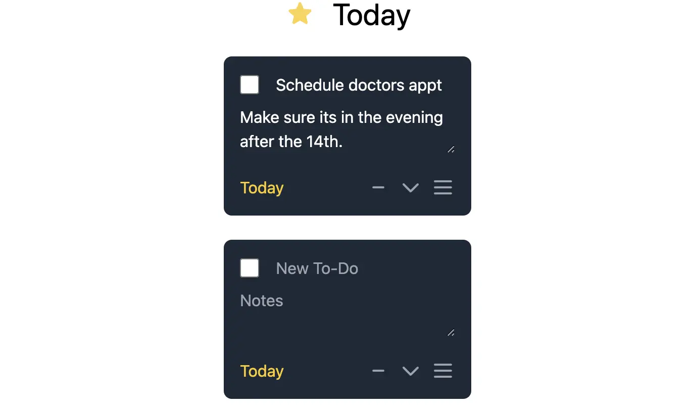
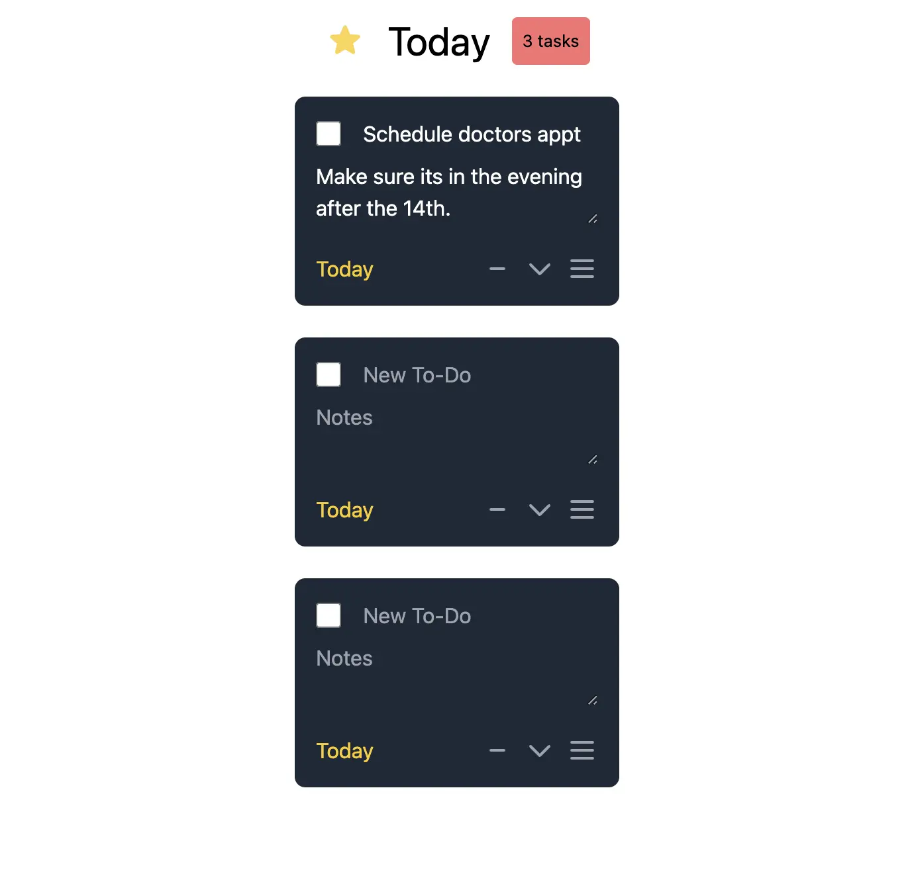

## 序論

シングルページアプリケーション (SPA) は Web 開発の風景を一変させ、ユーザーにネイティブアプリケーションのエミュレーションを提供しました。しかし、それと同時に複雑性も増してきました。NextJS や NuxtJS のような「メタフレームワーク」は、開発者がサーバーとクライアントの間の複雑な相互作用を管理するという任務を増やし、複雑性をさらに高めています。この複雑性を軽減する試みとして、[HTMX](https://htmx.org/)が再び現れてきました。

以前は“[intercooler.js](https://intercoolerjs.org/)”と呼ばれていたものが現在では HTMX となっています。HTMX は一言で言えば、DOM 要素に属性を付加する小さなクライアントサイドの JavaScript ライブラリです。これらの DOM 要素は、サーバーへのリクエストを送るために使用されます。これにより、開発者はサーバーから小さな HTML「スニペット」を送信して SPA の反応性をエミュレートし、それを DOM のどこかに HTMX が入れ替えたり挿入したりすることが可能となります。このシンプルなコンセプトが、現代のフロントエンドフレームワークが持つ大量のバゲージを必要としない多くのウェブアプリケーションを支えています。

多くの他の利点の中には、クライアントとサーバーの二箇所で状態を管理する必要性を減らし、開発者が好みのバックエンド言語でコードを書くことができるというものもあります。

この投稿では、一緒に小さな ToDo リストアプリケーションを作りながら、HTMX のシンプルさを強調し、なぜそれを次のプロジェクトで使用を検討すべきかを議論します。

## ToDo リスト

HTMX を理解する最良の方法は、それを使って何かを作ることです。では早速、ToDo リストアプリケーションを作ってみましょう。ここではすでに、HTMX の固有のメリットが始まります。それは、我々の好きなプログラミング言語とともに HTMX を使用できるということです。これにより、チームが特定のインフラストラクチャを必要とするフレームワークにロックインされないようにすることができます。実際には、多くの開発者が JavaScript から離れて HTMX を選ぶかもしれません、私たちは Python と Flask を使っていきます。

この組み合わせは、ウェブ開発に素晴らしい経験を提供します。シングルページアプリケーション (SPA) のエミュレーションを容易かつ効率的に作成することができます。Flask と HTMX を使用すれば、webpack のような伝統的なビルドシステムと結びついた複雑さを避けることができ、クライアントとサーバー間での状態の管理が簡単になります。このアプローチは、高速に概念証明を開発するのにも理想的です。私たちはこれを、コーディングプラットフォーム Replit で実現します。ローカルマシンでこれを追うことを希望する場合は、この[tutorial](https://flask.palletsprojects.com/en/2.2.x/quickstart/)を参照してください。しかし、この記事の目的は HTMX の使いやすさを示すことなので、アプリケーションのセットアップは無視します。

新しい[Repl](https://replit.com/new)に移動して Flask のテンプレートを選択することで、すぐに Replit を始めることができます。

まず、全体のページを包み込むインデックステンプレートを作成してみましょう：

```html
<!DOCTYPE html>
<!-- templates/index.html -->
<html lang="ja">
  <head>
    <meta charset="UTF-8" />
    <meta name="viewport" content="width=device-width, initial-scale=1.0" />
    <title>Todo App</title>
    <script src="https://unpkg.com/htmx.org"></script>
    <!-- Tailwind for styling -->
    <script src="https://cdn.tailwindcss.com"></script>
  </head>
  <body class="display flex flex-col items-center w-full relative h-screen">
    <h1 class="text-3xl flex gap-4">
                   今日    
    </h1>
    <div id="todo-list">
      <!-- This is where our todo list will go -->
    </div>
    <form hx-post="/add-todo" hx-target="#todo-list" hx-swap="“innerHTML”">
      <button
        type="submit"
        class="text-white text-3xl absolute right-5 bottom-5 rounded-full bg-blue-600 aspect-square w-6"
      >
        +
      </button>
    </form>
  </body>
</html>
```

そして、全てのロジックを含む次の Python ファイル：

```python
# main.py
app = Flask(__name__)

@app.route('/')
def index():

  return render_template('index.html')
```

ページでは、HTMX をスクリプトタグ経由で単純に含めます。ビルドステップは必要ありません。

HTMX への最初の紹介は、`form`要素上の`hx-post`、`hx-target`、`hx-swap`の属性で始まります。HTMX は、ウェブ開発者が任意の標準的な HTML 要素に特別な属性を追加することを可能にします。これらの強化された要素は HTTP リクエストを開始する能力を得ます。そして、HTML フラグメントという形のレスポンスは、ウェブページの任意の部分で動的に挿入または置換されることができます。この機能は、全ページのリフレッシュを必要とせずにコンテンツを更新するシームレスな方法を導入します。我々の場合、課題を"id"が"todo-list"の`div`要素に入れたいと思います。

ユーザーが"+"ボタンを押すと空のタスクが挿入されるようにしましょう。私たちは、HTML フラグメントを作成し、そのフラグメントを返すエンドポイントを追加することから始めます：

```python
# main.py
@app.route('/add-todo', methods=["GET"])
def task():
  return render_template('task.html')
```

そして、次のテンプレート：

```html
<!-- templates/task.html -->
<div class="bg-gray-800 rounded-lg p-4 max-w-lg mx-auto my-6">
  <div class="flex items-center">
    <input
      type="checkbox"
      class="form-checkbox h-5 w-5 text-yellow-400 rounded border-gray-600"
    />
    <input
      type="text"
      placeholder="New To-Do"
      class="ml-4 bg-transparent border-0 placeholder-gray-400 text-white focus:outline-none"
      style="width: calc(100% - 2rem);"
    />
  </div>
  <textarea
    placeholder="Notes"
    class="mt-2 bg-transparent border-0 placeholder-gray-400 text-white focus:outline-none w-full"
  ></textarea>
  <div class="flex items-center justify-between mt-4">
    <button class="text-yellow-400 focus:outline-none">
                  今日        
    </button>
    <div class="flex space-x-2">
      <button class="focus:outline-none">
                                  
      </button>
      <button class="focus:outline-none">
                                    
      </button>
      <button class="focus:outline-none">
                                    
      </button>
    </div>
  </div>
</div>
```

いくつかのスタイルを追加した後、このフラグメントの実際の重要なポイントは、間もなく活躍する`input`要素です。+ボタンをクリックすると、新しい空のタスクを表示します。これがどのように作動するか見てみましょう。ボタンはこのように見えます：

```html
<form hx-get="/add-todo" hx-target="#todo-list" hx-swap="“innerHTML”">
  <button
    type="submit"
    class="text-white text-3xl absolute right-5 bottom-5 rounded-full bg-blue-600 aspect-square w-6"
  >
    +
  </button>
</form>
```

HTMX によって追加された特別な属性 `hx-get`, `hx-target` および `hx-swap` は、「フォームが提出されたとき、(hx-)get リクエストを発行し、“todo-list”という id を持つ要素を(hx-)target とし、この HTML の内部コンテンツを(hx-)swap する」と教えてくれます。SPA のような動作を属性を通じてエミュレートするという概念は、HTMX の全行動を形成します。以下は、他の事柄を行うために我々が可能にする他の属性をいくつか示します:

1. `hx-trigger` は、マウスのホバーなどの動作に基づいてリクエストをトリガーすることを可能にします。
2. `hx-post` は get リクエストの代わりに post リクエストを送信します。PUT、DELETE、PATCH でもこれを行うことができます。
3. `hx-boost` を使用すると、すべてのアンカータグとフォームを、デフォルトではページの本文を対象とする AJAX リクエストに変換できます。
4. `hx-push-url` を使用すると、ブラウザの履歴 API と対話できます。

そして他にもたくさんあります。これらの属性のそれぞれに対する値の長いリストは、さらに我々が行動をカスタマイズすることを可能にします。これらの属性は任意の要素に適用可能であるということも重要な点です。これらはすべて、[documents page](https://htmx.org/docs)にて詳述され新たに属性を追加してタスクをリストに追加し、個々のタスクを編集する機能を追加することで、ToDo リストアプリケーションを改善しましょう。クライアントの HTML をスワップするのではなく、`#todo-list`要素の終端部分に追加することができます。例えば以下のように指定します：

```html
<form hx-get="/add-todo" hx-target="#todo-list" hx-swap="beforeend"
  …
 
```

これらのタスクは一時的なものなので、いくつかの状態を追加する必要があります。HTMX では、フロントエンドをサーバーサイドから制御することが可能なため、大規模なフロントエンドフレームワークを使用しているアプリケーションでしばしば必要とされる状態同期ソリューションを必要とせずに済みます。我々はサーバーを真実の源としてすべてを駆動します：

```python
# main.py
task_list = [{
    "id": 222,
    "title": "Schedule doctors appt",
    "notes": "Make sure its in the evening after the 14th."
}]


@app.route('/todos', methods=["GET"])
def load_task():
  return render_template('tasks.html', tasks=task_list)
```

状態をテンプレートに読み込み、コードをフラグメントに分割します。これはコンポーネントと似ています(`templates/tasks.html`というファイルを作成します)：

```html
<ul id="todo-list">
                   
  
</ul>
```

個々のアイテムテンプレートは、Flask によって供給されたデータを使用準備完了です。これで、私たちの小さな CRUD アプリケーションでの"READ"プロセスが完成しました。すでに最初のコードからの"CREATE"プロセスを持っているので、ここから"UPDATE"プロセスに進むことができます。我々は、ユーザーフレンドリーな UX パターンでタスクを編集する能力を追加できます。ユーザーはタイプしてタスクを更新できるようにするべきです。これはキーの入力をデバウンスすることで達成できます。これは典型的には他のフロントエンドフレームワークでは手間がかかるもので、複数行といくつかの巧妙な状態更新が必要ですが、HTMX ではエレガントです：

```html
<form
  id="task-form-{{ task.id }}"
  hx-post="/update-todo"
  hx-trigger="keyup from:input, keyup from:textarea delay:500ms
"
>
  <div class="flex items-center">
    <input type="hidden" name="task_id" value="{{ task.id }}" class="" />      
      <input type="checkbox" class="“…”" name="checked" />        
    <input
      type="text"
      name="title"
      placeholder="New To-Do"
      class="“…”"
      value="{{ task.title if task.title }}"
    />
  </div>
  <textarea name="notes" placeholder="Notes" class="“…”">
{{ task.notes if task.notes }}</textarea
  >
</form>
```

フォームの上部の`hx-trigger`は我々にたくさんの作業をしてくれます。それはほぼプレーンな英語のように読めます。「input または textarea からのキーアップをトリガーし、500 ミリ秒遅らせる」。

最後に、バックエンドのデータを更新することができます：

```python
@app.route('/update-todo', methods=["POST"])
def update_todo():
  # フォームからデータを抽出する
  task_id = request.form.get('task_id')
  title = request.form.get('title')
  notes = request.form.get('notes')
  checked = request.form.get('checked') == 'on'

  # リスト内のタスクを更新する
  global task_list
  task_list = [{
      **task, 'title': title,
      'notes': notes,
      'checked': checked
  } if str(task['id']) == task_id else task for task in task_list]

  # HTMXからのデフォルトのスワッピングを禁止するために何も返さない
  return '', 204
```

これで、"UPDATE"プロセスのコードが完成しました。削除や並べ替え（または他に思いつくもの）の実装は読者に任せます。もし今までの説明で納得していただけたなら、これらの機能を追加することがいかにささいなことかを既に理解していただけているはずです。



これまでは、簡単な CRUD 操作をどのように行うかを探ってきました。しかし、多くの人々が複雑な現代のフロントエンドフレームワークを選択する理由の一つは、他の状態に依存する状態が自動的に更新される能力にあります。HTMX は多くの DOM 要素間で複雑な依存関係が求められる場合には最良のアプローチでないかもしれませんが、それでも HTMX を使用してこれを達成することは十分に可能です。HTMX は、[`hx-swap-oob`](https://htmx.org/attributes/hx-swap-oob/) 属性を提供しており、これによりターゲット要素の外側をスワップすることができます。HTMX のドキュメントには次のように記載されています：

> これにより、他の要素のアップデートに応答の更新を Piggy Back することができます。

これを考えてみると、私たちの小さなアプリケーションに素晴らしい例を追加することができます。我々が追加するものは、アプリケーションヘッダーの上部にカウンターです。このカウンターは Todo アイテムの数に依存する状態です。新しい Todo アイテムを追加するとき、我々は新しい更新されたカウント値で上部のヘッダーを更新することができます：

`task.html` ファイルの最後に以下を追加します：

```html
<!-- remaining HTML -->

<span id="counter" hx-swap-oob="true">{{ new_task_length }}</span>

```

そして、`/add-todo`エンドポイントのリターンステートメントに以下のアイテムを追加します：

```python
@app.route('/add-todo', methods=["GET"])
def task():
# ...他のロジック
    return render_template('task.html', task={}, new_task_length=len(task_list))
```

これにより、HTMX の `hx-swap-oob` 機能で状態依存の更新を簡単に管理する方法が示されています。ここでは、わずか数行のコードで、アプリケーションに追加機能を作成しました。これは、タスクリストの長さに依存する状態を反映したカウンターです。新たなタスクが作成されると、ヘッダーのカウンターが自動的に更新され、新たなカウントを表示します。

このチュートリアルの演習セクションを終えるにあたり、アニメーションについて議論したいと思います。これは多くの人々が JavaScript フレームワークを選択する理由の一つです。



確かに、アニメーションは現代のウェブアプリケーションの重要な側面であり、多くの場合、JavaScript フレームワークを選択する主要な理由となります。しかし、HTMX では、このユーザーエクスペリエンスの根本的な要素を犠牲にする必要はありません。

### HTMX でアニメーションを追加する

HTMX を使用しながらアニメーションを達成する方法はいくつかあります。インタラクティブなフィードバックの大部分は CSS で処理することができます。現代の CSS には十分なアニメーションとトランジションが用意されており、UI の変更に対応するアニメーションを作成することが可能です。

例えば、CSS トランジションを使用すれば、要素の現れや消え方、またはユーザーのインタラクションに応じた変形をスムーズにアニメーション化することができます。これは、リストのアイテムを追加、更新、削除するなどの操作において、視覚的なフィードバックがユーザー体験を向上させると特に効果的です。HTMX では、スワップトランジションのような素晴らしいインテグレーションにより、これをさらに進めることができます。ドキュメントから一例を見てみましょう。

> リクエストの終了時に要素をフェードアウトさせたい場合は、一部の CSS とスワップフェーズを十分に長くしてアニメーションが完成するのを待つことで `htmx-swapping` クラスを利用します。以下のようにして実現できます：

```html
<style>
  .fade-me-out.htmx-swapping {
    opacity: 0;
    transition: opacity 1s ease-out;
  }
</style>
<button
  class="fade-me-out"
  hx-delete="/fade_out_demo"
  hx-swap="outerHTML swap:1s"
>
  Fade Me Out
</button>
```

### JavaScript ライブラリを利用する

もっと複雑なアニメーションについては、軽量な JavaScript ライブラリと統合することがでます。GreenSock（GSAP）は、シンプルな API で高度なアニメーション機能を提供する優れたライブラリの一例です。HTMX とこれらのライブラリを組み合わせることで、フルの JavaScript フレームワークのオーバーヘッドなしに、洗練されたアニメーションを作成して UI を活性化させることが可能となります。

最後に、現在は Chrome でのみ利用可能な躍動的な Transitions API に言及したいと思います。この API は、滑らかなトランジションのためのネイティブサポートを提供することにより、このような効果に対する外部ライブラリへの依存を減らす可能性があり、SPA フレームワークの必要性を減らします。HTMX もまた、`hx-swap` 属性を通じてこの API にアクセスする良好な統合を提供しており、[こちら](https://htmx.org/examples/animations/#view-transitions)で詳しく学ぶことができます。

## 最後に

HTMX は、その単純さと機能性により、開発者にとって素晴らしい経験を提供します。HTMX を使えば、UI/UX を妥協することなく、ビジネスロジックに注力することができます。HTMX を用いれば、基本的な REST の知識だけで完全なユーザーインターフェースを構築することが可能で、複雑さ、開発時間、コストを軽減することができます。

しかし、HTMX が全ての解決策というわけではありません。より複雑なアプリケーションについては、包括的な JavaScript フレームワークがより適しているかもしれません。HTMX が本質的にサポートしていない状態管理やコンポーネントベースのアーキテクチャは、アプリケーションやニーズに応じてより良い適合をもたらす可能性があります。

それにもかかわらず、HTMX の容易な統合性とミニマリスティックなアプローチは、常に考慮すべき価値あるツールとして位置づけられています。それは特に、サーバでレンダリングされたページを強化するため、またはフルの JavaScript フレームワークが必要ないプロジェクトにとって効果的です。結局のところ、HTMX は最小限のオーバーヘッドで効率的で、インタラクティブなウェブ体験を提供する能力で際立っており、それは様々なウェブ開発シナリオで考慮すべき技術となっています。

常に学びは続きますので、[公式ドキュメンテーション](https://htmx.org/docs/)や、HTMX 作者によって提供される[エッセイ](https://htmx.org/essays/)、そして[無料の書籍](https://hypermedia.systems/)をチェックすることをご検討ください。また、このプロジェクトのためのソースコードは、ここでご覧いただけます：[Replit](https://replit.com/@hhofner/KnownHeartyApplescript)

## Resources

_Article Photo by [HTMX](https://htmx.org/)_
