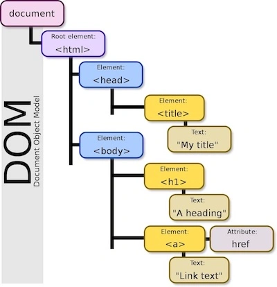
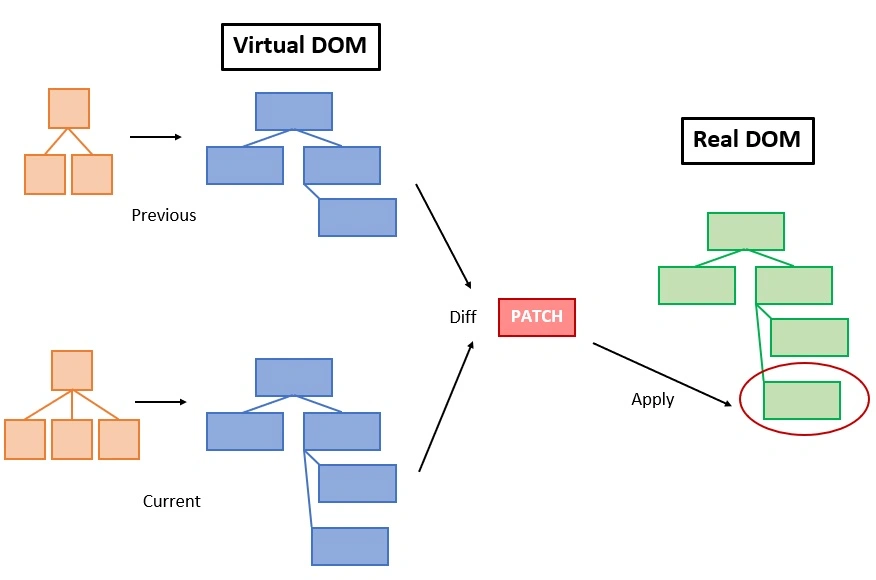
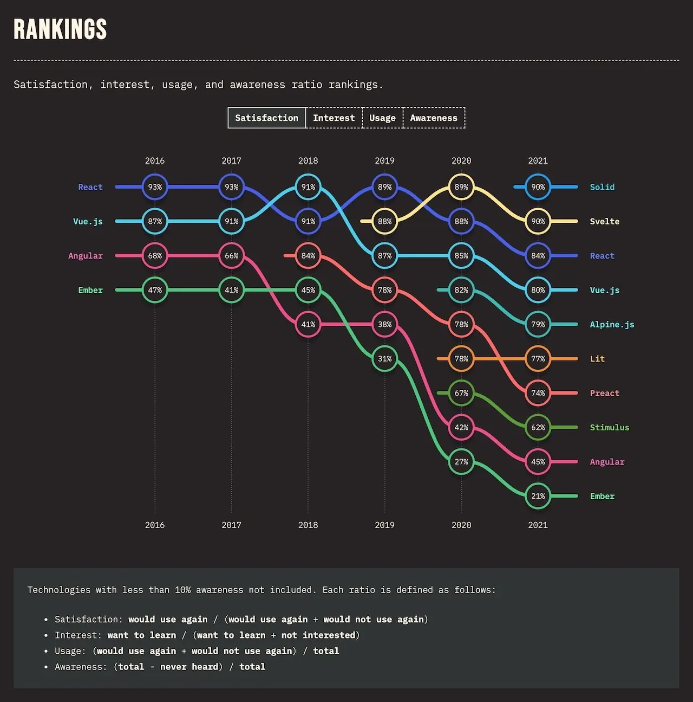

<!-- ## Intro -->

フロントエンドエンジニアや、主流のフロンエンドフレームワークの React と Vue.js を触った経験がある方なら、仮想 DOM という言葉を聞いたことがあると思います。仮想 DOM はフロンエンド開発において、パフォーマンスを向上させるスタンダードになるほど、普及してきました。しかし、その一方で仮想 DOM を使わないトレンドも最近流行っています。この記事では、仮想 DOM について、また仮想 DOM の時代はもう終わりなのかを討論したいと思います。

---


## The DOM

最初に、DOM についてみてみましょう。[MDN docs](https://developer.mozilla.org/ja/docs/Web/API/Document_Object_Model/Introduction)によると、

> DOM (Document Object Model) はウェブ文書をノードとオブジェクトで表現します。そうやって、プログラミング言語をページに接続することができます。

すなわち、DOM のおかげで、HTML のノード上に直接作業し、Javascript と CSS を使って、Web ページでインタラクティブなコンポーネントを作成することができました。

### DOM ツリーの例



下記は一番シンプルな HTML 要素を編集する例です：

```javascript
document.xxx.xxx.element.innerHTML = "Hello DOM!";
```

### DOM 操作の懸念

上記の例の DOM ツリーと HTML コンテンツは簡単なので、ここまでは開発者やユーザーにとって特に問題はありません。

ただし、ユーザーに見える HTML 内容の裏側に、DOM 自身がたくさんの複雑な要素と属性を持っています。シンプルな HTML 内容を作成するにも、ブラウザがたくさんの作業をする必要があります。

さらに、子ノードが複数あった親ノードが変更された場合、親ノード全体を再構築し、全てのコンテンツをユーザーにレンダリングし直すことになります。

これは明らかに、余計にコンピューティングリソースを消費し、パフォーマンスに影響を与える要因であります。特に Web ページが多くノードを持って、もっとインタラクティブな変更があった場合です。

---


## The (Virtual) DOM Revolutions

### コンセプト

前述のように、DOM 操作のコストが高いので、それを回避する方法が必要です。例えば、開発者が使いやすいとともに、不要なロードを削減し、効率的にピンポイントで変更を DOM に反映できるゲートウェイみたいものがあれば助かります。そこで今日の本題である仮想 DOM の登場になります。

仮想 DOM とは、DOM と開発者の間にある、軽量的な抽象化レイヤーとなります。その中身実は、DOM ツリーと下のノードを表すために必要な要素と属性しか持たない Javascript オブジェクトの集合です。この抽象された DOM ツリーがあれば、普通の Javascript オブジェクトを操作するように、DOM のノードを追加、編集や削除が簡単かつ速くなります。

さらに、仮想 DOM により、レンダリングのプロセス実体も抽象化ができます。その上で、Web ブラウザーだけではなく、モバイルネイティブやその他の GUI コンポーネントの開発クロスプラットフォームの互換性も向上させました。

### アプローチ: diff & patch

多くの人は仮想 DOM を知ったのは React がきっかけかもしれませんが、実は仮想 DOM は React が発明したものではありません。多くのフレームワークやライブラリーが仮想 DOM のアプローチを採用しています。また、仮想 DOM の実装を専門的に扱うプロジェクトも進んでいます。例えば [virtual-dom](https://github.com/Matt-Esch/virtual-dom) と [millionjs](https://millionjs.org/)。

仮想 DOM の実装がそれぞれで異なりますが、アプローチの思想は大体似ています。根本的に二つのステップが diff と patch となります。



DOM 操作コストの問題では、レンダリングし直す際に、変わってないノードが出来るだけ影響されないほど、効率が高くなります。なので、まず重要なタスクとして変更された箇所を特定することで、一般的に **diff** 計算と呼ばれます。変更内容を確定したら、それを実際の DOM 反映するためのもう一つタスクは **patch** 作業になります。

このプロセスの中に、**diff** 計算は最も中心的な部分です。基本の考えとしては全てのノードをトラバースし、変更前の仮想 DOM ツリーを変更後の内容を比較します。

下記のコードは diff を実装する簡単な例になります。 by [livoras](https://github.com/livoras/simple-virtual-dom):

```javascript
// diff compare two DOM tree
function diff (oldTree, newTree) {
  var index = 0 // current node index
  var patches = {} // record changes on each node
  dfsWalk(oldTree, newTree, index, patches)
  return patches
}

// depth-first walk through two DOM tree
function dfsWalk (oldNode, newNode, index, patches) {
  // compare the changes and record by index
  patches[index] = [...]
  diffChildren(oldNode.children, newNode.children, index, patches)
}

// compare child nodes
function diffChildren (oldChildren, newChildren, index, patches) {
  var leftNode = null
  var currentNodeIndex = index
  oldChildren.forEach(function (child, i) {
    var newChild = newChildren[i]
    currentNodeIndex = (leftNode && leftNode.count) // calculate node index
      ? currentNodeIndex + leftNode.count + 1
      : currentNodeIndex + 1
    dfsWalk(child, newChild, currentNodeIndex, patches) // traverse all child nodes
    leftNode = child
  })
}
```

違う仮想 DOM の実装は、各自のアルゴリズムを持って、diff のパフォーマンスを最適化されています。彼らの努力のおかげで、仮想 DOM はどんどん成熟に進化し、今なら特に仮想 DOM のことを考えずに開発を進めることができます。

ただし、仮想 DOM はいつも唯一の解決法ではありません。

---


## The DOM Resurrections

### 新世代の夜明け

仮想 DOM は既にここまで進化され、業界標準にもなるぐらいだったのに、なぜ「仮想 DOM の時代はも終わり」というでしょう？　先に [stateofjs](https://2021.stateofjs.com/en-US/libraries/front-end-frameworks/) という、フロントエンドフレームワークやライブラリーについてのオンライン調査結果から面白い事実を見て見ましょう。



調査結果によると、過去 5 年間では、React、Angular と Vue.js はずっと**一番利用されてる**ランキンングで上位 3 位でした。これは多分皆さんの予想通りだと思います。しかしながら、2020 と 2021 年度の**満足度**や**興味**のランキングを見ると、あまりなじみのない二つの名前 [Solid](https://www.solidjs.com/) と [Svelte](https://svelte.dev/) がトップに上がりました。そして、いずれも**仮想 DOM**を使わずに高速で高性能を実現したと主張しています。

### DOM に戻る

どうして Solid と Svelte は実際の DOM を使いながら高いパフォーマンスを提供できたですか？大まかに二つの理由があります：

#### 1. DOM 自体はそんなに悪くはない

話したように、DOM は必要のないリソースを消費することがあり、特に複雑な変更がある場合コストが高いです。でも、今のパソコンとブラウザも進化して、DOM の操作は実際のユーザーの目から見ると、そんなに変わりがないです。Jason Knight 氏が [DOM パフォーマンス](https://levelup.gitconnected.com/the-live-dom-is-not-slow-bad-or-wrong-web-developers-are-2bf86c3b9e2e)のテストを実行する記事があります。それは DOM、Doc Fragment と Shadow DOM の比較になりますが、私たちはその中から手がかりを得ることもできます。もし開発者が DOM 操作を慎重に処理すれば、実際の DOM でも効率になれます。

\* _Doc Fragment と Shadow DOM_ は仮想 DOM とは別物です。この記事では詳細を割愛します。

#### 2. 仮想 DOM もそれなりにコストがかかる

仮想 DOM は確か効率的ですけれども、完全に不要なリソースを消費しないわけではありません。例えば、diff のアルゴリズムの場合、ただ一つ小さい変更でも全てのノードを見比べするのは消してスマートなやり方ではないです。加えて、指定されたフォーマットでコンポネートコードを書いて、仮想 DOM を作成して、そしてランタイムでレンダリングするプロセスも、実にブラウザーに負担をかけています。

Svelte の作者、Rich Harris 氏が書いたように：

> '仮想 DOM は大抵、十分に速い'というほうがより近いですが、いくつかの注意点があります。... Svelte は、実行時にこの作業をするのを待つのではなく、どのように変更されるかビルド時にわかるコンパイラです

### 出来るだけ簡単に

それなら、仮想 DOM は自分達に合うかどうかどうやって分かるでしょう？実際には、問題を複雑に考える必要がありません。出来るだけ簡単に行けば良いです。

どちらのアプローチもより良い開発環境のためで、仮想 DOM もその一つにすぎないです。Ryan Carniato 氏の記事に書いた通りに、_すべてのアプローチには、自身なりの妥協があります。参考するのはパフォーマンスやサイズではなく、代わりに、**開発者のエクスペリエンス**を検討する必要があります。_

したがって、一番大事なのは、あなたとあなたのチームがどのやり方で開発がしやすいかということです。

---

## 結論

仮想 DOM の時代はもう終わり？答えは、**もちろん NO** です。

仮想 DOM は既に最適化され、ほとんどの場面でも充分に使えます。依然として、それも選択肢の一つです。仮想 DOM に関しては決して true or false の問題ではありません。

よく使われるかつもっとコミュニティサポートを持つベストプラクティスを従って、プロジェクトを成し遂げるのは重要です。その一方、この急速に変化しているフロントエンドの世界では、新しいものを挑戦し続けるのも良いじゃないですか？あなたが次のベストプラクティスを作るかもしれません。

---

## 参考記事

- _[Virtual DOM is pure overhead](https://svelte.dev/blog/virtual-dom-is-pure-overhead) by Rich Harris_
- _[Reports of the Virtual DOM’s Death are Greatly Exaggerated](https://javascript.plainenglish.io/reports-of-the-virtual-doms-death-are-greatly-exaggerated-2206d00beead) by Ryan Carniato_

## 画像引用元

- _Header Photo by [Federica Galli](https://unsplash.com/photos/aiqKc07b5PA?utm_source=unsplash&utm_medium=referral&utm_content=creditShareLink)_
- _DOM Tree image on [Wikipedia](https://en.wikipedia.org/wiki/Document_Object_Model)_
- _Diff and Patch image by [Chameera Dulanga](https://blog.bitsrc.io/incremental-vs-virtual-dom-eb7157e43dca)_
- _Front-end frameworks and libraries Rankings by [stateofjs](https://2021.stateofjs.com/en-US/libraries/front-end-frameworks/)_
