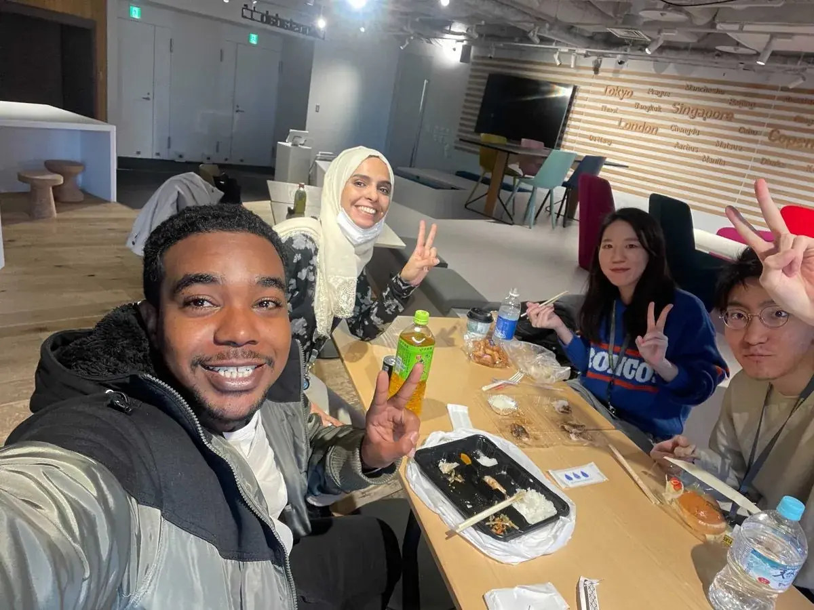
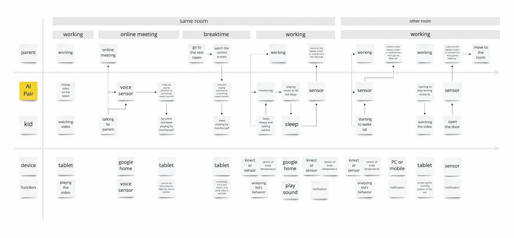
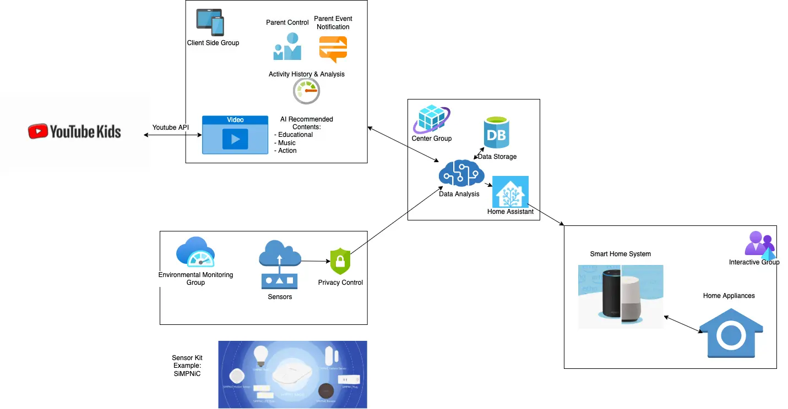
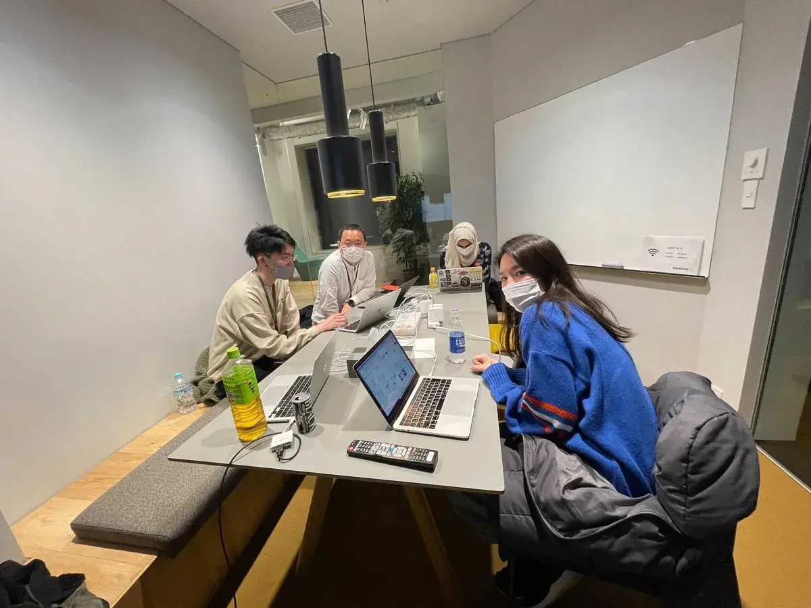

import { Image } from 'astro:assets'
import sdg_icon_03 from './sdg_icon_03.webp'
import sdg_icon_04 from './sdg_icon_04.webp'
import sdg_icon_05 from './sdg_icon_05.webp'

先日12月10日（金）から12日（日）の3日間で、「Monstarhacks2021」と題して、モンスターラボグループ全体で参加できるグローバルなハッカソンを行いました。
海外拠点の拠点内でハッカソンを行うことはありましたが、グローバルの規模で行うことは初めての試みでした。

## ハッカソンとは
ハッカソンとは、定められた短期間の間に異なるスキルを持った人々が数人（3~5人）でチームを組み共同でプロジェクトを行う、ソーシャルかつイノベーションに焦点を当てたイベントです。

多くの場合決められたテーマがあり、そのテーマに沿って自分たちのアイデアを出しプロトタイプを作るために作業をします。

知り合い同士で参加することもありますが、イベントで初対面の人同士でチームを組んで、得意分野を活かしながらチームワークを発揮して成果物を作ることもまた面白みの一つであります。

## Monstarhacks
### 今回のテーマ
今回のMonstarhacksでは**SDGs**に焦点を置き、テクノロジーを使って定められたゴールに対してアプローチを創出することがテーマとなりました。

#### SDGsとは
> 持続可能な開発目標（SDGs：Sustainable Development Goals）とは、2001年に策定されたミレニアム開発目標（MDGs）の後継として、2015年9月の国連サミットで加盟国の全会一致で採択された「持続可能な開発のための2030アジェンダ」に記載された、2030年までに持続可能でよりよい世界を目指す国際目標です。17のゴール・169のターゲットから構成され、地球上の「誰一人取り残さない（leave no one behind）」ことを誓っています。SDGsは発展途上国のみならず、先進国自身が取り組むユニバーサル（普遍的）なものであり、日本としても積極的に取り組んでいます。

*引用元: [外務省](https://www.mofa.go.jp/mofaj/gaiko/oda/sdgs/about/index.html)*

このSDGsによって定められた17のゴールのうち下記の3つに絞って選択し、いずれかの解決を狙うアイデア・プロダクトを作り出すことがトピックとなりました。
- ゴール3: あらゆる年齢のすべての人々の健康的な生活を確保し、福祉を促進する
- ゴール4: すべての人々への、包摂的かつ公正な質の高い教育を提供し、生涯学習の機会を促進する
- ゴール5: ジェンダー平等を達成し、すべての女性及び女児の能力強化を行う

*引用元: [ゴール](https://gooddo.jp/magazine/sdgs_2030/)*

  <Image src={sdg_icon_03} alt="" style='display:inline;margin:30px 15px;' />
  <Image src={sdg_icon_04} alt="" style='display:inline;margin:30px 15px;' />
  <Image src={sdg_icon_05} alt="" style='display:inline;margin:30px 15px;' />

*引用元: [国際連合広報センター - SDGsのアイコン](https://www.unic.or.jp/activities/economic_social_development/sustainable_development/2030agenda/sdgs_logo/sdgs_icon/)*

### 開催期間
冒頭にも述べましたように、12月10日（金）から12月12日（日）3日間で行われました。  
開催範囲がグローバルという単位ですので、一斉スタートというわけではなく、それぞれの国の生活時間として3日間が使える形です。

今回は金曜日の平日からでしたので、もちろん参加者はそれぞれクライアントのプロジェクトに参画しているのでそちらが優先ですが、プロジェクトが許す範囲で業務時間内に参加することが会社として許されています。

また、プライベートの都合などで期間内すべて参加ができなくてもイベントの参加自体は可能で、気軽に参加することができました。

### 参加者やチーム編成
参加者は世界中のモンスターラボグループの社員で、エンジニアやデザイナーをはじめ、プロジェクトマネージャーやビジネスアナリストなどいろいろな役職のメンバーが参加でき、普段のプロジェクトワークでは一緒に仕事をする機会が少ない人たちとチームを組むことができます。

また、違う国のメンバー同士でチームを組む多国籍チームもあったようです。

1チームが3〜5名で、APAC圏から12チーム、EMEA圏から3チームが参加し、総勢15のチームが参加しました。

### 成果物の提出方法
成果物として下記を提出します。
- 簡単に問題提起と解決策が記された文書
- 期間内に作成された成果物（コード、デザインなど）
- 5分以内のデモまたはプレゼンテーションビデオ

フォーマットは特に決まっておらず、制作物の形式はフリーです。  
もちろんアイデアを説明した文章よりかは、プロトタイプやデザインモックのようなアイデアを具体的にアウトプットしたものが期待されますし、評価も得やすくなります。

### 審査
#### 審査員
審査員はアメリカ、EMEA、APACのCTOなど世界各地の拠点の重役6名が審査します。

#### 審査基準
今回審査にあたって、以下のような基準で審査が行われました。

- 新しいイノベーティブなアイデアであるか、少なくとも以前からある問題に新しいアプローチをとっているか
- 人々が必要としているものであり、実際に使うようなものであるか
- ハックを通してメンバー自身が成長する要素があったか
- 設計がうまくされているか
- ユーザーエクスペリエンスがスムーズか
- テーマに沿っているか
- プロジェクト自体がテーマを理解し、表現できているものか
- 採用した技術が印象的か
- 現時点で使用するうえで障壁が高くないか

## 参加レポート
今回は東京オフィスからは3チームが出場しました。

### メンバー
- Tagy Aldeen: Software Engineer
- Sara Alafifi: Assistant PM
- 森 未央子: UI/UX Designer
- 王 東宇: Frontend Engineer
- 齋藤 広貴: Frontend Engineer

### テーマの選定
昨年から新型コロナウイルスの感染拡大により、在宅ワークを推奨する企業が増えました。

そんな中、子どもがいるご家庭では仕事をしながら子どもの面倒を見なくてはならないということも多いのではないかと思います。  
子どもが走り回ったり、仕事中に話しかけてきたりと、仕事をする集中力が損なわれてしまいます。  
と入っても放置するわけにもいかず、危険なことをしてしまっているかもしれないので見張っていないといけません。

そんな子どもの世話は、イクメンの増加はあるものの、奥さんが主に見ているという割合は多いのではないでしょうか？

上記のような考えから私たちのチームは、下記に詳細を記しますが、
- ゴール4: すべての人々への、包摂的かつ公正な質の高い教育を提供し、生涯学習の機会を促進する
- ゴール5: ジェンダー平等を達成し、すべての女性及び女児の能力強化を行う

2つのテーマにフォーカスし、「**AIによるバーチャルシッター**」を作れないか考えました。

### 具体的なアイデア
このアイデアは3~6歳の子どもで、ある程度言葉が理解できたり自分でなにかできるようになった子をターゲットとしました。  
Google HomeやAmazon Alexaを使用して、子どもとの対話とモニタリングの2つの機能をもたせようと考えました。

#### 子どもとの対話
- 家事のお手伝いをリマインド
- 歯みがきや寝るタイミングのお知らせ
- 子どもがその場を離れようとしたときに留まらせるか、実行中のものを停止する
- 教育的・対話的な活動を提供
- 子どもに呼びかける声は、親の声をベースにする

#### モニタリング
- センサーとIoTを利用して、子ども居場所や状態、室温や湿度を確認・調整する
- デバイスや活動（睡眠時間・歯みがき・モニタリング履歴）を親が確認できる
- 子どもの動き、行動の分析結果を親が知ることができる
- アクセスフィルタリングが必要なコンテンツにアクセスを検知して親に通知する

#### プロダクト設計
このアイデアのポイントは、親は子どもとAIをつなぐ仲介役です。  
AIに全面的に依存するわけではなく、親と子どもの人間的な交流を維持する補完機能としての役割を担ってもらおうというアイデアです。

今回は子どもとの対話部分を[Google Homeスピーカー](https://store.google.com/jp/magazine/compare_speakers?hl=ja)を使用し、子どもの行動などのデータのインプットは[SiMPNiC](https://simpnic.com/)などの比較的に安価で入手可能なセンサーを使用します。

親が仕事に集中するために、子どもが何かに興味を惹かれている状態を作り出す必要があると考え、子どもにはタブレットなどでYouTube Kidsを見て、子どもに教育や行動を促そうと考えました。  
YouTube KidsのAPIがあるので、YouTube Kidsの動画の中からAIがレコメンドするものを子どもに見てもらいます。

親が各センサーなどの情報を確認するために情報を集約する画面が必要だと思います。  
その機能は[Home Assistant](https://www.home-assistant.io/)を使用して、子どもの様子や動画の視聴履歴などを確認できるようにしました。  
この画面に、子どもの行動を分析して、結果のフィードバックを親が確認できる機能もこちらで確認できるようにしようと考えました。

このアイデアは、選定したテーマについて、下記のターゲットへのアプローチになると考えました。

- ゴール4: すべての人々への、包摂的かつ公正な質の高い教育を提供し、生涯学習の機会を促進する
  - 4.2 2030年までに、すべての子どもが男女の区別なく、質の高い乳幼児の発達支援、ケアおよび就学前教育にアクセスすることにより、初等教育を受ける準備が整うようにする。
- ゴール5: ジェンダー平等を達成し、すべての女性及び女児の能力強化を行う
  - 5.4 公共のサービス、インフラ、および社会保障政策の提供、ならびに各国の状況に応じた世帯・家族内における責任分担を通じて、無報酬の育児・介護や家事労働を認識・評価する。
    - 指標5.4.1 無償の家事・ケア労働に費やす時間の割合（性別、年齢、場所別）

*引用元: [ゴール4](https://gooddo.jp/magazine/sdgs_2030/quality_education_sdgs/), [ゴール5](https://gooddo.jp/magazine/sdgs_2030/gender_equality_sdgs/), [指標](https://www.mofa.go.jp/mofaj/gaiko/oda/sdgs/statistics/data/05/Indicator5.4.1(metadata)_ja.pdf)*

### 3日間の流れ
#### 金曜日
Slackでチームのチャンネルを作り挨拶をしました。  
平日のため、プロジェクトワークがある人はそちらを優先し、余裕のある人同士でディスカッションして、テーマの選定とアイデアの方向性の検討をしました。

私は、英語が苦手のためこの時点でコミュニケーションに不安を覚えています...  
Slackで進むディスカッションをDeepLで翻訳して、決まる方向性を追いかけました。  

#### 土曜日
メンバーは午後から作業ができる状態だったため、午後から会社に集まって作業することにしました。  
全員集まるのを待ちながら早く来た人と一緒にランチをしました。（上記メンバー照会の写真）

その後作業をはじめ、まずは前日決めたアイデアの詳細を詰めていく作業です。  
はじめはメタバースなど、近未来的なアイデアも出ましたが、コストがかかりすぎたり実現性が低いということで、よりリアリティのある案に落ち着きました。  
Miroなどを使ってユーザーストーリーマッピングを作成、アイデアのドキュメントの作成、プロダクトのアーキテクチャ検討を行ったところで解散としました。

#### 日曜日
最終日です。

前日にアイデアの詳細を詰めたので、決めた内容をもとにUIデザインをFigmaに落とす作業と、アーキテクチャの実現検証をして、プレゼンの準備をしました。  
今回私たちのチームでは、時間の都合上実際にプロダクトの作成までは行わず、アイデアの主要部分のUIデザインとプレゼンのビデオを提出し終了しました。

## まとめ
モンスターラボでは初めてグローバル規模でのハッカソンを実施しました。  
今回はSDGsをテーマにして、達成へのアプローチを考えることにチャレンジしました。

私自身、ハッカソン自体今回始めて参加したのですが、テーマに向けたアイデア出しから、アイデアを形にするところまでを短期間で目指すスピード感が非常に面白いと思いました。  
また、今回入ったチームでは基本的に英語でコミュニケーションがとられていたので開始時は少し心配しましたが、日本拠点に籍をおくメンバーなので、私が理解しきれない部分は「わからないです！」と言えばすぐサポートしてくれるので、すぐに安心して取り組むことができました。

作業以外にも、会社に集まりランチをしたりして、普段のプロジェクトワークでは交わる機会少ない人達との交流ができたり、またチームメンバーが外国人の方であれば、違う文化の話ができたりしてとても楽しい時間でした。

こういった経験ができるのは、世界各地に拠点をおき、日本のオフィスにも外国出身のメンバーが多数在籍しているモンスターラボだからこそできることだと感じました。

来年以降も継続して、モンスターラボを代表する恒例行事にしていけるようにしたいと思います。
