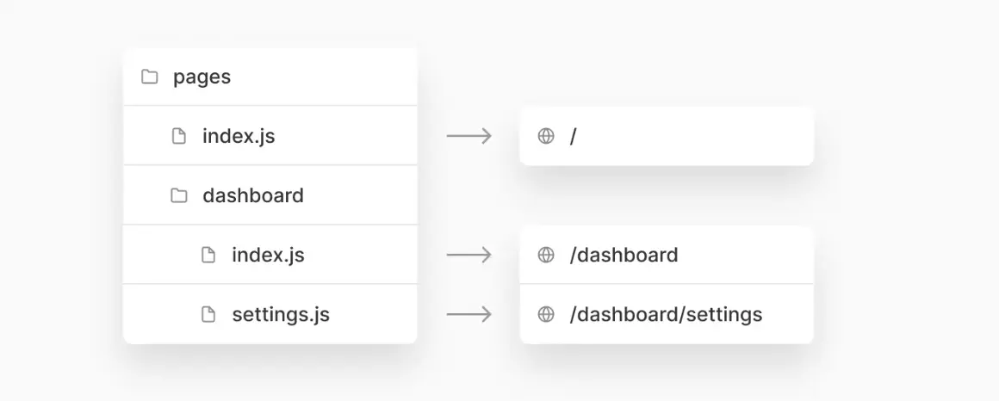
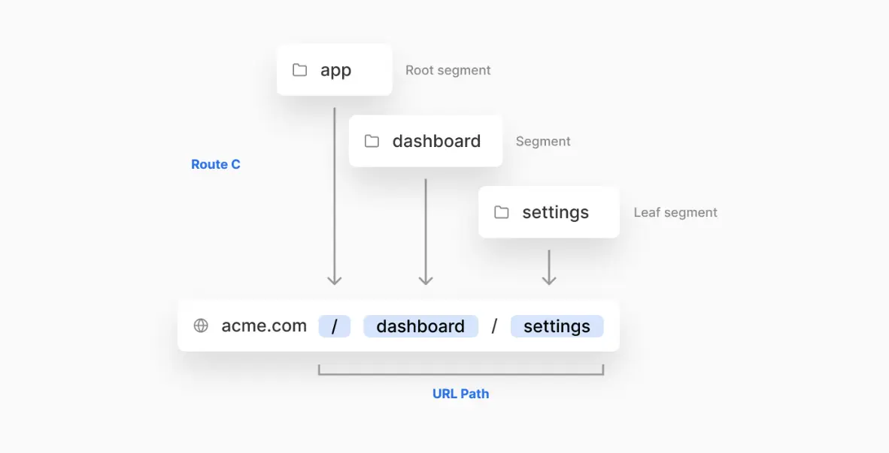
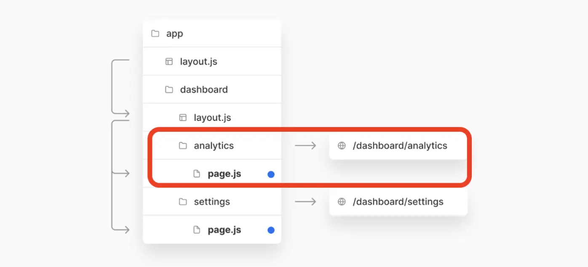
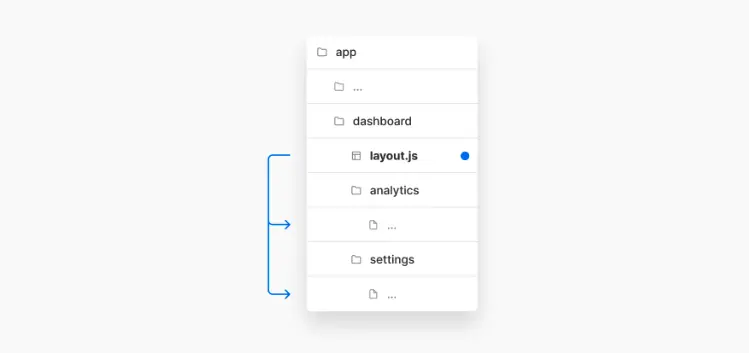

10 月 25 日に第 6 回 Next.js カンファレンスが開催され、Rust ベースのバンドラーである[Turbopack](https://vercel.com/blog/turbopack)、Server component を実装した **app** ディレクトリ、既存コンポーネントのアップデート等が紹介されました！

[**Next.js conference**](https://nextjs.org/conf)

今回の大型アップデートの一つである **app** ディレクトリは数年前から議論がなされてきた**Layout RFC**の一つであり、
**Layout RFC** には **app** ディレクトリやそれに合わせて今回のアップデートで紹介された機能が含まれております。
本記事ではそのいくつかを紹介いたします。

**app** ディレクトリは beta 版ではありますが **Layout RFC** で議論されてきた内容が反映されており、
割と大きな変更であるため本記事を見てまず概要を抑えていただければと思います。

## NOTE

- この記事は Next.js を触ったことがある方向けです。
- **Layout RFC** の中で特に大きく変更のあるものについて書いてます、全てではありません。

# そもそも Layout RFC って？

Next.js の共同開発者である Tim Nuekens 氏により 2016 年から[Github discussion](https://github.com/vercel/next.js/discussions/37136)で話し合いがされている RFC(Request for comments)です。

2022 年 5 月に[こちらで](https://nextjs.org/blog/layouts-rfc)概要が発表されています。

それでは早速中身を見てみましょう！

## ルーティング

新たなルートとして **app**ディレクトリが追加されました。

大きな違いとして、従来の page ディレクトリでは、**ファイル名からパスが生成**されていましたが、**app** ディレクトリでは**ディレクトリ名をもとにパスが生成される**ようになります。

### **従来パターン**

ルート：**pages**

pages/index.js → `/`

pages/dashboard/**index.js** → `/dashboard`

pages/dashboard/**settings.js** → `/dashboard/settings`



### **app ディレクトリパターン**

ルート：**app**

app/page.js → `/`

app/**dashboard** → `/dashboard`

app/dashboard/**settings** → `/dashboard/settings`



この通り、フォルダ内がそのままルートパスになります。

かなり大きな変更ではありますが、**app** ディレクトリは pages ディレクトリと**並行して利用できる**ため、今回の RFC が実装されたとしても、従来の方法で使用されている pages ディレクトリには大きく影響がないと思われます。

## 命名規約に沿ったファイルの作成

上の **app**ディレクトリの場合に疑問に思った方もいらっしゃると思いますが、ディレクトリ名でパスが決まるのであれば**ファイル名はどうしたら良いのでしょうか**？

RFC によると各ディレクトリ下のファイルはその名前によって機能が定義されてます。

RFC では以下のファイル名が定義の対象とされてます。

- **`page.js`**
  - ディレクトリパスが呼ばれた際に読み込まれるページコンポーネント
- **`layout.js`**
  - ディレクトリパスが呼ばれた際にディレクトリ下で有効なレイアウトコンポーネント
- **`loading.js`**
  - ディレクトリパスが呼ばれた際のフォールバック用コンポーネント
- **`error.js`**
  - エラーが返された場合に遷移されるコンポーネント

`page.js`や`layout.js`についてもう少し詳しく見てみましょう。

## `page.js`

`page.js` は従来の Next.js において各ページディレクトリで定義されていた`index.js` に近い分類ですが、大きく違う点は page.js では**React18 で新たに実装された、server component がデフォルトで適応される点です。**（下記で紹介しています。）

### 従来パターン


### RFC パターン



## `layout.js`

layout.js も元々存在している layout コンポーネントですが、**今回の実装でネスト化されたルート内のみにレイアウトを適応することが可能となりました。**

### 従来のレイアウトコンポーネント


### ネスト化されたレイアウトコンポーネント



## React server component がデフォルトで実装

**app** ディレクトリ下で使用される`page.js` では React18 で新たに実装された server component がデフォルトで適応されます。

これにより`page.js` で定義されたコンポーネントはサーバー側で server component としてレンダーされるようになります。

React server component については[こちら](https://zenn.dev/g4rds/articles/287c53498d17a1)の記事で詳しく説明されています。（日本語）

[React 公式サイト](https://reactjs.org/blog/2020/12/21/data-fetching-with-react-server-components.html)でデモも紹介されています。（英語)

React18 では`.server.js` , `.client.js` と拡張子によって各機能を定義するようにしており、Next.js では`page.js`に `.client` を追加することで client component として使用可能です。

</br>

`page.js` → server component (e.g. dashboard/**page.js**)

`page.client.js` → client component(e.g. dashboard/**page.client.js**)

</br>

ちなみに、**従来の page ディレクト下では server component を使用することはできません。**

server component を使用したい場合は新たに **app**ディレクトリを作成する必要があります。

[https://nextjs.org/blog/layouts-rfc#server-components-as-the-default](https://nextjs.org/blog/layouts-rfc#server-components-as-the-default)

## Data fetching

従来の`pages` ディレクト下ではページ単体で制限されていた Data fetching が今回のアップデートで`layout.js` でも呼び出しが可能となりました。

以下のようなフォルダ構成の場合、`blog/layout.js` でカテゴリーを Fetch し、サイドバーとして Render させ、`blog/[slug]/page.js` で blog データを Fetch、Render するような形が可能となります。

```
app
|_blog
 |_layout.js // カテゴリーデータをフェッチし、サイドバーがレンダーされる
 |_[slug]
  |_page.js; // ブログデータをフェッチし,コンテンツがレンダーされる
```

```jsx
// app/blog/layout.js
export async function getStaticProps(){
  const categories = await getCategoriesFromCMS();

  return {
    props: { categories };
  }
}

export default function BlogLayout({ categories, children }){
  return (
    <>
      <BlogSidebar categories={categories} />
      {children}
    </>
  )
}
```

```jsx
// app/blog/[slug]/page.js
export async function getStaticPaths() {
  const posts = await getPostSlugsFromCMS();

  return {
    paths: posts.map(post => ({
      params: { slug: post.slug },
    })),
  };
}

export async function getStaticProps({ params }) {
  const post = await getPostFromCMS(params.slug);

  return {
    props: { post },
  };
}

export default function BlogPostPage({ post }){
  return <Post post={post>
}
```

また、上記の場合`app/blog/[slug]`全体のルートが React server component としてビルド時に静的に生成され、クライアント側では server component で生成された静的なスナップショットを読み込むだけとなるためクライアント側で実行される JavaScript の量が更に少なくなりより早くページがインタラクティブな状態となります。

## 最後に

以上大まかではありますが、今回のアップデートで紹介された **Layout RFC** の機能をいくつか紹介させていただきました。

**Layout RFC** では上記以外にも[ルートのグループ化](https://nextjs.org/blog/layouts-rfc#advanced-routing-patterns)や[エッジケースに対応したルートパターン](https://nextjs.org/blog/layouts-rfc#advanced-routing-patterns)など紹介されていますので一読されることをお勧めします。

今回紹介させていただいた機能は NextJS13 のアップデートの一部であり、
Turbopack 等の紹介は割愛しておりますのでアップデートの詳細等は下記公式サイトからご確認ください。

# 参考

NextJS13:

[https://nextjs.org/blog/next-13](https://nextjs.org/blog/next-13)

NextJS13 へアップグレードしたい方

[Upgrade guide](https://nextjs.org/docs/upgrading)

# 出典

Photo source:

[NextJS Layout RFC](https://nextjs.org/blog/layouts-rfc)
