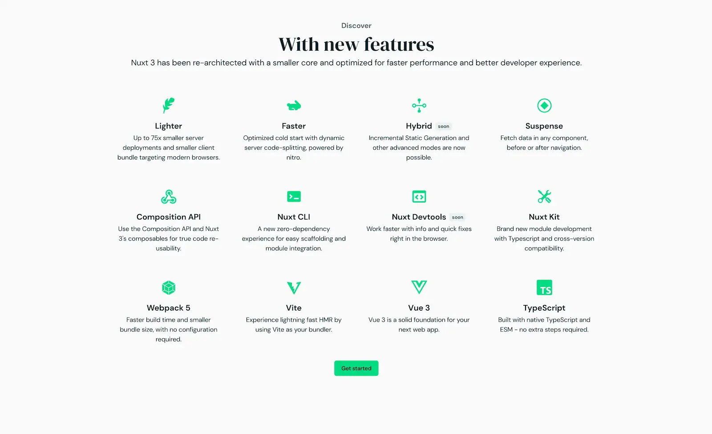

Vue.js のフレームワークである **[Nuxt.js の v3](https://v3.nuxtjs.org/docs/usage/data-fetching)** が、2021/10/12 にパブリックベータ版に移行しました 🎉  
Monstarlab でのプロジェクトの多くは React.js で開発されることが多いですが、個人的には一番初めに触れた Web Frontend JavaScript フレームワークが Vue.js だったこともあり、Nuxt.js も v1 リリース直後から使っていました。  
そんな思い入れがあるフレームワークで、社内でも Vue/Nuxt が好きと公言していますが、最近は触れることがあまりなくなってしまい・・・いい機会なので、今回は Nuxt3 について変更点や改善点をまとめようと思います。

## Nuxt.js について

このブログを見ているほとんどの方はすでに Nuxt.js について知識があるかもしれませんが、まずは Nuxt.js について簡単に説明します。

Nuxt.js は、JavaScript フレームワークである Vue.js の Web アプリケーションフレームワークで、Vercel が開発した **[Next.js](https://nextjs.org/)** に影響を受けて開発されました。基本的には Vue.js で開発するために必要なエコシステムや開発に必要な規約を簡単に導入できることに加え、SSR/SSG/SPA それぞれのレンダリングモードで Build 可能であり、個人的には Vue.js で開発するのであれば Nuxt.js を使用することを一番に考えるくらい良くできたフレームワークだと思います。

一般的に大規模開発に Vue.js は向かないよね・・・という話を Web Frontend 界隈ではよく聞きますが Nuxt.js の規約をもとに開発することで、規模が大きいプロジェクトでも十分使用できると思っています。大規模の場合 Vue.js だとパフォーマンスが・・・などの記事も見ますが、フレームワークによるパフォーマンスの優劣を感じたことはそこまで多くありません。（あくまで個人的見解です）  
React.js も Vue.js も開発がどんどん進み、より速くより便利になっていますので、どちらかがより良いということはないかもしれません。Monstarlab では React が多く使われていると冒頭で記載しましたが、これは TypeScript が Web frontend 開発においてスタンダードと言って良い状況の中で、Vue.js＆TypeScript の課題が多くあったことが一番の理由なのかなと感じます。

今回の Nuxt3(Vue3) は TypeScript のネイティブサポートもされており、今後は今までよりも Nuxt.js を選択する可能性があるのでは？と期待しています。

## Nuxt3 の主な新機能/変更点

Nuxt2 → Nuxt3 は大部分が新たに設計、開発されたようで多くの新機能や変更点があります。リポジトリも新しく作られていますね。  
_Nuxt2 https://github.com/nuxt/nuxt.js_  
_Nuxt3 https://github.com/nuxt/framework_

主な新機能は *https://v3.nuxtjs.org/* に記載されています。


上記以外にも細かな部分含め多くの変更があるようですが、この中でも個人的に大きな変更点は以下です。

- Vue3 のサポート
- TypeScript のネイティブサポート
- Nitro Engine

### Vue3 のサポート

2021 年 9 月にリリースされた **[Vue3](https://v3.vuejs.org/)** を採用しており、CompositionAPI や Teleport、 `<script setup>`、Vite など、Vue3 で新しく追加された機能をすでにサポートしています。ただしその代わり Vue2 はサポートしていないため、Nuxt2(Vue2)からの移行には **[Nuxt Bridge](https://v3.nuxtjs.org/getting-started/bridge)** が用意されています。一部の機能は使えませんが Nuxt3 で追加された多くの機能は Nuxt Bridge を使用することで体験できそうです。


*https://v3.nuxtjs.org/getting-started/introduction#comparison*

まずは既存の Nuxt2 プロジェクトに Nuxt Bridge を適用することが、Nuxt3 によるパフォーマンスの改善を感じることができる一番の方法かもしれません。

### TypeScript のネイティブサポート

Nuxt3 も Vue3 も JavaScript から TypeScript へ一新され、Composition API への変更もあり TypeScript の恩恵をストレスなく受けることができるようになりました。個人的にはこれが一番よかった、というかやっと対応した・・・という気持ちです。最近 React ばかり使っていた中で、やっとこれで Nuxt も本格的に使えるかも！と期待しています。（まだパブリックベータなのでもう少し時間はかかるかもしれません）

### Nitro Engine

おそらくこの新機能が一番話題になっていたように思います。Nuxt3 のサイトでもトップページで大きく取り上げていました。軽量で高速に動作し、Nuxt2 ではなかった機能も新たに追加されています。まだローカルでいくつかの機能を確認したレベルですが、動作については Nuxt2 よりも高速に Server が立ち上がりました。開発ではローカル環境でのパフォーマンスも重要になりますので、よりストレスを感じなくなって効率が上がるのではないかと思います。（Vite や Webpack5 への移行も影響していると思います）  
Nitro Engine については私もまだ理解できてない部分が多いのですが、主な機能を 2 つ紹介します。

#### クロスプラットフォームのサポート

いわゆる SSR(Server Side Rendering)をするために、Nuxt2 では Node.js が必要でしたが、Nitro Engine の採用により複数の環境での実行が可能になりました。この機能はかなり驚きで、Web Frontend の開発が今までとは違う選択肢を持つ可能性があると感じました。情報がまだ少なく完璧には理解できていないので、間違った部分もあるかもしれませんがご了承ください 😔  
Document 内では以下のような環境が記載されていました。

- Node.js
- Browser
- service-workers
- serverless

具体的には Nuxt3 の **[Docs](https://v3.nuxtjs.org/docs/usage/data-fetching)** の Deployment にいくつかのサービスでのデプロイ方法について説明されています。

- Azure (Azure Functions)
- Cloudflare Workers
- Firebase Hosting
- Netlify
- PM2
- Vercel
- Presets
  - Node.js server (default)
  - Node.js function
  - Lambda function
  - Service worker

設定方法はとても簡単で、`nuxt.config.ts` に Nitro Engin のターゲットを設定するだけのようです。

```javascript
export default {
  nitro: {
    preset: 'worker' // service-worker
  }
}
```

ただし、ローカル環境で Build が上手く行かず確認することはできませんでした 😞

今までは Nuxt をデプロイするにあたって、Node.js を使用できるサーバーで SSR、CloudFront+S3 や Netlify などで Hosting する場合は SSG で静的ファイルを生成した上でリリース、という選択肢をまず考えていました。  
今回の変更により、Node.js だけでなく CDN の Edge server や Netlify のような Hosting サービス、ブラウザの Service worker でサーバーが動作するようです。上記のような様々な環境でサーバーを起動できるということは、今までの選択肢だけでなく Serverless + JAMstack のような新たな選択肢をより簡単に使用できる事になりそうです。  
Github には Nitro Engin のデモリポジトリもあり、いくつかのサービスに Nitro Engin を使用した Nuxt でもサイトがデプロイされていました。

Github: _[nuxt/nitro-demo](https://github.com/nuxt/nitro-demo)_  
Nitro Project Demo: _[Netlify](https://nitro-demo.netlify.app/)_

Vercel, Cloudflare など他のデモサイトもありましたが、全て SSR が上手く動いているわけではなく中には 404 のページもあったので、現時点ではなんとも言えませんが・・・Netlify で SSR ができていることはすごいですね。

#### API ルートのサポート

Nuxt プロジェクトの中で API エンドポイントを作成できるようになりました。この機能は Next.js などではすでに実装されているので馴染みがある方もいるかも知れません。  
`server/api` ディレクトリに `xxx.ts|js` ファイルを作成すると、クライアント側から呼び出すことができるエンドポイントとして提供され、`/api/xxx` という形で呼び出せます。また、Nuxt3 で追加された `useFetch()` `useAsyncData()` でエンドポイントを呼び出した場合、自動的に type ファイルが生成されレスポンスに対して型が定義されます。  
例えば以下のようなエンドポイントを作成し、

```typescript
// server/api/test.ts

import type { IncomingMessage, ServerResponse } from 'http'

let count = 0

export default async (req: IncomingMessage, res: ServerResponse) => {
  return {
    Hello: "Monstarlab",
    count: ++counter,
  }
}
```

`yarn dev` もしくは `yarn build` を実行した場合、`.nuxt` ディレクトリに以下の定義が自動的に作成されます。

```typescript
// .nuxt/nitro.d.ts

// Generated by nitro
declare module '@nuxt/nitro' {
  type Awaited<T> = T extends PromiseLike<infer U> ? Awaited<U> : T
  interface InternalApi {
    '/api/test': Awaited<ReturnType<typeof import('../server/api/test').default>>
  }
}
export {}
```

結果、以下のように Pick 型で定義されました。

```typescript
const response: Ref<Pick<{
    Hello: string;
    count: number;
}, "Hello" | "count">>
```

もちろん、外部の API を `server/api/xxx` で呼び出した場合には any 型になってしまうので型定義が必要ですが、開発する際にかなり便利な機能ではないでしょうか。

## 最後に

他にもディレクトリの構造が変更されたり、CLI が新しくなったりと様々な変更点がありますが、私が感じた大きな変更点としては以上となります。（ちなみに IE はサポートしていません 😇）  
まだベータ版ということで、すぐにプロジェクトで使用できるとは思っていませんが、今後の Web Frontend 開発の選択肢の一つとして十分に期待できるフレームワークだと感じる事ができ、Nuxt(Vue)ファンとしてはとても嬉しいです 🥳

_Article Photo by [NuxtJS](https://v3.nuxtjs.org/)_
