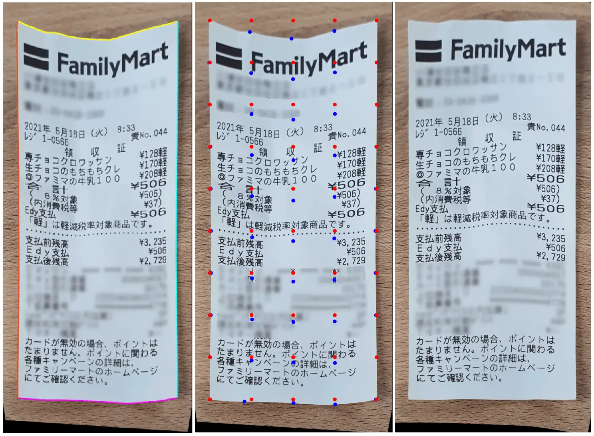
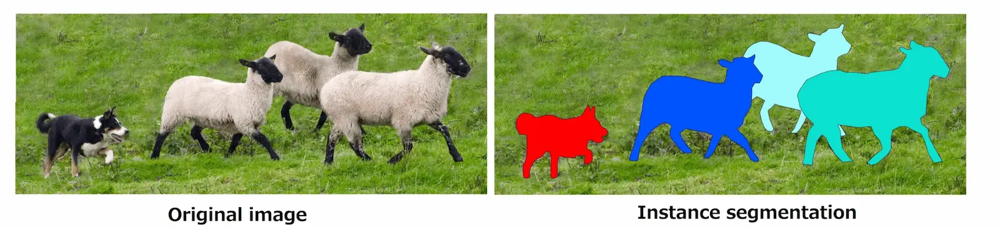

この技術ブログでは、コンピュータビジョンとディープラーニングによるレシートの認識と認識結果の改善方法を紹介します。
さらに、コンピュータビジョンを使って半自動で学習データを作成した様子も紹介します。
以下のに興味がある方は、ぜひご覧ください。
 - ディープラーニング - インスタンスのセグメンテーション
 - コンピュータビジョン - 輪郭形成、アフィン変換、ホモグラフィー変換、薄板スプライン変換
 - 半自動でのデータ作成

## これは何なの？

AI関連技術の使い勝手や利便性の向上により、私たちの日常生活の中でAIの普及が着実に進んでいます。
レシートを認識してその内容を理解することは、人事の請求書チェックや会計、文書の解析・分析など様々な用途があります。
レシート認識を民主化するためには、スマートフォンの写真を使って行うのが簡単ですがスマートフォンで撮影した写真は、スキャナーを使用したものよりも、ノイズ（画像の背景）が多いため、正確なレシート認識が難しくなります。

レシート認識の目的を達成するために、2つのアプローチが考えられます。
- コンピュータビジョン：入力画像に様々な変換を施して、画像内のレシートの位置を取得し、その観測を強化する。
- ディープラーニング：学習されたモデルを用いて画像内のレシートの位置を検索し、その観測を強化します。

コンピュータビジョンはより効率的に、より少ないコード行で問題を解決できるため、ディープラーニングは時として過剰な機能となります。
しかし、コンピュータビジョンがすべての状況で機能するわけではなく、ディープラーニングを使用することでレシートの認識をより強固にすることができます。このブログでは、両方のアプローチを調査してその結果を確認し、パフォーマンスの高いレシート認識を実現する方法についてご紹介します。

## 手順

レシート認識とその観測の強化の異なるステップは、次のとおりです（専門用語は次項で説明します）:

1. 画像内のレシートの輪郭を見つける。
2. アフィン変換を適用して、レシートを垂直方向に回転させる。
3. レシートの角を取得します。
4. 角とバウンディングボックスの角を使ってホモグラフィー変換を適用します。
5. レシートの輪郭と対応するバウンディングボックスの間のグリッドマッピングを計算します。
6. thin plate spline transformationを適用して、レシートの歪みを補正します。

上述した操作のうち、ステップ1が最も重要であり、この輪郭形成操作が後続の操作の成功を左右します。 したがって、ステップ1はコンピュータビジョンとディープラーニングの両方を使用して実現し、次のステップはコンピュータビジョンのみを使用して実現します。

## コンピュータビジョンの運用

上記のセクションでは、受信機の理解と向上を実現するためのさまざまなステップを示しました。このセクションでは、各ステップの技術的な説明を提案します。

輪郭処理は、エッジを持つ形状の周りの境界を検出する操作です。輪郭処理アルゴリズムは、周囲のピクセル値の勾配を計算して、閉じた形状を検出することができます。
これは、コンピュータビジョンとディープラーニングの両方でよく知られている問題です。
レシートの輪郭と、それを囲むバウンディングボックスを用いて、アフィン変換によりレシートを垂直方向に回転させます。
バウンディングボックスとは、ある物体（ここではレシート）を囲む、縦と横の辺を持つ最小の長方形のことです。
コンピュータビジョンにおけるアフィン変換とは、画像の移動や回転などの線形変換の集合を指します。

Figure: 図1. 元画像、輪郭線とバウンディングボックスの推定、回転したレシート

平面ホモグラフィー演算とも呼ばれるホモグラフィー演算は、ある画像の点をマッピングして、その画像を別の視点から観測できるようにする変換です。
ここでは、画像を平行移動させ、ヨー／ピッチ／ロールの角度を変更して、上から観察できるようにしています。

Figure: 図2. 元の画像とホモグラフィーを用いた観測結果の修正

thin plate spline transformationとは、2組の格子から空間的なマッピングを行い、その格子内の値を補間することで、画像の歪みを補正することができる演算である。

Figure: 図3. 輪郭解析、ソース（青点）とデスティネーション（赤点）のグリッド検索、レシートの歪みをなくすための薄板スプライン変換

上の画像では、コンピュータビジョンはチケットの認識とその観察の強化に十分な効果があると思われます。
しかし、輪郭処理は、画像の背景やレシートの状態（くしゃくしゃのレシート）、画像の明るい部分などに大きく左右され、うまくいかないことがあります。
ここでは、輪郭処理がうまくいかず、失敗に終わった例を紹介します。

Figure: 図4. 輪郭処理の失敗（緑）とバウンディングボックスの推定（赤）

この問題を解決するために、コンピュータビジョンができなかった複雑な認識タスクを処理できるディープラーニングが検討されています。

## ディープラーニングの運用
### インスタンスの分割

ディープラーニングは、人工知能のサブセットであり、入力データを層状のモデルにマッピングして、分類や回帰問題として変数を推定することを目的としています。
入力データには、画像、テキスト、表データ、時系列信号などの形式があります。
出力データは、セグメンテーションマスク、バイナリ変数、ベクトルなど、任意の形をとることができます。

インスタンスセグメンテーションは、ディープラーニングの一つで、画像に写っている興味のある個別のオブジェクトを検出することを目的としています。
同じクラスの複数のオブジェクトを個別のインスタンスとして扱い、インスタンスごとに異なるピクセル単位のセグメンテーションマスクを生成します。

今回のケースでは、1枚の画像に複数のレシートがある場合でも、レシートの輪郭として使用できるセグメンテーションマスクが得られるという利点があります。

Figure: 図5. インスタンス・セグメンテーションの概念

コンピュータビジョンとは異なり、ディープラーニングは学習するためのトレーニングデータが必要ですが、これについては次のセクションで説明します。

### データ作成の半自動

ディープラーニングモデルの学習に必要なデータ量は、実現を目指すタスクによって大きく異なります。レシートは単純な形状をしており、背景とのコントラストが強い場合が多いため、数百個のサンプルで良い結果が得られると考えられます。
しかし、レシートのセグメンテーションのためのオンラインデータセットは存在しないため、これらのデータを一から作る必要があります。
ゼロからのラベリングは、反復的で時間のかかる面倒な作業なので、ほとんどのAIエンジニアは他者に委ねたがります。

今回の例では、コンピュータビジョンを用いて画像中のレシートの輪郭を推定することができるので、セグメンテーションマスクの作成はこのアプローチに基づいて行われます。
コンピュータビジョンによる輪郭抽出がうまくいかない場合は、ポリゴンデータのラベリングソフトを使ってセグメンテーションマスクを編集します。
このように、学習データの作成には時間がかかりますが（データの品質を確認するためのレビュー）、半自動化することで、その負担を軽減することができます。

## ディープラーニングのコンタリング運用

インスタンス・セグメンテーション・モデルを学習した後、問題のあるレシート画像をテストしました。

Figure: 図6. 問題のある画像でのインスタンス・セグメンテーションの結果

コンピュータビジョンでは正しく輪郭抽出ができていませんでしたが、インスタンス・セグメンテーション・モデルをでは、正しくレシート・セグメンテーション・マスクを推定することができました。
輪郭処理が正しく行われたことで、以下のコンピュータビジョンステップが正常に適用されました。

## まとめ

このブログでは、スマートフォンで撮影した写真からレシートを認識するために、コンピュータビジョンとディープラーニングを組み合わせたり、別々に使用したりする方法を紹介しました。
コンピュータビジョンの長所であるわかりやすさと、ディープラーニングの短所である学習データの必要性を組み合わせて、強固なレシート認識ソリューションを実現しました。
レシートの認識以降は、コンピュータビジョンの手順を適用して、レシートの観察を強化しました。

我々のソリューションの精度とロバスト性を向上させるために、ディープラーニングアプローチでは以下のタスクを考慮しています。
- トレーニングデータセットにさらにデータを追加する。
- インスタンス・セグメンテーション・モデルのための様々なバックボーンのベンチマークを行う。
- コンピュータビジョンを用いてディープラーニングの結果を改良する。

_[図5. COCOデータセットの例](https://cocodataset.org/)_

_[PexelsのKarolinaGrabowskaの記事の写真](https://www.pexels.com/photo/person-using-a-computer-and-holding-a-credit-card-and-receipts-4968390/)_
