# レスポンシブウェブデザイン：手法とベストプラクティス

レスポンシブウェブデザインは、ウェブデザインと開発で頻繁に使用される用語です。しかし、それは具体的には何を意味するのでしょうか？このブログ投稿では、レスポンシブウェブデザインの多岐にわたる側面を、より掘り下げて紹介します。

## 定義

> 「レスポンシブ Web デザイン（RWD）とユーザーエクスペリエンス  
> 多数のデバイスをサポートするためにレスポンシブデザインのチームが作成するサイトは 1 つだが、ユーザビリティを確実なものにするには、全デバイスでのコンテンツやデザイン、パフォーマンスを考慮する必要がある。」  
> \- [Nielsen Norman Group](https://www.nngroup.com/articles/responsive-web-design-definition/)

この定義は画面サイズを強調していますが、より広い視点では、ウェブサイトがアクセスされるさまざまな環境を考慮しています：

> レスポンシブウェブデザインは、ウェブサイトが表示されるすべての異なる環境を考慮するアプローチです。

## 利点

現代のメトリクスに焦点を当てたウェブ開発では、レスポンシブウェブデザインがある意味で見落とされがちです。その複雑で解釈に余地があり、無数の可能な環境に対応する必要があるため、実装、テスト、計測が困難なことがあります。
しかしながら、各ユーザーが独自の環境を持っていることは明らかであり、良好なレスポンシブ性は肯定的な影響を与えます。
このガイドの各側面では、効果的な実装のための簡潔な紹介、手法、ガイドライン、および潜在的な落とし穴が取り上げられます。

## ディスプレイとウィンドウのパラメータ

レスポンシブウェブデザインに関する最も重要なパラメータは、ディスプレイとウィンドウのパラメータです。これには次のものが含まれます：

### 幅

幅はレスポンシブウェブデザインにおける主要な考慮事項です。以下のいくつかの重要な要素が関わります：

- デザイン：様々な幅のカテゴリーごとに異なるベースデザイン。
- ブレークポイント：画面幅に基づいて各デザインが適用されるポイントを定義します。
- 適応：これらのブレークポイントの間でデザインがどのように適応するかを指定します。例えば、375px のモバイルデザインが 768px のブレークポイントである場合、375px から 768px の間でこのデザインがどのように適応するかを定義することが重要です。

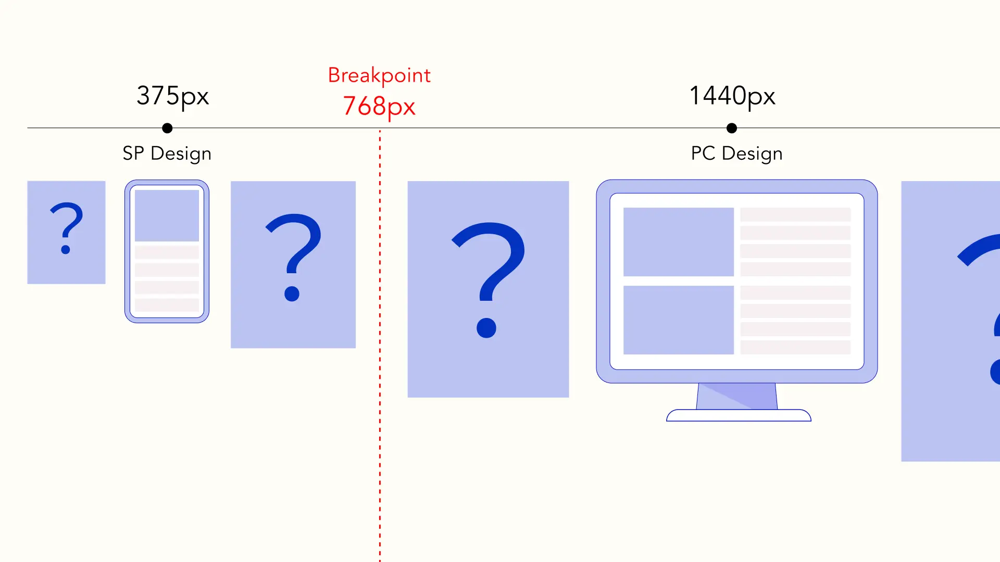
Figure: モバイルとデスクトップデザイン

#### グリッドレイアウト

これらの適応を処理する一つのアプローチは、ウェブページを効果的に構造化するために[グリッドレイアウト](https://m2.material.io/design/layout/responsive-layout-grid.html)を使用することです。

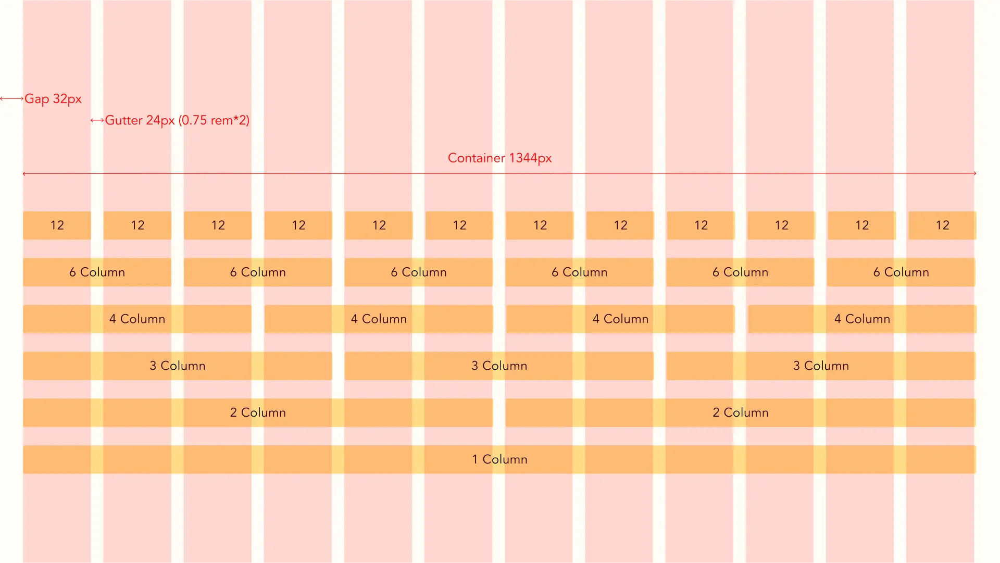
Figure: グリッドレイアウト

### 高さ

高さは、[アバブ ザ フォールド](https://www.nngroup.com/articles/scrolling-and-attention)（スクロールせずにユーザーが見るコンテンツ）に影響を与えます。Figma などのツールを使用する際、初期にユーザーがウェブサイトでどのような内容を見るかが常に明確ではありません。しかし、これはユーザーの維持にとって重要です。さらに、グラフィックデザインの観点からは、一部しか見えていない場合にページのバランスが変わることがあります。

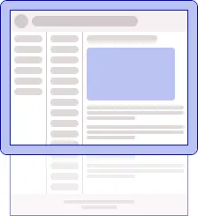
Figure: アバブ ザ フォールド

⚠ スマートフォンでは、ユーザーがスクロールを開始したり、キーボードが表示されると高さが変わることに注意してください。

#### 垂直リズム

グリッドレイアウトと同様に考慮すべき別のタイポグラフィのコンセプトは [垂直リズム](https://medium.com/built-to-adapt/8-point-grid-vertical-rhythm-90d05ad95032)です。しかし、このコンセプトを実装することは、テキストと絡み合う多数の非テキスト要素の存在から挑戦があります。さらに、同じ高さのテキスト要素が異なるコンテナ内に配置される場合、それらは互いに独立して垂直に流れることがあります。

### ピクセル密度

#### CSS

画面には異なるピクセル密度があります。例えば、一部の画面は 0.5px のボーダーをレンダリングできる一方、他の画面では 1px に丸められます。この違いは小さいように見えるかもしれませんが、積み重なると画面上の要素の配置に影響を与える可能性があります。

#### 画像

[srcset 属性](https://developer.mozilla.org/ja/docs/Learn/HTML/Multimedia_and_embedding/Responsive_images)は、画面サイズ、ピクセル密度、受け入れられるフォーマットなどの要因に基づいて異なる画像を提供するための便利なツールです。これにより、デバイスに適したサイズと品質の画像が表示されることが保証されます。

```html
<picture>
  <source
    media="(max-width: 767px)"
    type="image/webp"
    srcset="image-mobile.webp, image-mobile@2x.webp 2x"
  />
  <source
    media="(min-width: 768px)"
    type="image/webp"
    srcset="image-desktop.webp, image-desktop@2x.webp 2x"
  />
  <source
    media="(max-width: 767px)"
    type="image/png"
    srcset="image-mobile.png, image-mobile@2x.png 2x"
  />
  <source
    media="(min-width: 768px)"
    type="image/png"
    srcset="image-desktop.png, image-desktop@2x.png 2x"
  />
  
</picture>
```

上記のコードは、768px 以下のビューポートでは異なる画像を表示し、[適切な場合](https://caniuse.com/webp)には [webp](https://developers.google.com/speed/webp?hl=ja) とレティナ画像を提供します。

### コントラスト

様々な画面向けにデザインする際には、コントラストを考慮してください。安価な画面は一般的にコントラスト比が低く、特に画面を斜めから見る場合に特定の色を区別するのが難しいことがあります。[Chrome の Lighthouse](https://developer.chrome.com/docs/devtools/accessibility/contrast/#discover-low-contrast) などのツールは、コントラストの問題を特定するのに役立ちます。

⚠ 交互の行などの背景色が周囲と十分に対比しないことがあります。これはテキストの読みやすさに影響を与えませんので、これらのツールで警告されることはないかもしれません。

#### 背景画像の上にテキストを配置する場合

レスポンシブウェブデザインと画像上のテキストを組み合わせる際、特定の幅ではテキストがコントラストの低い部分の画像上に表示されることがあります。読みやすさを向上させる小技として、テキストシャドウを使用する方法があります。

薄いシャドウ：

```css
color: #fff;
text-shadow: 1px 1px 0 rgba(0, 0, 0, 0.5);
```

より目立つシャドウ：

```css
text-shadow: 1px 1px 0 rgba(0, 0, 0, 0.5), -1px 1px 0 rgba(0, 0, 0, 0.5),
  -1px -1px 0 rgba(0, 0, 0, 0.5), 1px -1px 0 rgba(0, 0, 0, 0.5);
```


Figure: シャドウなし


Figure: 薄いテキストシャドウ


Figure: より目立つテキストシャドウ

### 方向性 / アスペクト比

ユーザーは、グラフ、表、ビデオなど特定の種類のコンテンツを横向きで表示することを好むかもしれません。この場合、ヘッダーなどの固定位置の要素が、コンテンツの残りに十分なスペースを残すことを考慮することが重要です。

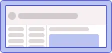
Figure: 横向きモードでの大きな固定ヘッダー

⚠ テキストサイズがビューの幅に合わせて調整されている場合、横向きモードを使用するとズームイン効果が生じることがあります。これは横向きモードを意図的に使用する際に望ましい結果ではないでしょう。

## サイズ単位

サイズ指定にピクセルを使うだけでなく、[ビューポート単位](https://web.dev/blog/viewport-units)を使うことで要素のサイズを動的に定義できます。ビューポート単位はビューポートの幅や高さのパーセンテージであり、様々なウィンドウサイズに適応します。スマートフォンでユーザーがスクロールする際など、ビューポートが動的に変化する場合には、小さい、大きい、または動的な単位を使用できます。

⚠ 100vw を使用する際は注意が必要です。縦スクロールバーがあると利用可能な幅が減少し、コンテンツがはみ出して水平スクロールバーが表示される可能性があります。  
以下はその回避方法です：

```css
width: calc(100vw - (100vw - 100%));
```

### REM

rem 単位は、ルート要素のフォントサイズに基づいてサイズを定義する柔軟な方法です。例えば、ルートのフォントサイズが 16px の場合、段落のフォントサイズを 1rem に設定すると、それは 16px に等しくなります。

```css
html {
  font-size: 16px;
}

p {
  font-size: 1rem;
}
```

さまざまな画面サイズで固定デザインを行うためには、viewport width (vw) と rem 単位の組み合わせが使えます。例えば：

```css
html {
  font-size: calc(100vw / 375);
}

p {
  font-size: 16rem;
}
```

この場合、ビューポート幅が 375px のとき段落のフォントサイズは 16px になり、ウィンドウ幅の変更に比例して調整されます。この方法では、デザインに従いやすく、すべての値に px の代わりに rem を使用できます。

⚠ ただし、rem 単位を使用する場合、残念ながら 100vw の回避策は機能しません。

```css
font-size: calc((100vw - (100vw - 100%)) / 375);
```

## スクロール

コンテンツがコンテナの寸法を超える場合、スクロールコンテナを定義し、「通常」「固定」「sticky」などのスクロール動作を指定することが重要です。

モバイルブラウザにはオーバーレイプロパティを持つスクロールバーがあり、[非モバイルブラウザでは広く利用できない機能](https://caniuse.com/mdn-css_properties_overlay)です。代替案として [scrollbar-gutter](https://caniuse.com/mdn-css_properties_scrollbar-gutter) の使用がありますが、現時点では普遍的にサポートされていません。

デスクトップでは、縦方向のスクロールが好まれます。これにより、スクロールホイールを使用して簡単にアクセスできます。これにより、より狭く、より控えめな縦スクロールバーが可能になります。水平スクロールバーは、スクロールバーサムを使用する必要があるため、より大きく、より邪魔になります。  
一方、モバイルでは、縦スクロールをページ全体に限定することが推奨されます。コンテンツがコンテナを超える場合、スワイプ操作で水平スクロールを簡単に行うことができます。

⚠ 両方の場合において、フッターが存在する場合は無限スクロールを避けてください。フッターが不達になる可能性があります。

⚠ 二重の縦スクロールバーを使用することは避け、ユーザーエクスペリエンスが混乱する原因となることがあります。そのような要素内でマウスホイールを使用すると、両方のスクロールバーの位置に応じて一貫性のないスクロール動作が発生します。

#### 同じデザインをベースにした異なるスクロールパターン

以下の例は、一つのデザインが様々なスクロールパターンを持つ可能性を示しています。

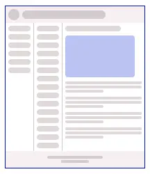
Figure: デザイン

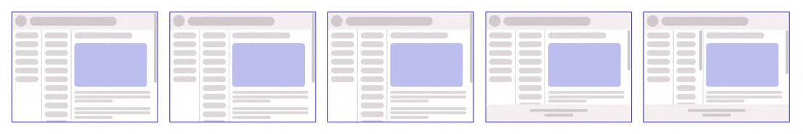
Figure: スクロールパターン

### スクロール位置

[Intersection Observer API](https://developer.mozilla.org/ja/docs/Web/API/Intersection_Observer_API) は、スクロール位置をスクロールやリサイズ時に確認するよりもパフォーマンスが向上します。レスポンシブウェブデザインでは、特定のイベントがトリガーされるポイントを、サイズが可変する要素で簡単に制御できるという追加の利点があります。

## ブラウザーと OS

### フォント

フォントを選ぶ際には、各 OS には独自のシステムフォントがあり、[フォントスタック](https://css-tricks.com/snippets/css/system-font-stack/)が推奨されます。

さまざまなプラットフォーム間で統一性を確保するために、ウェブフォントも使用できます。これらのフォントはコードと一緒にホストされることがあります。また、[Google Fonts](https://fonts.google.com) のようなサービスでは、さまざまなフォントに簡単にアクセスできます。これらのサービスはしばしばフォントファイルを小さな部分に分割し、必要なフォントサブセットのみをダウンロードすることを保証します。特に日本語などの多様なフォントセットには、読み込みパフォーマンスを最適化するためにこのアプローチが特に推奨されます。

ただし、使用しているブラウザによってはわずかなレンダリングの違いがまだ発生する可能性があることに注意する価値があります。

以下の例では、Google Fonts を固定の CSS で使用していますが、それでもブラウザによってわずかな違いがあります。

```css
font-size: 24px;
line-height: 1.5;
```

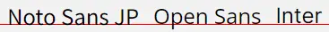
Figure: Windows Chrome

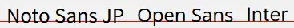
Figure: Windows Firefox

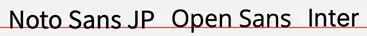
Figure: Mac Chrome

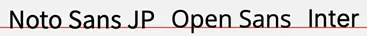
Figure: Mac Firefox

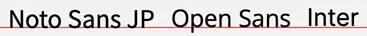
Figure: Mac Safari

### グレースフルデグラデーションとプログレッシブエンハンスメント

[グレースフルデグラデーション (上品な劣化) ](https://developer.mozilla.org/ja/docs/Glossary/Graceful_degradation)と[プログレッシブエンハンスメント](https://developer.mozilla.org/ja/docs/Glossary/Progressive_Enhancement)は、最新のブラウザ機能を活用しながら、レガシーブラウザでも機能を維持するための設計原則です。その代わりにパフォーマンスやデザインの違いが生じることがあります。これは JavaScript や CSS の機能の両方に適用できます。  
例えば、[flex box gap プロパティ](https://caniuse.com/flexbox-gap)は iOS 14.5 より前のブラウザでは利用できません。これによりレイアウトの違いが生じますが、ユーザーエクスペリエンスに影響を与えず、以前の方法よりも実装が簡単になります。

[CanIUse](https://caniuse.com) はブラウザの互換性を評価するための参照となります。  
[Modernizr](https://modernizr.com) のようなツールは、ウェブサイトに実装する広範なチェックリストを提供し、スタイリングやコードの例外を効果的に処理できるようにします。

このアプローチはブラウザの機能だけでなく、画面サイズにも適用でき、すべてのケースでピクセルパーフェクトでなくても、レイアウトがより一般的なサイズで機能するように保証できます。

## タッチスクリーン

異なる画面タイプに対するデザインは、ユーザーがコンテンツとやり取りする方法を考慮に入れる必要があります。

従来のスクリーンでは、ホバーステートが情報を伝えることができますが、タッチスクリーンでは利用できません。ユーザーインターフェースを設計する際には、この違いを考慮する必要があります。

一方、タッチスクリーンにはスワイプやピンチなど、従来のスクリーンでは利用できないイベントがあります。また、スワイプはスクロールに使用されるため、モバイルデザインではスクロールバーの有無を考慮する必要はありません。

さらに、タッチスクリーンデバイスでは、キーボードのタイプやセレクトリストなど、固有の入力動作があります。モバイル画面向けにデザインする際には、カスタムスタイルではなく、ネイティブのセレクト要素を優先することが多く、有益です。

## メディアクエリ

メディアクエリは、一般的には画面幅や印刷に基づいてスタイルを調整するために使用されますが、方向、解像度、ポインタータイプ、ホバーの可能性など、[多くのプロパティが利用可能です](https://developer.mozilla.org/ja/docs/Web/CSS/CSS_media_queries/Using_media_queries)。

メディアクエリを使用するタイミングと他の解決策を選択するタイミングについては、この記事のデザインシステムのセクションで詳しく議論されています。

## コンポーネント駆動デザイン

[コンポーネント駆動デザイン](https://www.componentdriven.org/)は、原子デザインに似た手法で、アプリケーションを最小のコンポーネントから構築する方法論です。このアプローチでは、コンポーネントはそのコンテナに適応するべきであることが重要視されます。その結果、ウェブページは主にこれらのコンポーネントを配置するためのコンテナとして機能し、レスポンシブデザインを実現するプロセスを簡素化します。

### デザインシステム

Material や Ant Design のようなコンポーネントライブラリを使用するか、独自のデザインを作成する場合、レスポンシブウェブデザインには２つの可能なアプローチがあります。

1. すべてのサイズで同じスタイルを使用し、プロパティで区別する方法。例えば、モバイルでは大きなボタンを、デスクトップでは中程度のボタンを使用する。
2. メディアクエリで分けられた異なるスタイルを使用する方法。例えば、すべての画面サイズで大きなボタンを使用しますが、スタイルが異なります。

2 番目の方法が好まれます。なぜなら、JavaScript に依存せず、サーバーサイドのレンダリングに影響を受けないからです。

一般的な原則として、コンポーネントに基本的なデザインの違いがある場合にはメディアクエリを使用しますが、利用可能なスペースに基づくデザインの違いには使用しないでください。

次のケースを考えてみましょう。記事コンポーネントには画像とテキストがあります。画像は左側に配置され、テキストは右側に配置されますが、幅が制限された場合、画像は全幅を占有し、テキストはその下に配置されるようになります。利用可能なスペースがどれほどあるかわからないため、メディアクエリに依存することはできません（そのコンテナには複数の列があるかもしれませんし、サイドメニューがあるかもしれません）。  
以下は、この問題を解決するための例です。[min](https://developer.mozilla.org/ja/docs/Web/CSS/min) などの CSS 値を使用しています。

```html
<article class="article">
  <div class="article_image_container">
    
  </div>
  <div class="article_text">
    <h1 class="article_title">Lorem ipsum dolor sit amet</h1>
    <p class="article_description">
      Lorem ipsum dolor sit amet, consectetur adipiscing elit, sed do eiusmod
      tempor incididunt ut labore et dolore magna aliqua. Ut enim ad minim
      veniam, quis nostrud exercitation
    </p>
  </div>
</article>
```

```css
.article {
  display: flex;
  align-content: flex-start;
  /* Wrapはテキストを画像の隣または下に配置します */
  flex-wrap: wrap;
  padding: 20px;
  width: 100%;
  border: 1px solid #ccc;
  gap: 16px;
}

.article_image_container {
  /* 
    flexだと画像がテキストと縦に伸びます
    blockだと画像の下に余分なスペースができます
  */
  display: grid;
  /* 水平レイアウトでの画像の幅 */
  min-width: 200px;
  flex: 1;
}
.article_image {
  aspect-ratio: 4/3;
  width: 100%;
  background: #ccc;
  border-radius: 16px;
}

.article_text {
  display: flex;
  flex-direction: column;
  flex: 1;
  /*
    コンテナが画像のmin-widthとgap（216px）+ 240pxより小さい場合、
    テキストコンテナは画像の下に配置されます
    コンテナがより広い場合、テキストは全幅 -（216px）を取ります
  */
  min-width: max(240px, calc(100% - 216px));
  gap: 16px;
}

.article_title {
  font-size: 24px;
  line-height: 1.3;
}

.article_description {
  display: flex;
  flex-direction: column;
  text-align: justify;
  font-size: 16px;
  line-height: 1.5;
}
```

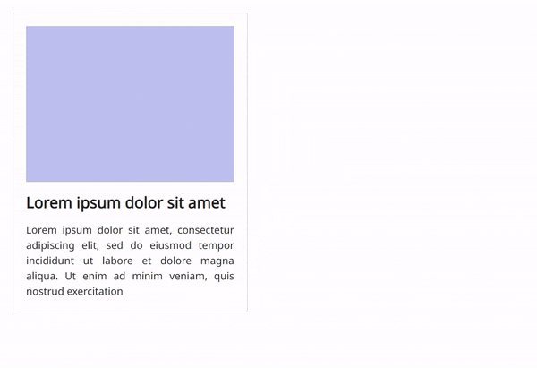
Figure: レスポンシブコンポーネント

#### ライブラリ

Material（[React](https://mui.com), [Vue](https://Vuetifyjs.com), [Angular](https://material.angular.io)）や [Ant Design](https://ant.design) のようなライブラリは、中規模のプロジェクトには良い基盤となります（小規模プロジェクトには少し重すぎるかもしれず、大規模プロジェクトでは独自のライブラリの方が有益かもしれません）。  
これらのライブラリはさまざまな環境で広範にテストされており、レスポンシブウェブデザインに信頼性のある選択肢となります。  
ほとんどのデザインに合わせてカスタマイズできますが、変更が多ければ多いほどバグのリスクが高まります。したがって、プロジェクトの開始時にデザインチームと合意し、どのライブラリを使用するか、どのカスタマイズをどの程度で行うかを共にレビューすることが重要です。  
これらのライブラリの利点は、コンポーネントが既にベストプラクティスを使用していることです。UI/UX チームがすべての状態やユースケースを定義する必要が少なく、開発者がそれらをゼロから実装する必要がありません。

### Storybook

[Storybook](https://storybook.js.org) は、UI コンポーネントやページを独立して構築しテストするためのツールで、コンポーネント駆動デザインに最適です。
さらに、Storybook はさまざまなブラウザや異なる[ビューポートサイズ](https://storybook.js.org/docs/web-components/essentials/viewport)のための[ビジュアルテスト](https://storybook.js.org/docs/web-components/writing-tests/visual-testing)を可能にします。

## アクセシビリティ

アクセシビリティは独自の詳細な記事が必要ですが、レスポンシブウェブデザインを実装する際に考慮すべきポイントをいくつか紹介します。

### スクリーンリーダー

レスポンシブレイアウトを実装する過程で、要素の順序を調整する必要があることがあります。これらの変更がスクリーンリーダーを利用するユーザーや SEO にも影響を与えることを覚えておくことが重要です。

### フォントサイズ

画面幅に適応するフォントサイズを使用する場合、最小可能なフォントサイズが読みやすいものであることを確認してください。

```css
p {
  font-size: max(16rem, 12px);
}
```

## テスト環境

[Browserstack](https://www.browserstack.com)のようなツールは、クロスブラウザやクロスデバイスのテストに使用できます。これらのツールは、Web アプリケーションが様々なブラウザ、デバイス、および OS 上で正しく機能し、一貫した表示がされることを確認するのに役立ちます。さらに、Web 開発における問題の解決と品質保証を効率化するためのデバッグやインスペクションツールも提供しています。

### Google Analytics

すべての環境で完璧な結果を得ることはコストと時間がかかる場合があります。そのため、優先順位をつけることが重要です。[Google Analytics](https://analytics.google.com) は、あなたの観客が使用しているデバイス、オペレーティングシステム、および画面サイズに関する貴重なデータを提供しています。  
デザインのパラメータやテストに関する決定を行う際には、このデータを分析して、最も効率的なカバレッジを実現するのに役立ててください。

## SEO（検索エンジン最適化）

Google はウェブサイトのランキングにモバイルフレンドリーさを考慮しています。パフォーマンスも重要な要素なので、適切なコンテンツを適切な環境で迅速に提供する一方で、他の環境用のコンテンツを提供する負荷やページの読み込み時の多くの JavaScript チェックを制限する適切なバランスを取ることが重要です。

## テキストの省略表示

テキストがオーバーフローする場合にスクロールが望ましくない（チップやテーブルセルなどの小さいコンテナ）場合に、テキストの省略表示を使用することができます。CSS（[ellipsis](https://developer.mozilla.org/en-US/docs/Web/CSS/text-overflow) や [line clamp](https://developer.mozilla.org/en-US/docs/Web/CSS/-webkit-line-clamp)）は、異なる文字数やコンテナサイズに適応するため、固定された JavaScript の文字列長よりもいくつかの利点を提供します。

⚠ 省略記号を使用する際は、ユーザーが全文を視覚化できる方法があることを確認しなければなりません。  
一部のケースでは、完全なテキストを選択およびコピーできる機能も維持する必要があります。これはツールヒントで問題になることがあります。

## UI＆UX デザイナーとの共同作業

プロジェクトの初期段階で開発者とデザイナーが合意できれば、その方が良いです。お互いの視点や問題を理解することが実装を助けます。デザインの哲学に共通の見解を持ち、明確な初期ガイドラインを持つことは、開発者がすべてのページやコンポーネントのすべての状態やユースケースを作成する負担をデザイナーに押し付けることなく、デザインを実装することを可能にします。

## References

- [Responsive Web Design (RWD) and User Experience](https://www.nngroup.com/articles/responsive-web-design-definition)
- [Responsive layout grid](https://m2.material.io/design/layout/responsive-layout-grid.html)
- [Scrolling and Attention](https://www.nngroup.com/articles/scrolling-and-attention/)
- [8-Point Grid: Vertical Rhythm](https://medium.com/built-to-adapt/8-point-grid-vertical-rhythm-90d05ad95032)
- [Mozilla Resources for Developers, by Developers](https://developer.mozilla.org/en-US/)
- [ウェブ用の画像形式](https://developers.google.com/speed/webp)
- [Can I use](https://caniuse.com)
- [Make your website more readable](https://developer.chrome.com/docs/devtools/accessibility/contrast)
- [The large, small, and dynamic viewport units](https://web.dev/blog/viewport-units)
- [System Font Stack](https://css-tricks.com/snippets/css/system-font-stack/)
- [Modernizr](https://modernizr.com/)
- [Component Driven User Interfaces](https://www.componentdriven.org/)
- [Storybook](https://storybook.js.org/)

_ヘッダー、グリッド、およびレスポンシブデザインの画像は [Hanaka Misono](https://design-journal.monstar-lab.com/category/journal/writer/misono/) によるものです。_
