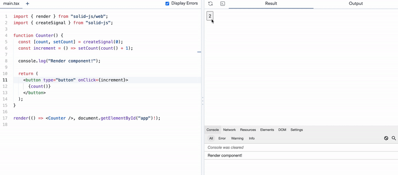
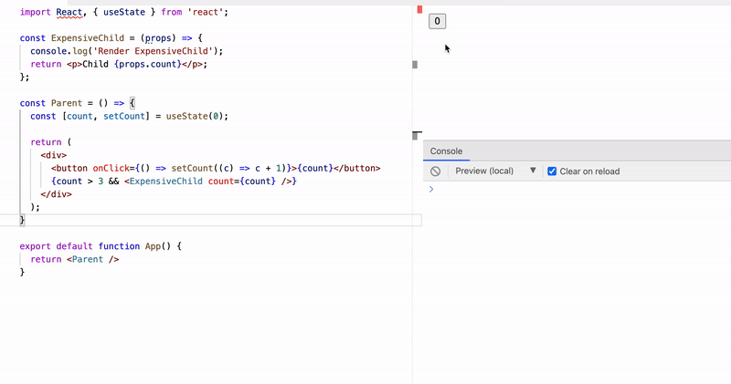
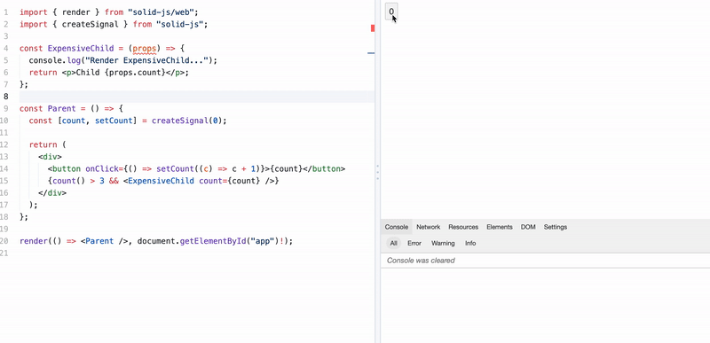

こんにちは、モンスターラボ Front-end の 山下 です。
普段のプロジェクトでは React、Vueで開発していますが、2021年末から急速に成長している Front-end フレームワーク Solid のことを知り、習得していくと、React 開発経験者を考慮した API 設計や Solid のシンプルなソリューションなど React に替わる選択肢として興味深いものでした。この記事では React の経験者目線で書きたいと思いますので、同じく React 開発経験があり、これから Solid の使用を検討している方の参考になれば幸いです。

## Solid について

Solid はパフォーマンスを重視した宣言的な UI 構築のフレームワークです。2016 年、[Marko](https://github.com/marko-js/marko) のコアメンバーでもある [Ryan Carniato](https://twitter.com/RyanCarniato) 氏により、10 年ほどの Knockout での開発経験に基づいて、Knockout のモデルを現代的に再解釈するという趣旨が、このプロジェクトの動機だったそうです。

> Knockout is a perfect example of this since its View Models run once, it is the primitives that update. My library Solid is like a modern re-interpretation of Knockout.
> https://ryansolid.medium.com/i-used-knockout-in-professional-dev-environment-for-almost-10-years-b94ab2be5c96

また、React のような一方向性のデータフロー設計、React Hooks に大きく影響を受けた API、React の設計思想にも沿っている点や JSX 使用など、React を使って開発したことがある人なら、Solidもなじみやすい設計になっています。

2021 年 6 月には [1.0 バージョンがリリース](https://dev.to/ryansolid/solidjs-official-release-the-long-road-to-1-0-4ldd)され、パフォーマンスを重視しつつ、DX コストもそこまでかからない点で人気が急上昇、[Wang](https://engineering.monstar-lab.com/jp/authors/dongyu-wang/) さんの[記事](https://engineering.monstar-lab.com/jp/post/2022/05/27/Is-Virtual-DOM-Outdated/)にも言及されたように 2022 年 2 月まで実施された「State of JavaScript 2021」では Svelte とともに最も満足度が高い [Front-end framework](https://2021.stateofjs.com/en-US/libraries/front-end-frameworks) としてトップランクされました。

Solid については仮想 DOM を使わない framework、他の framework と比べてパフォーマンスが優れているなど、
いろんな特徴がありますが、まずは開発者の DX を考慮した二つの API から紹介できればと思います。

## React の設計思想に沿うと同時に、異なる仕組み

1 秒ごとにカウントが増加するアプリケーションを作るとします。

React のライフサイクルフックを考えると、下記のコードは正常に動かないことがわかります。setInterval の コールバック関数 は state を毎秒ごとに変更、state が変更される度に、
コンポーネント関数は再度実行するので、結局 memory leaks が発生してしまうからです。

```jsx
import { useState, useEffect } from "react";

const Counter = () => {
  const [count, setCount] = useState(0);

  setInterval(() => setCount(count + 1), 1000);

  return <div>{count}</div>;
};
```

正常に動作するコードを書くのであれば、ライフサイクルフックをを考慮して下記の手順でコードが書けると思います。

```jsx
import { useState, useEffect } from "react";

const Counter = () => {
  const [count, setCount] = useState(0);

  useEffect(() => {
    const id = setInterval(() => setCount(count + 1), 1000);
    return () => clearInterval(id);
  }, [count]);

  return <div>{count}</div>;
};
```

動作自体には問題ないですが、count の状態は頻繁に変更されて、その度に setInterval を登録・解除してしまう問題があるので、
依存配列から count を抜くことでそれを解決できます。

> If you want to run an effect and clean it up only once (on mount and unmount), you can pass an empty array ([]) as a second argument.
>
> https://reactjs.org/docs/hooks-effect.html

```jsx
useEffect(() => {
  const id = setInterval(() => setCount(c => c + 1), 1000);
  return () => clearInterval(id);
}, []);
```

これで期待通り毎秒ごとに増加された最新の count は描画しながら useEffect 内の setInterval は mount された時に 1 回だけ実行されるようになりました。
unmount の際には setInterval も clear しているので、他に気になるところはありません。

このようにコンポーネントの開発する際に、

1. コンポーネントのライフサイクル
1. ライフサイクルに相応するフック、フック関数を再実行するための依存配列の値

などを常に頭の中でイメージしながらコンポネートの開発する必要があります。

Hooks やライフサイクルのルールを理解して、常に頭の中でイメージしながらコンポーネントを開発する必要があります。

上記例は簡単な例でしたが、実際はもう少し複雑なコンポーネント構造の中で、さまざまな状態の依存関係を考慮しないと、意外と発見しづらいバグが発生します。
eslint のルールを使って、ある程度は防ぐことができるかもしれませんが、全部防げるわけではありません。

同じ動作をするコードを Solid にてみてみましょう。

```jsx
import { createSignal, onCleanup } from "solid-js";

const Counter = () => {
  const [count, setCount] = createSignal(0);

  const id = setInterval(() => setCount(c => c + 1), 1000);
  onCleanup(() => clearInterval(id));

  return <div>{count()}</div>;
};
```

React 開発者には Solid のコードが初見でもすぐ理解できると思います。
例えば `createSignal` は React の `useState` と似たような挙動をする関数に見えますね。
ただ、`setInterval` が hooks にてラップされていない点や、コンポーネント自体のライフサイクルなども気になるかもしれません。

実は Solid でライフサイクルがほとんどなく、関数コンポーネントは（レンダリングサイクルごとではなく）一度しか実行されません。

> Render-once mental model: your components are regular JavaScript functions that run once to set up your view
>
> https://github.com/solidjs/solid/blob/main/README.md

Sample にて関数に console などを出力して見ると、関数コンポーネントは一度実行されてビューの部分に変更があっても再度実行されないことがわかります。



[Try playground](https://playground.solidjs.com/?version=1.4.1#NobwRAdghgtgpmAXGGUCWEwBowBcCeADgsrgM4Ae2YZA9gK4BOAxiWGjIbY7gAQi9GcCABM4jXgF9eAM0a0YvADo1aAGzQiAtACsyAegDucAEYqA3EogcuPfr2ZCouOAGU0Ac2hqps+YpU6DW09CysrGXoIZlw0WgheAGEGCBdGAAoASn4rXgd4sj5gZhTcLF4yOFxkqNwAXV4AXgcnF3cvKDV0gAZMywT8iELeDEc4eFSm3iymgD4KqprU9JLamYBqXgBGPvCBkqH1OAA6NVoPdJUAJWExCRLOeOFcAEIVXYhcwSqmBMuBvIAHhM9FwuHivAIxEaKhBYPiKl48USGmYAGtGiBRkIJrhJLMvnk8iBVstMpJCbxAfo4eCIASBh8KZ8IEJROJ0jNGvNAUs0rx9LNyiJaMx6Ljjh4qgBRNTjZ4AIXwAEkRJcwFBCIR3i8PmBJHUgA)

`createSignal`が戻す値 Signal は [Proxy で実装された追跡が可能な Observer](https://github.com/solidjs/solid/issues/2)で、
現在の Signal の値を返すゲッター関数と Signal を更新するセッター関数を持つ配列で構成されています。

Solid ではコンポーネント関数はコンストラクタのような役割で、プログラムの実行時に Signal が更新されて Signal のゲッターを呼び出した側のコンテキストのみ（この例では JSX 式にて呼び出した部分）再実行を行います。

コンポーネント関数が一度しか実行されないことは、特に親コンポーネントと子コンポーネント関係の再レンダリング問題に便利です。
例えば、コストの高い計算を行っている子コンポーネントがあって、親コンポーネントの状態や条件が変わって再度レンダーされるかもしれないということに注意したり、また、Hooks にてメモ化するのであれば、どの Hooks を使うのが一番効果的なのかを考えながら、開発した経験があるかもしれません。下記の簡単な React コードを見てみましょう。

```jsx
const ExpensiveChild = props => {
  console.log("Render ExpensiveChild...");
  return <p>Child {props.count}</p>;
};

const Parent = () => {
  const [count, setCount] = useState(0);

  return (
    <div>
      <button onClick={() => setCount(c => c + 1)}>{count}</button>
      {count > 3 && <ExpensiveChild count={count} />}
    </div>
  );
};
```

React にて親コンポーネントの `count` が 3 を超えたら、子コンポーネントをレンダリングさせたいと思っています。
ここで問題は、`count` が 3 を超えて 4、5、6 に変更される度に、子コンポーネントは毎回レンダリングされてしまうことです。



[Try playground](https://stackblitz.com/edit/react-ts-u4oz8q?file=.vscode%2Fsettings.json,App.tsx)

コストの高い計算を行っている場合、すぐ思いつくのは `count > 3` の状態をメモ化するか、再レンダーを発生させない ref オブジェクトを使うかでしょうか。

```jsx
const Parent = () => {
  const [count, setCount] = useState(0);
  const isVisibleExpensiveChild = useMemo(() => count > 3, [count]);
  return (
    <div>
      <button onClick={() => setCount(c => c + 1)}>{count}</button>
      {isVisibleExpensiveChild && <ExpensiveChild count={count} />}
    </div>
  );
};
```

コンポーネント関数が最初に作成されたときに一度だけ実行される Solid では、
上記のように関数コンポーネント内の条件分岐で、子コンポーネントが再度レンダリングされるかどうか、メモ化について考える必要はありません。

```jsx
const ExpensiveChild = props => {
  console.log("Render ExpensiveChild...");
  return <p>Child {props.count}</p>;
};

const Parent = () => {
  const [count, setCount] = createSignal(0);

  return (
    <div>
      <button onClick={() => setCount(c => c + 1)}>{count}</button>
      {count() > 3 && <ExpensiveChild count={count} />}
    </div>
  );
};
```



[Try playground](https://playground.solidjs.com/?version=1.4.1#NobwRAdghgtgpmAXGGUCWEwBowBcCeADgsrgM4Ae2YZA9gK4BOAxiWGjIbY7gAQi9GcCABM4jXgF9eAM0a0YvADo1aAGzQiAtACsyAegDucAEYqA3EogcuPfr2ZCouOAGU0Ac2hqps+YpU6DW09CysrZloIMj4AUQpiaLQANzgAYQALNDURXgBeXgAKQnlCMgBKfIA+fiteByiguAA6NVoPQpUAJWExCXjEshT0rJzm8ZVyywh6oVwmGYAeQirM7NyQEtoy5sj6CFxJRf0V6clpiMa+AAUoIQP8osq8mpA6hui+YD2DrF4yOC4NIMA4AXUejjgzjcnm8hQADFNwjNBICFkV3vVFiIUlVMfVeIsTPRcLgorwomkNMwANZ5ECFZ41AFAkG4QqFZhMhy8ADUvAAjOVJFUQD9DsdiaSoniUQT+OLGbwagBmXgAMnVhIGwiGqTWOQa+1w9PF0n0VUk+OOOOSsvqSIg52R9z6HO5i1u9z4Fr+IlozHo8AOzQ8gNiajgwdwACF8ABJESdMBQQiESYAQkdYEkoKAA)

count が 4 に変更されたら、一度子コンポーネントがレンダリングされ、5、6 に変更されたとしても、再度レンダリングされないことがわかります。
さらに、親コンポーネントの `count` を子コンポーネントの props で渡すとしても、同じ結果です。

コンパイルされたコードを見ると、このような結果になる理由についてヒントを見つけやすいです。

```js
import { createComponent, insert, memo } from "solid-js/web";
insert(
  _el$3,
  (() => {
    const _c$ = memo(() => count() > 3, true);

    return () =>
      _c$() &&
      createComponent(ExpensiveChild, {
        count: count,
      });
  })(),
  null
);
```

```js
const _c$ = memo(() => count() > 3, true);
```

`ExpensiveChild` のレンダリングの条件に Signal が使われた場合はまず、条件式を Hoisting、そしてメモ化します。`count()` が 3 を超えた時点で内部的にメモ化するので、5、6 に変更されても、`_c$` は変更されることはなく、子コンポーネントもレンダリングされることはありません。

また、Signal 自体が独立しているリアクティビティなので、コンポーネント関数にてネストして細かく設定して処理することも可能です。

```jsx
const TodoApp = () => {
  const [todos, setTodos] = createSignal([]);

  const addTodo = text => {
    const [completed, setCompleted] = createSignal(false);
    setTodos([...todos(), { id: ++todoId, text, completed, setCompleted }]);
  };

  const toggleTodo = id => {
    const index = todos().findIndex(t => t.id === id);
    const todo = todos()[index];
    // 各 todo はネストされた Signal を参照しているので、正確な値をゲッター、独自でセットできる
    if (todo) todo.setCompleted(!todo.completed());
  };
};
```

リストを複製して置き換えることもなくなり、無駄なく必要最低限の DOM のみレンダリングができます。

では、関数内にて更新された Signal を検知して何か付加的に処理を行いたい場合を見てみましょう。
Solid にも React の`useEffect`のような `createEffect` にて Signal に依存する副作用を実行することができます。

```jsx
import { createSignal, createEffect } from "solid-js";

const Counter = () => {
  const [count, setCount] = createSignal(0);

  const id = setInterval(() => setCount(count() + 1), 1000);

  createEffect(() => {
    console.log("The count is ", count());
  });

  return <div>{count()}</div>;
};
```

`createEffect` に依存配列は存在しません。その代わりコールバック関数内にて Signal のゲッター関数が呼ばれたら、再度コールバック関数を実行します。
stale closures が存在しないので、フック外部のことについて気にする必要もなくなります。

コールバック関数内でゲッター関数を実行することが少しオーバーヘッドのように見えましたが、この発想はなるほど！と思いました。
Effectを自動的に適用しなおすアプローチは Vue、Svelte でも採用していて、比較的単純な動作で開発者のミスも減らせるのではないでしょうか。

## 最後に

React と同じ哲学を持っていて開発者の DX を向上しつつ、内部的に行う効果的なレンダリング処理をする Solid について
簡単に紹介しました。今回の `createSignal`、`createEffect` や他にも React 開発者ならおなじみの、かつ Solid の思想が感じられる魅力的な API がまだまだたくさんあるので、今後も期待できるフレームワークとして使い続けたいと思います。皆さんも是非活用してみてくださいね。

## 参考

- [SolidJS 公式ドキュメント](https://www.solidjs.com/docs/latest/api)
- [A Hands-on Introduction to Fine-Grained Reactivity](https://dev.to/ryansolid/a-hands-on-introduction-to-fine-grained-reactivity-3ndf) by [Ryan Carniato](https://dev.to/ryansolid)

## 画像引用

- Header Photo by [Terry Vlisidis](https://unsplash.com/@vlisidis?utm_source=unsplash&utm_medium=referral&utm_content=creditCopyText) on [Unsplash](https://unsplash.com/s/photos/atoms?utm_source=unsplash&utm_medium=referral&utm_content=creditCopyText)
