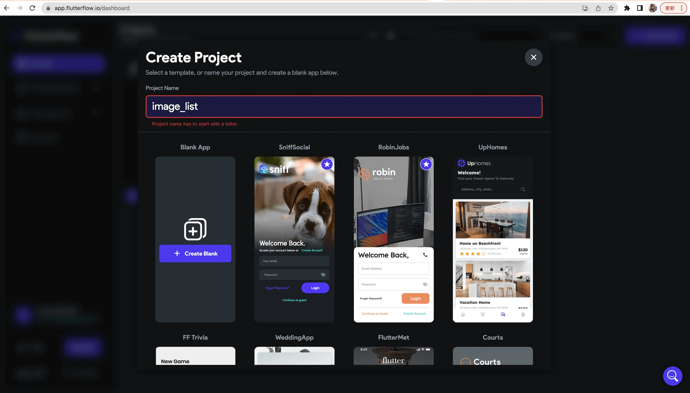
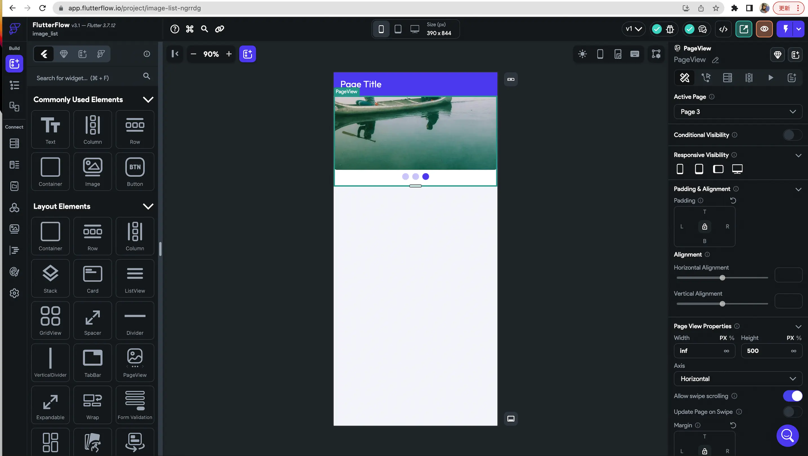
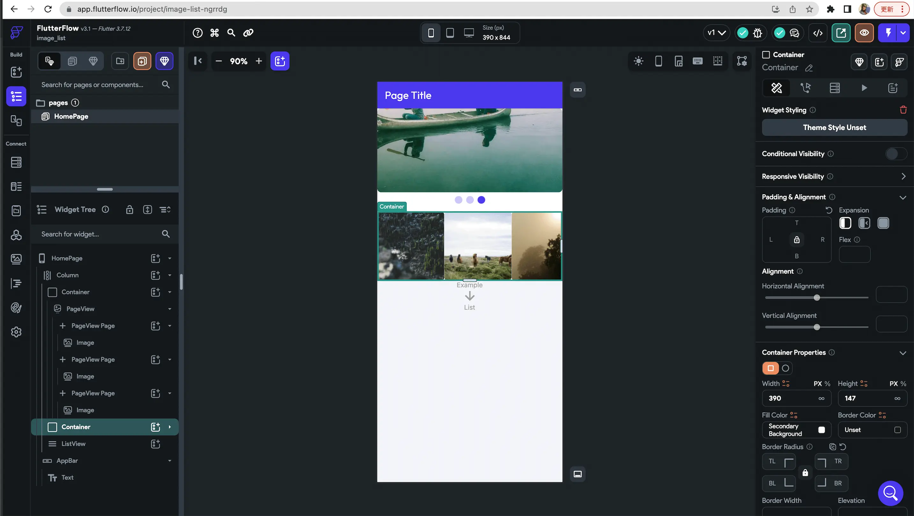
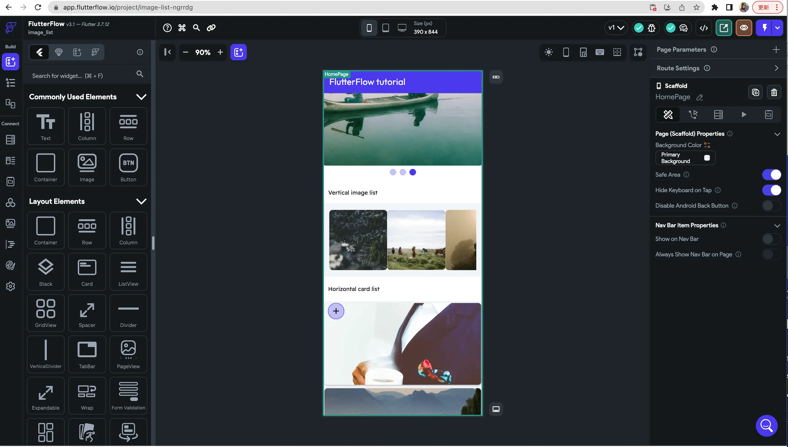
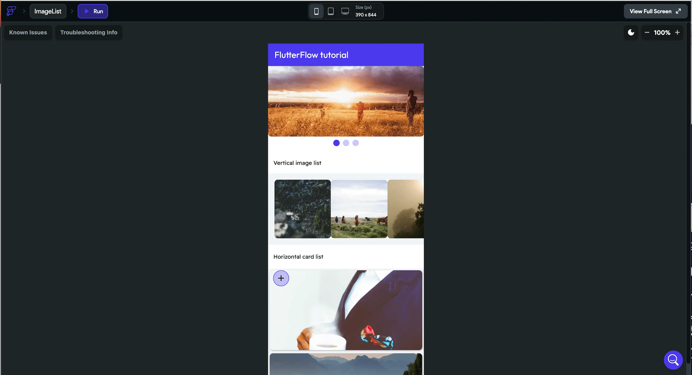

## はじめに：
目まぐるしく変化をしていく現代では企業や開発者にとって、堅牢で使いやすいモバイルアプリケーションを作ることは非常に重要です。しかし、アプリの構築プロセスは複雑で時間がかかることがあります。その点で、FlutterFlowが大いに役立ちます。FlutterFlowは、GoogleのFlutterフレームワークを使用してアプリ開発プロセスを簡素化する強力なビジュアル開発プラットフォームです。本記事では、FlutterFlowの特徴と利点、そしてどのようにアプリ開発のワークフローを革新できるのかについて探っていきます。

### FlutterFlowとは？
FlutterFlowは直感的でパワフルなビジュアル開発プラットフォームであり、開発者がビジュアルインターフェースを使用してモバイルアプリケーションの設計、プロトタイプ、構築をできるようにします。GoogleのFlutterフレームワークの力を借りて、iOSとAndroid向けの高品質なネイティブアプリを作成します。

### 驚くべきビジュアルインターフェース：
FlutterFlowの特筆すべき機能の1つは、ビジュアルインターフェースです。このインターフェースにより、開発者はコードを1行も書かずにアプリの画面をデザインし、インタラクティブなプロトタイプを作成することができます。ドラッグアンドドロップの機能を使用して、迅速にUIレイアウトを構築し、コンポーネントを追加し、画面間の相互作用を定義することができます。このビジュアルアプローチにより、アプリのデザインを繰り返し改善することが容易になり、開発プロセスでの時間と労力を節約できます。

### 簡単なコード生成：
FlutterFlowはアプリ開発のビジュアルデザインの側面を簡素化しますが、ビジュアルのみのワークフローに制限されることはありません。FlutterFlowは、デザインに基づいてクリーンで本番向けのFlutterコードを生成し、従来のコーディング手法を使用してアプリの機能をカスタマイズや拡張する柔軟性を提供します。これにより、開発者はビジュアルインターフェースからコードの記述にシームレスに移行でき、両方の利点を最大限に活用することができます。

### エレメントライブラリ：
FlutterFlowには、美しいアプリインターフェースを作成するために使用できる、事前に作成された豊富なUIコンポーネントライブラリが付属しています。ボタンや入力フィールドからリストやグリッドのような複雑な要素まで、FlutterFlowは幅広い使いやすいコンポーネントを提供しています。これにより、開発者は車輪の再発明から解放され、開発プロセスを加速させることができます。

### リアルタイムコラボレーション：
アプリ開発プロジェクトでは、コラボレーションが重要です。FlutterFlowはリアルタイムコラボレーション機能を提供し、チームワークを効率化します。複数のチームメンバーが同じプロジェクトで同時に作業できるため、アイデアの共有、フィードバックの収集、進捗の追跡が容易になります。FlutterFlowのコラボレーション機能により、効率的なコミュニケーションを確保し、生産性を最大化することができます。

### バックエンドサービスとの統合：
完全なアプリを構築するには、バックエンドの統合が必要です。FlutterFlowは、人気のあるバックエンドサービスとシームレスに統合する機能を提供しています。データベースへの接続、ユーザーの認証、APIからのデータの取得など、FlutterFlowは組み込みの統合機能を通じてプロセスを簡素化します。Firebase、GraphQL、REST APIなどのサービスとの連携が簡単で複雑なバックエンドの開発なしで機能的なアプリができます。

## FlutterFlowの利用手順：

1. アカウントの登録とプロジェクトの作成:
   * [FlutterFlowのウェブサイト](https://flutterflow.io/)にアクセスし、アカウントを登録します。
   * ログイン後、「プロジェクトの作成」ボタンをクリックして新しいプロジェクトを作成します。

2. アプリのデザイン:
   * プロジェクトを作成すると、FlutterFlowのビジュアルエディタに移動します。
   * サイドバーからUIコンポーネントをキャンバスにドラッグアンドドロップして、アプリの画面をデザインします。
   * ビジュアルインターフェースを使用して、コンポーネントの外観をカスタマイズし、レイアウトを定義し、画面間の相互作用を追加します。

3. データソースの設定:
   * アプリがバックエンドサービスやAPIからデータを必要とする場合、FlutterFlowでデータソースを設定できます。
   * FirebaseやREST API、GraphQLなどの外部サービスに必要な設定をFlutterFlow内で行い、アプリを接続します。

4. ロジックと機能の追加:
   * FlutterFlowはビジュアルデザインを簡素化しますが、コードブロックを使用してアプリにロジックと機能を追加することもできます。
   * FlutterFlowの組み込み機能ブロックを活用するか、Dartコードスニペットを使用してカスタムなロジックを作成します。

5. プレビューとテスト:
   * FlutterFlowのプレビューモードを使用して、ビジュアルエディタ内でアプリのデザインと相互作用をテストします。
   * アプリを異なるデバイスサイズや向きでプレビューし、レスポンシブ性を確認します。

6. Flutterコードの生成:
   * アプリのデザインと機能に満足したら、Flutterコードを生成できます。
   * 「コードのエクスポート」ボタンをクリックして、FlutterFlowプロジェクトに基づいてクリーンで構造化されたFlutterコードを生成します。

7. Flutterへのインポート:
   * 好みのFlutter開発環境（Android StudioやVisual Studio Codeなど）を開き、新しいFlutterプロジェクトを作成するか、既存のプロジェクトを開きます。
   * FlutterFlowから生成されたFlutterコードをコピーし、Flutterプロジェクト
   
## FlutterFlowを使って、シンプルな画面を作成しましょう。

FlutterFlowのウェブサイト(https://flutterflow.io/）にアクセスし、アカウントを作成してください。

プロジェクトの詳細を入力するように促されますが、このブログではFirebaseの統合は行いません。

## ツール：

FlutterFlowは、ビジュアル開発プロセスをサポートするために、インターフェースの左側と右側にツールとパネルを提供しています。それぞれの側面とそれぞれのツールについて詳しく見てみましょう。

左側パネルのツール：

* スクリーンの選択：左上隅には、ドロップダウンメニューがあり、アプリ内の異なるスクリーンを選択して切り替えることができます。ここでプロジェクト内のさまざまなスクリーンを管理し、アクセスすることができます。

* コンポーネントツリー：スクリーン選択のドロップダウンの下には、コンポーネントツリーパネルがあります。これは、現在選択されたスクリーンに存在するすべてのUIコンポーネントの階層ビューを提供します。ツリーを展開・折りたたんで、特定のコンポーネントを編集するためにナビゲートしたり、選択したりすることができます。

* プロパティパネル：左側に位置するプロパティパネルは、選択されたUIコンポーネントのプロパティと属性を表示します。これらのプロパティを変更して、選択したコンポーネントの外観、動作、スタイルをカスタマイズすることができます。

* データソース：データソースパネルでは、アプリにデータソースを管理し、接続することができます。データモデルを定義し、APIを統合し、このパネルを使用してアプリのための動的なコンテンツを作成することができます。データとAPIの接続を管理するためのビジュアルインターフェースが提供されています。

* アクション：アクションパネルを使用すると、アプリ内でインタラクティブな動作を定義し、管理することができます。ボタンのクリックやフォームの送信など、ユーザーの操作に応答するイベントとアクションを作成できます。このパネルを使用して、コードを書かずにアプリにロジックとインタラクティビティを追加することができます。

右側パネルのツール：

* ウィジェットライブラリ

：右側にあるウィジェットライブラリパネルには、ドラッグアンドドロップでアプリのスクリーンに追加できる、さまざまなカテゴリのプリビルドUIコンポーネントが用意されています。ボタン、テキストフィールド、画像、リストなどのウィジェットが含まれています。これらのウィジェットをカスタマイズしてデザイン要件に合わせることができます。

* スタイル：スタイルパネルを使用して、UIコンポーネントにスタイルを管理し適用することができます。テキストスタイル、カラー、スペーシング、その他のビジュアルプロパティを定義してカスタマイズするオプションが提供されています。再利用可能なスタイルを作成して、アプリ全体で一貫性を保つことができます。

* アセットマネージャー：アセットマネージャーパネルを使用して、アプリで使用するアセット（画像、アイコン、フォントなど）をアップロードして管理することができます。アセットをアップロードし、フォルダに整理し、簡単にアプリのスクリーン内でアクセスして使用することができます。

* コンポーネント構造：コンポーネント構造パネルは、アプリのコンポーネントとスクリーンの階層的な概要を表示します。アプリの全体構造の視覚的な表現を提供し、スクリーンとコンポーネント間を簡単に移動できます。

* プレビューとシミュレーター：右上隅には、アプリのデザインと機能のプレビューをするためのボタンがあります。さまざまなデバイスサイズや向きでアプリの外観を表示し、内蔵のシミュレーターを使用してプレビューされたアプリと対話することができます。

以下の画像では、Columnを親ウィジェットとしてドラッグアンドドロップし、pageViewコンポーネントを配置しました。コンポーネントをクリックすると、要素を配置しデザインするためのオプションが表示されます。

次に、Rowを持つContainerウィジェットを追加し、さらに3つの画像コンポーネントを持つContainerを追加しました。

その後、下部にListViewコンポーネントを追加し、画像付きのカードを追加しました。右側のオプションを選択してListViewを展開し、水平スクロールが可能になっています。

最後に、画面の外観に満足したら、実行オプションを選択してアプリのプレビューを表示します。以下は、その見た目です。

## いくつかの不利な点があります：

1. 限られた柔軟性：FlutterFlowはさまざまなUIコンポーネントを提供していますが、特定の専門的なまたはカスタムのコンポーネントが必要な場合もあります。そのような場合には、カスタムコードの記述や追加のFlutterパッケージの統合が必要になる場合があります。
2. プラットフォームの制約：FlutterFlowはクロスプラットフォーム開発を可能にしますが、特定のプラットフォーム固有の機能や機能を視覚的なインターフェースだけで簡単に実装することができない場合もあります。そのような状況では、開発者はプラットフォーム固有のコードの記述に頼る必要があります。

## 結論:

FlutterFlowはモバイルアプリ開発において画期的な存在です。その視覚的なインターフェース、コード生成の機能、幅広いコンポーネントライブラリ、シームレスなバックエンド統合は、効率的に高品質なネイティブアプリを開発したい開発者にとって頼りになるプラットフォームです。開発プロセスを簡素化し、コラボレーションを促進することで、FlutterFlowは開発者に素早く効果的にアプリのアイデアを具現化する力を与えてくれます。初心者でも経験豊富な開発者でも、FlutterFlowはアプリ開発のポテンシャルを引き出すために探求する価値のあるツールです。

ただし、FlutterFlowは強力なビジュアル開発ツールですが、その機能を最大限に活用するためには、FlutterとDartプログラミングの基本的な理解が必要です。FlutterFlowはビジュアルインターフェースとコード生成によって開発ワークフローを補完しますが、アプリの機能をカスタマイズしたり拡張するためには手動でのコーディングが必要になる場合もあります。

FlutterFlowのドキュメンテーション、チュートリアル、コミュニティリソースを参照して、その機能を詳しく探求し、この強力なアプリ開発プラットフォームを最大限に活用しましょう。

最後に、FlutterFlowの真のパワーを体験する最良の方法は、実際に試してみることをお勧めします。

