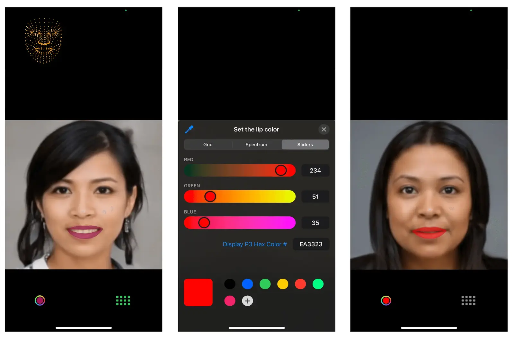

現在のデジタル時代において、モバイルアプリケーションは私たちの日常生活の欠かせない一部となりました。食事の注文から財務の管理まで、あらゆるニーズに対応するアプリが存在します。その裏側で、これらのアプリは私たちがスマートフォンとのインタラクションを革命化した技術、つまり人工知能（以下、AI）によって支えられています。AI はモバイルアプリの能力だけでなく、開発者とユーザー双方にとって無限の可能性を広げてくれました。

モンスターラボの日本に所属するモバイルチームのメンバーは AI の最新情報をキャッチアップし、クライアントへのより良い提案を行えるよう準備したいと考えました。そのために、モバイル開発にこの技術を応用するチームを結成し、育成体験を手軽に得られるシンプルなアイデアを考えました。

# AI とは？

AI は、人間の知能を必要とするタスクを実行できる知的な機械を創造することを目指すコンピューターサイエンスの分野です。AI アルゴリズムは一般的に、特定のデータセットを使用してトレーニングされたモデルに基づいています。

AI モデリングの目標は、トレーニングフェーズ中に提供されたデータセットを使用して推論フェーズ中に知識を一般化することです。トレーニングデータセットは通常、データポイントとそれに対応する正解値のペアで構成されており、モデルがその 2 つの間の関係を学習し、再現しようとします。

画像、テキスト、表形式のデータなど、さまざまな種類のデータが使用されることがあります。入出力データは必ずしも同じである必要はありません。例えば、モデルに特定のカテゴリ（例：画像に猫が含まれているかどうか）に画像を分類させることができます。

この記事で開発されたプロジェクトでは、画像内の顔のランドマークを検出することを目指しています。したがって、モデルに画像を入力し、これらのランドマークの座標を出力として表す表形式のデータを受け取ります。技術的な詳細は以下の通りです：

- **解析するデータ**：RGB 画像
- **モデルの入力データ**：顔の周りにフレームされた、**192 x 192**ピクセルの画像
- **モデルの出力データ**：**X、Y、Z**座標を持つ**468**の顔のランドマーク
- **モデルの種類**：TensorFlow Lite フレームワークに基づいた人工ニューラルネットワークを使用する深層学習モデル

# リップスティックを選ぶ

開発されたアプリは、リップスティックの色から始まる顔のメイクアップアプリです。このアプリケーションは、高度なポーズ推定技術を使用して、ユーザーがリアルタイムで唇の色を変える機能を提供することを目指しています。以下は、この機能がどのように動作するかの基本的な概要です：

- **リアルタイムでの唇の検出**：AI チームで事前トレーニング済みのポーズ推定モデルを使用して、ユーザーの唇の位置と形状をリアルタイムで検出します。モデルは顔のランドマークを分析し、唇の輪郭の正確な座標を示します。

- **カラーパレットの選択**：様々な種類のリップカラーとシェードを提供するために、RGB スライダーをユーザーに提供します。ユーザーはスライダーと対話し、任意で希望するリップカラーを選択できます。

- **リアルタイムのカラー適用**：ユーザーがパレットからリップカラーを選択すると、アプリケーションは選択した色をリアルタイムで検出された唇の領域に適用します。これは、色を AI モデルから得られた特定のリップ輪郭座標にマッピングすることで実現されます。

このアイデアは、私たちで行なったブレインストーミングの結果により、低いリソース（開発者の顔とスマートフォンの前面カメラ）と簡単なシナリオ（既存の AI モデル）が必要であったために選ばれました。さらに、顔のメイクアップアプリケーションは、さまざまなソーシャルメディアプラットフォームが勢いを増してきていることと、ユーザーが楽しみながら創造的に外見を向上させたいという欲求の高まりにより、近年大きな人気を得ています。

次のセクションでは、提案されたアイデアを実現するために私たちが行った詳細なプロセスと、途中で発生した課題と問題について説明します。

# 画像処理のフロー概要

まず最初に、モバイルデバイスのカメラからビデオ画像を取得し、顔のランドマークを取得するために、一連の手順を追う必要がありました。以下は、関連する主なプロセス概要です：


1. **ビデオのキャプチャー**：デバイスの組み込みカメラ機能を使用してビデオをキャプチャーします。検出およびランドマーク抽出を行うための顔が含まれていることを確認し、同時に顔が近すぎずまたは遠すぎないように注意します。ほとんどの顔検出モデルは、顔があまりにも遠く、または傾いている場合は対応が難しく注意する必要があります。

2. **ビデオからフレームを抽出**：ビデオは基本的に画像のシーケンスですので、ビデオを個々のフレームに変換します。Android と iOS のネイティブフレームワークを使用してビデオからフレームを抽出し、各フレームごとに静止画像として後続の手順を実行します。

3. **画像を TensorFlow Lite の入力形式に変換**：これらの画像を TensorFlow Lite で使用する前に、顔ランドマーク検出モデルの入力要件に合わせて前処理する必要があります。通常、これには画像をモデルの予想される入力サイズにリサイズし、ピクセル値を正規化することが含まれます。各モデルには、画像に対して特定の要件があり、画像を正しく前処理しないと、不正確な結果になったり、顔のマッチングができない可能性があります。この手順の詳細は、次のセクションで説明します（画像のトリミングおよび画像処理技術）。

4. **画像を TensorFlow Lite モデルへ**：前処理された画像を TensorFlow Lite の顔ランドマーク検出モデルに読み込み、各画像に対して推測を行います。モデルは、フレーム内で検出された顔の予測されたランドマークを出力します。TensorFlow Lite は、モデルの読み込みと推測実行のための API を提供します。

5. **ビデオフレームに画像を重ねる**：各フレームに対して顔のランドマークがあるため、ランドマークを参照点として画像を重ねたり、視覚効果を追加したりします。これには Android と iOS の高度なグラフィックフレームワークを使用します。

これで画像内の顔のランドマークを検出するための手順の概要が分かりました。次に、画像を変換するために使用するいくつかの画像処理技術について見てみましょう。

# 画像のトリミング

顔のランドマークモデルの精度を向上させるために顔のみが必要な場合は、フレーム全体の画像を使用せずに済むようにします。。したがって、最初に行う画像処理のタスクの一つは、顔をトリミングして、モデルに送信する必要のある領域だけを処理することです。

通常、顔のランドマークモデルは、顔がすでにトリミングされたり中央に配置されたりしたデータセットでトレーニングされています。したがって、推測中にトリミングされた顔の画像を使用することで、モデルがトレーニングされたデータ分布と入力を整合させることができ、結果として性能が向上します。

ただし、顔のトリミングを画像から行い、顔のランドマークモデルで使用する際には、いくつかの課題と問題を解決する必要があります。以下は、主要な考慮事項です：

- **顔検出の精度**：顔のランドマークモデルの精度は、トリミングされた顔イメージの品質と正確さに大きく依存します。トリミングプロセスが正確に行われない場合、不完全または不正確な顔領域が生じ、検出性能が低下する可能性があります。正確で包括的なトリミングを行うことは、信頼性のある結果を得るために重要です。

- **顔の位置特定**：顔のランドマークモデルは、顔が適切に中央に配置されていることが望まれます。しかし、元の画像での姿勢、スケール、回転、遮蔽の変動は、顔の位置特定を難しくすることがあります。これらの要因に対処し、顔の位置特定のための技術を実装することは、正確で適切にトリミングされた顔を得るために重要です。

- **正しいアスペクト比**：トリミング中に顔の正しいアスペクト比を維持することは、歪みや伸縮を防ぐために重要です。画像内の顔は異なる向きとアスペクト比を持つことがあります。これらの変動を適切に処理し、トリミングされた顔が効果的な顔検出のために正しい比率を維持することが必要です。

- **背景とコンテキスト**：トリミングされた顔から背景と関係のないコンテキストを取り除くことで、顔ランドマークモデルの性能が向上します。混雑したシーンや関連のないパターンなど、顔ランドマーク処理に干渉する可能性があるものを排除することで、モデルの精度が向上します。

- **頭部のトリミング**：顔のランドマークについて話していますが、多くのモデルでは全体の頭部が必要です。顔の領域だけをトリミングすると不正確な結果が得られるため、トリミング領域は顎、耳、頭部の上部を含むように設定する必要があります。

- **画像と照明の品質**：カメラの写真画像の品質、解像度、ノイズ、ぼかし、照明条件などの要因は、顔検出モデルの性能に影響を与える可能性があります。ノイズやぼかしが顔の特徴を隠す可能性があり、照明条件が悪いと顔の見やすさに影響を及ぼすかもしれません。画像の強化技術、ノイズ除去、シャープ化、明るさ/コントラストの調整などを適切に処理することで、トリミングされた顔の品質を向上させ、より正確な検出を実現できます。

- **遮蔽や部分的な顔の問題**：顔を画像からトリミングするか、顔のランドマークを検出しようとする際に、髪、眼鏡、手などの顔の一部を隠す遮蔽の問題を解決することは重要です。これらの遮蔽を検出し、考慮することは、正確な検出に必要な完全な顔の特徴を含むようにするために不可欠です。遮蔽検出や追加の前処理ステップなどの高度な技術を使用して、これらの状況に対処することができますが、通常は単にユーザーに顔検出の制約を認識させ、可能な限り顔を隠さないようにすることが効果的です。

上記を考慮した上で、2 つのトリミング方法を試みました。

1. **中央トリミング**：これは実装が最も簡単です。画像の中央から最大の正方形をトリミングし、高さが幅に等しい状態で切り取ります（画像が縦向きの場合）。ユーザーが誤って顔をこの領域の外に動かさないように、ビデオ画像にガイドラインを重ねて、ユーザーに顔の理想的な位置を示すことができます。この方法は、ユーザーが顔を適切な距離で最適な位置に正確に配置することを前提としています。ユーザーがこれに難しさを感じる場合、**中央パディング**に変更することができます。この方法は、画像の左右にバッファ領域を追加して長方形を正方形に変換します。この方法により、ユーザーの顔が誤ってトリミングされることはありませんが、画像のサイズを増加させるので、精度が低下します。


Figure: 中央パディング（左）対中央トリミング（右）：パディングは常に顔を含みますが、不必要なスペースで画像のサイズが増加します。トリミングはスペース効率が良いですが、顔の一部が失われるリスクがあります。非常に背の高い細長い画面を持つデバイスは、パディングも多くなります。

2. **顔検出によるトリミング**：これは、個々の顔ランドマークなしで、顔全体の正確な位置を決定するために顔検出モデルを使用し、原点（**x、y**）とサイズ（**幅、高さ**）を持つ境界矩形を返します。通常、正方形にするために右側と左側にパディングを追加する必要がある矩形が得られます。正方形を得るために矩形の上部と下部をトリミングすることは避けるべきです。なぜなら、これにより顎などが削除され、顔のランドマークモデルが混乱する可能性があるからです。この方法の利点は、トリミングされた領域が顔の領域のみを含み、顔ランドマークモデルに最も正確な画像を提供できることです。


Figure: 顔検出によるトリミング：顔検出は、サイズに関係なく顔のみを使用します。これにより、顔ランドマーク検出の精度が大幅に向上しますが、CPUの計算負荷もかなり増加します。

この記事で説明するプロジェクトでは、顔検出モデルを使用することに決めました。顔のトリミング後、画像はモデル用に小さくリサイズされます。モデルに入力する画像は数百ピクセルしか幅がないため、顔を画像全体にできるだけ広げることで、ランドマークの位置を割り当てる範囲が広がります。例えば、唇だけでも 50 以上のランドマークを持つことがあります。顔検出モデルを使用するもう一つの利点は、ユーザーが自由に移動できることで、モデルはそれでも正確に顔の位置を特定できます。ユーザーがカメラから遠く離れていても、アプリは適切に画像を拡大して検出します。一方で、集中的な画像処理の追加は CPU 使用量を増加させ、バッテリーの消耗を早め、モバイルデバイスの温度上昇を引き起こす可能性があります。

### 中央パディング対中央トリミング対顔検出トリミングの例

どのトリミング方法があなたのユースケースに最も適しているかを決定する際には、以下の例をご覧ください。これらは、被写体がカメラからどれだけ遠くにいるかに応じて画像がどのように表示されるかを示しています。ただし、中央トリミングは、ユーザーが中央トリミング領域内に自分自身を積極的に配置する場合にのみ効果的であり、そうでない場合、トリミングされた画像は使用できなくなる可能性があります。

最上段は**中央パディング**、中央段は**中央トリミング**、最下段は**顔検出トリミング**を示しています。✅ は、顔ランドマーク検出に適した画像です。⚠️ は、顔ランドマーク検出には使用できないかもしれない画像（非常に小さな顔や部分的にトリミングされた顔など）を示しています。❌ は、顔ランドマーク検出には使用できない画像（顔が不適切にトリミングされているか、遮蔽されているなど）を示しています。


Figure: トリミングの比較（遠距離）：顔のサイズの違いは明らかです。中央パディング画像の顔は、顔検出画像と比べて非常に小さく、顔ランドマークモデルがそれを認識できなくなる可能性があります。中央トリミング画像では、顔が誤ってトリミングされており、顔ランドマークモデルでは完全に使用できない状態になっています。


Figure: トリミングの比較（中距離）：顔のサイズの違いはそれほど大きくありません。中央パディング画像の顔は、顔検出画像の約四分の一のサイズであり、低精度の顔ランドマークの結果につながる可能性があります。中央トリミング画像では、少し頭部がトリミングされており、それによって顔ランドマークモデルで使用できなくなるか、誤った結果が生じる可能性があります。


Figure: トリミングの比較（近距離）：顔のサイズの違いはほとんどありません。中央パディング画像の顔は、顔検出画像と同じサイズであり、追加の計算負荷なしに正確な結果を生成します。中央トリミング画像では、顔の上部と下部がトリミングされており、顔ランドマークモデルで使用できなくなる可能性があります。

# 画像処理技術

画像から顔をトリミングしたとしても、モデルが正しく認識するためには、画像が適切に準備される必要があります。以下は、TensorFlow Lite 顔検出モデルに対してトリミングされた画像を処理する一般的なガイドです：


1. **画像のリサイズ**：TensorFlow の顔検出モデルは通常、特定の入力サイズ要件（固定の幅と高さなど）を持っています。画像をこれらの寸法にリサイズすることで、モデルとの互換性が確保されます。選択したライブラリが提供するリサイズ関数を使用するか、モバイル OS が提供するグラフィックスフレームワークを使用して画像を処理することができます。画像を正しい形状（通常は四角形から正方形へ）にトリムし、その後、正しいサイズに縮小します。

2. **必要なカラーフォーマットへの変換**：モデルが特定のカラーフォーマット（RGB や BGR など）で画像を期待しているかどうかを確認します。必要に応じて、画像を適切なカラーフォーマットに変換します。モデルライブラリは通常、画像のカラーフォーマットを変換するための変換関数を提供しています。そうでない場合は、代替のライブラリを見つけるか、必要なカラーフォーマット変換コードを自分で記述する必要があります。

3. **ピクセル値の正規化**：画像のピクセル値をモデルに適した特定の範囲に正規化します。一般的に使用される正規化の技術には、ピクセル値を[0, 1]の範囲にスケーリングする方法があります。画像の正規化は、数学的な操作や組み込みのライブラリ関数を使用して行います。

4. **必要なデータフォーマットへの変換**：TensorFlow モデルは通常、テンソル形式の入力データを期待します。前処理された画像を適切なデータフォーマットに変換するために、使用しているライブラリが提供する関数を使用します。

注意すべきなのは、一部（もしくはほとんど）のモデルは、顔を見つけることができなかったという情報を提供せず、代わりにデフォルトの顔ランドマークを返すことがある点です。これは、モデルが顔ランドマークのコレクションを提供するが、通常はユーザーの顔に一致せず、時間の経過とともに変化しない場合です。これは混乱の原因となる可能性があり、画像処理を始める前に、まず顔検出モデルを使用してビデオフレーム画像を前処理することの別の良い理由です。これにより、結果を解析して顔がない画像をフィルタリングしたり、顔ランドマークモデルが使用できないような位置や方向にある顔を破棄したりすることが可能です。

# 顔ランドマークの位置変換

モデルから正常に予測された顔のランドマークを取得した後、必要なランドマークの座標値（この場合、唇の位置）を取り出し、これらを検出された顔に画像を描画するために使用します。元の顔の上に唇を描画するために、以下の手順を実行しました：


1. **顔のランドマークを取得**：TensorFlow Lite を使用して顔のランドマーク検出モデルを実行した後、予測された顔のランドマークを取得します。これらのランドマークは、目、鼻、唇のような特定の顔の特徴を表します。

2. **唇のランドマークポイントの特定**：唇に対応する特定のランドマークポイントを特定します。正確なランドマークは使用する顔のランドマークモデルによって異なる場合がありますが、通常、唇の外縁を表すポイント、角や唇輪郭に沿ったキーポイントが含まれます。上唇と下唇の両方が別々に存在するため、上下唇の上部と下部のエッジと角のポイントがあります。

3. **唇のランドマーク座標の抽出**：顔のランドマーク出力から唇のランドマークポイントの座標を取得します。これらの座標は通常、各唇のランドマークポイントの位置を表す（**x、y**）のペアの配列で構成されます。一部のモデルは 3D ランドマークを（**x、y、z**）座標として予測できる場合もありますが、この場合、単純な画像をビデオに重ねるだけなので、奥行きの値（z）は無視します。

4. **ランドマーク座標を画面座標に変換**：TensorFlow Lite 顔検出モデルの結果を取得した後、各ランドマークの座標を元の画像の正しいサイズとスケールに戻す必要があります。これは、例えば、**192 x 192**の画像をモデルに渡す場合、すべてのランドマーク座標も**1 から 192**になるためです。モデルはビデオフレーム画像や画面サイズのサイズに関する知識がないため、これらの値を次の手順で正しいサイズに戻す必要があります：

- 元の画像の幅と高さを取得します。これらの寸法は、リサイズや前処理のステップが適用される前の画像のサイズを表します。
- 幅と高さの両方のスケーリングファクターを計算します。これは、TensorFlow Lite モデルの出力の寸法を元の画像の寸法で割ることで求めます。このステップにより、座標を元の画像のサイズに合わせるために座標をどれだけスケーリングする必要があるかが決定されます。
- TensorFlow Lite モデルから得られた各座標（**x、y**）を、前述のスケーリングファクターと対応する乗算します。このスケーリング操作により、座標が元の画像の正しいサイズとスケールに戻ります。

5. **元のビデオ画像に唇を重ねる**：唇のランドマーク座標を取得した後、以下の手順で画像上に唇を描画して重ねます：

- 唇を描画するために新しい空の画像ビューを作成します。
- 唇のランドマーク座標を反復処理し、上唇と下唇の唇輪郭を形成します。新しい画像上に唇の輪郭を描画するために、標準の線**描画**関数を使用します。
- 輪郭ポイントを使用して唇を塗りつぶします。唇の輪郭に囲まれた領域を塗りつぶすために、標準の**シェイプフィル**関数を使用します。
- 描かれた唇の色と透明度を調整して、目的の視覚効果を達成します。
- 唇を画像ビューに描画した後、必要に応じてビデオに重ねます。

特定の実装の詳細は、使用しているライブラリや TensorFlow Lite モデルによって提供される顔ランドマークの形式に基づいて異なりますが、これらの一般的な手順に従うことで、TensorFlow Lite から得られた顔ランドマークを元の画像に描画することができます。

# 技術的な背景: Android

これは、私たちの Android アプリの開発説明です。


Figure: Androidアプリのスクリーンショット

### 実装


Figure: Androidアプリの実装モジュール

- **LiveCameraView**：このコンポーザブル関数は、ライブカメラのプレビューを表示し、RGB スライダーを使用して唇の色を調整するための UI コンポーネントを表示する役割を担います。Jetpack Compose というモダンな UI ツールキットを使用して UI を構築します。LiveCameraViewModel からデータを受け取り、UI を適切に更新します。

- **LiveCameraViewModel**：このクラスは、カメラプレビューの管理と AR メイクアップ効果の適用を担当しています。ViewModel パターンに従い、Model と対話してデータを取得し、UI を更新します。顔検出には MLKitFaceDetector を、顔のランドマーク検出には FaceLandmarkAIInterpreter を使用します。

  - **processCameraImage(fullImageBitmap: Bitmap)**: カメラ画像を処理し、顔の検出、顔画像の抽出、顔のランドマーク検出、AR メイクアップ効果の適用を行います。完全なカメラ画像をパラメータとして受け取ります。
  - **arProcessedOutputBitmap: StateFlow<Bitmap?>**: AR メイクアップ効果が適用された出力ビットマップを表します。UI から観察できるようになっています。

- **MLKitFaceDetector**：このパッケージには、ML Kit Face Detection API を使用した顔検出に関連する関数が含まれています。

  - **detectFace(fullImageBitmap: Bitmap, faces: (result: List<Face>) -> Unit)**: ML Kit Face Detection API を使用して、与えられた**fullImageBitmap**内で顔を検出します。**fullImageBitmap**と、検出された**Face**オブジェクトのリストでコールバック関数**faces**を指定します。
  - **cropBitmapFromFace(fullImageBitmap: Bitmap, face: Face): Bitmap**: 提供された**Face**オブジェクトの境界ボックスに基づいて、**fullImageBitmap**を切り抜きます。切り抜かれた顔画像が含まれる新しいビットマップを返します。
  - **mergeBitmaps(fullImageBitmap: Bitmap, croppedFaceImageBitmap: Bitmap, face: Face): Bitmap**: **croppedFaceImageBitmap**を、提供された Face の境界ボックスに**fullImageBitmap**に結合します。

- **FaceLandmarkAIInterpreter**: このクラスは、顔画像を処理し、AI モデルを使用して顔のランドマークを検出する機能を提供します。AI モデルの出力を解釈し、顔のランドマークの位置を抽出するためのロジックをカプセル化しています。
  FaceLandmark AI モデルをロードするには、モデルファイル（**face_landmark_model.tflite**）を指定します。

  ```kotlin
  faceLandmarkInterpreter.loadModel("face_landmark_model.tflite")
  ```

  モデルの推論を処理するために、Interpreter オブジェクトが作成されます。入力テンソルの形状が取得され、モデルに必要な入力サイズに合わせた 192x192 ピクセルの Bitmap が作成されます。出力テンソルの形状が取得され、モデルの出力予測を格納するために TensorBuffer が作成されます。

  - **processFaceImage(faceImage: Bitmap): List<PointF>**: 顔画像を処理し、顔のランドマーク位置のリストを返します。顔画像をパラメータとして受け取り、顔のランドマークの位置を表す PointF オブジェクトのリストを返します。ロードされたモデルを使用して入力画像を処理します。

  ```kotlin
  val inputBitmap: Bitmap = // Load or create a 192x192 size bitmap
  val landmarks: List<PointF> = faceLandmarkInterpreter.processImage(inputBitmap)
  ```

- **FaceLandmarkARProcessor**: このパッケージには、顔のランドマークの処理と入力ビットマップ画像の唇に AR メイクアップ効果を適用する関数が含まれています。
  - **processImageByAR(bitmap: Bitmap, facePos: List<PointF>, color: Int = Color.RED, radius: Float = 10f, isDrawLandmarks: Boolean = false): Bitmap**: 入力ビットマップ画像を処理し、顔のランドマークを検出し、唇に AR メイクアップ効果を適用し、オプションで顔のランドマークを描画する関数です。ビットマップ画像、顔のランドマーク位置のリスト（**facePos**）、AR メイクアップ効果のための希望の色（**color**）、顔のランドマークを描画するための半径（**radius**）、顔のランドマークを描画するかどうかを示すフラグ（**isDrawLandmarks**）を受け取ります。処理されたビットマップ画像を返します。
  - **drawLandmarks(bitmap: Bitmap, landmarks: List<PointF>, radius: Float, isDrawLandmarks: Boolean): Bitmap**: 入力ビットマップ画像に顔のランドマークを描画する関数です。ビットマップ画像、顔のランドマーク位置のリスト（**landmarks**）、顔のランドマークを描画するための半径（**radius**）、顔のランドマークを描画するかどうかを示すフラグ（**isDrawLandmarks**）を受け取ります。顔のランドマークが描かれたビットマップ画像を返します。
  - **drawRedColorfulMarks(bitmap: Bitmap, facePos: List<PointF>, color: Int)**: 入力ビットマップ画像の唇に赤いカラフルなマーク効果を適用する関数です。ビットマップ画像、顔のランドマーク位置のリスト（**facePos**）、効果のための希望の色（**color**）を受け取ります。この関数は、指定された色で唇領域に多角形を描画します。

### ライブラリー

- [TensorFlow Lite](https://mvnrepository.com/artifact/org.tensorflow/tensorflow-lite/2.12.0): モバイルデバイス上で機械学習モデルを実行するためのライブラリです。このライブラリにより、顔のランドマーク検出のための AI モデルを使用したリアルタイム推論をアプリで実行することができます。
- [TensorFlow Lite Task Vision](https://mvnrepository.com/artifact/org.tensorflow/tensorflow-lite-task-vision/0.4.0): TensorFlow Lite を使用してビジョン関連のタスクを実行するためのライブラリです。ビジョンモデルを操作するための必要なツールとユーティリティを提供します。

- [ML Kit Face Detection](https://mvnrepository.com/artifact/com.google.mlkit/face-detection/16.1.5): Google が提供する顔検出のためのライブラリです。事前に学習されたモデルや画像や動画中の顔を検出するための API を提供します。

- CameraX: Android 上でカメラの開発プロセスを簡素化する Jetpack ライブラリです。さまざまな Android デバイスやバージョンで一貫した API を提供します。CameraX には複数のモジュールが含まれており、以下の通りです。
  - [Camera2 API](https://mvnrepository.com/artifact/androidx.camera/camera-camera2/1.0.1): Android 5.0（API レベル 21）で導入された低レベルのカメラ API で、より高度な機能とカメラハードウェアの高度な制御を提供します。
    - [CameraX CameraView](https://mvnrepository.com/artifact/androidx.camera/camera-view/1.0.0-alpha27): カメラプレビューの表示と画像や動画のキャプチャを行うための事前構築された UI コンポーネントです。Camera2 API の上に構築され、より高レベルで一貫性のある API を提供します。
    - [CameraX Lifecycle](https://mvnrepository.com/artifact/androidx.camera/camera-lifecycle/1.0.1): Android ライフサイクルコンポーネントとの統合を提供するモジュールで、異なるライフサイクル状態でのカメラ操作の簡単な管理が可能です。

# 技術的な背景: iOS

これは、私たちの iOS アプリの開発説明です。


Figure: デバッグモード（左）は、検出の正確性を確認するために追加の顔のランドマークポイントを表示します。カラーピッカー（中央）はRGBスライダーを使用して色を選択できます。通常モード（右）では、選択した色でリップスティックがオーバーレイされた顔が表示されます。

### 実装

1. **ビデオキャプチャのためのカメラのセットアップ**：

   1. **AVCaptureSession** を使用して、フロントカメラからのビデオ入力を管理するキャプチャセッションを作成します。
   2. カメラデバイスを使用して **AVCaptureDeviceInput** のインスタンスを作成し、入力デバイスをキャプチャセッションに追加します。
   3. **AVCaptureVideoDataOutput** を使用して、キャプチャセッションがキャプチャセッションからビデオフレームを受信するように構成します。

2. **プレビューレイヤーの設定**：

   1. **AVCaptureVideoPreviewLayer** のインスタンスを作成して、カメラの映像を画面に表示します。
   2. キャプチャーセッションを開始して、ビデオフレームの受信を開始します。

3. **Vision フレームワークを使用した顔検出の設定**：

   1. ビューコントローラーで **AVCaptureVideoDataOutputSampleBufferDelegate** プロトコルを採用します。
   2. **captureOutput(\_:didOutput:from:)**関数を実装して、ビデオフレームを受信して処理します。
   3. **captureOutput** 内で、**VNDetectFaceRectanglesRequest** のインスタンスを使用して、キャプチャされたビデオフレーム内の顔を検出するリクエストを作成します。
   4. **VNImageRequestHandler** のインスタンスを作成して、キャプチャされたビデオフレームを処理し、顔検出リクエストを実行します。
   5. 顔検出リクエストの完了ハンドラ内で、検出された顔の矩形結果を処理して、顔エリアに一致する境界ボックス（**CGRect**）を取得します。
   6. **captureOutput(\_:didOutput:from:)**関数内で、キャプチャされたビデオフレームから顔領域を抽出する **cropFace(from:boundingBox:)**関数を実装します。

4. **TensorFlow Lite の設定と顔ランドマークの取得**：

   1. 顔ランドマークの検出に特化した機械学習モデルを準備します。このモデルは TensorFlow Lite と互換性があり、切り抜かれた顔画像上のランドマークを検出するようにトレーニングされている必要があります。
   2. TensorFlow Lite モデル（**.tflite** 拡張子）を Xcode プロジェクトに読み込み、アプリのターゲットに含まれていることを確認します。
   3. ロードしたモデルファイルを使用して、TensorFlow Lite の **Interpreter** のインスタンスを作成します。
   4. 切り抜かれた顔画像を TensorFlow Lite モデルに送る前に、前処理が必要です。通常、これには画像のリサイズ、正規化、モデルが期待する適切な形式に変換することが含まれます。具体的な実装の詳細は、画像の設定（サイズ、向きなど）と入力テンソルの仕様により異なります。
   5. 前処理された切り抜かれた顔画像を、Interpreter を使用して TensorFlow Lite モデルに推論用に渡します。
   6. TensorFlow Lite モデルから取得した出力テンソルから顔ランドマークを抽出します。具体的な実装は、モデルの構造と出力テンソルの形式によって異なります。

5. **顔の特徴の識別とその位置への画像の追加**：
   1. 顔ランドマークを使用して、描画したい特定の顔の特徴（この場合は唇）を識別します。
   2. TensorFlow Lite インタープリタから得られる顔ランドマークは通常、正規化された座標[0, 1]であり、切り抜かれた顔画像に対して相対的です。ビデオプレビューレイヤーに顔の特徴を描画するためには、これらのランドマークを画面座標に変換する必要があります。これにはビデオプレビューレイヤーの寸法とビデオフレーム内での切り抜かれた顔の位置を使用して座標変換を行います。
   3. path.addLine などを使用して適切な視覚表現を決定し（例：境界線と塗りつぶしの形状）、対応するオーバーレイビューを作成します。色、線の太さ、透明度などの外観を必要に応じて設定します。
   4. オーバーレイビューをビデオプレビューレイヤーのサブビューとして追加し、ビデオフレーム内の特定の顔の特徴に合わせてビューの位置とサイズを調整します。

### Libraries

- [Vision Library Framework](https://developer.apple.com/documentation/vision/): 入力画像とビデオ上で様々なタスクを実行するためのコンピュータビジョンアルゴリズムを適用します。

  - **iOS 11.0+、iPadOS 11.0+、macOS 10.13+、Mac Catalyst 13.0+、tvOS 11.0+、visionOS 1.0+ ベータ版**。
  - Vision フレームワークは、顔検出、顔ランドマーク検出、テキスト検出、バーコード認識、画像登録、一般的な特徴追跡を行います。Vision はまた、分類やオブジェクト検出などのタスクにカスタム Core ML モデルを使用することも可能です。

- [AVCaptureVideoDataOutput (AVFoundation Framework)](https://developer.apple.com/documentation/avfoundation/avcapturevideodataoutput): ビデオの録画とビデオフレームへのアクセスを提供して処理するためのキャプチャ出力です。

  - **iOS 4.0+、iPadOS 4.0+、macOS 10.7+、Mac Catalyst 14.0+、tvOS 17.0+ ベータ版**
  - **class AVCaptureVideoDataOutput : AVCaptureOutput**

- [TensorFlow Lite Framework](https://www.tensorflow.org/lite/guide/build_ios): TensorFlow Lite は、モバイル、マイクロコントローラー、およびその他のエッジデバイスに機械学習モデルを展開するためのモバイルライブラリです。
  - **pod 'TensorFlowLiteSwift', '~> 0.0.1-nightly', :subspecs => ['Metal']**

# まとめ

AI の統合は、モバイルアプリの機能に新たな次元をもたらすことは間違いありません。しかしながら、特に画像処理の領域において、現在のプロジェクトでの経験は、関与する可能性のある複雑さを強調しています。AI の力は明らかですが、それに伴う課題には、望ましい結果を得るために徹底的な前処理と後処理が必要です。

実際のところ、私たちは Flutter アプリ開発を選択してこの冒険に乗り出しました。しかし、TensorFlow ライブラリの Flutter との互換性に関するいくつかの障害に直面し、そのため私たちはより確立されたプラットフォームである iOS と Android それぞれのネイティブ実装に切り替えました。この変更は一時的に私たちを Flutter から遠ざけたかもしれませんが、私たちは、クロスプラットフォームの能力の急速な進化がこの分野でもすぐに追いつくと信じています。

先を見据えると、私たちのプロジェクトの軌跡は、より複雑な要素を実装に導入するために拡張現実（AR）ライブラリを取り入れる方向を示しています。具体的には、現在は検出された顔にサングラスを重ねて表示する作業を進めています。今後も前進していく中で、遭遇した課題と学んだ教訓は、モバイルアプリ開発の AI 知識をさらに強化する決意を確実にし、クライアントにとってより魅力的で革新的な体験を創り出すための原動力となっています。
