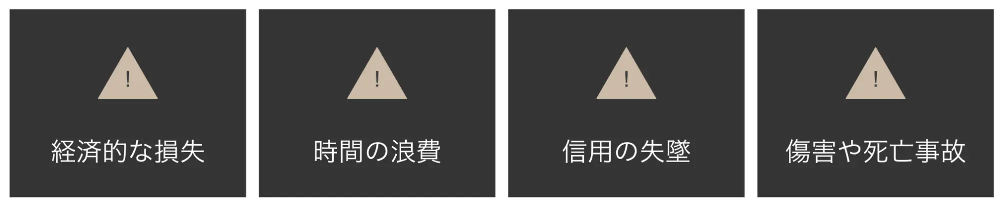

ソフトウェアの品質保証を行う弊社サービス『TESTAR LAB(テスター・ラボ)』には、JSTQB(日本ソフトウェアテスト資格認定委員会：Japan Software Testing Qualifications Board)が実施している、JSTQB 認定テスト技術者資格試験の資格保有者が在籍しています。

本記事では、JSTQBが作成している、JSTQB 認定テスト技術者資格試験の Foundation Level、「テスト技術者資格制度 Foundation Level シラバス」の第 1 章「テストの基礎」の中から、「1.1 テストとは何か」について解説していきます。

「テスト」と聞いてどんなことを思い浮かべますか。

欠陥を発見する・・？

これは間違いとも正しいとも言えません。

また、「デバッグ」という言葉を聞いたことがある方も多いと思います。

「テスト」と「デバッグ」は同じか？

結論から言うと、**同じではありません。**

## テスト：

ソフトウェアに存在する欠陥に起因する故障を発見することを目的としている

## デバッグ：

故障の基となる欠陥を見つけて、欠陥の原因を解析し、修正する一連の開発の活動のこと

一般的には、テスト担当者はテストに責任を持ち、開発担当者はデバッグに責任を持つことになります。

ただし、実際の開発現場では開発ライフサイクルによって、役割が変わることもあります。例えば、アジャイル開発では、テスト担当者はアジャイルチームの一員となります。大まかな役割分担はありますが、それにとらわれず、コンポーネントテストのテスト設計をレビューしたり、デバッグのためにソースコードを調べたりすることもあります。

ソフトウェアシステムは、私たちの生活の中に多岐に渡って関わり、さまざまな分野で使われることが必須となっています。

そのためソフトウェアが正しく動かないと私たちの生活にも大きく影響してきます。

また、ソフトウェアシステムが期待通りに動作しないことで不都合が生じる対象はだけではありません。ソフトウェアを作る側にとっても不都合が生じることがあります。

ではなぜソフトウェアのテストを行うのでしょうか？テストをしないと、どのようなことが起きるのでしょうか？

ソフトウェアが期待通りに動かないことによる不都合は、以下の４つがあると言われています。

|     | 損失の種類     | 損失の説明                                                                                                                                                                                                                                                                                                                                                                                                                                                                                                                                                                                                                                                                                                                        |
| --- | -------------- | --------------------------------------------------------------------------------------------------------------------------------------------------------------------------------------------------------------------------------------------------------------------------------------------------------------------------------------------------------------------------------------------------------------------------------------------------------------------------------------------------------------------------------------------------------------------------------------------------------------------------------------------------------------------------------------------------------------------------------- |
| 1   | 経済的な損失   | トラブルが発生した場合、システム修正やその修正に対して行う再テストにかかるコスト、クレーム受付や製品回収などのトラブル対応にかかるサポートコストが考えられます。 また、ユーザーが受ける損失だけではなく、そのシステムを利用しているユーザー企業の業務が止まってしまうことによる損害への補償や機会損失も忘れてはいけません。 2016 年に発表された調査結果によれば、データ損失やシステムダウンなどのシステム障害により生じた過去 1 年間の損失額は、国内企業 1 社あたり約 2 億 1,900 万円、国内全体で約 4 兆 9,600 億円とされており、システム障害による経済損失やその影響は大きく、システム障害の未然防止は企業にとって喫緊の課題であるといえます。 引用元：[IPAWeb サイト](https://www.ipa.go.jp/sec/reports/20160229.html) |
| 2   | 時間の浪費     | 経済的な損失で発生するコストは、たいてい時間的な損失として発生します。時間的な損失は、単純なコストだけは済まされない浪費となります。 例えば、システムトラブルが起きてしまって修正作業を行う場合、本来別に使う予定であった開発担当者の時間を圧迫します。単純に対象の製品対するコストが増加するのではなく一見関係ないようにみえる他の製品の開発コストやスケジュールにまで影響を及ぼし、マネジメント的な調整が必要になります。問題が大きくならないようにするために、開発担当者の労働時間を増やすことで対処する場合も多く、精神的、体力的なストレスから健康問題にもつながることがあります。                                                                                                                                        |
| 3   | 信用の失墜     | 品質の低下は信用を失うことになります。また、そのような状況が続くと製品としての競争力も弱まり、結果として会社の信用まで失うことにもなります。                                                                                                                                                                                                                                                                                                                                                                                                                                                                                                                                                                                      |
| 4   | 傷害や死亡事故 | ソフトウェアシステムは様々な用途で使われています。ソフトウェアが正しく動作しないことで、傷害や死亡事故につながる場合があります。2001 年の例ですが、パナマの病院でがん治療に利用する放射線装置のソフトウェアに欠陥があり、患者に対して許容量以上の放射線を浴びせたため、5 名もの命が絶たれてしまうという惨事がありました。                                                                                                                                                                                                                                                                                                                                                                                                         |

## テストとは

テストと聞くと、テストを実行すること（ソフトウェアを実行して結果を確認すること）だと思われる方が多いようです。実は、テストの活動はソフトウェアを実行して結果を確認することがすべてではありません。

テストを実行する他にさまざまな活動があります。これをテストプロセスと言います。

以下にテストプロセスとともに、**Testar-lab で標準としている作業をご紹介します。**

### テスト実行前作業

テスト実行前に実施しておくべき作業です。この事前作業を軽視してこの作業を行わずテスト実行に取りかかることはテストチームにとってリスクとなります。

| 作業       | 作業の説明                                                                                                                                                                                                                                                        | Testar-lab 標準                                                                                          |
| ---------- | ----------------------------------------------------------------------------------------------------------------------------------------------------------------------------------------------------------------------------------------------------------------- | -------------------------------------------------------------------------------------------------------- |
| テスト計画 | テストの準備作業、リソース配分、いつまでにどのような作業を実施するのかを計画します。テストの終了基準についても決定します。                                                                                                                                        | ・テスト計画書の作成 ・スケジュール表の策定 ・Q&A 表の用意 ・BTS の準備 ・テストベースの選定 |
| テスト分析 | テストベース(\*1)を分析し、何をテストするのかを決定します。 テスト計画で定めたテスト戦略に基づいてテストを行うための情報、つまりテスト対象の性質や品質、特徴などが記されたテストベースを収集した上で、取捨選択、再収集、新たに作成するなどを検討していきます。 | ・観点表の作成 ・テスト手法の選定 ・自動テストの検討                                               |
| テスト設計 | 特定したテスト条件を網羅して確認できるようテストケースを設計します。 ★ 実際のテスト現場では、テスト条件を網羅した確認をすべて実行できるとは限りません。この点については、以降の記事で解説していきます。                                                        | ・ディシジョンテーブルの作成  ・テストケース仕様書の作成 ・自動テストの Script 作成             |
| テスト実装 | テスト実行に必要なものをすべて準備します。 ★ 実際のテスト現場では、すべてが都合よく準備が実施されないこともあり、五月雨に準備が進められていくこともよくあります。                                                                                              | ・テスト用データの準備 ・スマホなどの機材準備 ・自動テストの環境構築                               |

(\*1)テストベースとは、テスト設計のインプット（RFP や企画書、発注者やユーザー観点で記されたドキュメント、要求仕様書、機能仕様書、など）テストのスコープにより様々なものがあります。

### テスト実行時の作業

テスト実行時に行うべき作業です。単にテストケースを実行するだけでなくて、テスト計画やテスト設計で決定した事項の確認を忘れないようにしなければなりません。

| 作業                 | 作業の説明                                                                                                                                                                                                         | Testar-lab 標準                                              |
| -------------------- | ------------------------------------------------------------------------------------------------------------------------------------------------------------------------------------------------------------------ | ------------------------------------------------------------ |
| 実行結果のチェック   | テストケースを実行して得られた結果の確認を行います。何度も実行するテストケースであれば、結果の確認を自動化したほうがよいでしょう。 ★ 実際のテスト現場では、エビデンスを取得してチェックをするケースもあります。 | ・BTS の起票 ・自動テストの見直し ・品質向上施策の策定 |
| テスト終了基準の評価 | 計画時に決定した終了基準を満たしているかを評価します。 ★ 実際のテスト現場では、終了基準を定義しているものの評価までしっかりできていることは少ないかもしれません。                                               | ・出荷基準に対するテスト                                     |

### テスト完了作業

次のテストプロジェクトのための作業です。この積み重ねが行われることにより、テストプロジェクトが成熟していきます。また担当者自身のテスト技術向上につながります。

| 作業               | 作業の説明                                                                                                                                                 | Testar-lab 標準          |
| ------------------ | ---------------------------------------------------------------------------------------------------------------------------------------------------------- | ------------------------ |
| テスト結果の報告   | テスト実行結果、欠陥への対応結果、終了基準の達成度合いなどについて、ステークホルダーへ報告します。                                                         | ・テスト結果報告書の作成 |
| テストウェアの整理 | テストプロジェクトが終了したときに、テストウェアの整理を行い資産化し、次回のテストプロジェクトに引き継ぎ、良いスパイラルを回していくための作業を行います。 | ・観点表のアップデート   |

### 全体を通して行われる作業

テストプロジェクト全体を通して行われる作業です。

| 作業                       | 作業の説明                                                                             | Testar-lab 標準                                                                |
| -------------------------- | -------------------------------------------------------------------------------------- | ------------------------------------------------------------------------------ |
| モニタリングとコントロール | テストの進捗管理やテストカバレッジと終了基準の達成状況をモニタリングなどを実施します。 | ・進捗管理表の作成 ・不具合分析 ・品質向上施策の策定 ・制約事項の管理 |

テストは、検証と妥当性確認があります。

#### 検証：

期待結果と確認結果が一致するかどうかを確認すること

#### 妥当性確認：

仕様そのものが正しいかどうかを確認すること

テストとは、検証することを指していることだと思われるケースが多いです。

妥当性は、基本的には関係者の期待を元に開発をするものですが、実際に動かしてみないと判断できない場合もあるため、妥当性確認もテストで確認することが大事になります。

## テストの目的

テストの最初に必ず行わなければならないことは、テストの目的をはっきりさせることです。目的はさまざまであり、どのようなテストをするかによって、テストにかける工数や期間、テストを行うメンバーのスキル、開発担当者との関わり方など色々なことが変わってきます。ISTQB では、一般的に共通して必要だと思われるテストの目的を明記しています。テストの目的は、テスト対象のクリティカルな度合い、採用しているソフトウェア開発ライフサイクル、またテストレベルといった要因で取捨選択していきます。

**実際のテスト現場では、この「テストの目的をはっきりさせること」を飛ばしてテスト計画の作成に着手していることがほとんどではないでしょうか？目的があいまいなままに進めてしまうことはリスクとなりますし、後から「なぜこのテスト計画になったのか」を問われたときに、こんな目的があったからといえることが大事だと思います。**

共通する目的を以下に示します。

### 評価　

要件、ユーザーストーリー、設計、およびコードなどの作業成果物の評価

作業成果物をレビューする中で、正しく書かれていること以外についても確認することを指します。

例えば

- 間違ってはいないが誤解を招きやすい表現で記述されている
- 同じことがいろいろな場所に重複して書かれている
- 構成に一貫性がなく非常に読みづらい

などです。これらは一例ですが、作業成果物の評価を目的にする場合は、観点をあらかじめ洗い出し、評価対象の作業成果物ができた段階で確認をすることになります。

#### 【Testar-lab の取り組み】

結合テストの設計時に仕様不備を検出、後工程への流出を防止しています。

### 要件を満たしている

明確にしたすべての要件を満たしていることの検証

- どのテストレベルでもテスト対象となる作業成果物、コンポーネントやシステムが要件を満たすことを検証する必要があります。最も共通的なテストの目的だと言えます。

#### 【Testar-lab の取り組み】

統合テスト設計時に要件漏れを検出、後工程への流出を防止しています。
あわせて、ユーザビリティを考慮してテスト実施します。

### 妥当性確認

テスト対象が完成し、ユーザーやその他ステークホルダーの期待通りの動作内容であることの妥当性確認

- 受け入れテストでは、要件の検証だけでなく、テスト対象に対して、それを使うユーザーや、そのテスト対象のステークホルダーが期待していると思われる動作内容を確認します。また、受け入れテストでは欠陥の検出を目的とせずに、ソフトウェアの品質確認を行い、所定の時期にソフトウェアをリリースすればどんなリスクがあるのかをステークホルダーに提供するために行われることもあります。

#### 【Testar-lab の取り組み】

業務フロー・ユースケースを想定したシナリオテストを実施しています。

### ステークホルダーが判断できる情報の提言

ステークホルダーが意思決定できる、特にテスト対象の品質レベルについての十分な情報の提供

- これは「テスト対象の品質に対する信頼を積み重ねて、所定のレベルであることの確証」とほぼ同様の活動となります。ただし、テストを行った結果、品質が所定のレベルであることを確証できない部分についても適切に評価することが含まれます。欠陥の修正が完了しないままリリースをしなければならない場合に、欠陥がどの程度のインパクトとなるのか？回避策はあるのか？といったところまで考慮して評価を行うことで、意思決定のための有用な情報となります。テストの最も重要な目的は、この「意思決定のための情報提供」だと言っても過言ではないでしょう。

#### 【Testar-lab の取り組み】

テストの進捗、検出した不具合を分析などをもとに、品質向上施策を策定します。

### 品質レベルのリスク低減

（以前に検出されなかった故障が運用環境で発生するなどの）不適切なソフトウェア品質のリスクレベルの低減

- これを目的としたテストをする際に必要となるのがリグレッションテストです。リグレッションテストについては、別の章で詳しく説明がありますのでここでは言及しません。

#### 【Testar-lab の取り組み】

機能追加などアップデート時に効果的、且つ必要十分なテスト項目を選定しリグレッションテストを実施しています。

### 契約・法律・規約の検証

契約上、法律上、また規則上の要件や標準を遵守する、そして／またはテスト対象がそのような要件や標準に準拠してしることの検証

- ソフトウェアシステムが使われる業界ごとに、独自の要件や標準を遵守する必要がある場合があります。例えば、自動車業界の車載コンポーネントやシステムであれば ISO 26262 という自動車の電気/電子に関する機能安全についての国際規格があり、この規格に遵守したテストを行う必要があります。

#### 【Testar-lab の取り組み】

参画するプロジェクトに応じて業界ごとに準拠すべき情報のキャッチアップをし、観点として試験に取り入れています。

### 故障や欠陥を発見する

開発でのテスト（コンポーネントテスト、統合テスト、システムテスト）の主たる目的となります。なるべく多くの故障を発見して、ソフトウェアの欠陥を特定して修正することです。

#### 【Testar-lab の取り組み】

観点表をあらかじめ用意し網羅的に機能を確認。

不具合の取りこぼしを防止しています。

### 欠陥の作り込みを防ぐ

欠陥の作り込みの防止

- 欠陥の作り込みの防止は、長い期間をかけた改善活動の一環としてテストを利用することになります。とある開発を行っている際のテストにて検出した故障と修正した欠陥の原因分析を行い、その後の開発時に「要件、ユーザーストーリー、設計、およびコードなどの作業成果物の評価」を行う際の評価観点に分析結果を取り入れることで、同じ欠陥を作り込むことを防止するといった活動が該当します。

#### 【Testar-lab の取り組み】

不具合の混入フェーズを特定し、開発側に改善を求めています。

### 品質レベル確認

テスト対象の品質に対する信頼を積み重ねて、所定のレベルにあることの確証

- これは「明確にしたすべての要件を満たしていることの検証」や「故障や欠陥の発見」そして「テスト対象が完成し、ユーザーやその他ステークホルダーの期待通りの動作内容であることの妥当性確認」をした結果として、開発担当者、プロジェクトマネージャー、もしくはユーザーに伝えることのできる情報になります。確証が持てるようにするためには、ある部分のテストに合格しているだけでは不十分であり、全テストレベルで計画したテスト結果を包含して確認することが必要になるため、テスト結果や欠陥修正の結果を、メトリクスを使って確認する必要があります。

#### 【Testar-lab の取り組み】

テスト実施状況、不具合の検出ならびに修正状況を分析、品質レベルを測定し PRJ に報告します。

## 最後に

ここまでソフトウェアテストについてや目的などを説明してきました。
この記事を通じて、少しでもテストについての重要性が伝わっていたら幸いです。

次回は「テストの基礎その 2」についてご紹介します。

## 『TESTAR LAB(テスターラボ)』とは

テスターラボとは、アプリケーションの機能・サービス品質をテストすることに特化した新サービスで、１７ カ国 29 都市の豊富な人材リソースおよび国内外パートナー企業との豊富なネットワークにより、コスト最適でスピーディな提案をいたします。

テスターラボは自社サービスの品質に課題を感じている顧客、バージョンアップ頻度が高くリグレッションテスト（※）にコストと時間がかかっている顧客を対象にコスト効率・検出効率を最適化し、独立した第三者検証チームを提供いたします。

※リグレッションテストとは、開発でプログラムの一部を変更した際に、新たな問題が発生していないかを検証するテストのことです。
