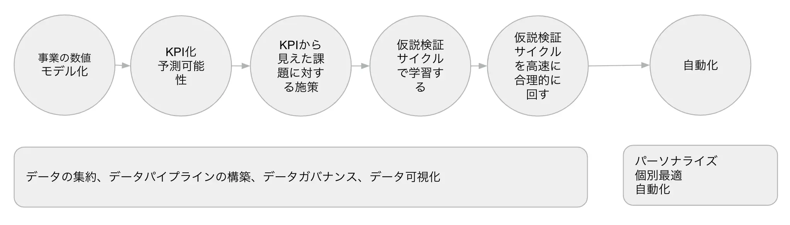
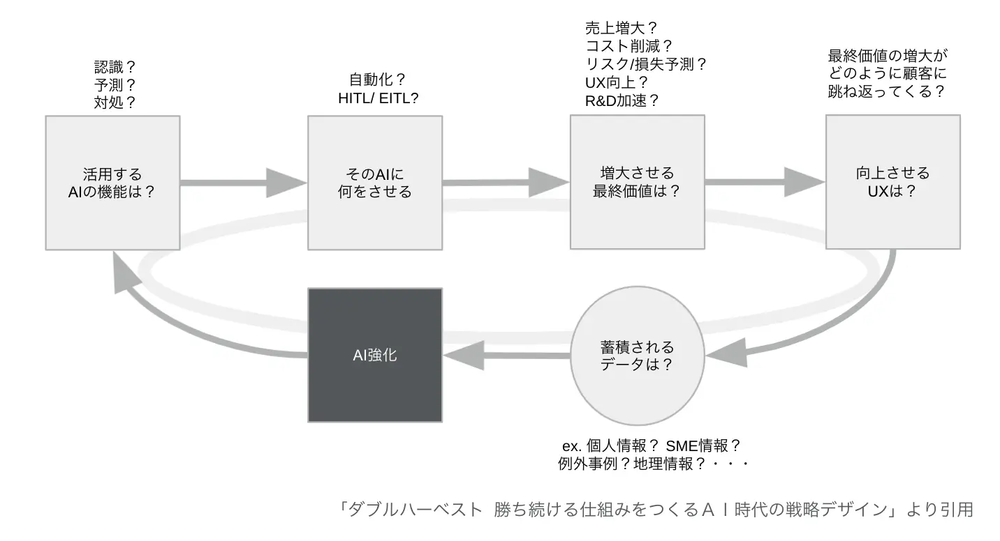
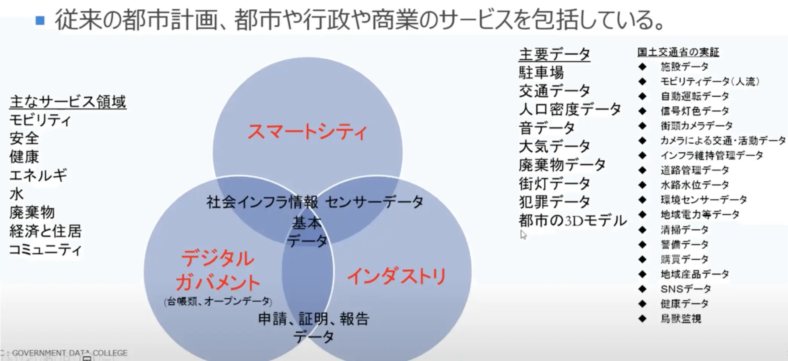

こんにちは皆さん、モンスターラボ CTO APAC の 平田 です。この記事ではデータ利活用について書きます。

## データの利活用と言うものの？

「データは21世紀の石油だ」「データ活用が企業の命運を握ることになる」と言われます。
データの利活用がデジタル・トランスフォーメーション(DX)の鍵になるのは、おそらく間違いありません。ただ、データの利活用といっても、それが意味しているものが何か、人により捉え方はさまざまです。ある人にとっては機械学習であり、他の人にとってはデータ駆動経営を意味しています。他にも色々な捉え方があります。
データ活用のフィールドは昨今の盛り上がりもあり、ソフトウェアエンジニアだけでなくビジネスサイドなど多種多様な分野からの人の流入があり、多くの視点や観点で語られる混沌とした状況にあります。

データの利活用は重要に違いないが、ビジネスでの活用や実際に成功にまで結びつけていく必要があり、そのためのより良い認知マップが必要だと感じます。この記事では、私が普段仕事を通じて得た、また書籍や動画を通じて学んだデータ利活用について、まとめてみようと思います。

## データ利活用の3種

1. データ駆動経営、分析、ターゲッティング
2. AIにより単純作業をなくす。ノウハウのAI化
3. データの組み合わせや保有データの新たな展開で新しいValueを創出する

この分類は、デジタル庁の平本 健二さんの[2021データ研修](https://www.youtube.com/watch?v=nuK3rnRhIQo)にインスパイアされています。それぞれでオーバーラップしている部分もあり、明確な線引はないですが、データの利活用方法をうまく分類出来ていると思います。
ひとつずつ簡単に見ていきましょう。

## 1.データ駆動経営、分析とターゲッティング

まずは「1.データ駆動経営、分析とターゲッティング」からです。
事業経営のモニタリングや方向性の決定をデータドリブンに行う取り組みです。データ利活用の王道と思います。
プロダクト開発の現場では、ソフトウェア・プロダクト開発する側も、ユーザー自身も現在の自分にどんなプロダクトが必要なのか分からない、誰もが答えを持っていない状況の中、事業を進める必要があります。正解がないものを作るということは、すべてが「仮説」ということになります。この仮説検証のために、

- 「アジャイル開発」であれば、プロダクトを適切な粒度で、素早く作り、ユーザーへ提供する、ユーザーの反応を学びながら、仮説検証を繰り返していくことになります。
- 「デザイン思考」であれば、例えば、仮説を持ってユーザーにインタビューすることで、仮説の正しさらしさを検証したり、課題の感覚を拾い上げたり、カスタマーの隠れたニーズを引き出したりします。
- 「データ駆動」では、データを見ることで仮説を検証し、少し先の未来を予測しながら事業を作っていく。「直感」や「経験」でしか考えらなかった問題に対して、データを武器にして、より客観的に見た指針で、次の戦略・仮説を立案する。主観のぶつかり合いではなく、客観的に見た指針で、スピード感をもった意思決定ができる場面を増やすということになるでしょう。

以下の図は、データ駆動経営の大まかな流れです。

事業構造を数値モデル（KPIツリー）として正しく理解して、事業の観測可能性をあげます。そこから見えてくる勝ち筋に対するアプローチを検討するためにデータを活用するもので、指標に基づいた仮説検証ループ（構築 Build->計測 Monitor->学習サイクル Learn）を回しながら、日々事業改善を行います。
開発現場目線では、単にECサイトをソースコードを書いて構築していくだけではダメで、ユーザーの一挙手一投足を細かくトラッキングすることが必要です。このページをクリックして、ここまでページスクロールした上で購入ボタンを押したこのユーザーは、30歳男性で東京に住んでいるユーザーである。というようなものです。
ミクロな行動をしっかりと捉え、分析基盤を通じて売上のようなマクロなKGIを分析できるようにするなど、ミクロとマクロがシームレスにつながる状態を目指します。言い換えれば、財務諸表（P/L）からユーザーの行動までを結びつけるということです。

仮説検証ループ（構築 Build->計測 Monitor->学習サイクル Learn）の内、計測に特化した書籍が「LEAN Analytics」で、優れた KPI の特徴や事業のステージ毎にどのようにデータを活用していくのか、例を含めて丁寧に説明してあり役に立つと思います。仮説の検証にはA/Bテストなどが使われます。
また、書籍「DMM.com を支えるデータ駆動戦略」が、このテーマを扱っており、全体感の把握にとても参考になります。

### データ駆動経営の副産物 パーソナライズとAIを使ったデータ分析

データ収集のインフラが出来て、データが多く集まれば、機械学習による自動化・個別最適ができる基盤ができてきます。代表的なものが商品のレコメンドで、あなたにおすすめの商品はこちら、というものです。膨大なログデータから、ユーザーの趣味嗜好にあった商品などをおすすめします。コンテンツ、ユーザー属性、ユーザーの行動が合わせてリコメンデーションエンジンを作ります。
パーソナライズだけでなく、蓄積されたデータで機械学習を使った分析を行い、よりハイレベルな課題に取り組むことができます。どの商品をどこで売るべきか、新しい店舗はどこに開くべきか、閉じるべきかなどの複雑な問に対して、データ分析で答えていきます。

### データ分析基盤

データ駆動経営を支えるインフラ基盤にはいくつかベーシックな型があります。以下は AWS によるラムダアーキテクチャの例です。バッチ処理を行うScaleレイヤとリアルタイム処理を行うSpeedレイヤがあります。

## 2. AIにより単純作業をなくす。ノウハウのAI化

次は、「2. AIにより単純作業をなくす。ノウハウのAI化」です。
AIの活用範囲は広大で簡単にまとめることは難しいですが、大雑把に捉えれば、蓄積されたデータを活用し、AIを使って業務効率化、自動化を目指すものといえると思います。具体的な事例は多くの場所で見つけることができるので、ここではAIを活かした事業戦略の検討に便利なフレームワークを紹介します。
「ダブルハーベスト」という書籍では、継続して価値を発揮するAIを構築するためのフレームワークが紹介されています。

- 活用するAIの機能は何なのか？
- そのAIに何をさせるのか？
- 増大させたい最終価値は何なのか？
- 向上させたいUXは何なのか？
- そのAIを活用した活動を行うことで自然と蓄積されるデータは何か？
- 蓄積されたデータを使ってさらにAIを強化できるのか？

こうした問いに答えることで、検討中のAI戦略の筋が良いものなのかを明らかにします。特にデータが持続的にたまり、それによってAIの精度が上がり続けるループ構造（ハーベストループ）が構築できるかは重要であり、さらには事業を特徴づける他社が簡単に真似できない競争優位のあるデータを育てることができるかという発想も大事です。少ないデータ量で達成できるAIは、いずれレッドオーシャンになってしまいます。ループが構築できてしまえば、当初はデータの蓄積がなくても、事業活動により自然とデータが蓄積され、精度は後からついてくると考えます。設計段階からどんなデータを集めるかを考えて、AI戦略をデザインします。

## 3. データの組み合わせや保有データの新たな展開で新しいValueを創出する

最後に「3. データの組み合わせや保有データの新たな展開で新しいValueを創出する」です。
最もよく聞く例としては、気象データとTweetを組み合わせて販売量を予測するというものです。急ブレーキデータを都市計画に使う、というクリエイティブなものもあります。
既に蓄積されたデータのうち有効利用されずに保存されているデータのことをダークデータといいますが、新たな使い道を見出せる場合もあります。たとえば、カスタマーサポートで録音された音声が蓄積されているが有効利用されていない。よくあるお問い合わせを抽出してFAQとして活用したい。チャットボットによる応答に使いたいなどです。
スマートシティーは、データの組み合わせで価値を発揮できる良い例です。分野を横断してデータを組み合わせる。データを使いこなせるかどうかでサービスの競争力が変わり、より豊かに暮らせるかが変わります。
先に紹介した平本 健二さんの[2021データ研修](https://www.youtube.com/watch?v=nuK3rnRhIQo)に、とても刺激的なスライドがあったので引用します。

これらのデータを組み合わせれば何ができそうか、夢が膨らみますね。

## 最後に

データが生み出す価値をプロダクト開発に取り込む3つの方法を簡単に紹介しました。それぞれの How や事例については、またの機会に深堀りしたいと思います。実際の開発現場でも、これらのデータの利活用をどんどん進めて、より良い社会をつくりたいですね。
