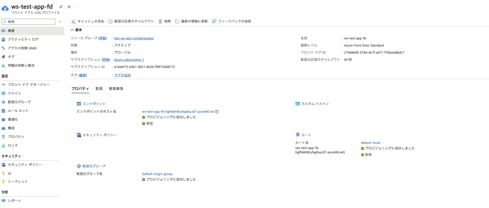
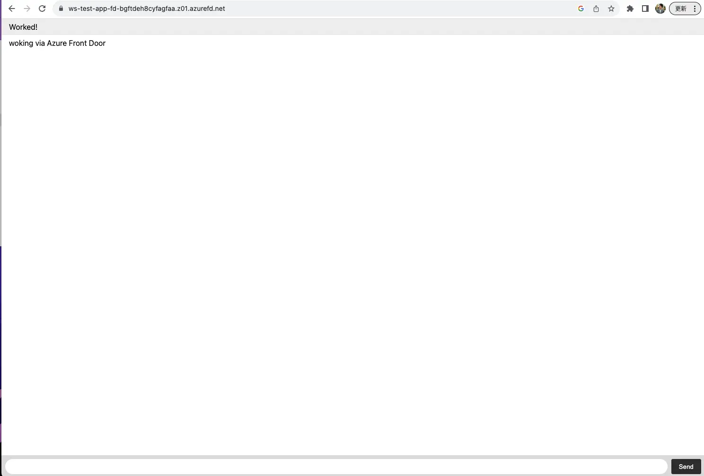

## はじめに

こんにちは！
Backendチーム所属の森田です。  
最近少し関わった案件で、「Azureのソリューションを使った、グローバルな（リージョン間の）負荷分散を実現したWebアプリケーションを構築したい」というものがありました。  
グローバルな負荷分散について検討するのは初めてだったため色々と調べていたのですが、その中でAzure Front Door周りの挙動で気になる部分があったため共有いたします。  
お話の内容としては「Azure Front DoorはWebSocketに対応していないと言っているけど、実は対応しているのでは？」という内容です。  

## どんな人がターゲットか

- Azure Front Doorを使ったL7でのリージョン間負荷分散がしたい人
- WebSocketを使ったWebアプリケーションを負荷分散できるようにしたいが、Azure Front Doorが対応していないっぽくて気になっていた人

## おさらい：リージョン間の負荷分散の選択肢について

Azureでリージョン間の負荷分散を実現するためには、以下のようなものを選択することができます。

| サービス | グローバル | 推奨されるトラフィック|
| ---- | ---- | ---- |
|Azure Front Door|グローバル|HTTP(S)|
|Azure Traffic Manager|グローバル|非HTTP(S)|
|Azure Load Balancer|リージョン/グローバル|非HTTP(S)|
|Azure Application Gateway|リージョン|HTTP(S)|

それぞれのサービスについての詳細と、どのようなケースで使うのが良いかについては、以下の公式ドキュメントに記載されています。  
https://learn.microsoft.com/ja-jp/azure/architecture/guide/technology-choices/load-balancing-overview

サービスを分類するための2つの次元について簡単に説明すると、「グローバルな（リージョン間での）負荷分散ができるかどうか」と「HTTP(S)以外のトラフィックを扱えるかどうか」の2つです。  
1つめの次元、「グローバルな（リージョン間での）負荷分散ができるかどうか」について見てみると、Azure Application Gateway以外の3つのサービスがグローバルな負荷分散を実現できることがわかります。  

2つめの次元、「HTTP(S)以外のトラフィックを扱えるかどうか」について見てみましょう。  
非HTTP(S)な通信（ソケット通信など）を使いたい場合は、Azure Traffic ManagerかAzure Load Balancerを使うことになります。  
逆に、Azure Front DoorとAzure Application GatewayはL7レイヤーのロードバランサーなので、HTTP(S)通信を扱う場合はこの2つのサービスが候補に入ってきます。  

これらのサービスは1つだけを選択するだけではなく、組み合わせて使うこともできます。  

みなさんがアプリケーションを構築したいとき、どのような負荷分散オプションを使用すればよいか（あるいは組み合わせればよいか）は[こちらのデシジョンツリー](https://learn.microsoft.com/ja-jp/azure/architecture/guide/technology-choices/load-balancing-overview)によくまとまっています。

## Webアプリケーションをグローバルに負荷分散したい場合は何を選ぶべきか

先程リンクを張ったデシジョンツリーを見ると、Webアプリケーションをグローバルに負荷分散したい場合はAzure Front Door(もしくはそれと他のサービスの組み合わせ)を使用するのが良さそうです。

実際、Azure Front DoorはCDNの機能も有しており（以前はAzure CDN Standardが提供していましたが、Front Doorに統合されました）、WAF(Web Application Firewall)も提供しています。  
AzureでWAFを使いたい場合、Front DoorかApplication Gatewayの2つの選択肢が存在しますが、Application Gatewayはリージョン内での負荷分散をするものなので、グローバルな負荷分散をしたい場合はFront Doorを選択するほうが適切です。  
SSL終端処理もできますし、パスベースのルーティングやキャッシュ、高速フェールオーバーなどL7ロードバランサーとしての機能は非常に充実しています。  

上記の理由からWebアプリケーションをグローバルに負荷分散したい場合はFront Doorを使えば問題ないように見えますが、公式ドキュメントを見ると気になる文言があります。  

## 疑問：Azure Front DoorではWebSocketをサポートしていない？

前のセクションでリンクを貼った公式ドキュメントには、2023年9月現在、重要な一文があります。  

```
現時点では、Azure Front Door では Web ソケットをサポートしていません。
```

最近のWebアプリケーション（特にチャット機能を持つもの）ではWebSocketを使うことはよくあることで、これがサポートされていないのはかなり気になるところです。  
以下は直近1年でMicrosoftに寄せられたQAの一例ですが、コメント等を見ればわかるようにかなり多くの開発者がこの件について不満に思っていたことがわかります。  
https://learn.microsoft.com/en-us/answers/questions/1051011/azure-front-door-web-socket-connectivity-issue
https://github.com/MicrosoftDocs/architecture-center/issues/4011

少なくとも2022年10月の時点では、Microsoftから「WebSocketについてはサポートしていない」という回答が出ています。  

しかしながら、以下の機能リクエストに気になるコメントが付いていることを見つけました。  
https://feedback.azure.com/d365community/idea/c8b1d257-8a26-ec11-b6e6-000d3a4f0789

```
Azure Front Door now supports WebSocket connections, enabling real-time, bidirectional communication for interactive web applications, such as live chats and online gaming, enhancing user experience and engagement.

```

Front DoorでWebSocketがサポートされた、というコメントです。  

一方でその直後に
```
Just checked with Microsoft team. No WebSocket support so far. 
```

というコメント（訳：公式に聞いてみたがサポートされていないみたいだよ）も付いており、見ただけでは果たしてWebSocketがサポートされているのかいないのか、よくわかりません。  
そこで、実際に簡単なWebSocketを使ったチャットアプリケーションを作成、デプロイし、Front Door経由でアクセスしてみることで検証してみます。  


## Front DoorがWebSocketをサポートしていないのか試してみる

### 前提条件

- 簡単なWebSocketを使ったアプリケーションをデプロイし、Front Doorからアクセスして検証してみる
- グローバルな負荷分散については一旦考慮しない
  - 本来なら実施したかったのですが、WebSocketを複数サーバ間で伝播させるためにはRedisやMQTTなどを用いてサーバー間の連携を行う必要があり、時間がかかりそうだったため一旦スコープ外としています。
- WebアプリケーションはContainer Appsに配置する

### テスト用のチャットアプリの作成とデプロイ

まずは施行するためのアプリケーションを作成します。  
今回の主眼は「Azure Front Doorは本当にWebSocketをサポートしていないのかを検証すること」なので、検証用のアプリケーションはごく簡単なものを使います。  
Socket.ioの公式ページにある、[チャットアプリケーション](https://socket.io/get-started/chat/)を使います。  
```javascript
const express = require('express');
const app = express();
const http = require('http');
const server = http.createServer(app);
const { Server } = require("socket.io");
const io = new Server(server);

app.get('/', (req, res) => {
  res.sendFile(__dirname + '/index.html');
});

io.on('connection', (socket) => {
    socket.on('chat message', (msg) => {
      console.log('message: ' + msg);
      io.emit('chat message', msg);
    });
  });

server.listen(8080, () => {
  console.log('listening on *:8080');
});
```

```html
<!DOCTYPE html>
<html>
  <head>
    <title>Socket.IO chat</title>
    <style>
      body { margin: 0; padding-bottom: 3rem; font-family: -apple-system, BlinkMacSystemFont, "Segoe UI", Roboto, Helvetica, Arial, sans-serif; }

      #form { background: rgba(0, 0, 0, 0.15); padding: 0.25rem; position: fixed; bottom: 0; left: 0; right: 0; display: flex; height: 3rem; box-sizing: border-box; backdrop-filter: blur(10px); }
      #input { border: none; padding: 0 1rem; flex-grow: 1; border-radius: 2rem; margin: 0.25rem; }
      #input:focus { outline: none; }
      #form > button { background: #333; border: none; padding: 0 1rem; margin: 0.25rem; border-radius: 3px; outline: none; color: #fff; }

      #messages { list-style-type: none; margin: 0; padding: 0; }
      #messages > li { padding: 0.5rem 1rem; }
      #messages > li:nth-child(odd) { background: #efefef; }
    </style>
  </head>
  <body>
    <ul id="messages"></ul>
    <form id="form" action="">
      <input id="input" autocomplete="off" /><button>Send</button>
    </form>
    <script src="/socket.io/socket.io.js"></script>
    <script src="/socket.io/socket.io.js"></script>
    <script>
      var socket = io();
    
      var messages = document.getElementById('messages');
      var form = document.getElementById('form');
      var input = document.getElementById('input');
    
      form.addEventListener('submit', function(e) {
        e.preventDefault();
        if (input.value) {
          socket.emit('chat message', input.value);
          input.value = '';
        }
      });
    
      socket.on('chat message', function(msg) {
        var item = document.createElement('li');
        item.textContent = msg;
        messages.appendChild(item);
        window.scrollTo(0, document.body.scrollHeight);
      });
    </script>
  </body>
</html>
```

完全なコードを確認したい場合は、以下のリポジトリを参照ください（殆ど上記のリンクそのままです）
https://github.com/Kent-Morita/test-ws-app

localhostで`node index/js`を実行して動作確認すると、以下のような画面が表示されます。  

どうやら、localhostではきちんと動いているようです。  

続いて、Dockerfileを作成して、アプリケーションをコンテナ化します。  
コンテナ化が完了したら、作成したアプリケーションをAzure Container Appsで動くように、Container Appsを作成します。  
以下の公式ドキュメントを元に、Container Appsを作成します。  
https://learn.microsoft.com/ja-jp/azure/container-apps/tutorial-code-to-cloud?tabs=bash%2Ccbu &pivots=acr-remote

詳細はリンクを参照いただければと思いますが、簡単な流れを記載します。  

- Azure CLIをインストールしておく（やっていなければ）
- リソースグループを作成する
- Azure Container Registryを作成する
- アプリケーションをビルドする
- Container Apps環境を作成する
- Container Appsにデプロイする

上記が完了すると、先程ローカルホストで確認したものと同じようなアプリケーションが公開されていることがわかります。  


### Front Doorを作成する

https://learn.microsoft.com/ja-jp/azure/frontdoor/create-front-door-portal#create-front-door-profile---quick-create
上記のリンクを参考に、Front Doorプロファイルを作成します。  



### 実際にアクセスしてみて試してみる

作成したFront DoorのURLにアクセスして、動いているかを確認します。  



動いています。  
Azure Front Door経由でWebSocket通信ができていることが確認できました。  
別ブラウザ及び別端末からも試してみましたが、通信ができているようです。  

## まとめ

Azure Front DoorがいつWebSocketに対応したのかについては定かではなく（確認できる限りでは、2023年8月頃から対応していた可能性があります）、今回の検証だけでは不足している部分もあるかと思いますが、少なくとも公式ドキュメントの記載は現時点では正しくないように見えています。  

このサポートにより、今までFront Doorを採用することが難しかった双方向コミュニケーションのためのWebアプリケーションにおいてもFront Doorを採用することが可能になりますし、WebアプリケーションをL7でグローバルに負荷分散したい場合、より多くの場合でFront Doorを使うことができるようになるはずです。  
Microsoft公式から発表が出るまでは断言ができないところですが、今までWebSocketが使えないことを理由に、Front Doorを使わずApplication Gatewayを（無理やり）使っていた皆さんは一度試してみても良いと思います。

## 参考

https://learn.microsoft.com/ja-jp/azure/architecture/guide/technology-choices/load-balancing-overview
