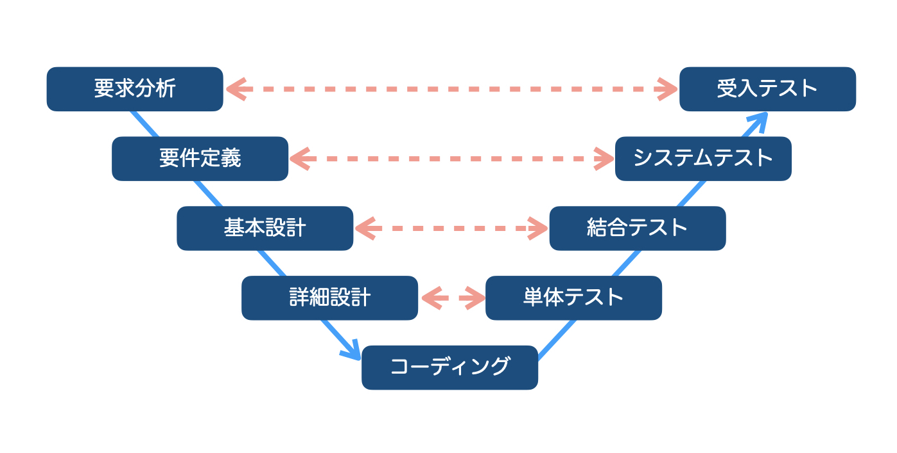
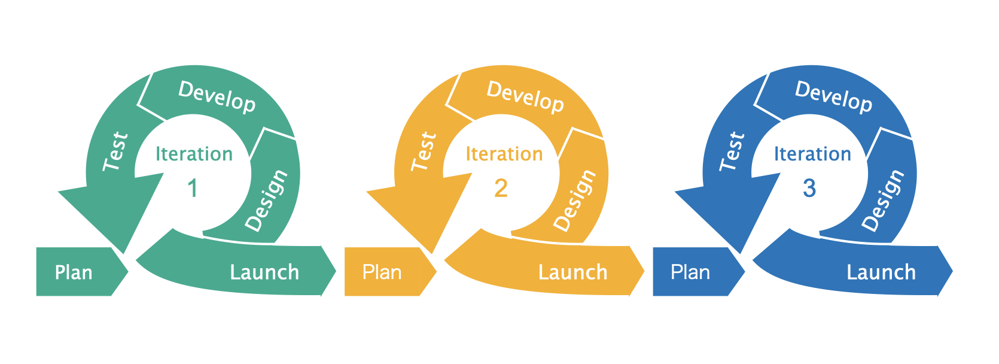

こんにちは。モンスターラボのQAチーム・テスターラボの秋元です。

この記事では、アジャイル開発におけるテスト（以下「**アジャイルテスト**」）について、ISTQB Foundation Level Agile Tester（※1）のシラバスを参考にしながら、以下の3つのテーマで整理します。
- ウォーターフォール型開発のテストとの違い
- 高い効率性を実現するには？
- アジャイルテストと第三者目線のジレンマ

※1 ISTQB（International Software Testing Qualifications Board：国際ソフトウェアテスト資格認定委員会）認定のアジャイルテストに関する資格

## ウォーターフォール型開発のテストとの違い
### ウォーターフォール型開発のテスト
ウォーターフォール型開発（以下「WF」）では、要求分析・設計・開発・テストの各工程で、成果物が確定してから次の工程に進みます。Waterfallと言う名の通り、前工程に戻ることは想定されていません。

テストに関しても、単体テストの完了を条件として結合テストを開始し、結合テストの完了を条件としてシステムテストを開始・・・というのが基本です。

また、図1で示すように、要件定義の成果物がシステムテストのテストベース（※2）となり、基本設計の成果物が結合テストのテストベースになる・・・といった工程間の関連性があります。

Figure: 図1. V字モデル

※2 テスト設計のインプットになる資料や情報

クライアントが直接プロダクトを触れるのは、受入テストの段階です。案件の規模にもよりますが、すべての工程で1年以上かかることも珍しくありません。

### アジャイルテストは短いスパンで繰り返す
一方、アジャイル型開発では、**数週間程度の短い開発サイクル**（**イテレーション**）ごとに動くプロダクトをリリースし、フィードバックを受けながら改良していきます。

テストも各イテレーション内で実施します。短期間でテスト設計から実施までを完了させるために、**高い効率性**が求められます。

Figure: 図2. アジャイルモデルのイメージ

### アジャイルテストのテストレベル
WFでは結合テスト、システムテストなどのテストレベルが明確に定義されていますが、アジャイルテストでは少し異なります。下表は、ISTQB Foundation Level Agile Testerのシラバスの説明を要約し、私の解釈を少し加えたものです。

テストレベル|実施者|実施タイミング|実施内容
--|---|---|--
単体テスト|開発者|イテレーション内|コンポーネントレベルの確認
フィーチャ検証テスト(*3)|開発者 or QA|イテレーション内|ユーザストーリーの受入基準を満たすことを確認
フィーチャ妥当性確認テスト(*3)|開発者・QA・ビジネスステークホルダ|イテレーション内|フィーチャーが利用に適していることを確認
システムテスト|QA|イテレーション外|ユーザーストーリーをテストベースとした機能テスト、非機能テスト
受入テスト|ユーザー全般|各イテレーション、またはすべてのイテレーション完了後|α/βテスト、ユーザ受入テストなど

上記をすべて必ず実施するのではなく、プロジェクトのニーズに応じた実施内容を検討し、計画することが求められます。

また、各イテレーションで実施したテストケースを積み上げて、リリース前に**リグレッションテスト**(*4)を行うケースもあります。

*3 『ISTQBテスト技術者資格制度 Foundation Level Extension シラバス アジャイルテスト担当者 日本語版』の用語を使用
*4 プログラムの一部に対する変更が、システムに意図しない影響を及ぼしていないか検証するテスト

## 高い効率性を実現するには？
### 仕様変更に対応しやすいテスト技法 ・・・ 探索的テスト
「アジャイルソフトウェアの12の原則」(*4) の1つに、

_”要求の変更はたとえ開発の後期であっても歓迎します。”_

という原則があります。WFでは考えられませんが、アジャイル開発ではプロダクトの価値を高めるために仕様変更は許容されます。

開発の後期で仕様変更が発生すると、**テスト設計の修正やテストのやり直し**が必要になります。最悪の場合、一生懸命作ったテストケースがすべて水の泡に・・・ということもあり、無駄なコストになります。

このような状況で有効なテスト技法として、**探索的テスト**があります。

*4 [アジャイル宣言の背後にある原則](https://agilemanifesto.org/iso/ja/principles.html) から引用

従来の**スクリプトテスト**では、テスト手順や期待値などが明記されたテストケースを使用しますが、探索的テストではテストケースを使いません。と言っても、アドホックテストやモンキーテストのようにやみくもに実施するテストとも異なります。
下表は、スクリプトテストと探索的テストの違いを整理したものです。

テスト技法|テストケース|メリット|デメリット  
--|---|---|--
スクリプトテスト|あり|・結果の個人差が出にくい ・網羅性を担保できる|・仕様変更時の手戻りが大きい
探索的テスト|なし|・経験に頼り効率的にバグを検出できる ・テストケース作成の工数が不要|・実施者に一定のスキルが必要 ・網羅性の担保が難しい

探索的テストにはいくつかのアプローチがありますが、テスターラボでは**テストチャーター**と呼ばれるテストの指針が書かれたドキュメントを用意し、これに沿ってテスト実施することが多いです。テストチャーターを使用することで経験の少ない実施者にもヒントを与えることができ、また定量的な分析も可能になります。

探索的テストはアジャイル開発にフィットするテスト技法ですが、表のとおりデメリットもあるため、**重要な機能はスクリプトテストを実施する**など、使い分けが必要です。

## 何度も実施するリグレッションテストを自動化
アジャイル開発ではコードの追加・変更・削除が多く発生するため、デクレードが起こりやすくなります。よって、**リグレッションテスト**の重要度が増します。

多くの場合、リグレッションテストでは過去に作成したテストケースを使い回して繰り返し実施するので、テストを自動化することで実行工数の削減が期待できます。これにより、QAは**新規機能や変更箇所のテストに集中できる**という利点もあります。

また、PRやデプロイのタイミングで自動テストを実行することで、バグの早期発見も可能になります。

アジャイルチームのQAには、自動テストの知見も求められます。

## アジャイルテストと第三者視点のジレンマ
一般に、**QAの独立性が高いほどバグを効率的に検出できる**と言われます。開発者と分離された環境で、より客観的かつ批判的な視点でプロダクトを評価できるのです。

一方、アジャイル開発では、QAはアジャイルチームの中でビジネスステークホルダや開発者と協調してプロダクト・プロセスの品質向上に取り組みます。つまり、**独立性とのトレードオフ**が生じることになります。

### ISTQBが示すアプローチ
アジャイルチーム内で協調しながら、独立性を維持するにはどうすれば良いか？

このジレンマについて、ISTQB Foundation Level Agile Testerのシラバスでは、

_”独立かつ分離したテストチームを持ち、そのチームに属するテスト担当者に、プロジェクトの開始から長期にわたってアジャイルチームを担当させる”_

というアプローチを示しています。

役割分担として、アジャイルチーム内のQAはプロダクトへの理解やチームメンバーとの関係性を深め、アジャイルチーム外のQAは自動化や非機能テストなど、イテレーションに依存しない活動を担当します。

Figure: 図3. アジャイルモデルのイメージ

ただしこの場合にも、アジャイルチーム内のテスト担当者には一定の客観性、批判的目線が求められます。でなければ、QAとしてアジャイルチームに参加している意義がなくなってしまうでしょう。

## まとめ
アジャイルテストの特徴として、記事を通じて以下が伝われば嬉しいです。
- WFに比べると画一的な定義がなく、プロジェクトに応じた計画が求められる
- 探索的テストや自動テストを活用して効率化に対応
- QAの独立性を損なわないよう注意が必要

テスターラボが参加するプロジェクトは、アジャイル型開発のプロジェクトが多くを占めます。開発モデルはWFやアジャイルの他にも存在していますが、どのような開発モデルにおいても最適な品質保証を提供できることを目指したいと思います。

## リファレンス
- [ISTQB Foundation Level Agile Tester](https://www.istqb.org/certification-path-root/agile-tester.html)
- [ISTQBテスト技術者資格制度 Foundation Level Extension シラバス アジャイルテスト担当者 日本語版 Version 2014.J01](http://jstqb.jp/dl/JSTQB-SyllabusFoundation-AgileExt_Version2014.J01.pdf)

※本記事で使用している画像は無断転載不可です。

## 『TESTAR LAB(テスターラボ)』とは
テスターラボとは、アプリケーションの機能・サービス品質をテストすることに特化した新サービスで、18カ国 30都市の豊富な人材リソースおよび国内外パートナー企業との豊富なネットワークにより、コスト最適でスピーディな提案をいたします。
テスターラボは自社サービスの品質に課題を感じている顧客、バージョンアップ頻度が高くリグレッションテストにコストと時間がかかっている顧客を対象にコスト効率・検出効率を最適化し、独立した第三者検証チームを提供いたします。

_Article Photo by [Patrick Perkins](https://unsplash.com/photos/ETRPjvb0KM0)_
